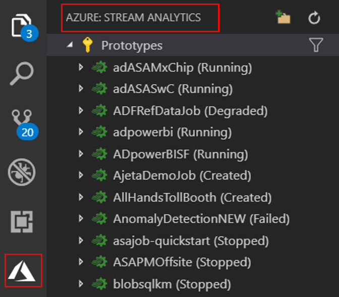
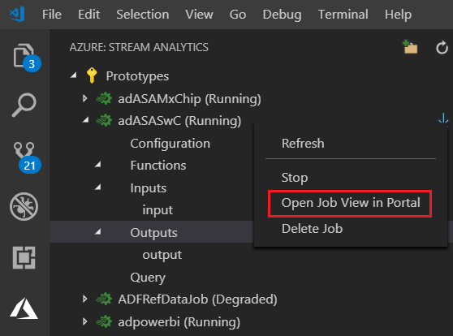

# Explore Azure Stream Analytics with Visual Studio Code (Preview)

The Azure Stream Analytics for Visual Studio Code extension gives developers a lightweight experience for managing their Stream Analytics jobs. It can be used on Windows, Mac and Linux. With the Azure Stream Analytics extension, you can:

- [Create](quick-create-vs-code.md), start, and stop jobs
- Export existing jobs to a local project
- List jobs and view job entities

## Export a job to a local project

To export a job to a local project, locate the job you wish to export in the **Stream Analytics Explorer** in Visual Studio Code. Then select a folder for your project. The project is exported to the folder you select, and you can continue to manage the job from Visual Studio Code. For more information on using Visual Studio Code to manage Stream Analytics jobs, see the Visual Studio Code [quickstart](quick-create-vs-code.md).

## List job and view job entities

You can use the job view to interact with Azure Stream Analytics jobs from Visual Studio.

1. Click the **Azure** icon on Visual Studio Code Activity Bar and then expand **Stream Analytics node**. Your jobs should appear under your subscriptions.

   

2. Expand your job node, you can open and view the job query,  configuration, inputs, outputs and functions. 

3. Right click your job node, and choose the **Open Job View in Portal** node to open the job view in the Azure portal.

   

## Next steps

* [Create an Azure Stream Analytics cloud job in Visual Studio Code (Preview)](quick-create-vs-code.md)
