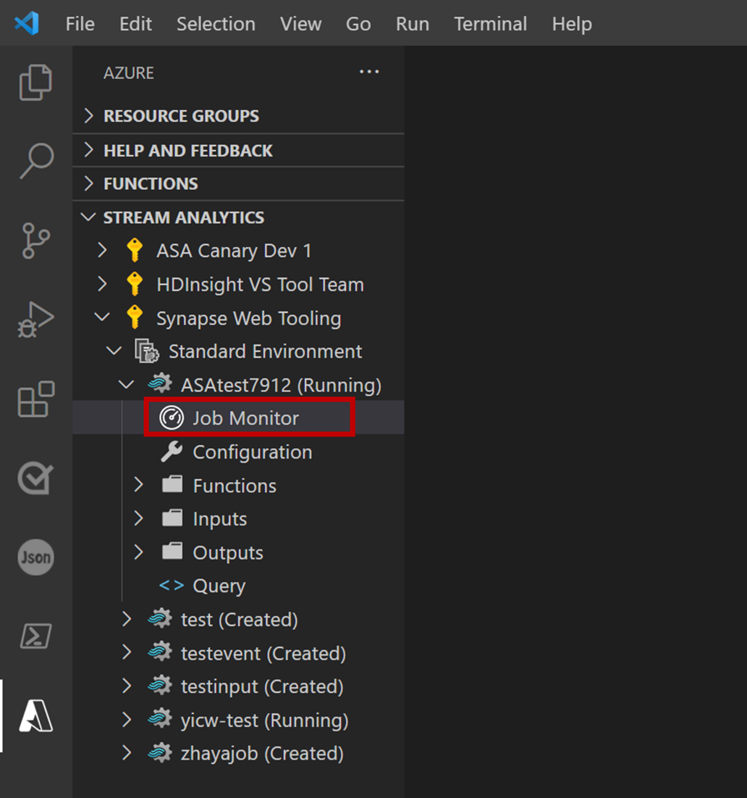
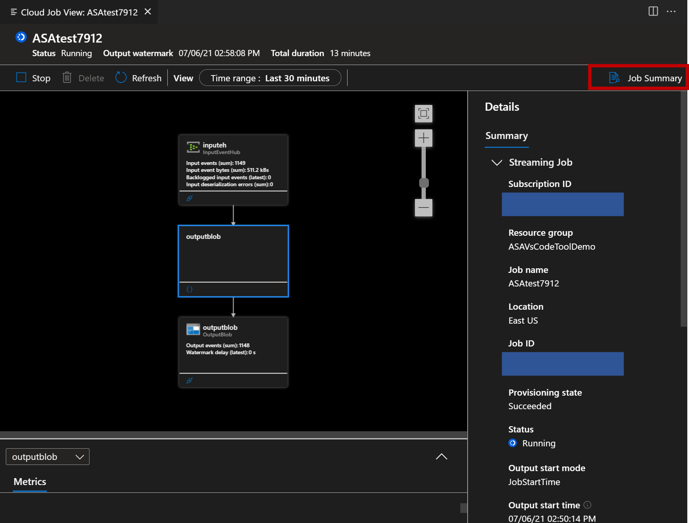
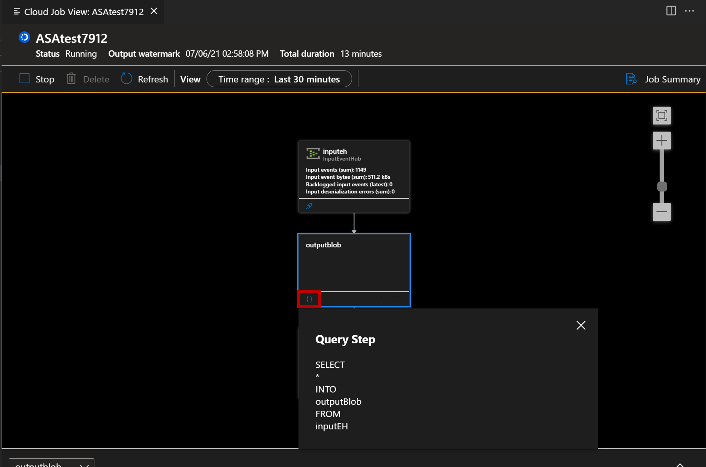
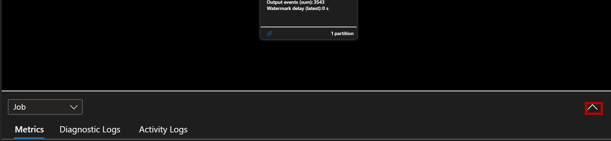
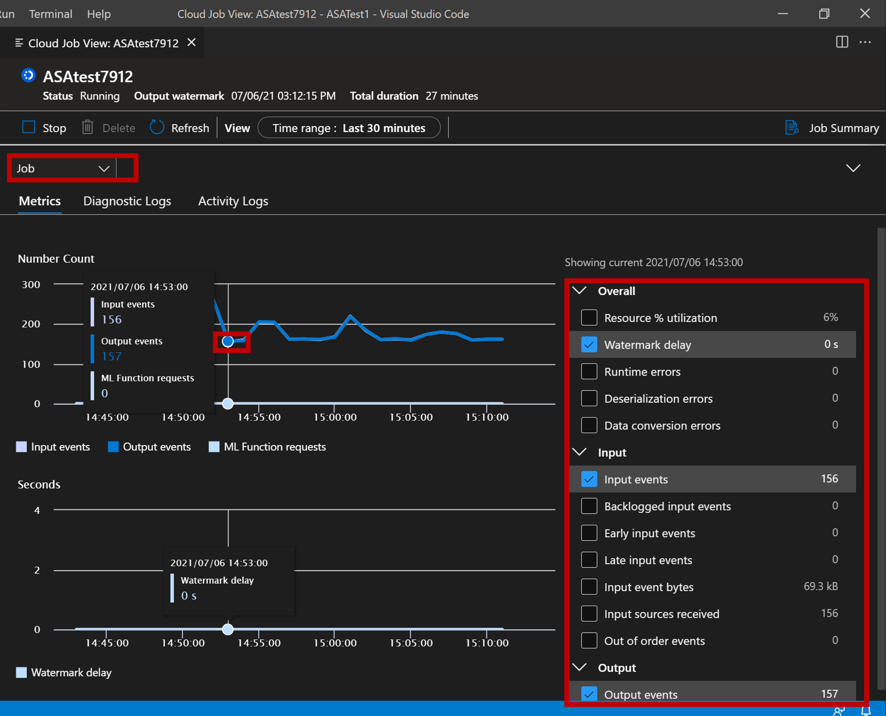
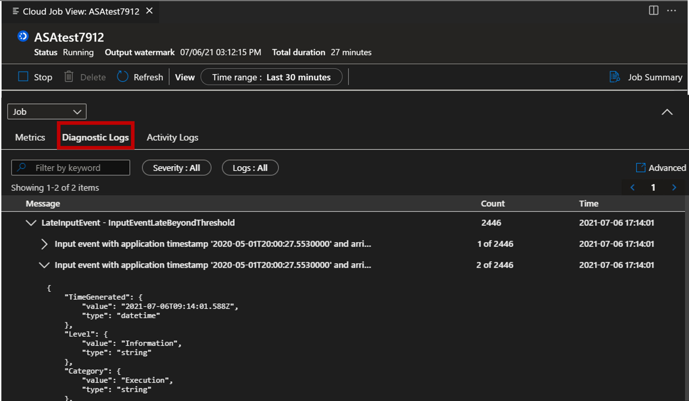
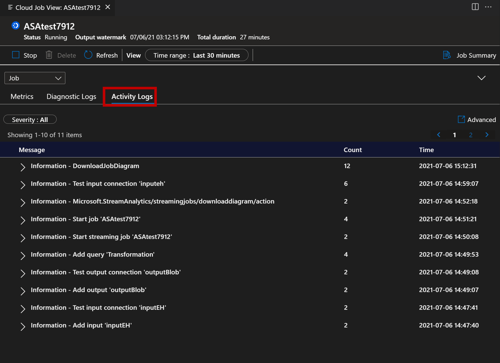

# Export and manage Stream Analytics jobs in Visual Studio Code

The Azure Stream Analytics (ASA) extension for Visual Studio Code gives you a seamless experience for managing Stream Analytics jobs in the cloud. It can be used across Windows, Mac and Linux platforms. With the ASA extension, it allows you to:

- Create, start, and stop a cloud job in Azure
- Export existing jobs to a local machine
- List jobs and view job entities
- View and debug job using **Job Diagram** and **Monitor**

## Export job to local machine

1. Open your VS Code and select **Azure** icon on the activity bar. If you haven't installed the ASA extension, follow [this guide](./quick-create-visual-studio-code.md) to install. 
2. Select **STREAM ANALYTICS** in the explorer to locate the job you want to export. 

## List job and view job entities

You can use the job view to interact with Azure Stream Analytics jobs from Visual Studio.

1. Select the **Azure** icon on Visual Studio Code Activity Bar and then expand **Stream Analytics node**. Your jobs should appear under your subscriptions.

   

2. Expand your job node, you can open and view the job query,  configuration, inputs, outputs and functions. 

3. Right-click your job node, and choose the **Open Job View in Portal** node to open the job view in the Azure portal.

   

## View job diagram and debug in Job Monitor

You can use job monitor in Visual Studio Code to view and troubleshoot your Azure Stream Analytics jobs.

### View job diagram and job summary
1. Select **Job Monitor**. Your Job Monitor should appear, and job diagram should be loaded automatically.
   

2. You can view your job diagram and select **Job Summary** to view properties and information of your job. 
    

3. You can select **Test Connection** button to test connection to your input and output.
    

4. You can also select **Locate Script** button to view your query.
    

### Monitor and debug with Metrics

1. Select the arrow button, you can open the Metrics panel.
    

2. You can interact with it and analyze your job with key metrics showing in chart. You can choose to view job-level metrics or nodes level metrics. And you can also decide which metrics you want them to show in the chart.
    

### Debug with diagnostic logs and activity logs

You can view your job’s diagnostic logs and activity logs for troubleshooting.

1. Select **Diagnostic Logs** tab.

   

2. Select **Activity Logs** tab 

   

## Next steps

* [Create an Azure Stream Analytics cloud job using Visual Studio Code extension](quick-create-visual-studio-code.md)
