# Manage and export Stream Analytics jobs in Visual Studio Code

The Azure Stream Analytics (ASA) extension for Visual Studio Code lets you manage your cloud Stream Analytics jobs without leaving your editor. You can monitor and troubleshoot jobs on Windows, macOS, and Linux. By using the extension, you can:

- Create, start, and stop a cloud job in Azure.
- Export existing jobs to a local machine.
- List jobs and view job entities.
- View and debug a job by using the **Job Diagram** and **Job Monitor**.

## Export a job to a local machine

Export an existing cloud job to your local machine so you can edit and manage it in Visual Studio Code.

1. Open Visual Studio Code and select the **Azure** icon on the activity bar. If you didn't install the ASA extension, follow the steps to [set up the Stream Analytics extension](./quick-create-visual-studio-code.md).
1. Select **STREAM ANALYTICS** in the explorer to locate the job you want to export.

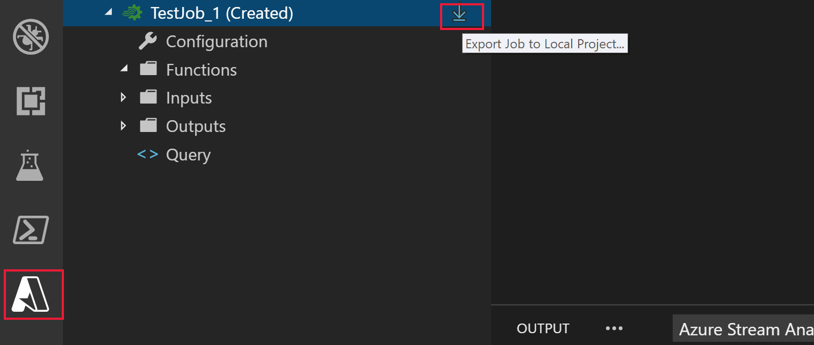

## List a job and view job entities

Use the job view to interact with Azure Stream Analytics jobs from Visual Studio Code.

1. Select the **Azure** icon on the Visual Studio Code activity bar and then expand the **Stream Analytics** node. Your jobs appear under your subscriptions.

   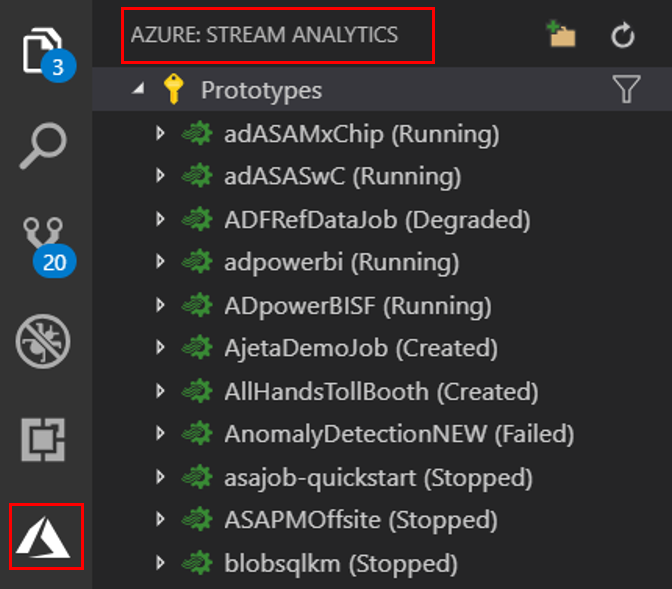

1. Expand your job node to open and view the job query, configuration, inputs, outputs, and functions.

1. Select and hold (or right-click) your job node, and select **Open Job View in Portal** to open the job view in the Azure portal.

   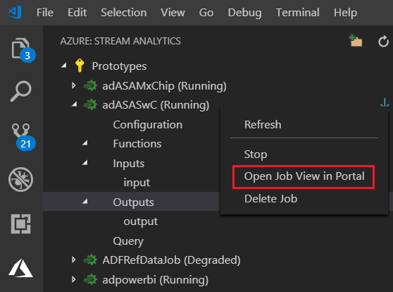

## View job diagram and job summary

Use Job Monitor in Visual Studio Code to view and troubleshoot your Azure Stream Analytics jobs. Open the job diagram and review the job summary to get started.

1. Select **Job Monitor**. The Job Monitor opens, and the job diagram loads automatically.

   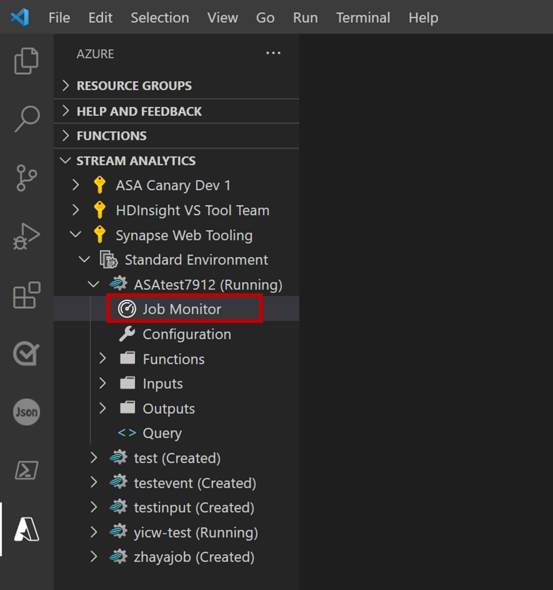

1. View your job diagram and select **Job Summary** to view the properties and information of your job.

   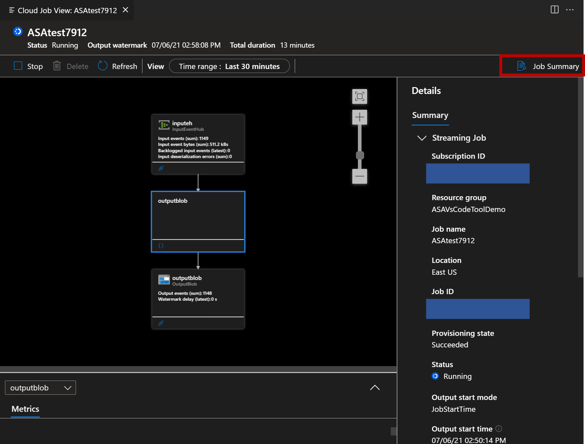

1. Select **Test Connection** to test the connection to your input and output.

   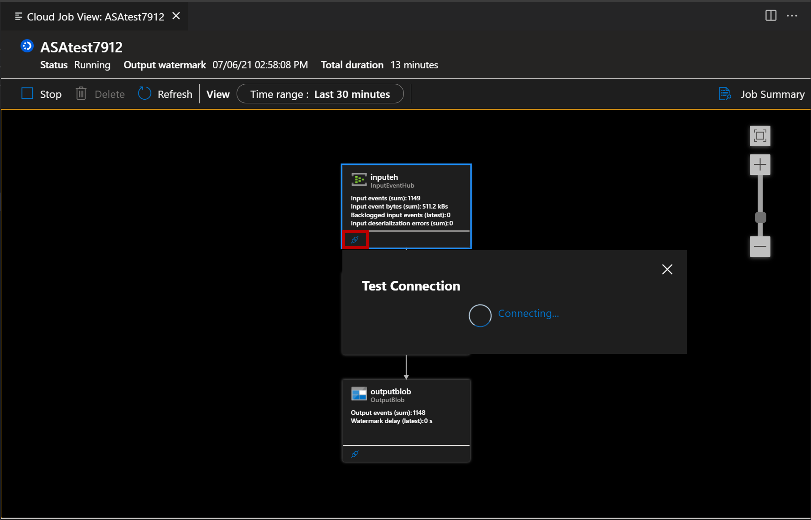

1. Select **Locate Script** to view your query.

   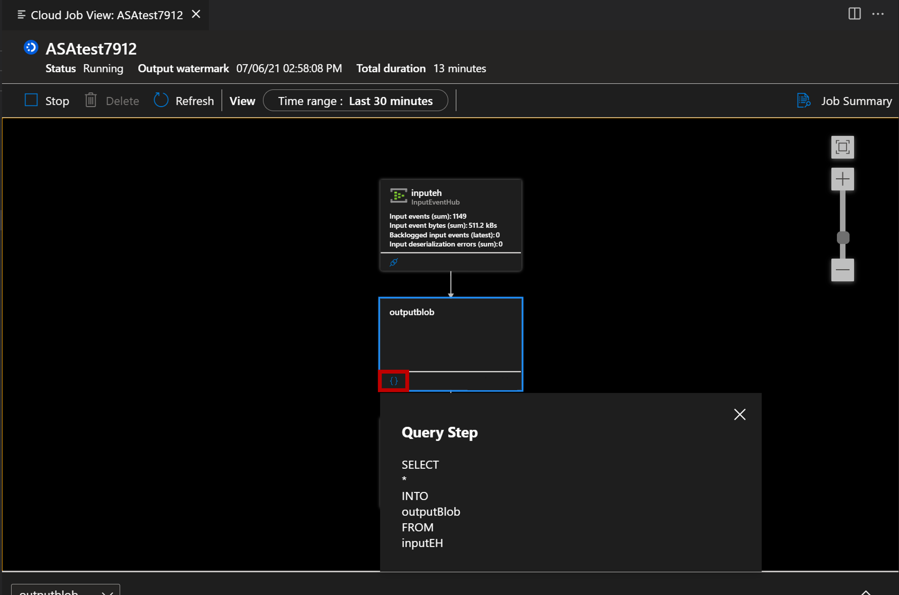

## Monitor and debug with metrics

Use the **Metrics** panel to analyze job-level and node-level metrics while you debug your job.

1. Select the arrow button to open the **Metrics** panel.

   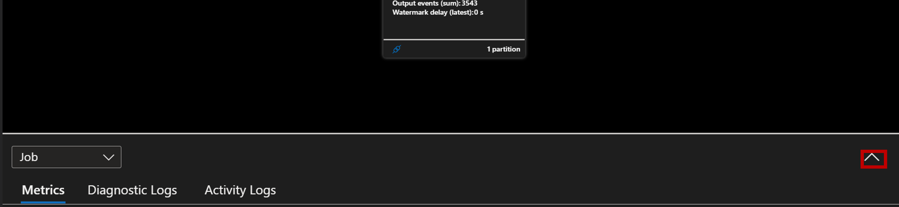

1. Analyze your job with the key metrics shown in the chart. View job-level or node-level metrics, and select which metrics to show in the chart.

   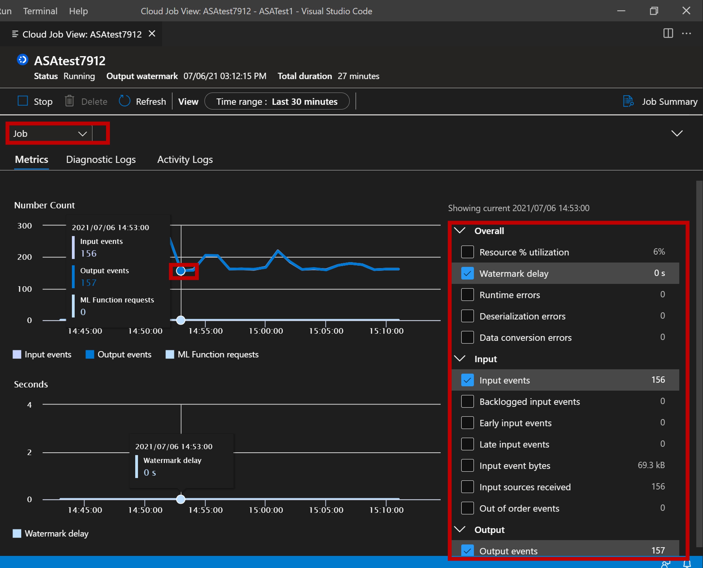

## Debug with diagnostic logs and activity logs

View your job's diagnostic logs and activity logs to troubleshoot issues.

1. Select the **Diagnostic Logs** tab.

   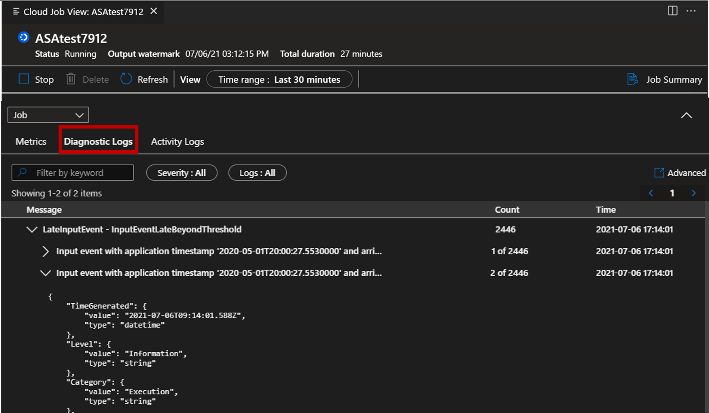

1. Select the **Activity Logs** tab.

   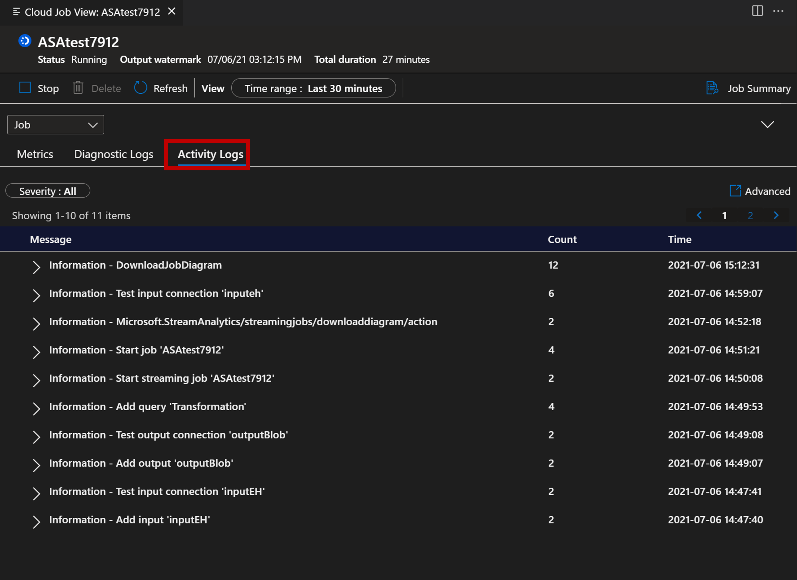

## Next step

> [!div class="nextstepaction"]
> [Create an Azure Stream Analytics cloud job using Visual Studio Code extension](quick-create-visual-studio-code.md)
