# Testing Stream Analytics query locally against live stream input with Visual Studio Code

Testing your Stream Analytics query locally against live stream input is a crucial step in ensuring the accuracy and efficiency of your query logic. With the Azure Stream Analytics (ASA) extension for Visual Studio Code (VS Code), you have the necessary tools to perform this testing seamlessly. This article guides you through the steps of setting up your environment, configuring the live stream input, and executing your query locally for thorough testing.

## Prerequisites

* Install the [.NET Core SDK](https://dotnet.microsoft.com/download) and restart Visual Studio Code.
* Follow [this quickstart](quick-create-visual-studio-code.md) to install and create a Stream Analytics job using Visual Studio Code.

## Define a live stream input

1. Right-click the **Inputs** folder in your Stream Analytics project and select **ASA: Add Input**.
    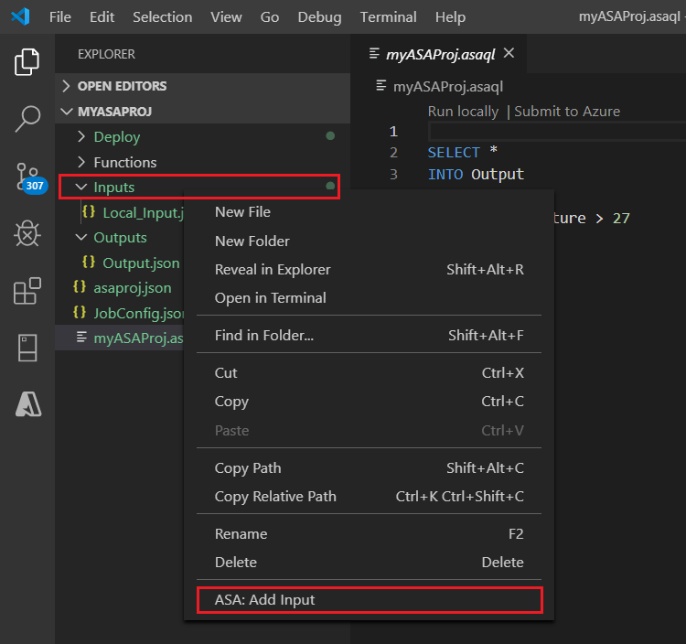
   OR press **Ctrl+Shift+P** to open the command palette and enter **ASA: Add Input**. Then choose the query script for processing the input stream. 
    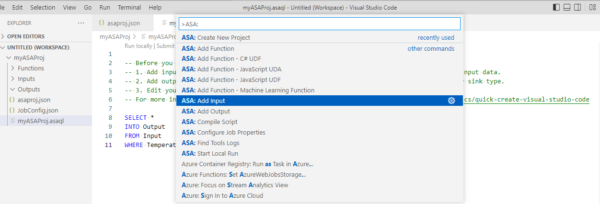

2. Choose a live input source type from the drop-down list, **Select from your Azure Subscriptions** and enter a name for the input source. 
    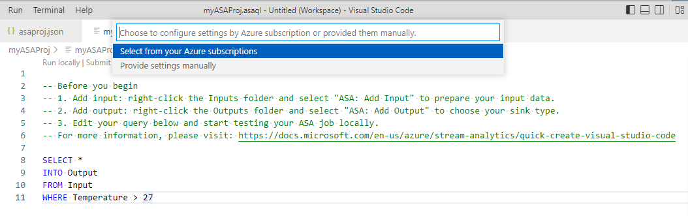

3. You see a new JSON file created under the **Input** folder. Open the file and **Select from your subscriptions** to help you configure your Event Hubs input. 
    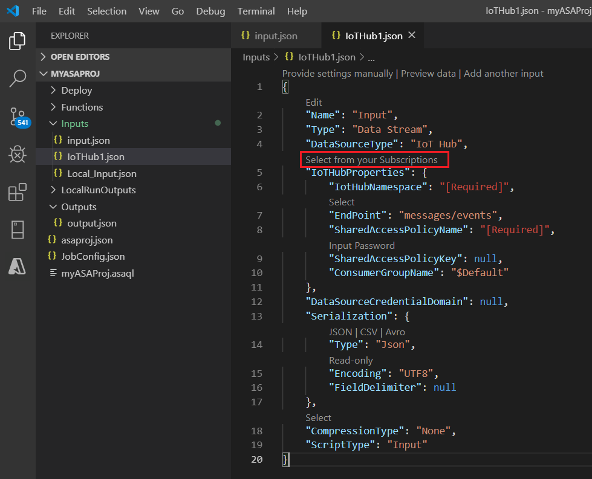

4. Select **Preview data** to validate if the live input is successfully configured.
    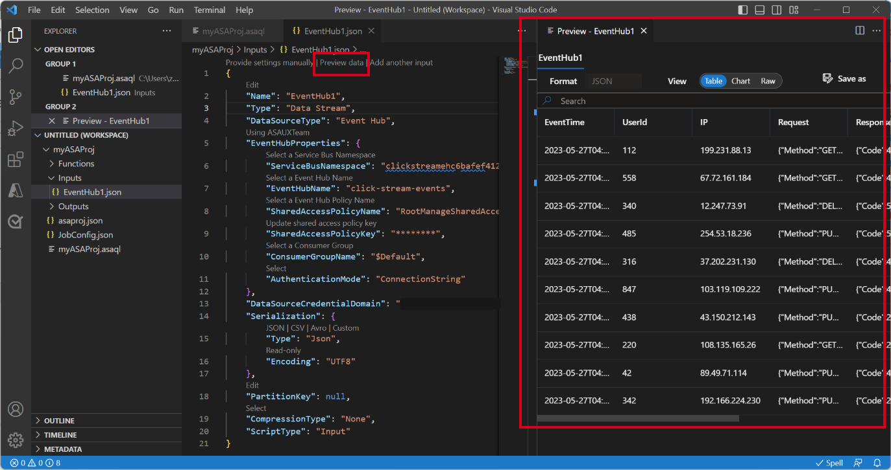

## Run query locally

Open your query file, select **Run locally** or the **Play** button on the menu bar to open a **Local run option** window for configuring local run mode. 

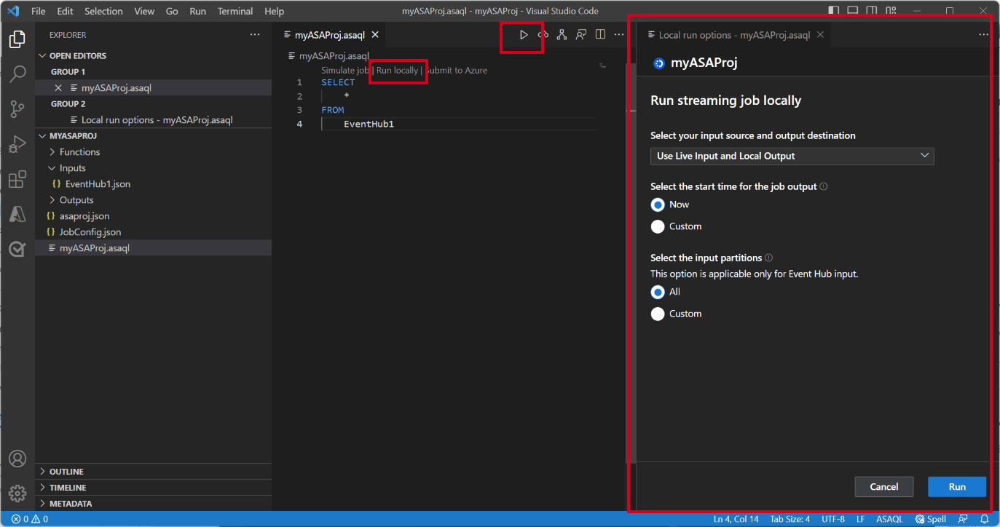

Choose **Use Live Input and Local Output** to run job locally against live input stream and produce output results to a local folder. Then select **Run** to start running job locally. 

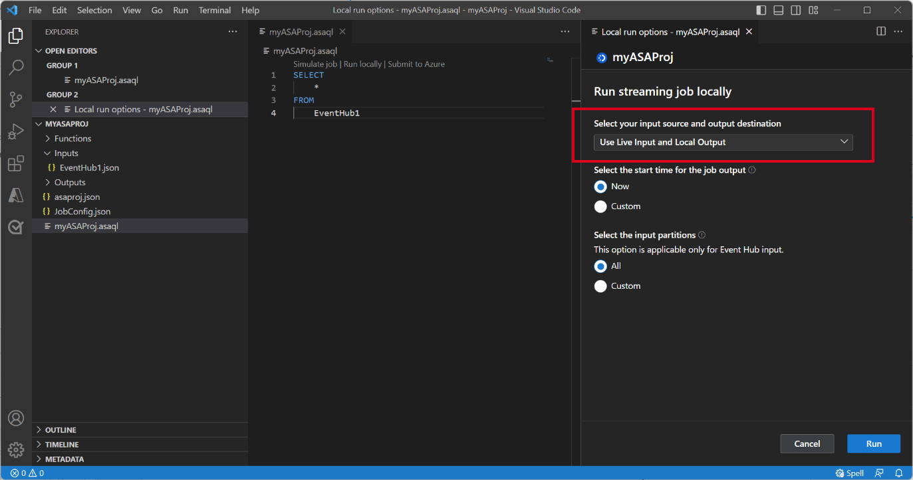

You can see a **Local test** window is opened and refreshed every 3 seconds. The output results are stored as JSON format in **LocalRunOutputs** folder.

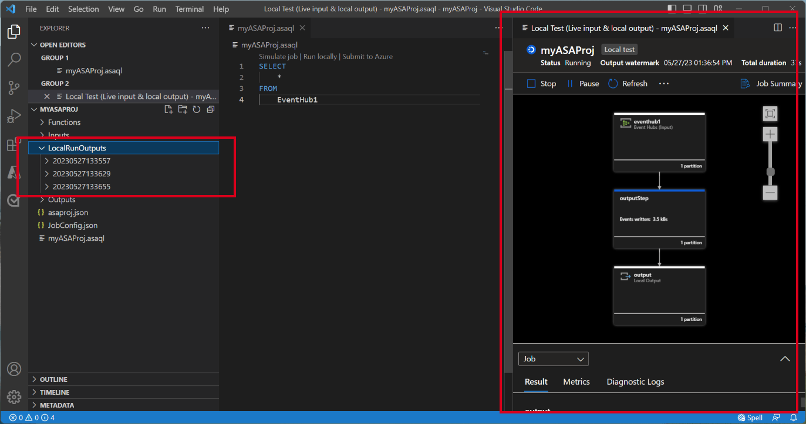

## Specify input partitions for local testing

To avoid ingesting all data from Event Hubs, you can specify specific partitions for your Event Hubs during local testing. 

1. Select **Run locally** to open the local run option window. 
2. Under **Select the input partitions** section and choose **Custom**.
3. Enter the specific partition numbers that you want to ingest data from for your local testing.

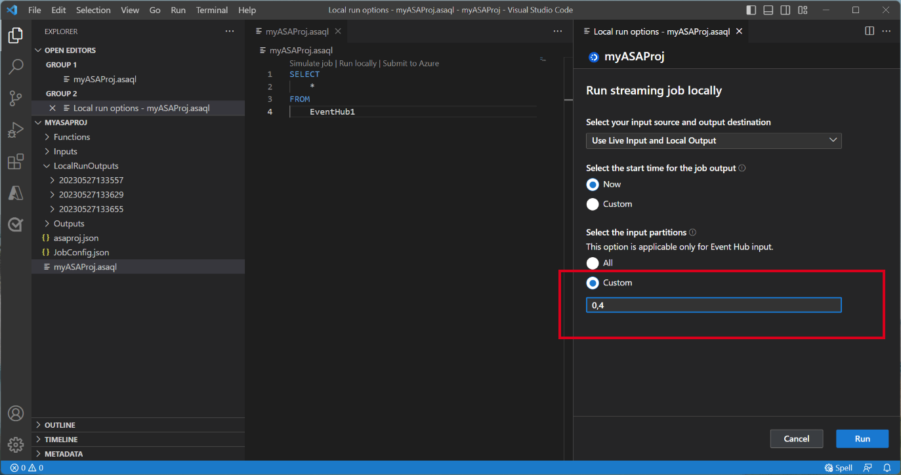

By specifying the partitions, you can focus on testing your query logic without worrying about a large volume of data. This feature allows for more efficient and targeted testing of your Stream Analytics job.

## Submit job to Azure

Once you have completed testing your query locally, you can submit your Stream Analytics project to Azure and start running the job in the cloud. 
1. Select the **Submit to Azure** option or select the **Upload** button on the query file.
2. In the submit options window, you can **update an existing job in Azure** or **create a new job** for the upload.
3. Provide the necessary details, including your subscription, resource group, and region for the deployment.

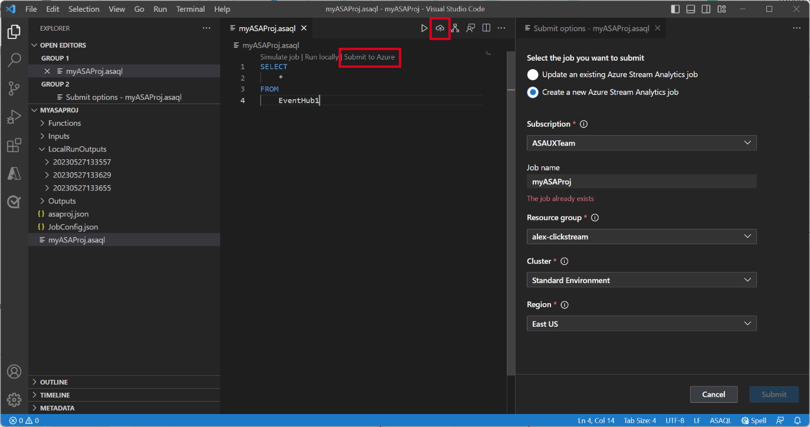

Once the submission process is complete, you can view your cloud job in a new window. From there, you can monitor its performance and manage its configurations as needed. You can also open the job in your browser by clicking on the link provided in the OUTPUT panel.

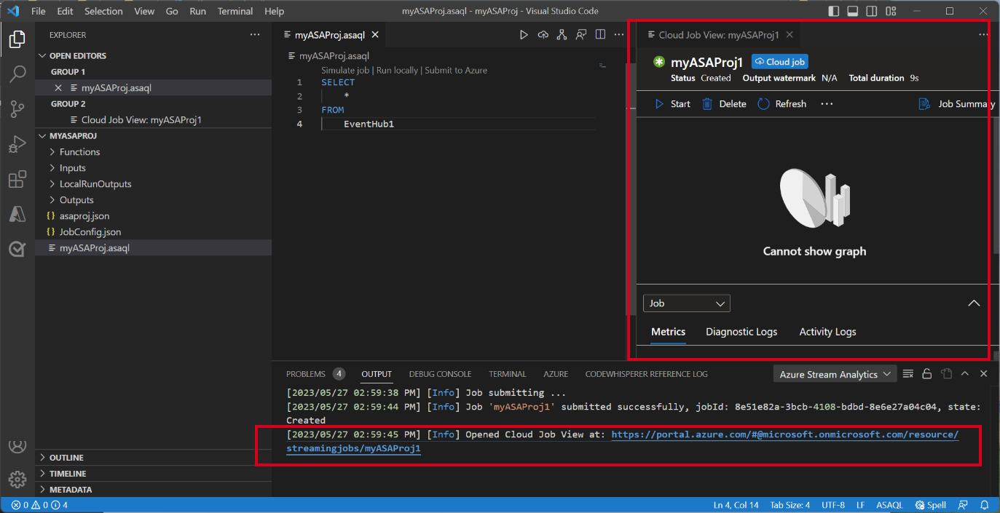

## Next steps

* [Export and manage Stream Analytics jobs using Visual Studio Code extension](visual-studio-code-explore-jobs.md)
* [Overview of running Stream Analytics jobs locally](visual-studio-code-local-run-all.md)
* [Test Stream Analytics queries locally with sample data](visual-studio-code-local-run.md)
* [Set up CI/CD pipelines using the ASA npm package](./cicd-overview.md)
