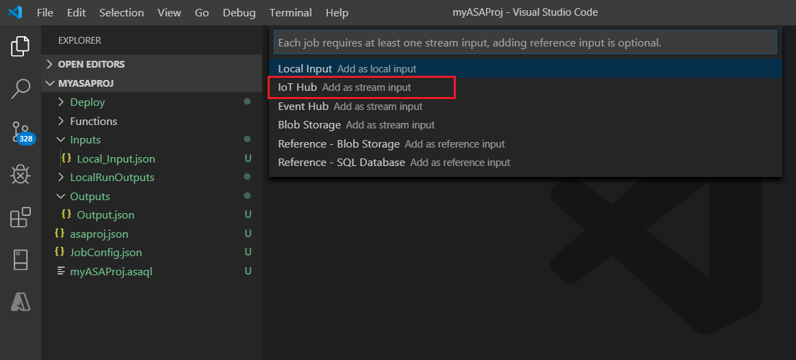
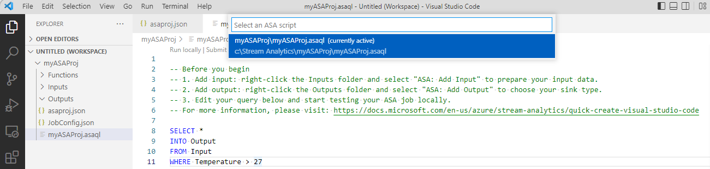

# Testing Stream Analytics query locally against live stream input with Visual Studio Code

Testing your Stream Analytics query locally against live stream input is a crucial step in ensuring the accuracy and efficiency of your query logic. With the Azure Stream Analytics (ASA) extension for Visual Studio Code (VS Code), you have the necessary tools to perform this testing seamlessly. This article will guide you through the steps of setting up your environment, configuring the live stream input, and executing your query locally for thorough testing.

## Prerequisites

* Install the [.NET Core SDK](https://dotnet.microsoft.com/download) and restart Visual Studio Code.
* Follow [this quickstart](quick-create-visual-studio-code.md) to install and create a Stream Analytics job using Visual Studio Code.

## Define a live stream input

1. Right-click the **Inputs** folder in your Stream Analytics project and select **ASA: Add Input**.

   

   OR press **Ctrl+Shift+P** to open the command palette and enter **ASA: Add Input**.

   

2. Choose an input source type from the drop-down list.

   

3. If you added the input from the command palette, choose the Stream Analytics query script that will use the input. It should be automatically populated with the file path to **myASAproj.asaql**.

   

4. Choose **Select from your Azure Subscriptions** from the drop-down menu.

    

5. Configure the newly generated JSON file. You can use the CodeLens feature to help you enter a string, select from a drop-down list, or change the text directly in the file. The following screenshot shows **Select from your Subscriptions** as an example.

   

## Preview input

To make sure that the input data is coming, select **Preview data** in your live input configuration file from the top line. Some input data comes from an IoT hub and is shown in the preview window. The preview might take a few seconds to appear.

 

## Run queries locally

Return to your query editor, and select **Run locally**. Then select **Use Live Input** from the drop-down list.

The result is shown in the right window and refreshed every 3 seconds. You can select **Run** to test again. You can also select **Open in folder** to see the result files in File Explorer and open them with Visual Studio Code or a tool like Excel. The result files are available only in JSON format.

The default time for the job to start creating output is set to **Now**. You can customize the time by selecting the **Output start time** button in the result window.

After you completed testing for your Stream Analytics project, you'll lThe output results are stored as JSON files in your project folder called **LocalRunOutputs**.

## Specify input partitions for Event Hubs

....

## Submit job to Azure

....

## Next steps

* [Overview of local Stream Analytics runs in Visual Studio Code with ASA Tools](visual-studio-code-local-run-all.md)
* [Test Stream Analytics queries locally with sample data using Visual Studio Code](visual-studio-code-local-run.md)
* [Explore Azure Stream Analytics jobs with Visual Studio Code (preview)](visual-studio-code-explore-jobs.md)
* [Set up CI/CD pipelines and unit testing by using the npm package](./cicd-overview.md)
