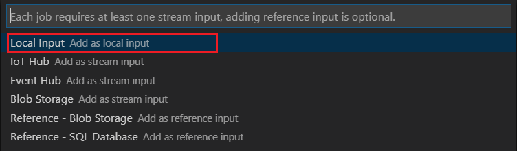
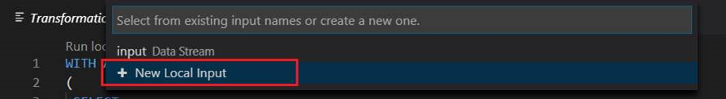
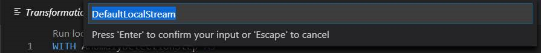
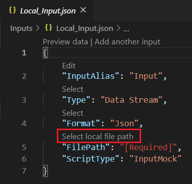
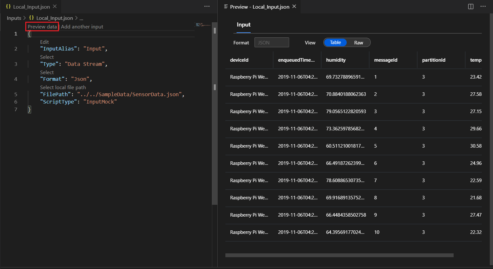
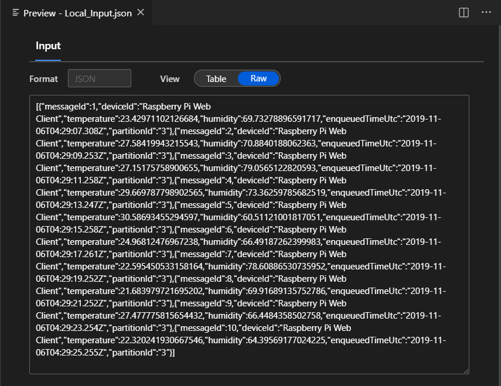
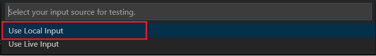
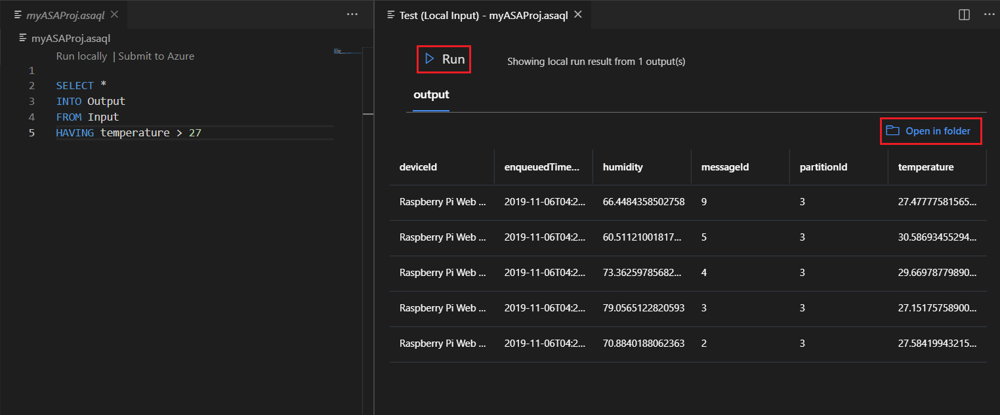

# Test Stream Analytics queries locally with sample data using Visual Studio Code

You can use Azure Stream Analytics tools for Visual Studio Code to test your Stream Analytics jobs locally with sample data. You can find the query results in JSON files in the **LocalRunOutputs** folder of your project.

## Prerequisites

* Install [.NET core SDK](https://dotnet.microsoft.com/download) and restart Visual Studio Code.

* Use this [quickstart](quick-create-vs-code.md) to learn how to create a Stream Analytics job using Visual Studio Code.

## Prepare sample data

You need to prepare sample input data files first. If you already have some sample data files on your machine, you can skip this step and move on to the next one.

1. Click **Preview data** in your input configuration file from the top line. Some input data will be fetched from IoT Hub and shown in the preview window. Note that this may take a while.

2. Once the data is shown, click **Save as** to save the data to a local file.

 

## Define a local input

1. Click **input.json** under Inputs folder in your Stream Analytics project. Then select **Add local input** from the top line.

    

    You can also use **Ctrl+Shift+P** to open the command palette and enter **ASA: Add Input**.

   

2. Select **Local Input**.

    

3. Select **+ New Local Input**.

    

4. Enter the same input alias that you used in your query.

    

5. In the newly generated **LocalInput_Input.json** file, enter the file path where your local data file is located.

    

6. Select **Preview Data** to preview the input data. The serialization type for your data is automatically detected if its JSON or CSV. Use the selector to view your data in **Table** or **Raw** format. The following table is an example of data in the **Table format**:

     

    The following table is an example of data in the **Raw format**:

    

## Run queries locally

Return to your query editor, and select **Run locally**. Then select **Use local input** from the dropdown list.

The result is shown in the right window. You can click **Run** to test again. You can also select **Open in folder** to see the result files in file explorer and further open them with other tools. Note that the result files are only available in JSON format.

## Next steps

* [Test Azure Stream Analytics jobs locally with live input using Visual Studio Code](visual-studio-code-local-run-live-input.md)

* [Explore Azure Stream Analytics jobs with Visual Studio Code (Preview)](visual-studio-code-explore-jobs.md)
