# Test Stream Analytics queries locally with sample data using Visual Studio Code

Use Azure Stream Analytics tools for Visual Studio Code to test your Stream Analytics jobs locally with sample data. Testing locally lets you validate your query logic quickly before you run the job in Azure. Visual Studio Code saves the output results as JSON files in the **LocalRunOutputs** folder of your project.

## Prerequisites

* Completion of the [Create a Stream Analytics job by using Visual Studio Code](quick-create-visual-studio-code.md) quickstart.

* The [.NET SDK](https://dotnet.microsoft.com/download) installed. Restart Visual Studio Code after you install the SDK.

## Prepare sample data

Prepare sample input data files first. If you already have sample data files on your machine, you can skip this step.

To validate your query against a live streaming source instead of saved sample data, see [Test Stream Analytics queries locally against live stream input by using Visual Studio Code](visual-studio-code-local-run-live-input.md).

1. Select **Preview data** in your input configuration file from the top line. Visual Studio Code fetches some input data from IoT Hub and shows it in the preview window.

1. After the data appears, select **Save as** to save it to a local file.

 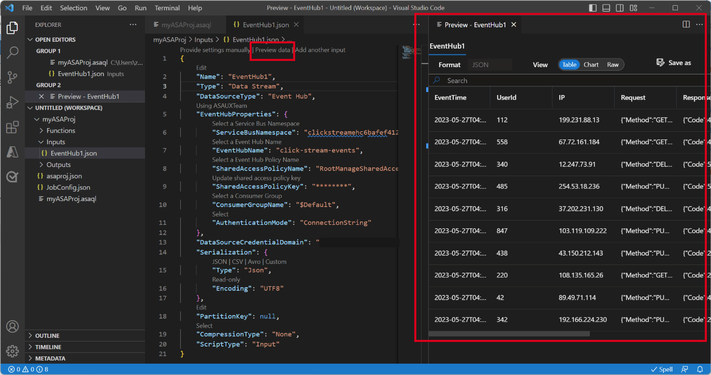

## Define a local input

Define a local input in your Stream Analytics project so that your query can read from the sample data file instead of a live source. Use the following steps to add and configure the local input:

1. Select **input.json** under the Inputs folder in your Stream Analytics project. Then select **Add local input** from the top line.

    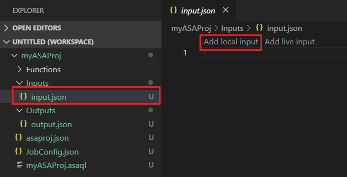

    You can also use **Ctrl+Shift+P** to open the command palette and enter **ASA: Add Input**.

   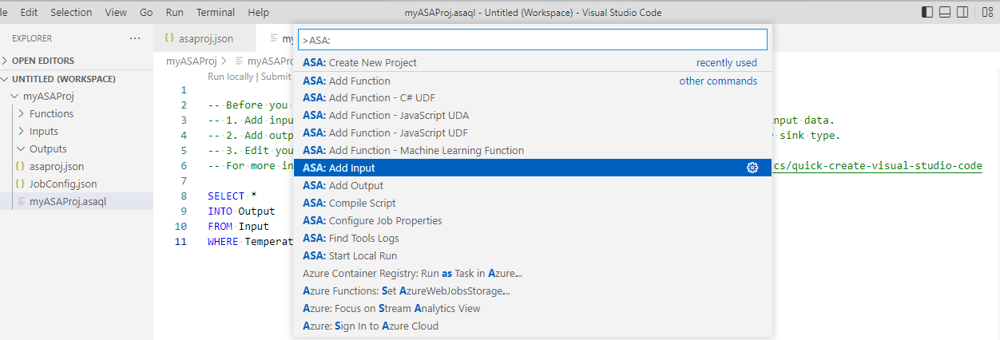

1. Select **Local Input**.

    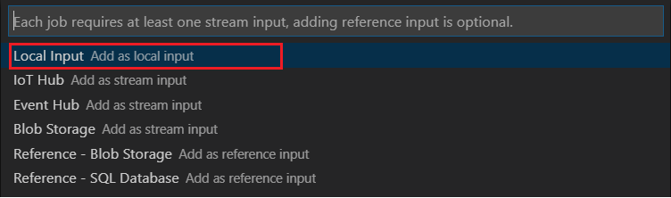

1. Select **+ New Local Input**.

    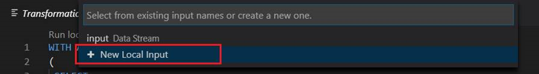

1. Enter the same input alias that you used in your query.

    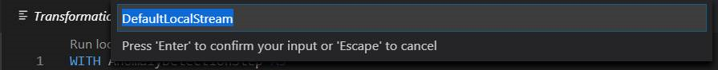

1. In the newly generated **LocalInput_Input.json** file, enter the path to your local data file.

    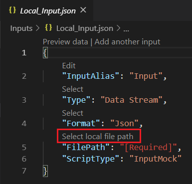

1. Select **Preview Data** to preview the input data. Visual Studio Code automatically detects the serialization type (JSON or CSV) for your data. Use the selector to view your data in **Table** or **Raw** format. The following table is an example of data in the **Table format**:

     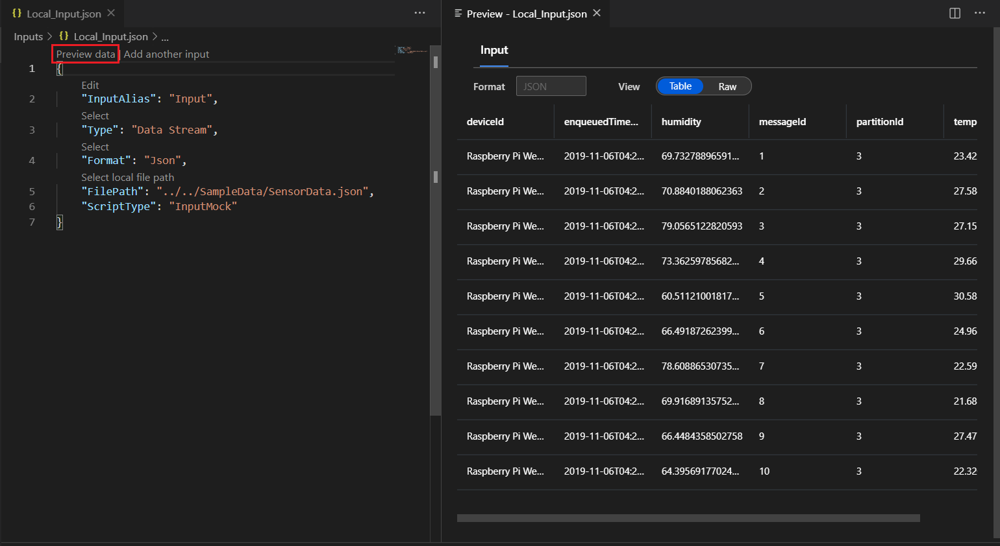

    The following table is an example of data in the **Raw format**:

    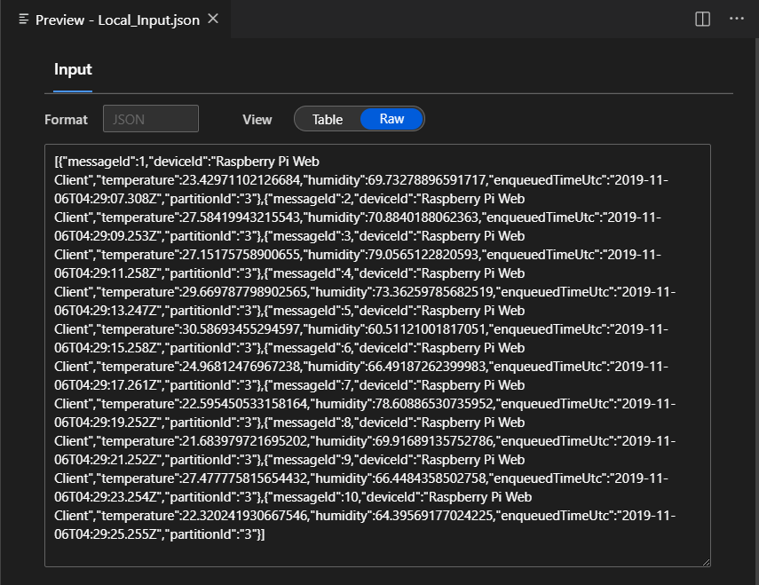

## Run queries locally

Run your query against the local input to validate the query logic before you run the job in Azure.

1. Return to your query editor, and select **Run locally**. Then select **Use local input** from the dropdown list.

    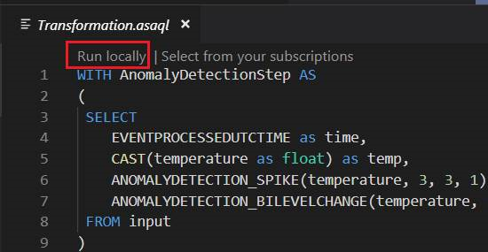

    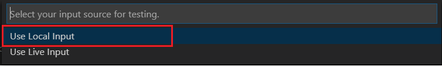

1. Review the result in the right window. Select **Run** to test again, or select **Open in folder** to see the result files in the file explorer and open them with other tools. The result files are only available in JSON format.

    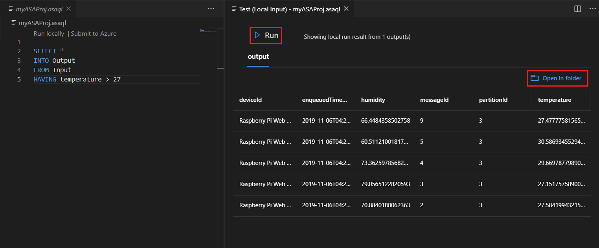

## Related content

* [Overview of local Stream Analytics runs in Visual Studio Code with ASA Tools](visual-studio-code-local-run-all.md)
* [Explore Azure Stream Analytics jobs with Visual Studio Code (preview)](visual-studio-code-explore-jobs.md)
* [Set up CI/CD pipelines and unit testing by using the npm package](./cicd-overview.md)
