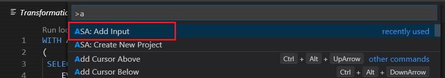

# Test Stream Analytics queries locally with Visual Studio Code

You can use Azure Stream Analytics tools for Visual Studio Code to test your Stream Analytics jobs locally with sample data.

Use this [quickstart](quick-create-vs-code.md) to learn how to create a Stream Analytics job using Visual Studio Code.

## Run queries locally

You can use the Azure Stream Analytics extension for Visual Studio Code to test your Stream Analytics jobs locally with sample data.

1. Once you've created your Stream Analytics job, use  **Ctrl+Shift+P** to open the command palette. Then type and select **ASA: Add Input**.

    

2. Select **Local Input**.

    

3. Select **+ New Local Input**.

    

4. Enter the same input alias that you used in your query.

    

5. In the **LocalInput_DefaultLocalStream.json** file, enter the file path where your local data file is located.

    

6. Return to your query editor, and select **Run locally**.

    

## Next steps

* [Create an Azure Stream Analytics cloud job in Visual Studio Code (Preview)](quick-create-vs-code.md)

* [Explore Azure Stream Analytics jobs with Visual Studio Code (Preview)](vscode-explore-jobs.md)
