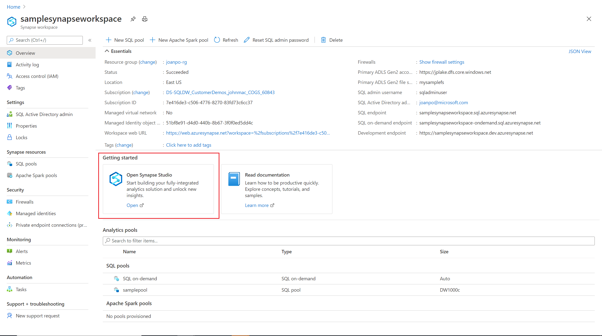
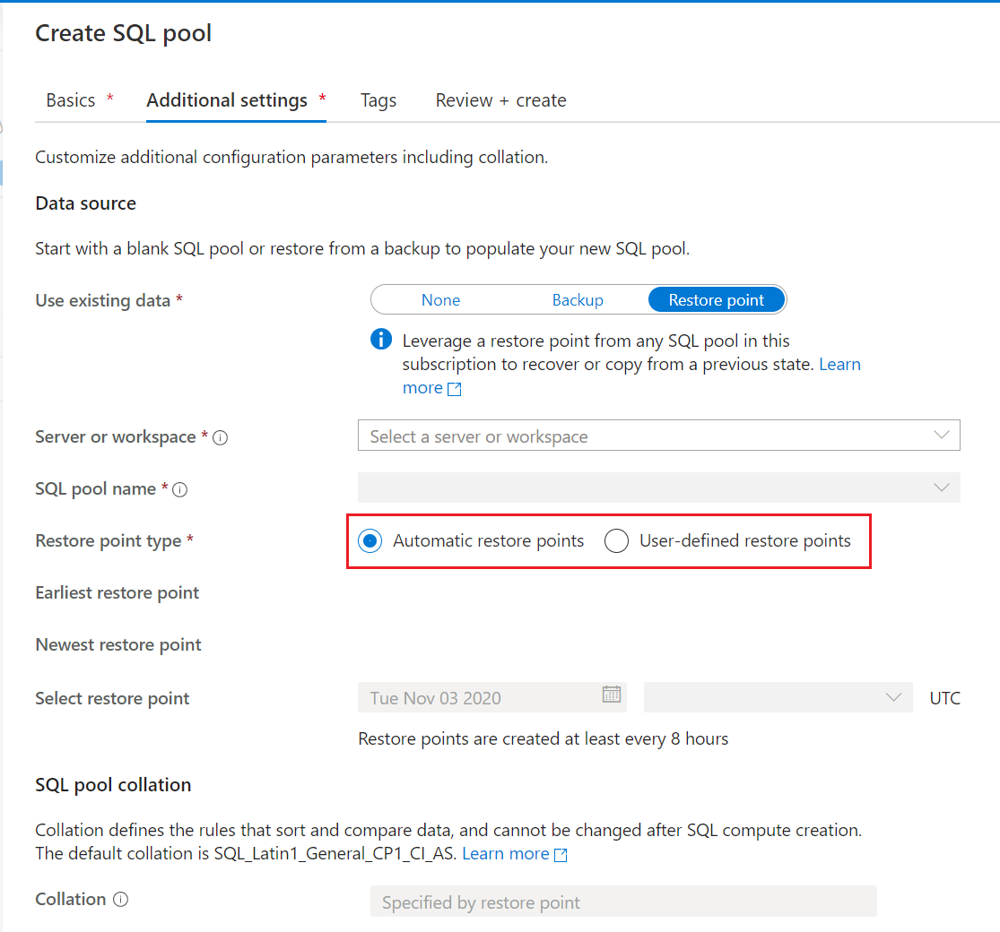
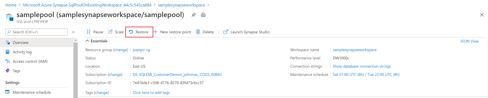
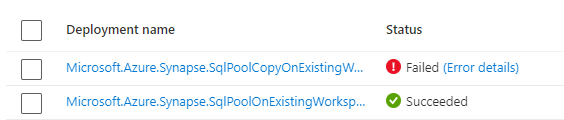
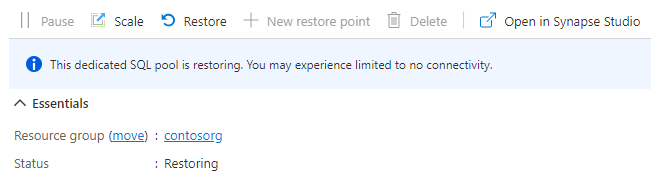

# Restore an existing dedicated SQL pool

In this article, you learn how to restore an existing dedicated SQL pool in Azure Synapse Analytics using Azure portal, Synapse Studio, and PowerShell. This article applies to both restores and geo-restores. 

## Restore an existing dedicated SQL pool through the Synapse Studio

1. Sign in to the [Azure portal](https://portal.azure.com/).
2. Navigate to your Azure Synapse workspace. 
3. Under **Getting Started** -> **Open Synapse Studio**, select **Open**.

    
4. On the left hand navigation pane, select **Data**.
5. Select **Manage pools**. 
6. Select **+ New** to create a new dedicated SQL pool in the Azure Synapse Analytics workspace.
7. In the **Additional Settings** tab, select a **Restore Point** to restore from. 

    If you want to perform a geo-restore, select the workspace and dedicated SQL pool that you want to recover. 

8. Select either **Automatic Restore Points** or **User-Defined Restore Points**. 

   

   * If the dedicated SQL pool doesn't have any automatic restore points, wait a few hours, or create a user defined restore point before restoring. For User-Defined Restore Points, select an existing one or create a new one.

   * If you want to restore a dedicated SQL pool from a different workspace, select **New dedicated SQL pool** from your current workspace. Under the **Additional settings** tab, find the **Use existing data** and select the **Restore point** option. As shown in the above screenshot, you can then select the **Server or workspace** name from which you can restore.

   * If you are restoring a geo-backup, select the workspace located in the source region and the dedicated SQL pool you want to restore.

   > [!NOTE]
   > You cannot perform an in-place restore of a SQL pool with the same name as an existing pool. Regardless of the SQL pool being in the same workspace or a different workspace.

9. Select **Review + Create**.

## Restore an existing dedicated SQL pool through the Azure portal

1. Sign in to the [Azure portal](https://portal.azure.com/).
2. Navigate to the dedicated SQL pool that you want to restore from.
3. At the top of the **Overview** page, select **Restore**.

    

4. Select either **Automatic Restore Points** or **User-Defined Restore Points**.

    If the dedicated SQL pool doesn't have any automatic restore points, wait a few hours or create a user-defined restore point before restoring. 

    If you want to perform a geo-restore, select the workspace and dedicated SQL pool that you want to recover. 

5. Select **Review + Create**.

## Restore an existing dedicated SQL pool through PowerShell

1. Open a PowerShell terminal.

2. Connect to your Azure account and list all the subscriptions associated with your account.

3. Select the subscription that contains the SQL pool to be restored.

4. List the restore points for the dedicated SQL pool.

5. Pick the desired restore point using the RestorePointCreationDate.

6. Restore the dedicated SQL pool to the desired restore point using [Restore-AzSynapseSqlPool](/powershell/module/az.synapse/restore-azsynapsesqlpool?toc=/azure/synapse-analytics/toc.json&bc=/azure/synapse-analytics/breadcrumb/toc.json) PowerShell cmdlet.

    1. To restore the dedicated SQL pool to a different workspace, make sure to specify the other workspace name.  This workspace can also be in a different resource group and region.
    2. To restore to a different subscription, see [Restore an existing dedicated SQL pool to a different subscription through PowerShell](#restore-an-existing-dedicated-sql-pool-to-a-different-subscription-through-powershell) later in this article.

7. Verify that the restored dedicated SQL pool is online.

```powershell

$SubscriptionName="<YourSubscriptionName>"
$ResourceGroupName="<YourResourceGroupName>"
$WorkspaceName="<YourWorkspaceNameWithoutURLSuffixSeeNote>"  # Without sql.azuresynapse.net
#$TargetResourceGroupName="<YourTargetResourceGroupName>" # uncomment to restore to a different workspace.
#$TargetWorkspaceName="<YourtargetWorkspaceNameWithoutURLSuffixSeeNote>"  
$SQLPoolName="<YourDatabaseName>"
$NewSQLPoolName="<YourDatabaseName>"

Connect-AzAccount
Get-AzSubscription
Select-AzSubscription -SubscriptionName $SubscriptionName

# list all restore points
Get-AzSynapseSqlPoolRestorePoint -ResourceGroupName $ResourceGroupName -WorkspaceName $WorkspaceName -Name $SQLPoolName
# Pick desired restore point using RestorePointCreationDate "xx/xx/xxxx xx:xx:xx xx"
$PointInTime="<RestorePointCreationDate>"

# Get the specific SQL pool to restore
$SQLPool = Get-AzSynapseSqlPool -ResourceGroupName $ResourceGroupName -WorkspaceName $WorkspaceName -Name $SQLPoolName
# Transform Synapse SQL pool resource ID to SQL database ID because currently the restore command only accepts the SQL database ID format.
$DatabaseID = $SQLPool.Id -replace "Microsoft.Synapse", "Microsoft.Sql" `
    -replace "workspaces", "servers" `
    -replace "sqlPools", "databases"

# Restore database from a restore point
$RestoredDatabase = Restore-AzSynapseSqlPool –FromRestorePoint -RestorePoint $PointInTime -ResourceGroupName $SQLPool.ResourceGroupName `
    -WorkspaceName $SQLPool.WorkspaceName -TargetSqlPoolName $NewSQLPoolName –ResourceId $DatabaseID -PerformanceLevel DW100c

# Use the following command to restore to a different workspace
#$TargetResourceGroupName = $SQLPool.ResourceGroupName # for restoring to different workspace in same resourcegroup 
#$RestoredDatabase = Restore-AzSynapseSqlPool –FromRestorePoint -RestorePoint $PointInTime -ResourceGroupName $TargetResourceGroupName `
#    -WorkspaceName $TargetWorkspaceName -TargetSqlPoolName $NewSQLPoolName –ResourceId $DatabaseID -PerformanceLevel DW100c

# Verify the status of restored database
$RestoredDatabase.status
```

## Restore an existing dedicated SQL pool to a different subscription through PowerShell

When performing a cross-subscription restore, a dedicated SQL pool in an Azure Synapse workspace can only restore directly to a standalone dedicated SQL pool (formerly SQL DW). If it is required to restore a dedicated SQL pool in an Azure Synapse workspace to a workspace in the destination subscription, an additional restore step is required.

The PowerShell below is similar to the above, however there are three main differences:
- After retrieving the SQL Pool object to be restored, the subscription context needs to be switched to the destination (or target) subscription name. 
- When performing the restore, use the Az.Sql modules instead of the Az.Synapse modules. 
- The below sample code has additional steps for restoring to an Azure Synapse workspace in the destination subscription. Uncomment the PowerShell commands as described in the sample.

Steps:

1. Open a PowerShell terminal.

1. Update Az.Sql Module to 3.8.0 (or greater) if on an older version using `Update-Module`. Otherwise it will cause failures. A PowerShell command to validate the version is below.
   ```powershell
   foreach ($i in (get-module -ListAvailable | ?{$_.name -eq 'az.sql'}).Version) { $version = [string]$i.Major + "." + [string]$i.Minor; if ($version -gt 3.7) {write-host "Az.Sql version $version installed. Prequisite met."} else {update-module az.sql} }
   ```
   
1. Connect to your Azure account and list all the subscriptions associated with your account.

1. Select the subscription that contains the SQL pool to be restored.

1. List the restore points for the dedicated SQL pool.

1. Pick the desired restore point using the **RestorePointCreationDate**.

1. Select the destination subscription in which the SQL pool should be restored.

1. Restore the dedicated SQL pool to the desired restore point using [Restore-AzSqlDatabase](/powershell/module/az.sql/restore-azsqldatabase?toc=/azure/synapse-analytics/sql-data-warehouse/toc.json&bc=/azure/synapse-analytics/sql-data-warehouse/breadcrumb/toc.json) PowerShell cmdlet.

1. Verify that the restored dedicated SQL pool (formerly SQL DW) is online.

1. If the desired destination is a Synapse Workspace, uncomment the code to perform the additional restore step.
   1. Create a restore point for the newly created data warehouse.
   2. Retrieve the last restore point created by using the `Select -Last 1` syntax.
   3. Perform the restore to the desired Azure Synapse workspace.

```powershell
$SourceSubscriptionName="<YourSubscriptionName>"
$SourceResourceGroupName="<YourResourceGroupName>"
$SourceWorkspaceName="<YourServerNameWithoutURLSuffixSeeNote>"  # Without sql.azuresynapse.net
$SourceSQLPoolName="<YourDatabaseName>"
$TargetSubscriptionName="<YourTargetSubscriptionName>"
$TargetResourceGroupName="<YourTargetResourceGroupName>"
$TargetServerName="<YourTargetServerNameWithoutURLSuffixSeeNote>"  # Without sql.azuresynapse.net
$TargetDatabaseName="<YourDatabaseName>"
#$TargetWorkspaceName="<YourTargetWorkspaceName>" # uncomment if restore to an Azure Synapse workspace is required

# Update Az.Sql module to the latest version (3.8.0 or above)
# Update-Module -Name Az.Sql -RequiredVersion 3.8.0

Connect-AzAccount
Get-AzSubscription
Select-AzSubscription -SubscriptionName $SourceSubscriptionName

# list all restore points
Get-AzSynapseSqlPoolRestorePoint -ResourceGroupName $SourceResourceGroupName -WorkspaceName $SourceWorkspaceName -Name $SourceSQLPoolName
# Pick desired restore point using RestorePointCreationDate "xx/xx/xxxx xx:xx:xx xx"
$PointInTime="<RestorePointCreationDate>"

# Get the specific SQL pool to restore
$SQLPool = Get-AzSynapseSqlPool -ResourceGroupName $SourceResourceGroupName -WorkspaceName $SourceWorkspaceName -Name $SourceSQLPoolName
# Transform Synapse SQL pool resource ID to SQL database ID because currently the restore command only accepts the SQL database ID format.
$DatabaseID = $SQLPool.Id -replace "Microsoft.Synapse", "Microsoft.Sql" `
    -replace "workspaces", "servers" `
    -replace "sqlPools", "databases"

# Switch context to the destination subscription
Select-AzSubscription -SubscriptionName $TargetSubscriptionName

# Restore database from a desired restore point of the source database to the target server in the desired subscription
$RestoredDatabase = Restore-AzSqlDatabase –FromPointInTimeBackup –PointInTime $PointInTime -ResourceGroupName $TargetResourceGroupName `
    -ServerName $TargetServerName -TargetDatabaseName $TargetDatabaseName –ResourceId $DatabaseID

# Verify the status of restored database
$RestoredDatabase.status

# uncomment below cmdlets to perform one more restore to push the SQL Pool to an existing workspace in the destination subscription
# # Create restore point
# New-AzSqlDatabaseRestorePoint -ResourceGroupName $RestoredDatabase.ResourceGroupName -ServerName $RestoredDatabase.ServerName `
#     -DatabaseName $RestoredDatabase.DatabaseName -RestorePointLabel "UD-001"
# # Gets the last restore point of the sql dw (will use the RestorePointCreationDate property)
# $RestorePoint = Get-AzSqlDatabaseRestorePoint -ResourceGroupName $RestoredDatabase.ResourceGroupName -ServerName $RestoredDatabase.ServerName `
#     -DatabaseName $RestoredDatabase.DatabaseName | Select -Last 1
# # Restore to destination synapse workspace
# $FinalRestore = Restore-AzSynapseSqlPool –FromRestorePoint -RestorePoint $RestorePoint.RestorePointCreationDate -ResourceGroupName $TargetResourceGroupName `
#     -WorkspaceName $TargetWorkspaceName -TargetSqlPoolName $TargetDatabaseName –ResourceId $RestoredDatabase.ResourceID -PerformanceLevel DW100c

```


## Troubleshooting
A restore operation can result in a deployment failure based on a "RequestTimeout" exception. 

  

This timeout can be ignored. Review the dedicated SQL pool page in the Azure portal and it may still have status of "Restoring" and eventually will transition to "Online". 

  

## Next Steps

- [Create a restore point](sqlpool-create-restore-point.md)
- [Restore-AzSqlDatabase](/powershell/module/az.sql/restore-azsqldatabase?toc=/azure/synapse-analytics/sql-data-warehouse/toc.json&bc=/azure/synapse-analytics/sql-data-warehouse/breadcrumb/toc.json)
- [What's the difference between Azure Synapse (formerly SQL DW) and Azure Synapse Analytics Workspace](https://techcommunity.microsoft.com/t5/azure-synapse-analytics-blog/what-s-the-difference-between-azure-synapse-formerly-sql-dw-and/ba-p/3597772)
