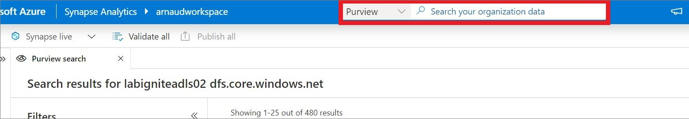

# Discover, connect, and explore data in Synapse using Microsoft Purview 

In this document, you will learn the type of interactions that you can perform when registering a Microsoft Purview Account into Synapse. 

## Prerequisites 

- [Microsoft Purview account](../../purview/create-catalog-portal.md) 
- [Synapse workspace](../quickstart-create-workspace.md) 
- [Connect a Microsoft Purview Account into Synapse](quickstart-connect-azure-purview.md) 

## Using Microsoft Purview in Synapse 

The use Microsoft Purview in Synapse requires you to have access to that Microsoft Purview account. Synapse passes-through your Microsoft Purview permission. As an example, if you have a curator permission role, you will be able to edit metadata scanned by Microsoft Purview. 

### Data discovery: search datasets 

To discover data registered and scanned by Microsoft Purview, you can use the Search bar at the top center of Synapse workspace. Make sure that you select Microsoft Purview to search for all of your organization data. 

## Microsoft Purview actions 

Here is a list of the Microsoft Purview features that are available in Synapse: 
- **Overview** of the metadata 
- View and edit **schema** of the metadata with classifications, glossary terms, data types, and descriptions 
- View **lineage** to understand dependencies and do impact analysis. For more information about, see [lineage](../../purview/catalog-lineage-user-guide.md)
- View and edit **Contacts** to know who is an owner or expert over a dataset 
- **Related** to understand the hierarchical dependencies of a specific dataset. This experience is helpful to browse through data hierarchy.
- Click **Request Access** to request access to the data by triggering the self-service data access workflow configured by Workflow Admin in Microsoft Purview. For more information see [Request access](../../purview/how-to-request-access.md) and [Self-Service data access workflow](../../purview/how-to-workflow-self-service-data-access-hybrid.md).
## Actions that you can perform over datasets with Synapse resources 

### Connect data to Synapse 

- You can create a **new linked service** to Synapse. That action will be required to copy data to Synapse or have them in your data hub (for supported data sources like ADLSg2) 
- For objects like files, folders, or tables, you can directly create a **new integration dataset** and leverage an existing linked service if already created 

We are not yet able to infer if there is an existing linked service or integration dataset. 

###  Develop in Synapse 

There are three actions that you can perform: **New SQL Script**, **New Notebook**, and **New Data Flow**. 

With **New SQL Script**, depending on the type of support, you can: 
- View the top 100 rows in order to understand the shape of the data. 
- Create an external table from Synapse SQL database 
- Load the data into a Synapse SQL database 
 
With **New notebook**, you can: 
- Load data into a Spark DataFrame 
- Create a Spark Table (if you do that over Parquet format, it also creates a serverless SQL pool table). 
 
With **New data flow**, you can create an integration dataset that can be used a source in a data flow pipeline. Data flow is a no-code developer capability to perform data transformation. For more information about [using data flow in Synapse](../quickstart-data-flow.md).

##  Next steps 

- [Register and scan Azure Synapse assets in Microsoft Purview](../../purview/register-scan-azure-synapse-analytics.md)
- [How to Search Data in Microsoft Purview Data Catalog](../../purview/how-to-search-catalog.md)
