# Continuous integration and delivery for Azure Synapse workspace

## Overview

Continuous Integration (CI) is the process of automating the build and testing of code every time a team member commits changes to version control. Continuous Deployment (CD) is the process to build, test, configure, and deploy from multiple testing or staging environments to a production environment.

For Azure Synapse workspace, continuous integration and delivery (CI/CD) move all entities from one environment (development, test, production) to another. To promote your workspace to another workspace, there are two parts: use [Azure Resource Manager templates](../../azure-resource-manager/templates/overview.md) to create or update workspace resources (pools and workspace); migrate artifacts (SQL scripts, notebook, Spark job definition, pipelines, datasets, data flows, and so on) with Synapse CI/CD tools in Azure DevOps. 

This article will outline using Azure release pipeline to automate the deployment of a Synapse workspace to multiple environments.

## Prerequisites

-   The workspace used for development has been configured with a Git repository in Studio, see [Source control in Synapse Studio](source-control.md).
-   An Azure DevOps project has been prepared for running release pipeline.

## Set up a release pipelines

1.  In [Azure DevOps](https://dev.azure.com/), open the project created for the release.

1.  On the left side of the page, select **Pipelines**, and then select **Releases**.

    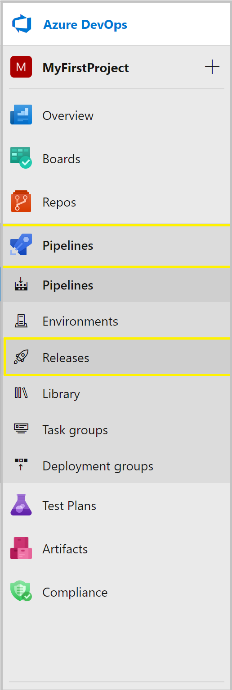

1.  Select **New pipeline**, or, if you have existing pipelines, select **New** and then **New release pipeline**.

1.  Select the **Empty job** template.

    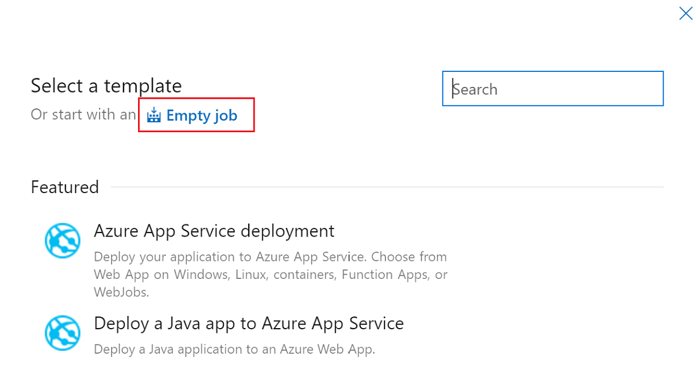

1.  In the **Stage name** box, enter the name of your environment.

1.  Select **Add artifact**, and then select the git repository configured with your development Synapse Studio. Select the git repository you used for managing ARM template of pools and workspace. If you use GitHub as the source, you need to create a service connection for your GitHub account and pull repositories. For more information about [service connection](/azure/devops/pipelines/library/service-endpoints) 

    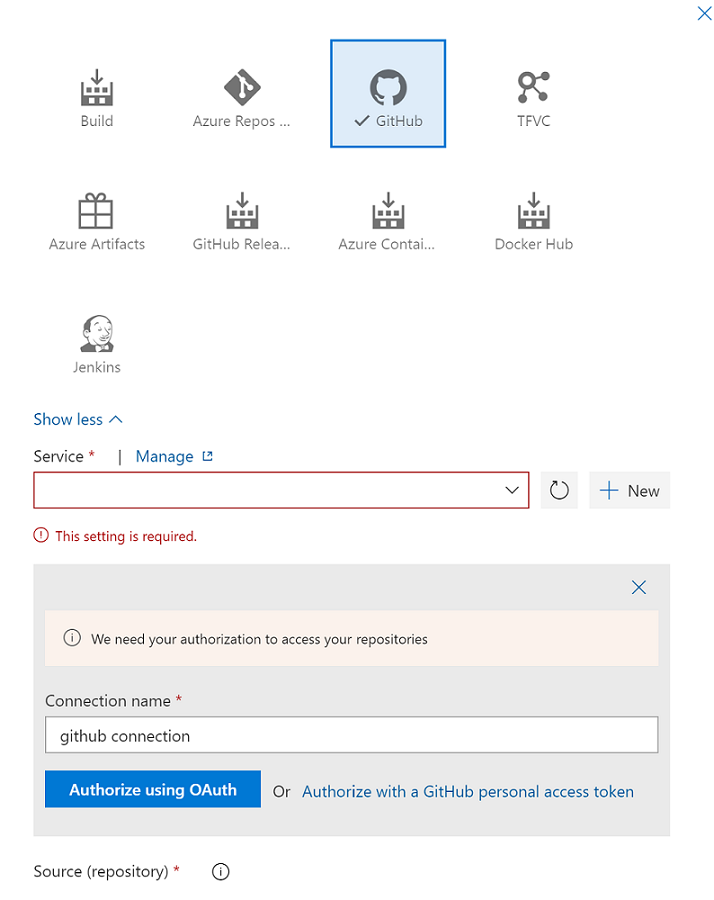

1.  Select the branch of ARM template for resources update. For the **Default version**, select **Latest from default branch**.

    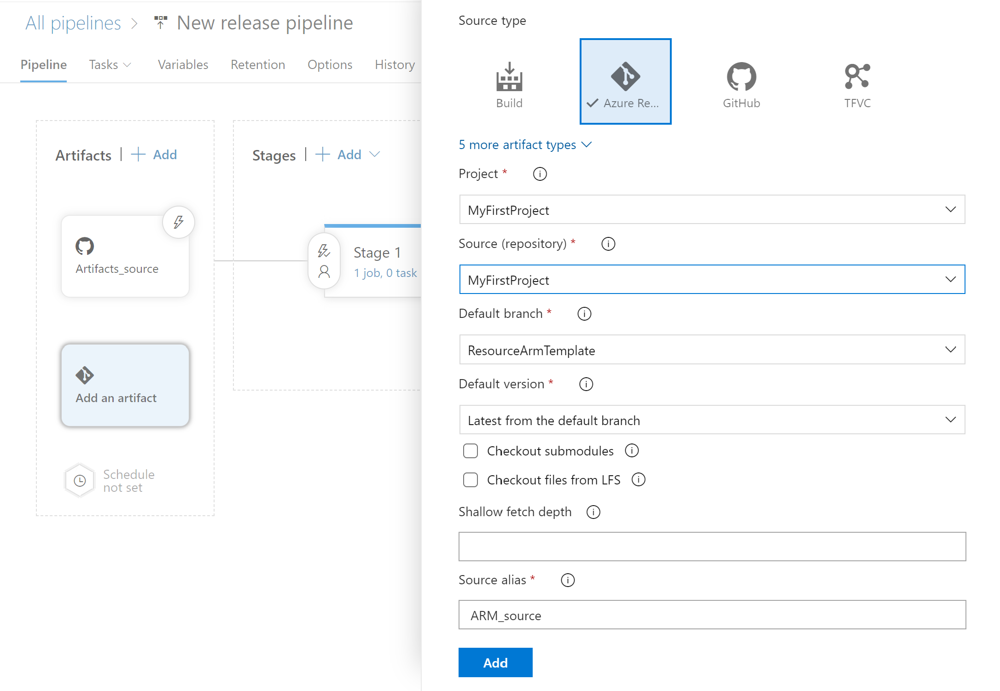

1.  Select the [publish branch](source-control.md#configure-publishing-settings) of the repository for the **Default branch**. By default, this publish branch is `workspace_publish`. For the **Default version**, select **Latest from default branch**.

    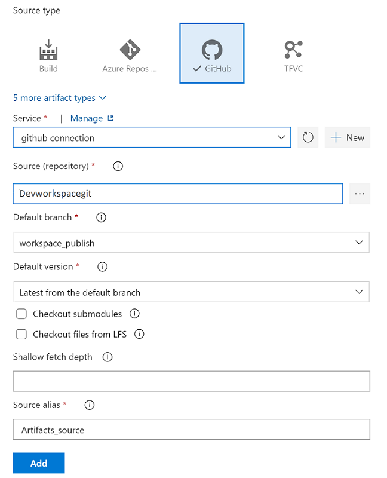

## Set up a stage task for ARM resource create and update 

Add an Azure Resource Manager Deployment task to create or update resources, including workspace, and pools:

1. In the stage view, select **View stage tasks**.

    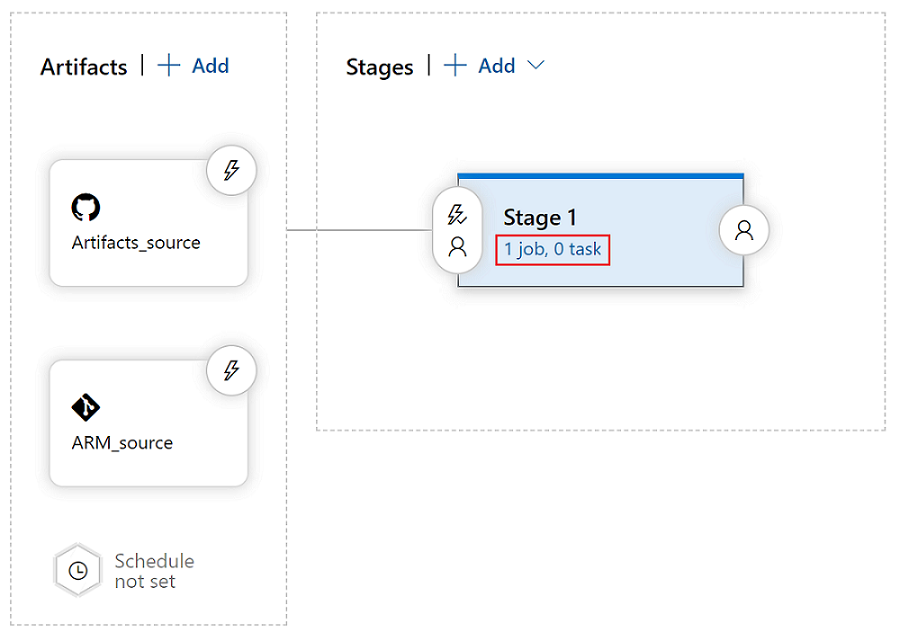

1. Create a new task. Search for **ARM Template Deployment**, and then select **Add**.

1. In the Deployment task, select the subscription, resource group, and location for the target workspace. Provide credentials if necessary.

1. In the **Action** list, select **Create or update resource group**.

1. Select the ellipsis button (**…**) next to the **Template** box. Browse for the Azure Resource Manager template of your target workspace

1. Select **…** next to the **Template parameters** box to choose the parameters file.

1. Select **…** next to the **Override template parameters** box, and enter the desired parameter values for the target workspace. 

1. Select **Incremental** for the **Deployment mode**.
    
    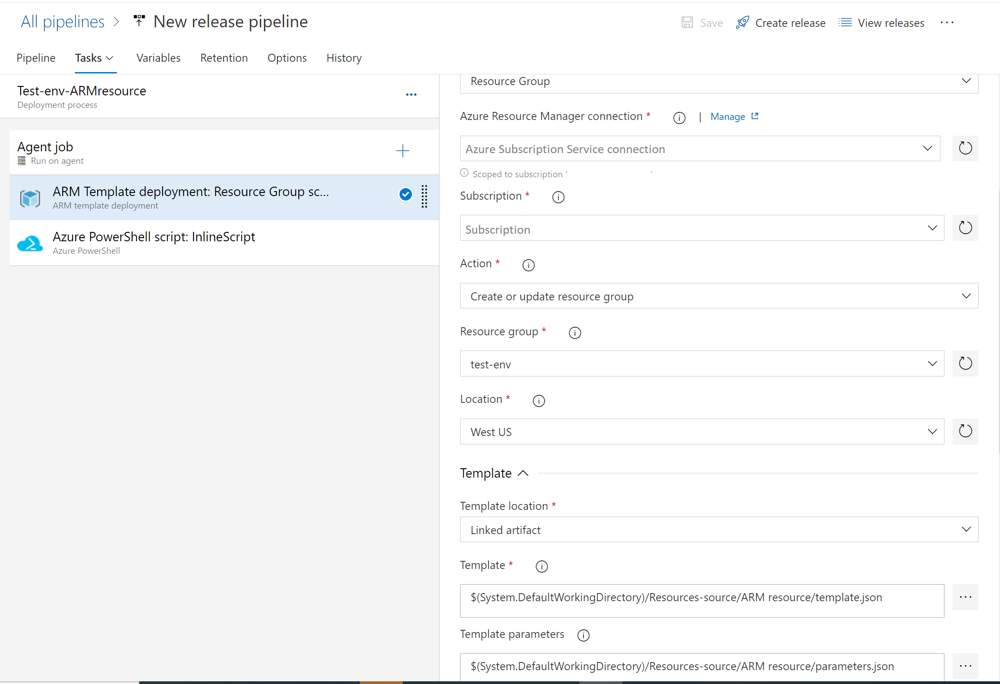

1. (Optional) Add **Azure PowerShell** for the grant and update workspace role assignment. If you use release pipeline to create a Synapse workspace, the pipeline’s service principal is added as default workspace admin. You can run PowerShell to grant other accounts access to the workspace. 
    
    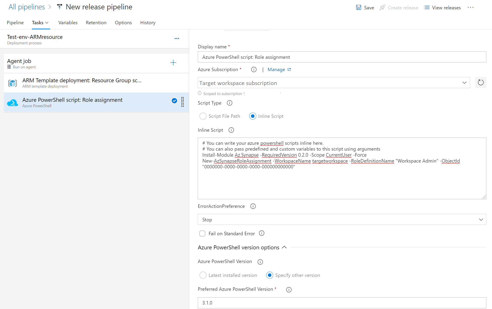

 > [!WARNING]
> In Complete deployment mode, resources that exist in the resource group but aren't specified in the new Resource Manager template will be **deleted**. For more information, please refer to [Azure Resource Manager Deployment Modes](../../azure-resource-manager/templates/deployment-modes.md)

## Set up a stage task for artifacts deployment 

Use [Synapse workspace deployment](https://marketplace.visualstudio.com/items?itemName=AzureSynapseWorkspace.synapsecicd-deploy) extension to deploy other items in Synapse workspace, like dataset, SQL script, notebook, spark job definition, dataflow, pipeline,linked service, credentials and IR (Integration Runtime).  

1. Search and get the extension from **Azure DevOps marketplace**(https://marketplace.visualstudio.com/azuredevops) 

     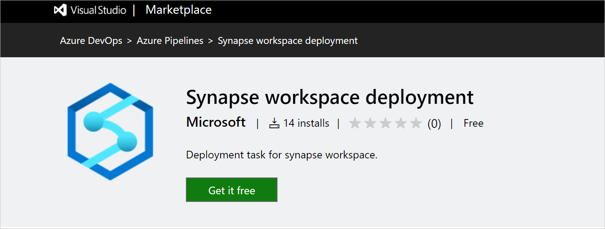

1. Select an organization to install extension. 

     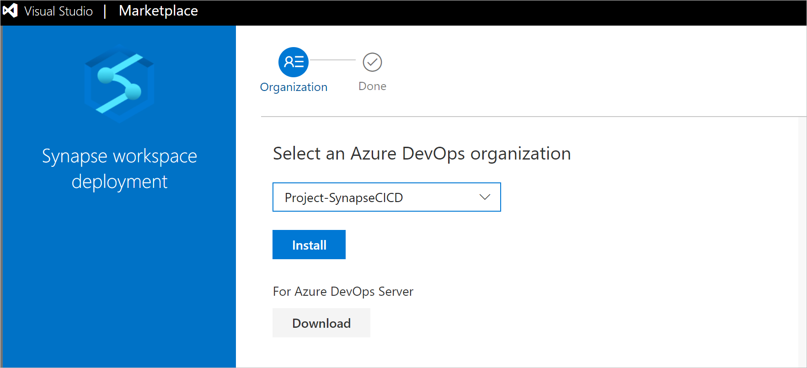

1. Make sure Azure DevOps pipeline’s service principal has been granted the permission of subscription and also assigned as workspace admin for target workspace. 

1. Create a new task. Search for **Synapse workspace deployment**, and then select **Add**.

     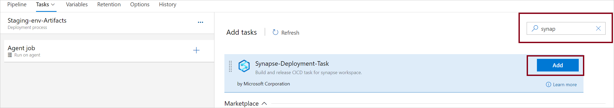

1.  In the task, select **…** next to the **Template** box to choose the template file.

1. Select **…** next to the **Template parameters** box to choose the parameters file.

1. Select the connection, resource group, and name of the target workspace. 

1. Select **…** next to the **Override template parameters** box, and enter the desired parameter values for the target workspace. 

    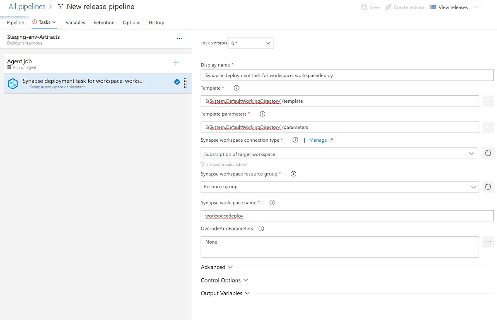

> [!IMPORTANT]
> In CI/CD scenarios, the integration runtime (IR) type in different environments must be the same. For example, if you have a self-hosted IR in the development environment, the same IR must also be of type self-hosted in other environments, such as test and production. Similarly, if you're sharing integration runtimes across multiple stages, you have to configure the integration runtimes as linked self-hosted in all environments, such as development, test, and production.

## Create release for deployment 

After saving all changes, you can select **Create release** to manually create a release. To automate the creation of releases, see [Azure DevOps release triggers](/azure/devops/pipelines/release/triggers)

   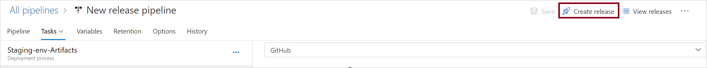

## Use custom parameters of the workspace template 

You use automated CI/CD and you want to change some properties during deployment, but the properties aren't parameterized by default. In this case, you can override the default parameter template.

To override the default parameter template, you need to create a custom parameter template, a file named **template-parameters-definition.json** in the root folder of your git collaboration branch. You must use that exact file name. When publishing from the collaboration branch, Synapse workspace will read this file and use its configuration to generate the parameters. If no file is found, the default parameter template is used.

### Custom parameter syntax

The following are some guidelines for creating the custom parameters file:

* Enter the property path under the relevant entity type.
* Setting a property name to `*` indicates that you want to parameterize all properties under it (only down to the first level, not recursively). You can also provide exceptions to this configuration.
* Setting the value of a property as a string indicates that you want to parameterize the property. Use the format `<action>:<name>:<stype>`.
   *  `<action>` can be one of these characters:
      * `=` means keep the current value as the default value for the parameter.
      * `-` means don't keep the default value for the parameter.
      * `|` is a special case for secrets from Azure Key Vault for connection strings or keys.
   * `<name>` is the name of the parameter. If it's blank, it takes the name of the property. If the value starts with a `-` character, the name is shortened. For example, `AzureStorage1_properties_typeProperties_connectionString` would be shortened to `AzureStorage1_connectionString`.
   * `<stype>` is the type of parameter. If `<stype>` is blank, the default type is `string`. Supported values: `string`, `securestring`, `int`, `bool`, `object`, `secureobject` and `array`.
* Specifying an array in the file indicates that the matching property in the template is an array. Synapse iterates through all the objects in the array by using the definition that's specified. The second object, a string, becomes the name of the property, which is used as the name for the parameter for each iteration.
* A definition can't be specific to a resource instance. Any definition applies to all resources of that type.
* By default, all secure strings, like Key Vault secrets, and secure strings, like connection strings, keys, and tokens, are parameterized.

### Parameter template definition samples 

Here's an example of what a parameter template definition looks like:

```json
{
"Microsoft.Synapse/workspaces/notebooks": {
        "properties":{
            "bigDataPool":{
                "referenceName": "="
            }
        }
    },
    "Microsoft.Synapse/workspaces/sqlscripts": {
	 "properties": {
         "content":{
             "currentConnection":{
                    "*":"-"
                 }
            } 
        }
	},
    "Microsoft.Synapse/workspaces/pipelines": {
        "properties": {
            "activities": [{
                 "typeProperties": {
                    "waitTimeInSeconds": "-::int",
                    "headers": "=::object"
                }
            }]
        }
    },
    "Microsoft.Synapse/workspaces/integrationRuntimes": {
        "properties": {
            "typeProperties": {
                "*": "="
            }
        }
    },
    "Microsoft.Synapse/workspaces/triggers": {
        "properties": {
            "typeProperties": {
                "recurrence": {
                    "*": "=",
                    "interval": "=:triggerSuffix:int",
                    "frequency": "=:-freq"
                },
                "maxConcurrency": "="
            }
        }
    },
    "Microsoft.Synapse/workspaces/linkedServices": {
        "*": {
            "properties": {
                "typeProperties": {
                     "*": "="
                }
            }
        },
        "AzureDataLakeStore": {
            "properties": {
                "typeProperties": {
                    "dataLakeStoreUri": "="
                }
            }
        }
    },
    "Microsoft.Synapse/workspaces/datasets": {
        "properties": {
            "typeProperties": {
                "*": "="
            }
        }
    }
}
```
Here's an explanation of how the preceding template is constructed, broken down by resource type.

#### Notebooks 

* Any property in the path `properties/bigDataPool/referenceName` is parameterized with its default value. You can parameterize attached Spark pool for each notebook file. 

#### SQL Scripts 

* Properties (poolName and databaseName) in the path `properties/content/currentConnection` are parameterized as strings without the default values in the template. 

#### Pipelines

* Any property in the path `activities/typeProperties/waitTimeInSeconds` is parameterized. Any activity in a pipeline that has a code-level property named `waitTimeInSeconds` (for example, the `Wait` activity) is parameterized as a number, with a default name. But it won't have a default value in the Resource Manager template. It will be a mandatory input during the Resource Manager deployment.
* Similarly, a property called `headers` (for example, in a `Web` activity) is parameterized with type `object` (Object). It has a default value, which is the same value as that of the source factory.

#### IntegrationRuntimes

* All properties under the path `typeProperties` are parameterized with their respective default values. For example, there are two properties under `IntegrationRuntimes` type properties: `computeProperties` and `ssisProperties`. Both property types are created with their respective default values and types (Object).

#### Triggers

* Under `typeProperties`, two properties are parameterized. The first one is `maxConcurrency`, which is specified to have a default value and is of type`string`. It has the default parameter name `<entityName>_properties_typeProperties_maxConcurrency`.
* The `recurrence` property also is parameterized. Under it, all properties at that level are specified to be parameterized as strings, with default values and parameter names. An exception is the `interval` property, which is parameterized as type `int`. The parameter name is suffixed with `<entityName>_properties_typeProperties_recurrence_triggerSuffix`. Similarly, the `freq` property is a string and is parameterized as a string. However, the `freq` property is parameterized without a default value. The name is shortened and suffixed. For example, `<entityName>_freq`.

#### LinkedServices

* Linked services are unique. Because linked services and datasets have a wide range of types, you can provide type-specific customization. In this example, for all linked services of type `AzureDataLakeStore`, a specific template will be applied. For all others (via `*`), a different template will be applied.
* The `connectionString` property will be parameterized as a `securestring` value. It won't have a default value. It will have a shortened parameter name that's suffixed with `connectionString`.
* The property `secretAccessKey` happens to be an `AzureKeyVaultSecret` (for example, in an Amazon S3 linked service). It's automatically parameterized as an Azure Key Vault secret and fetched from the configured key vault. You can also parameterize the key vault itself.

#### Datasets

* Although type-specific customization is available for datasets, you can provide configuration without explicitly having a \*-level configuration. In the preceding example, all dataset properties under `typeProperties` are parameterized.


## Best practices for CI/CD

If you're using Git integration with your Synapse workspace and have a CI/CD pipeline that moves your changes from development into test and then to production, we recommend these best practices:

-   **Git integration**. Configure only your development Synapse workspace with Git integration. Changes to test and production workspaces are deployed via CI/CD and don't need Git integration.
-   **Prepare pools before artifacts migration**. If you have SQL script or notebook attached to pools in the development workspace, the same name of pools in different environments are expected. 
-   **Infrastructure as Code (IaC)**. Management of infrastructure (networks, virtual machines, load balancers, and connection topology) in a descriptive model, use the same versioning as DevOps team uses for source code. 
-   **Others**. See [best practices for ADF artifacts](../../data-factory/continuous-integration-deployment.md#best-practices-for-cicd)

## Troubleshooting artifacts deployment 

### Use the Synapse workspace deployment task

In Synapse, there are a number of artifacts that are not ARM resources. This differs from Azure Data Factory. The ARM template deployment task will not work properly to deploy Synapse artifacts
 
### Unexpected token error in release

When your parameter file has parameter values which are not escaped, the release pipeline will fail to parse the file, and will generate the error, "unexpected token". We suggest you to override parameters or use Azure KeyVault to retrieve parameter values. You could also use double escape characters as a workaround.
