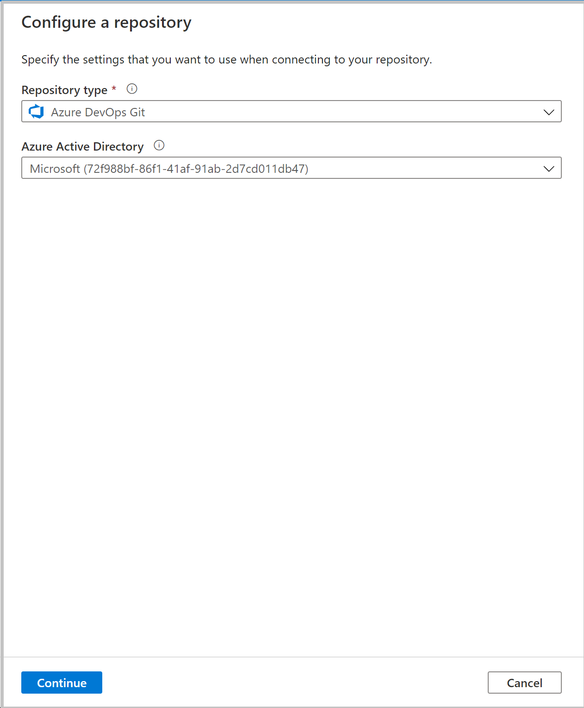

# Source control in Azure Synapse Studio

By default, Azure Synapse Studio authors directly against the synapse service. This experience has the following limitations:

- For now, Synapse Studio doesn't include a temporary storage for storing your changes. The only way to save and share changes is via the **Publish** and all changes are published directly to the Synapse service.
- The Synapse Studio isn't optimized for collaboration and version control.

To provide a good way to manage and version changes, Synapse Studio allows you to integrate your workspace with a Git repository, Azure DevOps or GitHub. This article will outline how to configure and work in a workspace with git repository enabled with highlighting best practices and a troubleshooting guide.

> [!NOTE]
> Azure Synapse Studio git integration is not available in the Azure Government Cloud.

## Configure Git repository in workspace 

After launching your Synapse Studio, you can configure git repository in workspace. A Synapse Studio workspace can only be associated with only one git repository at a time. 

### Configuration method 1: Authoring canvas

In the Synapse Studio authoring canvas, select the **Synapse Live** drop-down menu, and then select **Set up code repository**.


### Configuration method 2: Management hub

Go to the management hub of Synapse Studio. Select **Git configuration** in the **Source control** section. If you have no repository connected, click **Configure**.


> [!NOTE]
> Users granted as workspace contributor, owner, or higher level roles can configure, edit Setting and disconnect git repository in Azure Synapse studio 

You can connect either Azure DevOps or GitHub git repository in your workspace.

## Connect with Azure DevOps Git 

You can associate a Synapse Studio workspace with an Azure DevOps Repository for source control, collaboration, versioning, and so on. If you don't have an Azure DevOps repository, follow [these instructions](/azure/devops/organizations/accounts/create-organization-msa-or-work-student) to create your repository resources first.

### Azure DevOps Git repository settings

When connecting to your git repository, first select your repository type as Azure DevOps git, and then select one Azure AD tenant from dropdown list, and click **Continue**.



The configuration pane shows the following Azure DevOps git settings:

| Setting | Description | Value |
|:--- |:--- |:--- |
| **Repository Type** | The type of the Azure Repos code repository.<br/> | Azure DevOps Git or GitHub |
| **Azure Active Directory** | Your Azure AD tenant name. | `<your tenant name>` |
| **Azure Repos Organization** | Your Azure Repos organization name. You can locate your Azure Repos organization name at `https://{organization name}.visualstudio.com`. You can [sign in to your Azure Repos organization](https://www.visualstudio.com/team-services/git/) to access your Visual Studio profile and see your repositories and projects. | `<your organization name>` |
| **ProjectName** | Your Azure Repos project name. You can locate your Azure Repos project name at `https://{organization name}.visualstudio.com/{project name}`. | `<your Azure Repos project name>` |
| **RepositoryName** | Your Azure Repos code repository name. Azure Repos projects contain Git repositories to manage your source code as your project grows. You can create a new repository or use an existing repository that's already in your project. | `<your Azure Repos code repository name>` |
| **Collaboration branch** | Your Azure Repos collaboration branch that is used for publishing. By default, its `master`. Change this setting in case you want to publish resources from another branch. You can select existing branches or create new | `<your collaboration branch name>` |
| **Root folder** | Your root folder in your Azure Repos collaboration branch. | `<your root folder name>` |
| **Import existing resources to repository** | Specifies whether to import existing resources from the Synapse Studio into an Azure Repos Git repository. Check the box to import your workspace resources (except pools) into the associated Git repository in JSON format. This action exports each resource individually. When this box isn't checked, the existing resources aren't imported. | Checked (default) |
| **Import resource into this branch** | Select which branch the resources (sql script, notebook, spark job definition, dataset, dataflow etc.) are imported to. 

Your can also use repository link to quickly point to the repository  you want to connect with. 

### Use a different Azure Active Directory tenant

The Azure Repos Git repo can be in a different Azure Active Directory tenant. To specify a different Azure AD tenant, you have to have administrator permissions for the Azure subscription that you're using. For more info, see [change subscription administrator](../cost-management-billing/manage/add-change-subscription-administrator.md#to-assign-a-user-as-an-administrator)

> [!IMPORTANT]
> To connect to another Azure Active Directory, the user logged in must be a part of that active directory. 

### Use your personal Microsoft account

To use a personal Microsoft account for Git integration, you can link your personal Azure Repo to your organization's Active Directory.

1. Add your personal Microsoft account to your organization's Active Directory as a guest. For more info, see [Add Azure Active Directory B2B collaboration users in the Azure portal](../active-directory/external-identities/add-users-administrator.md).

2. Log in to the Azure portal with your personal Microsoft account. Then switch to your organization's Active Directory.

3. Go to the Azure DevOps section, where you now see your personal repo. Select the repo and connect with Active Directory.

After these configuration steps, your personal repo is available when you set up Git integration in the Data Factory UI.

For more info about connecting Azure Repos to your organization's Active Directory, see [Connect your Azure DevOps organization to Azure Active Directory](/azure/devops/organizations/accounts/connect-organization-to-azure-ad).

## Connect with GitHub 

 You can associate a data factory with a GitHub account repository for source control, collaboration, versioning. If you don't have a GitHub account or repository, follow [these instructions](https://github.com/join) to create your resources.

The GitHub integration with Synapse Studio supports both public GitHub (that is, [https://github.com](https://github.com)) and GitHub Enterprise. You can use both public and private GitHub repositories as long you have read and write permission to the repository in GitHub.


### GitHub settings

When connecting to your git repository, first select your repository type as GitHub, and then provide your GitHub account or GitHub Enterprise Server URL if you use GitHub Enterprise Server, and click **Continue**.


The configuration pane shows the following GitHub repository settings:

| **Setting** | **Description**  | **Value**  |
|:--- |:--- |:--- |
| **Repository Type** | The type of the Azure Repos code repository. | GitHub |
| **Use GitHub Enterprise** | Checkbox to select GitHub Enterprise | unselected (default) |
| **GitHub Enterprise URL** | The GitHub Enterprise root URL (must be HTTPS for local GitHub Enterprise server). For example: `https://github.mydomain.com`. Required only if **Use GitHub Enterprise** is selected | `<your GitHub enterprise url>` |                                                           
| **GitHub account** | Your GitHub account name. This name can be found from https:\//github.com/{account name}/{repository name}. Navigating to this page prompts you to enter GitHub OAuth credentials to your GitHub account. | `<your GitHub account name>` |
| **Repository Name**  | Your GitHub code repository name. GitHub accounts contain Git repositories to manage your source code. You can create a new repository or use an existing repository that's already in your account. | `<your repository name>` |
| **Collaboration branch** | Your GitHub collaboration branch that is used for publishing. By default, its master. Change this setting in case you want to publish resources from another branch. | `<your collaboration branch>` |
| **Root folder** | Your root folder in your GitHub collaboration branch. |`<your root folder name>` |
| **Import existing resources to repository** | Specifies whether to import existing resources from the Synapse Studio into a Git repository. Check the box to import your workspace resources (except pools) into the associated Git repository in JSON format. This action exports each resource individually. When this box isn't checked, the existing resources aren't imported. | Selected (default) |
| **Import resource into this branch** | Select which branch the resources (sql script, notebook, spark job definition, dataset, dataflow etc.) is imported. 

### GitHub organizations

Connecting to a GitHub organization requires the organization to grant permission to Synapse studio. A user with ADMIN permissions on the organization must perform the below steps to allow data factory to connect.

#### Connecting to GitHub for the first time

If you're connecting to GitHub from Synapse studio for the first time, follow these steps to connect to a GitHub organization.

1. In the Git configuration pane, enter the organization name in the *GitHub Account* field. A prompt to login into GitHub will appear. 
1. Login using your user credentials.
1. You'll be asked to authorize Synapse as an application called *Azure Synapse*. On this screen, you will see an option to grant permission for Synapse to access the organization. If you don't see the option to grant permission, ask an admin to manually grant the permission through GitHub.

Once you follow these steps, your workspace will be able to connect to both public and private repositories within your organization. If you are unable to connect, try clearing the browser cache and retrying.

## Version control

Version control systems (also known as _source control_) allows developers to collaborate on code and track changes.Source control is an essential tool for multi-developer projects.

### Creating feature branches

Each Git repository that's associated with a Synapse Studio has a collaboration branch. (`main`or`master` is the default collaboration branch). Users can also create feature branches by clicking **+ New Branch** in the branch dropdown. Once the new branch pane appears, enter the name of your feature branch.


When you are ready to merge the changes from your feature branch to your collaboration branch, click on the branch dropdown and select **Create pull request**. This action takes you to Git provider where you can raise pull requests, do code reviews, and merge changes to your collaboration branch. You are only allowed to publish to the Synapse service from your collaboration branch. 


### Configure publishing settings

By default, synapse generates the Resource Manager templates of the published factory and saves them into a branch called `workspace_publish`. To configure a custom publish branch, add a `publish_config.json` file to the root folder in the collaboration branch. When publishing, synapse studio reads this file, looks for the field `publishBranch`, and saves all Resource Manager templates to the specified location. If the branch doesn't exist, data factory will automatically create it. And example of what this file looks like is below:

```json
{
    "publishBranch": "workspace_publish"
}
```

Azure synapse studio can only have one publish branch at a time. When you specify a new publish branch, the previous publish branch would not been deleted. If you want to remove the previous publish branch, delete it manually.

### Publish code changes

After merging changes to the collaboration branch , click **Publish** to manually publish your code changes in the collaboration branch to the synapse service.


A side pane will open where you confirm that the publish branch and pending changes are correct. Once you verify your changes, click **OK** to confirm the publish.


> [!IMPORTANT]
> The collaboration branch is not representative of what's deployed in the service. The changes in collaboration branch *must* be published manually service.

## Best practices for Git integration

### Permissions

Typically you don't want every team member to have permissions to update the Data Factory. The following permissions settings are recommended:

*   All team members should have read permissions to the Data Factory.
*   Only a select set of people should be allowed to publish to the Data Factory. To do so, they must have the **Data Factory contributor** role on the **Resource Group** that contains the Data Factory. For more information on permissions, see [Roles and permissions for Azure Data Factory](concepts-roles-permissions.md).

It's recommended to not allow direct check-ins to the collaboration branch. This restriction can help prevent bugs as every check-in will go through a pull request review process described in [Creating feature branches](source-control.md#creating-feature-branches).

### Using passwords from Azure Key Vault

It's recommended to use Azure Key Vault to store any connection strings or passwords or managed identity authentication for Data Factory Linked Services. For security reasons, data factory doesn't store secrets in Git. Any changes to Linked Services containing secrets such as passwords are published immediately to the Azure Data Factory service.

Using Key Vault or MSI authentication also makes continuous integration and deployment easier as you won't have to provide these secrets during Resource Manager template deployment.

## Troubleshooting Git integration

### Stale publish branch

If the publish branch is out of sync with the master branch and contains out-of-date resources despite a recent publish, try following these steps:

1. Remove your current Git repository
1. Reconfigure Git with the same settings, but make sure **Import existing Data Factory resources to repository** is selected and choose **New branch**
1. Create a pull request to merge the changes to the collaboration branch 

Below are some examples of situations that can cause a stale publish branch:
- A user has multiple branches. In one feature branch, they deleted a linked service that isn't AKV associated (non-AKV linked services are published immediately regardless if they are in Git or not) and never merged the feature branch into the collaboration branch.
- A user modified the data factory using the SDK or PowerShell
- A user moved all resources to a new branch and tried to publish for the first time. Linked services should be created manually when importing resources.
- A user uploads a non-AKV linked service or an Integration Runtime JSON manually. They reference that resource from another resource such as a dataset, linked service, or pipeline. A non-AKV linked service created through the UX is published immediately because the credentials need to be encrypted. If you upload a dataset referencing that linked service and try to publish, the UX will allow it because it exists in the git environment. It will be rejected at publish time since it does not exist in the data factory service.

## Switch to a different Git repository

To switch to a different Git repository, go to Git configuration page in the management hub under **Source control**. Select **Disconnect**. 


Enter your data factory name and click **confirm** to remove the Git repository associated with your data factory.


After you remove the association with the current repo, you can configure your Git settings to use a different repo and then import existing Data Factory resources to the new repo.

> [!IMPORTANT]
> Removing Git configuration from a data factory doesn't delete anything from the repository. The factory will contain all published resources. You can continue to edit the factory directly against the service.

## Next steps

* To learn more about monitoring and managing pipelines, see [Monitor and manage pipelines programmatically](monitor-programmatically.md).
* To implement continuous integration and deployment, see [Continuous integration and delivery (CI/CD) in Azure Data Factory](continuous-integration-deployment.md).