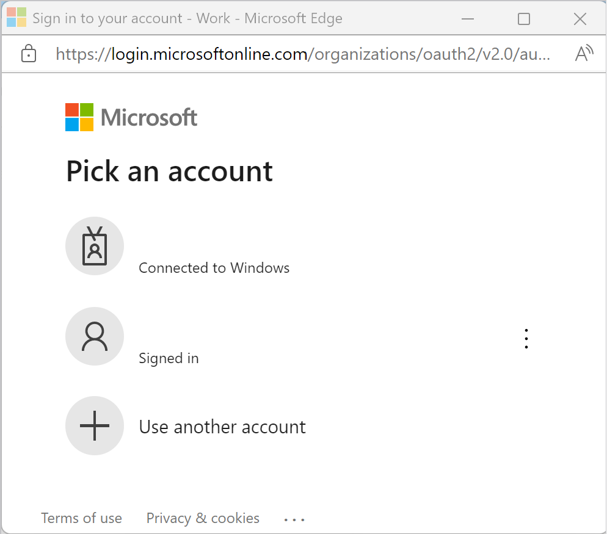
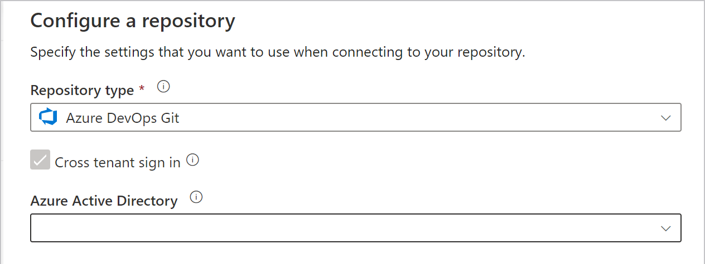

# Source control in Synapse Studio

By default, Synapse Studio authors directly against the Synapse service. If you have a need for collaboration using Git for source control, Synapse Studio allows you to associate your workspace with a Git repository, Azure DevOps, or GitHub. 

This article will outline how to configure and work in a Synapse workspace with git repository enabled. And we also highlight some best practices and a troubleshooting guide.

> [!NOTE]
>To use GitHub in Azure Gov and Microsoft Azure operated by 21Vianet, you can bring your own GitHub OAuth application in Synapse Studio for git integration. The configure experience is same with ADF. You can refer to the [announcement blog](https://techcommunity.microsoft.com/t5/azure-data-factory/cicd-improvements-with-github-support-in-azure-government-and/ba-p/2686918).

## Prerequisites
Users must have the Azure Contributor (Azure RBAC) or higher role on the Synapse workspace to configure, edit settings and disconnect a Git repository with Synapse. 

## Configure Git repository in Synapse Studio 

After launching your Synapse Studio, you can configure a git repository in your workspace. A Synapse Studio workspace can be associated with only one git repository at a time. 

### Configuration method 1: global bar

In the Synapse Studio global bar, select the **Synapse Live** drop-down menu, and then select **Set up code repository**.


### Configuration method 2: Manage hub

Go to the Manage hub of Synapse Studio. Select **Git configuration** in the **Source control** section. If you have no repository connected, click **Configure**.


You can connect either Azure DevOps or GitHub git repository in your workspace.

## Connect with Azure DevOps Git 

You can associate a Synapse workspace with an Azure DevOps Repository for source control, collaboration, versioning, and so on. If you don't have an Azure DevOps repository, follow [these instructions](/azure/devops/organizations/accounts/create-organization-msa-or-work-student) to create your repository resources.

### Azure DevOps Git repository settings

When connecting to your git repository, first select your repository type as Azure DevOps git, and then select one Azure AD tenant from the dropdown list, and click **Continue**.


The configuration pane shows the following Azure DevOps git settings:

| Setting | Description | Value |
|:--- |:--- |:--- |
| **Repository Type** | The type of the Azure Repos code repository.<br/> | Azure DevOps Git or GitHub |
| **Cross tenant sign in** | Checkbox to sign in with cross tenant account. | unselected (default) |
| **Azure Active Directory** | Your Azure AD tenant name. | `<your tenant name>` |
| **Azure DevOps account** | Your Azure Repos organization name. You can locate your Azure Repos organization name at `https://{organization name}.visualstudio.com`. You can [sign in to your Azure Repos organization](https://www.visualstudio.com/team-services/git/) to access your Visual Studio profile and see your repositories and projects. | `<your organization name>` |
| **ProjectName** | Your Azure Repos project name. You can locate your Azure Repos project name at `https://{organization name}.visualstudio.com/{project name}`. | `<your Azure Repos project name>` |
| **RepositoryName** | Your Azure Repos code repository name. Azure Repos projects contain Git repositories to manage your source code as your project grows. You can create a new repository or use an existing repository that's already in your project. | `<your Azure Repos code repository name>` |
| **Collaboration branch** | Your Azure Repos collaboration branch that is used for publishing. By default, its `master`. Change this setting in case you want to publish resources from another branch. You can select existing branches or create new | `<your collaboration branch name>` |
| **Root folder** | Your root folder in your Azure Repos collaboration branch. | `<your root folder name>` |
| **Import existing resources to repository** | Specifies whether to import existing resources from the Synapse Studio into an Azure Repos Git repository. Check the box to import your workspace resources (except pools) into the associated Git repository in JSON format. This action exports each resource individually. When this box isn't checked, the existing resources aren't imported. | Checked (default) |
| **Import resource into this branch** | Select which branch the resources (sql script, notebook, spark job definition, dataset, dataflow etc.) are imported to. 

Your can also use repository link to quickly point to the git repository you want to connect with. 

### Use a different Azure Active Directory tenant

The Azure Repos Git repo can be in a different Azure Active Directory tenant. To specify a different Azure AD tenant, you have to have administrator permissions for the Azure subscription that you're using. For more info, see [change subscription administrator](../../cost-management-billing/manage/add-change-subscription-administrator.md#assign-a-subscription-administrator)

> [!IMPORTANT]
> To connect to another Azure Active Directory, the user logged in must be a part of that active directory. 

### Use your personal Microsoft account

To use a personal Microsoft account for Git integration, you can link your personal Azure Repo to your organization's Active Directory.

1. Add your personal Microsoft account to your organization's Active Directory as a guest. For more info, see [Add Azure Active Directory B2B collaboration users in the Azure portal](../../active-directory/external-identities/add-users-administrator.md).

2. Log in to the Azure portal with your personal Microsoft account. Then switch to your organization's Active Directory.

3. Go to the Azure DevOps section, where you now see your personal repo. Select the repo and connect with Active Directory.

After these configuration steps, your personal repo is available when you set up Git integration in the Synapse Studio.

For more info about connecting Azure Repos to your organization's Active Directory, see [Connect your organization to Azure Active Directory](/azure/devops/organizations/accounts/connect-organization-to-azure-ad).

### Use a cross tenant Azure DevOps account

When your Azure DevOps is not in the same tenant as the Synapse workspace, you can configure the workspace with your cross tenant Azure DevOps account with the guide below.  

1. Select the **Cross tenant sign in** option and click **Continue** 

    

1. Select **OK** in the dialog box.

    

1. click **Use another account** and login with your Azure DevOps account.

    

1. After signing in, choose the directory and repository and configure it accordingly.

    

    > [!NOTE]
    > To login the workspace, you need to use the first sign-in to log into to your Synapse workspace user account. Your cross tenant Azure DevOps account is only used for signing into and getting access to the Azure DevOps repo associated with this Synapse workspace.


## Connect with GitHub 

 You can associate a workspace with a GitHub repository for source control, collaboration, versioning. If you don't have a GitHub account or repository, follow [these instructions](https://github.com/join) to create your resources.

The GitHub integration with Synapse Studio supports both public GitHub (that is, [https://github.com](https://github.com)) and GitHub Enterprise. You can use both public and private GitHub repositories as long you have read and write permission to the repository in GitHub.

### GitHub settings

When connecting to your git repository, first select your repository type as GitHub, and then provide your GitHub account, your GitHub Enterprise Server URL if you use GitHub Enterprise Server, or your GitHub Enterprise organization name if you use GitHub Enterprise Cloud. Select **Continue**.

> [!NOTE]
> If you're using GitHub Enterprise Cloud, leave the **Use GitHub Enterprise Server** checkbox cleared. 


The configuration pane shows the following GitHub repository settings:

| **Setting** | **Description**  | **Value**  |
|:--- |:--- |:--- |
| **Repository Type** | The type of the Azure Repos code repository. | GitHub |
| **Use GitHub Enterprise** | Checkbox to select GitHub Enterprise | unselected (default) |
| **GitHub Enterprise URL** | The GitHub Enterprise root URL (must be HTTPS for local GitHub Enterprise server). For example: `https://github.mydomain.com`. Required only if **Use GitHub Enterprise** is selected | `<your GitHub enterprise url>` |                                                           
| **GitHub account** | Your GitHub account name. This name can be found from https:\//github.com/{account name}/{repository name}. Navigating to this page prompts you to enter GitHub OAuth credentials to your GitHub account. | `<your GitHub account name>` |
| **Repository Name**  | Your GitHub code repository name. GitHub accounts contain Git repositories to manage your source code. You can create a new repository or use an existing repository that's already in your account. | `<your repository name>` |
| **Collaboration branch** | Your GitHub collaboration branch that is used for publishing. By default, its master. Change this setting in case you want to publish resources from another branch. | `<your collaboration branch>` |
| **Root folder** | Your root folder in your GitHub collaboration branch. |`<your root folder name>` |
| **Import existing resources to repository** | Specifies whether to import existing resources from the Synapse Studio into a Git repository. Check the box to import your workspace resources (except pools) into the associated Git repository in JSON format. This action exports each resource individually. When this box isn't checked, the existing resources aren't imported. | Selected (default) |
| **Import resource into this branch** | Select which branch the resources (sql script, notebook, spark job definition, dataset, dataflow etc.) is imported. 

### GitHub organizations

Connecting to a GitHub organization requires the organization to grant permission to Synapse Studio. A user with ADMIN permissions on the organization must perform the below steps.

#### Connecting to GitHub for the first time

If you're connecting to GitHub from Synapse Studio for the first time, follow these steps to connect to a GitHub organization.

1. In the Git configuration pane, enter the organization name in the *GitHub Account* field. A prompt to login into GitHub will appear. 

1. Login using your user credentials. 

1. You'll be asked to authorize Synapse as an application called *Azure Synapse*. On this screen, you will see an option to grant permission for Synapse to access the organization. If you don't see the option to grant permission, ask an admin to manually grant the permission through GitHub.

Once you follow these steps, your workspace will be able to connect to both public and private repositories within your organization. If you are unable to connect, try clearing the browser cache and retrying.

#### Already connected to GitHub using a personal account

If you have already connected to GitHub and only granted permission to access a personal account, follow the below steps to grant permissions to an organization.

1. Go to GitHub and open **Settings**.

    

1. Select **Applications**. In the **Authorized OAuth apps** tab, you should see *Azure Synapse*.

    

1. Select the *Azure Synapse* and grant the access to your organization.

    

Once you complete these steps, your workspace will be able to connect to both public and private repositories within your organization.

## Version control

Version control systems (also known as _source control_) allows developers to collaborate on code and track changes.Source control is an essential tool for multi-developer projects.

### Creating feature branches

Each Git repository that's associated with a Synapse Studio has a collaboration branch. (`main` or `master` is the default collaboration branch). Users can also create feature branches by clicking **+ New Branch** in the branch dropdown. 


Once the new branch pane appears, enter the name of your feature branch and select a branch to base the work off of.


When you are ready to merge the changes from your feature branch to your collaboration branch, click on the branch dropdown and select **Create pull request**. This action takes you to Git provider where you can raise pull requests, do code reviews, and merge changes to your collaboration branch. You are only allowed to publish to the Synapse service from your collaboration branch. 


### Configure publishing settings

By default, Synapse Studio generates the workspace templates and saves them into a branch called `workspace_publish`. To configure a custom publish branch, add a `publish_config.json` file to the root folder in the collaboration branch. When publishing, Synapse Studio reads this file, looks for the field `publishBranch`, and saves workspace template files to the specified location. If the branch doesn't exist, Synapse Studio will automatically create it. And example of what this file looks like is below:

```json
{
    "publishBranch": "workspace_publish"
}
```

Synapse Studio can only have one publish branch at a time. When you specify a new publish branch, the previous publish branch would not been deleted. If you want to remove the previous publish branch, delete it manually.


### Publish code changes

After merging changes to the collaboration branch , click **Publish** to manually publish your code changes in the collaboration branch to the Synapse service.


A side pane will open where you confirm that the publish branch and pending changes are correct. Once you verify your changes, click **OK** to confirm the publish.


> [!IMPORTANT]
> The collaboration branch is not representative of what's deployed in the service. The changes in collaboration branch *must* be published manually.

## Switch to a different Git repository

To switch to a different Git repository, go to Git configuration page in the management hub under **Source control**. Select **Disconnect**. 


Enter your workspace name and click **Disconnect** to remove the Git repository associated with your workspace.

After you remove the association with the current repo, you can configure your Git settings to use a different repo and then import existing resources to the new repo.

> [!IMPORTANT]
> Removing Git configuration from a workspace doesn't delete anything from the repository. Synapse workspace will contain all published resources. You can continue to edit the workspace directly against the service.

## Best practices for Git integration

-   **Permissions**. After you have a git repository connected to your workspace, anyone who can access to your git repo with any role in your workspace will be able to update artifacts, like sql script, notebook,spark job definition, dataset, dataflow and pipeline in git mode. Typically you don't want every team member to have permissions to update workspace. 
Only grant git repository permission to Synapse workspace artifact authors. 
-   **Collaboration**. It's recommended to not allow direct check-ins to the collaboration branch. This restriction can help prevent bugs as every check-in will go through a pull request review process described in [Creating feature branches](source-control.md#creating-feature-branches).
-   **Synapse live mode**. After publishing in git mode,  all changes will be reflected in Synapse live mode. In Synapse live mode, publishing is disabled. And you can view, run artifacts in live mode if you have been granted the right permission. 
-   **Edit artifacts in Studio**. Synapse studio is the only place you can enable workspace source control and sync changes to git automatically. Any change via SDK, PowerShell, will not be synced to git. We recommend you always edit artifact in Studio when git is enabled.

## Troubleshooting git integration

### Access to git mode 

If you have been granted the permission to the GitHub git repository linked with your workspace, but you can not access to Git mode: 

1. Clear your cache and refresh the page. 

1. Login your GitHub account.

### Stale publish branch

If the publish branch is out of sync with the collaboration branch and contains out-of-date resources despite a recent publish, try following these steps:

1. Remove your current Git repository

1. Reconfigure Git with the same settings, but make sure **Import existing resources to repository** is checked and choose the same branch.  

1. Create a pull request to merge the changes to the collaboration branch 

## Unsupported features

- Synapse Studio doesn't allow cherry-picking of commits or selective publishing of resources. 
- Synapse Studio doesn't support customize commit message.
- By design, delete action in Studio will be committed to git directly

## Next steps

* To implement continuous integration and deployment, see [Continuous integration and delivery (CI/CD)](continuous-integration-delivery.md).
