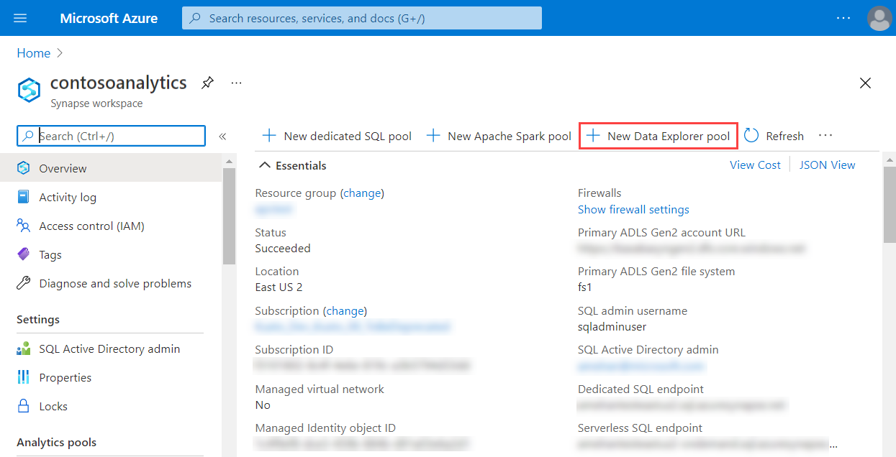
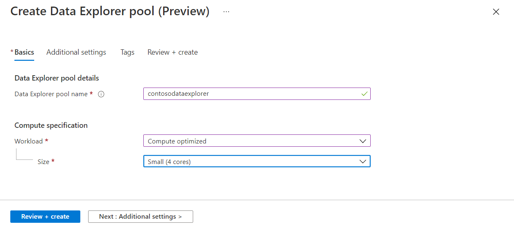
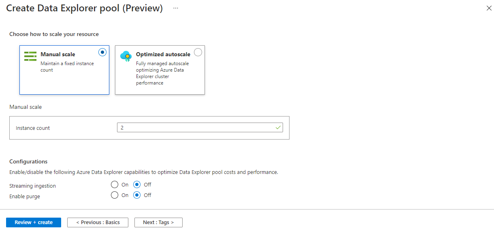
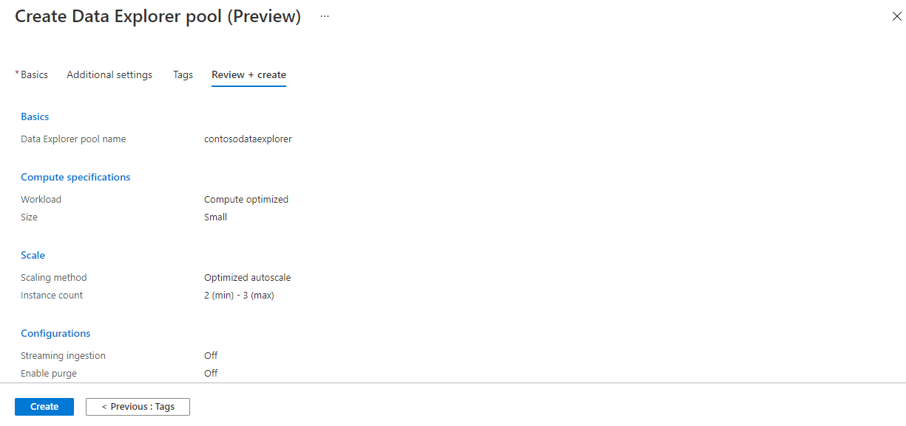
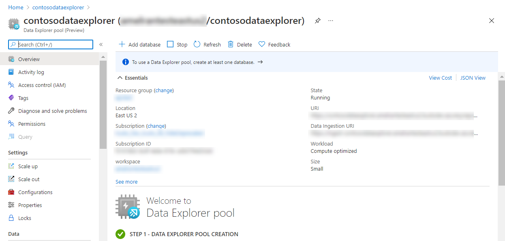
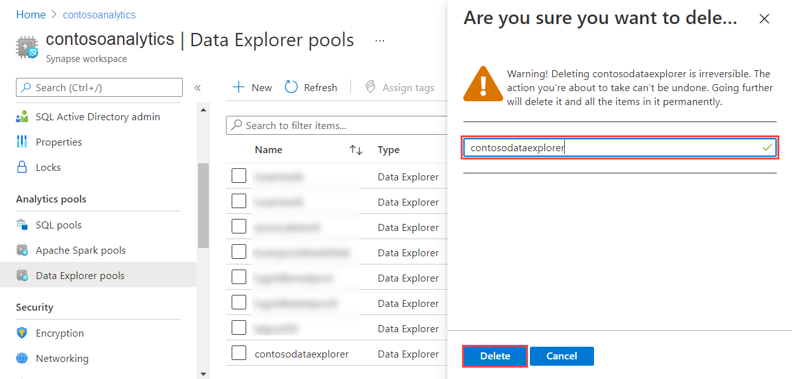

# Quickstart: Create a Data Explorer pool using the Azure portal (Preview)

Azure Synapse Data Explorer is a fast, fully managed data analytics service for real-time analysis on large volumes of data streaming from applications, websites, IoT devices, and more. To use Data Explorer, you first create a Data Explorer pool.

This article describes the steps to create a Data Explorer pool in a Synapse workspace by using the Azure portal.

> [!IMPORTANT]
> Billing for Data Explorer instances is prorated per minute, whether you are using them or not. Be sure to shutdown your Data Explorer instance after you have finished using it, or set a short timeout. For more information, see **Clean up resources**.

If you don't have an Azure subscription, [create a free account before you begin](https://azure.microsoft.com/free/).

## Prerequisites

- You'll need an Azure subscription. If needed, [create a free Azure account](https://azure.microsoft.com/free/)
- [Synapse workspace](../quickstart-create-workspace.md)

## Sign in to the Azure portal

Sign in to the [Azure portal](https://portal.azure.com/)

## Navigate to the Synapse workspace

1. Navigate to the Synapse workspace where the Data Explorer pool will be created by typing the service name (or resource name directly) into the search bar.

    

1. From the list of workspaces, type the name (or part of the name) of the workspace to open. For this example, we'll use a workspace named **contosoanalytics**.

    

## Create a new Data Explorer pool

1. In the Synapse workspace where you want to create the Data Explorer pool, select **New Data Explorer pool**.

    

1. Enter the following details in the **Basics** tab:

    | Setting | Suggested value | Description |
    |--|--|--|
    | Data Explorer pool name | contosodataexplorer | This is the name that the Data Explorer pool will have. |
    | Workload | Compute optimized | This workload provides a higher CPU to SSD storage ratio. |
    | Node size | Small (4 cores) | Set this to the smallest size to reduce costs for this quickstart |

    

    > [!IMPORTANT]
    > Note that there are specific limitations for the names that Data Explorer pools can use. Names must contain lowercase letters and numbers only, must be between 4 and 15 characters, and must start with a letter.

1. Select **Next: Additional settings**. Use the following settings and leave the defaults for the remaining settings.

    | Setting | Suggested value | Description |
    |--|--|--|
    | Scaling | Manual scale | We won't need autoscale in this quickstart |
    | Number count | 2 | Set this to the smallest size to reduce costs for this quickstart |

    

1. Select **Next: tags**. Don't add any tags.
1. Select **Review + create**.
1. Review the detail making sure they are correct, and then select **Create**.

    The Data Explorer pool will start the provisioning process.

    

1. Once the provisioning is complete, navigate back to the workspace **Overview** page and verify that the new Data Explorer pool welcome page appears.

    

## Clean up Data Explorer pool resources using the Azure portal

Use the following steps to delete the Data Explorer pool from the workspace using the Azure portal.

> [!WARNING]
> Deleting a data-explorer pool will remove the analytics engine from the workspace. It will no longer be possible to connect to the pool, and all queries, pipelines, and notebooks that use the deleted pool will no longer work.

### Delete the Data Explorer pool

1. Navigate to the Data Explorer pools in the workspace.
1. To remove the Data Explorer pool (in this case, **contosodataexplorer**), select **More [...]** > **Delete**.

    

1. To confirm the deletion, enter the name of the pool being deleted and then select **Delete**.

    

1. Once the process completes successfully, verify that the pool no longer appears in the list.

## Next steps

- [Ingestion overview](ingest-data/data-explorer-ingest-data-overview.md)
- [Analyze with Data Explorer](../get-started-analyze-data-explorer.md)
- [Monitor Data Explorer pools](data-explorer-monitor-pools.md)
