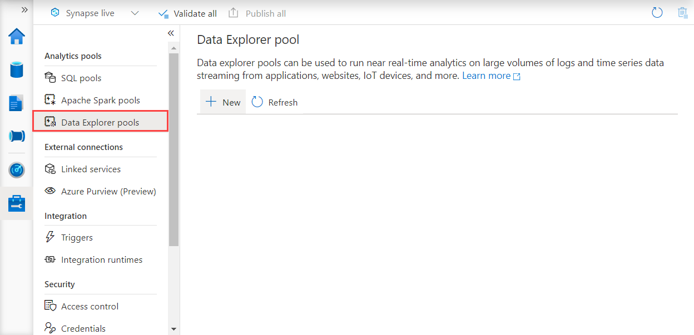
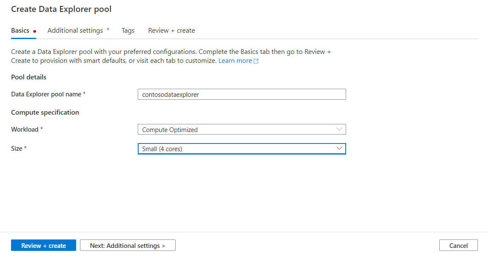
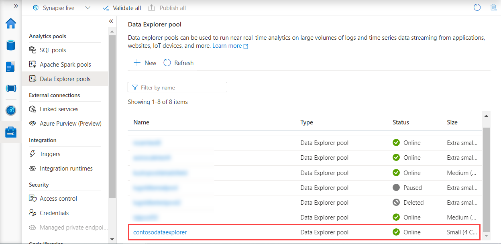

# Quickstart: Create a Data Explorer pool using Synapse Studio (Preview)

Azure Synapse Analytics Data Explorer is a fast, fully managed data analytics service for real-time analysis on large volumes of data streaming from applications, websites, IoT devices, and more. To use Data Explorer, you first create a Data Explorer pool.

This quickstart describes the steps to create a Data Explorer pool in a Synapse workspace by using Synapse Studio.

> [!IMPORTANT]
> Billing for Data Explorer instances is prorated per minute, whether you are using them or not. Be sure to shutdown your Data Explorer instance after you have finished using it, or set a short timeout. For more information, see **Clean up resources**.

If you don't have an Azure subscription, [create a free account before you begin](https://azure.microsoft.com/free/).

## Prerequisites

- Azure subscription - [create one for free](https://azure.microsoft.com/free/)
- [Synapse workspace](../quickstart-create-workspace.md)

## Sign in to the Azure portal

Sign in to the [Azure portal](https://portal.azure.com/)

## Navigate to the Synapse workspace

1. Navigate to the Synapse workspace where the Data Explorer pool will be created by typing the service name (or resource name directly) into the search bar.

    

1. From the list of workspaces, type the name (or part of the name) of the workspace to open. For this example, we'll use a workspace named **contosoanalytics**.

    

## Launch Synapse Studio

From the workspace overview, select the **Workspace web URL** to open Synapse Studio.

## Create a new Data Explorer pool

1. On the Synapse Studio home page, navigate to the **Management Hub** in the left navigation by selecting the **Manage** icon.

    

1. Once in the Management Hub, navigate to the **Data Explorer pools** section to see the current list of Data Explorer pools that are available in the workspace.

    

1. Select **+ New**. The new Data Explorer pool create wizard appears.

1. Enter the following details in the **Basics** tab:

    | Setting | Suggested value | Description |
    |--|--|--|
    | Data Explorer pool name | contosodataexplorer | This is the name that the Data Explorer pool will have. |
    | Workload | Computer optimized | This workload requires more CPU than SSD storage. |
    | Node size | Small (4 cores) | Set this to the smallest size to reduce costs for this quickstart |

    

    > [!IMPORTANT]
    > Note that there are specific limitations for the names that Data Explorer pools can use. Names must contain letters or numbers only, must be 15 or less characters, must start with a letter, not contain reserved words, and be unique in the workspace.

1. Select **Next: Additional settings**. Use the following settings and leave the defaults for the remaining settings.

    | Setting | Suggested value | Description |
    |--|--|--|
    | Autoscale | Disabled | We won't need autoscale in this quickstart |
    | Number of instances | 2 | Set this to the smallest size to reduce costs for this quickstart |

    

1. Select **Next: tags**. Don't add any tags.
1. Select **Review + create**.
1. Review the detail making sure they are correct, and then select **Create**.

    The Data Explorer pool will start the provisioning process.

    

1. Once the provisioning is complete, navigate back to the workspace and verify that the new Data Explorer pool appears in the list.

    

## Clean up Data Explorer pool resources using Synapse Studio

Use the following steps to delete the Data Explorer pool from the workspace using the Azure portal.

> [!WARNING]
> Deleting a data-explorer pool will remove the analytics engine from the workspace. It will no longer be possible to connect to the pool, and all queries, pipelines, and notebooks that use the deleted pool will no longer work.

If you want to delete the Data Explorer pool, do the following:

1. Navigate to the Data Explorer pools in the Management Hub in the Azure portal.
1. To remove the Data Explorer pool (in this case, **contosodataexplorer**), select **More [...]** > **Delete**.

    

1. To confirm the deletion, enter the name of the pool being deleted and then select **Delete**.

    

1. Once the process completes successfully, verify that the pool no longer appears in the list.

## Next steps

[Quickstart: Create a Data Explorer pool using the Azure portal](data-explorer-create-pool-portal.md)
