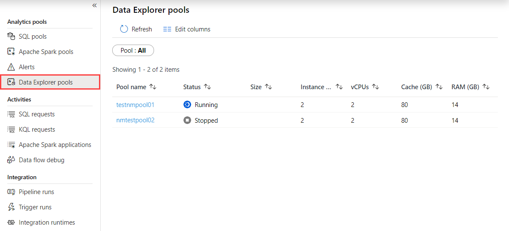
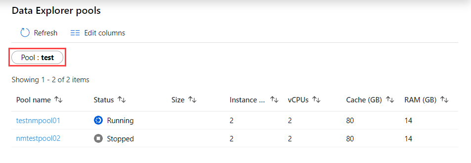
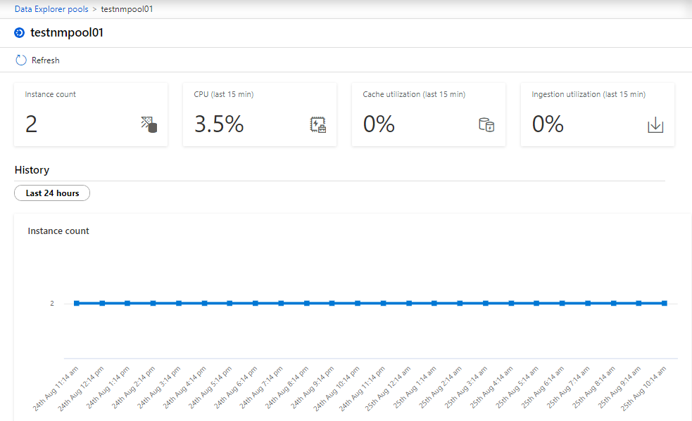

# Quickstart: Use Synapse Studio to monitor your Data Explorer pools (Preview)

With Azure Synapse Analytics, you can use Data Explorer to run queries, dashboards and more on Data Explorer pools in your workspace.

This article explains how to monitor your Data Explorer pools, allowing you to keep an eye on the status of your pools, including how many vCores are in use by different workspace users.

## Access Data Explorer pools list

To see the list of Data Explorer pools in your workspace, first [open the Synapse Studio](https://web.azuresynapse.net/) and select your workspace.

Once you've opened your workspace, select the **Monitor** section on the left.

Select **Data Explorer pools** to view the list of Data Explorer pools.

## Filter your Data Explorer pools

You can filter the list of Data Explorer pools to the ones that interest you. The filters at the top of the screen allow you to specify a field on which you'd like to filter.

For example, you can filter the view to see only the Data Explorer pools containing the name "test":

## View details about a specific Data Explorer pool

To view the details about one of your Data Explorer pools, select the Data Explorer pool to view the details.

