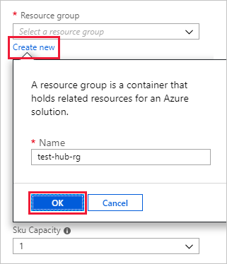
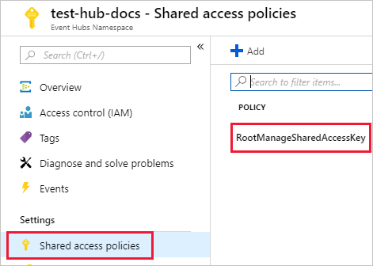
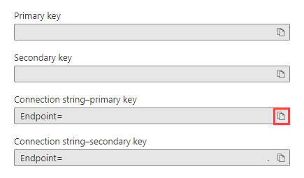
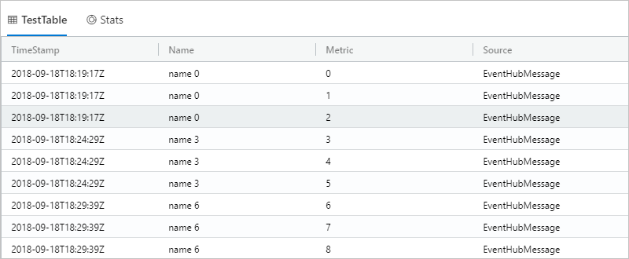
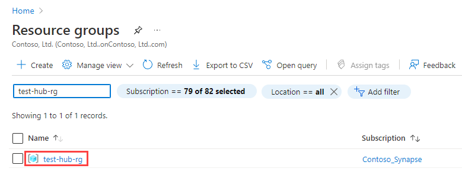

# Ingest data from Event Hub into Azure Synapse Data Explorer

> [!div class="op_single_selector"]
> * [Portal](data-explorer-ingest-event-hub-portal.md)
> * [One-click](data-explorer-ingest-event-hub-one-click.md)
> * [C\#](data-explorer-ingest-event-hub-csharp.md)
> * [Python](data-explorer-ingest-event-hub-python.md)
> * [Azure Resource Manager template](data-explorer-ingest-event-hub-resource-manager.md)

[!INCLUDE [data-connector-intro](../includes/data-explorer-ingest-data-intro.md)]

Azure Synapse Data Explorer offers ingestion (data loading) from Event Hubs, a big data streaming platform and event ingestion service. [Event Hubs](../../../event-hubs/event-hubs-about.md) can process millions of events per second in near real time. In this article, you create an Event Hub, connect to it from Azure Synapse Data Explorer and see data flow through the system.

## Prerequisites

[!INCLUDE [data-explorer-ingest-prerequisites](../includes/data-explorer-ingest-prerequisites.md)]

- Create a target table to which Event Hubs will send data
    1. In Synapse Studio, on the left-side pane, select **Develop**.
    1. Under **KQL scripts**, Select **&plus;** (Add new resource) > **KQL script**. On the right-side pane, you can name your script.
    1. In the **Connect to** menu, select *contosodataexplorer*.
    1. In the **Use database** menu, select *TestDatabase*.
    1. Paste in the following command, and select **Run** to create the table.

        ```Kusto
        .create table TestTable (TimeStamp: datetime, Name: string, Metric: int, Source:string)
        ```
    
        > [!TIP]
        > Verify that the table was successfully created. On the left-side pane, select **Data**, select the *contosodataexplorer* more menu, and then select **Refresh**. Under *contosodataexplorer*, expand **Tables** and make sure that the *TestTable* table appears in the list.

    1. Copy the following command into the window and select **Run** to map the incoming JSON data to the column names and data types of the table (TestTable).
    
        ```Kusto
        .create table TestTable ingestion json mapping 'TestMapping' '[{"column":"TimeStamp", "Properties": {"Path": "$.timeStamp"}},{"column":"Name", "Properties": {"Path":"$.name"}} ,{"column":"Metric", "Properties": {"Path":"$.metric"}}, {"column":"Source", "Properties": {"Path":"$.source"}}]'
        ```

- We recommend using a [user assigned managed identity](../../../active-directory/managed-identities-azure-resources/qs-configure-portal-windows-vm.md#user-assigned-managed-identity) or [system assigned managed identity](../../../active-directory/managed-identities-azure-resources/qs-configure-portal-windows-vm.md#system-assigned-managed-identity) for the data connection (optional).
- [A sample app](https://github.com/Azure-Samples/event-hubs-dotnet-ingest) that generates data and sends it to an Event Hub. Download the sample app to your system.
- [Visual Studio 2019](https://visualstudio.microsoft.com/vs/) to run the sample app.

## Sign in to the Azure portal

Sign in to the [Azure portal](https://portal.azure.com/).

## Create an Event Hub

Create an Event Hub by using an Azure Resource Manager template in the Azure portal.

1. To create an Event Hub, use the following button to start the deployment. Right-click and select **Open in new window**, so you can follow the rest of the steps in this article.

   :::image type="content" source="~/reusable-content/ce-skilling/azure/media/template-deployments/deploy-to-azure-button.svg" alt-text="Button to deploy the Resource Manager template to Azure." border="false" link="https://portal.azure.com/#create/Microsoft.Template/uri/https%3A%2F%2Fraw.githubusercontent.com%2FAzure%2Fazure-quickstart-templates%2Fmaster%2Fquickstarts%2Fmicrosoft.eventhub%2Fevent-hubs-create-event-hub-and-consumer-group%2Fazuredeploy.json":::

    The **Deploy to Azure** button takes you to the Azure portal.

1. Select the subscription where you want to create the Event Hub, and create a resource group named *test-hub-rg*.

    

1. Fill out the form with the following information.

    Use defaults for any settings not listed in the following table.

    **Setting** | **Suggested value** | **Field description**
    |---|---|---|
    | Subscription | Your subscription | Select the Azure subscription that you want to use for your Event Hub.|
    | Resource group | *test-hub-rg* | Create a new resource group. |
    | Location | *West US* | Select *West US* for this article. For a production system, select the region that best meets your needs. Create the Event Hub namespace in the same Location as the Azure Synapse Data Explorer cluster for best performance (most important for Event Hub namespaces with high throughput).
    | Namespace name | A unique namespace name | Choose a unique name that identifies your namespace. For example, *mytestnamespace*. The domain name *servicebus.windows.net* is appended to the name you provide. The name can contain only letters, numbers, and hyphens. The name must start with a letter, and it must end with a letter or number. The value must be between 6 and 50 characters long.
    | Event Hub name | *test-hub* | The Event Hub sits under the namespace, which provides a unique scoping container. The Event Hub name must be unique within the namespace. |
    | Consumer group name | *test-group* | Consumer groups enable multiple consuming applications to each have a separate view of the event stream. |
    | | |

1. Select **Review + create**.

1. Review the **Summary** of resources created. Select **Create**, which acknowledges that you're creating resources in your subscription.

    :::image type="content" source="../media/ingest-data-event-hub/review-create.png" alt-text="Screen shot of Azure portal for reviewing and creating Event Hub namespace, Event Hub, and consumer group.":::

1. Select **Notifications** on the toolbar to monitor the provisioning process. It might take several minutes for the deployment to succeed, but you can move on to the next step now.

    

### Authentication considerations

Depending on the type of identity, you are using to authenticate with the Event Hub, you may need some additional configurations.

- If you are authenticating with Event Hub using a user assigned managed identity, go to your Event Hub > **Networking**, and then under **Allow access from**, select **All networks** and save the changes.

    :::image type="content" source="../media/ingest-data-event-hub/configure-event-hub-all-networks.png" alt-text="Screenshot of the Event Hub networking page, showing the selection of allowing access to all networks.":::

- If you are authenticating with the Event Hub using a system assigned managed identity, go to your Event Hub > **Networking**, and then either allow access from all networks or under **Allow access from**, select **Selected networks**, select **Allow trusted Microsoft services to bypass this firewall** and save the changes.

    :::image type="content" source="../media/ingest-data-event-hub/configure-event-hub-trusted-services.png" alt-text="Screenshot of the Event Hub networking page, showing the selection of allowing access to trusted services.":::

## Connect to the Event Hub

Now you connect to the Event Hub from Data Explorer pool. When this connection is in place, data that flows into the Event Hub streams to the test table you created earlier in this article.

1. Select **Notifications** on the toolbar to verify that the Event Hub deployment was successful.

1. Under the Data Explorer pool you created, select **Databases** > **TestDatabase**.

    :::image type="content" source="../media/ingest-data-event-hub/select-test-database.png" alt-text="Select test database.":::

1. Select **Data connections** and **Add data connection**.

    :::image type="content" source="../media/ingest-data-event-hub/event-hub-connection.png" alt-text="Select data ingestion and Add data connection.":::

### Create a data connection (Preview)

Fill out the form with the following information, and then select **Create**.

:::image type="content" source="../media/ingest-data-event-hub/data-connection-pane.png" alt-text="Data connection pane Event Hub - Azure Synapse Data Explorer.":::

**Setting** | **Suggested value** | **Field description**
|---|---|---|
| Data connection name | *test-hub-connection* | The name of the connection you want to create in Azure Synapse Data Explorer.|
| Subscription |      | The subscription ID where the Event Hub resource is located. This field is autopopulated. |
| Event Hub namespace | A unique namespace name | The name you chose earlier that identifies your namespace. |
| Event Hub | *test-hub* | The Event Hub you created. |
| Consumer group | *test-group* | The consumer group defined in the Event Hub you created. |
| Event system properties | Select relevant properties | The [Event Hub system properties](../../../service-bus-messaging/service-bus-amqp-protocol-guide.md#message-annotations). If there are multiple records per event message, the system properties will be added to the first record. When adding system properties, [create](/azure/data-explorer/kusto/management/create-table-command?context=/azure/synapse-analytics/context/context) or [update](/azure/data-explorer/kusto/management/alter-table-command?context=/azure/synapse-analytics/context/context) table schema and [mapping](/azure/data-explorer/kusto/management/mappings?context=/azure/synapse-analytics/context/context) to include the selected properties. |
| Compression | *None* | The compression type of the Event Hub messages payload. Supported compression types: *None, Gzip*.|
| Managed Identity | System-assigned | The managed identity used by the Data Explorer cluster for access to read from the Event Hub.<br /><br />**Note**:<br />When the data connection is created:<br/>\- *System-assigned* identities are automatically created if they don't exist<br />\- The managed identity is automatically assigned the *Azure Event Hubs Data Receiver* role and is added to your Data Explorer cluster. We recommend verifying that the role was assigned and that the identity was added to the cluster. |

#### Target table

There are two options for routing the ingested data: *static* and *dynamic*.
For this article, you use static routing, where you specify the table name, data format, and mapping as default values. If the Event Hub message includes data routing information, this routing information will override the default settings.

1. Fill out the following routing settings:

    :::image type="content" source="../media/ingest-data-event-hub/default-routing-settings.png" alt-text="Default routing settings for ingesting data to Event Hub - Azure Synapse Data Explorer.":::

    |**Setting** | **Suggested value** | **Field description**
    |---|---|---|
    | Table name | *TestTable* | The table you created in **TestDatabase**. |
    | Data format | *JSON* | Supported formats are Avro, CSV, JSON, MULTILINE JSON, ORC, PARQUET, PSV, SCSV, SOHSV, TSV, TXT, TSVE, APACHEAVRO, and W3CLOG. |
    | Mapping | *TestMapping* | The [mapping](/azure/data-explorer/kusto/management/mappings?context=/azure/synapse-analytics/context/context) you created in **TestDatabase**, which maps incoming data to the column names and data types of **TestTable**. Required for JSON, MULTILINE JSON and AVRO, and optional for other formats.|

    > [!NOTE]
    >
    > * You don't have to specify all **Default routing settings**. Partial settings are also accepted.
    > * Only events enqueued after you create the data connection are ingested.

1. Select **Create**.

### Event system properties mapping

[!INCLUDE [event-hub-system-mapping](../includes/data-explorer-event-hub-system-mapping.md)]

If you selected **Event system properties** in the **Data Source** section of the table, you must include [system properties](data-explorer-ingest-event-hub-overview.md#system-properties) in the table schema and mapping.

## Copy the connection string

When you run the [sample app](https://github.com/Azure-Samples/event-hubs-dotnet-ingest) listed in Prerequisites, you need the connection string for the Event Hub namespace.

1. Under the Event Hub namespace you created, select **Shared access policies**, then **RootManageSharedAccessKey**.

    

1. Copy **Connection string - primary key**. You paste it in the next section.

    

## Generate sample data

Use the [sample app](https://github.com/Azure-Samples/event-hubs-dotnet-ingest) you downloaded to generate data.

1. Open the sample app solution in Visual Studio.
1. In the *program.cs* file, update the `eventHubName` constant to the name of your Event Hub and update the `connectionString` constant to the connection string you copied from the Event Hub namespace.

    ```csharp
    const string eventHubName = "test-hub";
    // Copy the connection string ("Connection string-primary key") from your Event Hub namespace.
    const string connectionString = @"<YourConnectionString>";
    ```

1. Build and run the app. The app sends messages to the Event Hub, and prints its status every 10 seconds.
1. After the app has sent a few messages, move on to the next step: reviewing the flow of data into your Event Hub and test table.

## Review the data flow

With the app generating data, you can now see the flow of that data from the Event Hub to the table in your cluster.

1. In the Azure portal, under your Event Hub, you see the spike in activity while the app is running.

    

1. To check how many messages have made it to the database so far, run the following query in your test database.

    ```Kusto
    TestTable
    | count
    ```

1. To see the content of the messages, run the following query:

    ```Kusto
    TestTable
    ```

    The result set should look like the following image:

    

    > [!NOTE]
    >
    > * Azure Synapse Data Explorer has an aggregation (batching) policy for data ingestion, designed to optimize the ingestion process. The default batching policy is configured to seal a batch once one of the following conditions is true for the batch: a maximum delay time of 5 minutes, total size of 1G, or 1000 blobs. Therefore, you may experience a latency. For more information, see [batching policy](/azure/data-explorer/kusto/management/batchingpolicy?context=/azure/synapse-analytics/context/context).
    > * Event Hub ingestion includes Event Hub response time of 10 seconds or 1 MB.
    > * To reduce response time lag, configure your table to support streaming. See [streaming policy](/azure/data-explorer/kusto/management/streamingingestionpolicy?context=/azure/synapse-analytics/context/context).

## Clean up resources

If you don't plan to use your Event Hub again, clean up **test-hub-rg**, to avoid incurring costs.

1. In the Azure portal, select **Resource groups** on the far left, and then select the resource group you created.

    If the left menu is collapsed, select  to expand it.

   

1. Under **test-resource-group**, select **Delete resource group**.

1. In the new window, type the name of the resource group to delete (*test-hub-rg*), and then select **Delete**.

## Next steps

- [Analyze with Data Explorer](../../get-started-analyze-data-explorer.md)
- [Monitor Data Explorer pools](../data-explorer-monitor-pools.md)