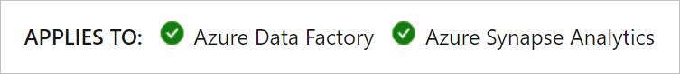

# Data integration in Azure Synapse Analytics versus Azure Data Factory

In Azure Synapse Analytics, the data integration capabilities such as Synapse pipelines and data flows are based upon those of Azure Data Factory. For more information, see [what is Azure Data Factory](../../data-factory/introduction.md). Almost all of the capabilities are identical or similar and documentation is shared between the two services. This article highlights and identifies the current differences between Azure Data Factory and Azure Synapse.

To see if an Azure Data Factory feature or article applies to Azure Synapse, check the moniker at the top of the article.

## Features in Azure Data Factory not planned for Azure Synapse

The following features are available in Azure Data Factory, but aren't planned for Azure Synapse.

* **Life and Shift SSIS packages:** In Azure Data Factory, you have the ability to lift and shift SSIS packages using the SSIS integration runtime. Both the SSIS integration runtime and the Execute SSIS Package activity aren't available in Synapse workspaces. 
* **Time to live:** Time to live is a setting in the Azure integration runtime that allows the spark cluster in mapping data flows to stay *warm* for a period of time after completion of a data flow. This feature isn't available in Synapse workspaces.

## Azure Synapse features not supported in Azure Data Factory

The following features are available in Azure Synapse, but aren't planned for Azure Data Factory.

* **Spark job monitoring of mapping data flows:** In Synapse, the Spark engine is contained in the user's subscription so users can view detailed Spark logs. In Azure Data Factory, job execution occurs on an Azure Data Factory-managed Spark cluster and this information isn't available. 

## Azure Data Factory features that behave differently in Synapse

The following features either behave differently or don't currently exist in Azure Synapse. 

* **Wrangling data flows:** The wrangling data flow activity is only available in Azure Data Factory at this time.
* **The solution template gallery:** In Azure Data Factory, users can find pipeline templates in the solution template gallery. In Synapse workspaces, the knowledge center contains a different set of templates along with additional datasets and SQL Scripts. 
* **Git integration and a native CI/CD solution:** Currently a Synapse workspace can't connect to a Git repository nor does it follow the same continuous integration and delivery process as Azure Data Factory.
* **Integration with Azure monitor:** Synapse workspaces doesn't integrate with Azure Monitor as Azure Data Factory does.
* **Hybrid integration runtime configuration:** Within a Synapse workspace, a user can't have both a managed VNet IR and an Azure IR. This capability is supported in Azure Data Factory.
* **Integration runtime sharing:** Self-hosted integration runtimes can't be shared between Synapse workspaces. This capability is supported in Azure Data Factory.
* **Cross region integration runtimes for data flows:** Data flows can't run on integration runtimes in different regions than a Synapse workspace. This capability is supported in Azure Data Factory.

## Next steps

Get started with data integration in your Synapse workspace by learning how to [ingest data into a Azure Data Lake Storage gen2 account](data-integration-data-lake.md).
