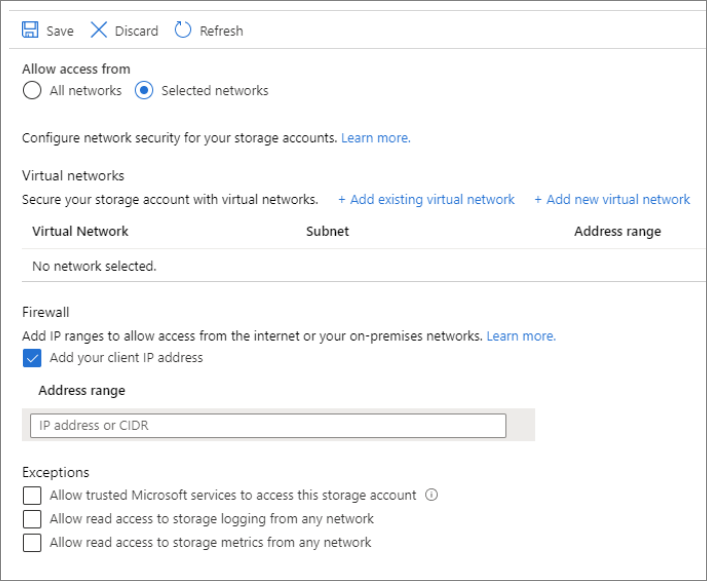

# Securing a linked service with Private Links 

In this article, you will learn how to secure a linked service in Synapse with a private endpoint.

## Prerequisites

* **Azure subscription**: If you don't have an Azure subscription, create a [free Azure account](https://azure.microsoft.com/free/) before you begin.
* **Azure Storage account**: You use Azure Data Lake Gen 2 as a *source* data store. If you don't have a storage account, see [Create an Azure Storage account](../../storage/blobs/data-lake-storage-quickstart-create-account.md) for steps to create one. Make sure that the Storage Account has the Synapse Studio IP filtering for accessing it and that you only allow **Selected networks** to access the Storage account. The setting under the blade **Firewalls and virtual networks** should look like the picture below.

## Create a linked service with Private Links

In Azure Synapse Analytics, a linked service is where you define your connection information to other services. In this section, you'll add Azure Synapse Analytics and Azure Data Lake Gen 2 as linked services.

1. Open the Azure Synapse Studio and go to the **Manage** tab.
1. Under **External connections**, select **Linked services**.
1. To add a linked service, click **New**.
1. Select the Azure Data Lake Storage Gen2 tile from the list and click **Continue**.
1. Make sure you enable **Interactive Authoring**. It might take around 1 minute to be enabled. 
1. Enter your authentication credentials. Account key, service principal, and managed identity are currently supported authentication types. Click test connection to verify your credentials are correct.
1. Select **Test connection**, it should fail because the Storage Account does not enable access into it without the creation and approval of a Private Endpoint. In the error message, you should see a link to create a **private endpoint** that you can follow to go to the next part. If you follow that link, skip the next part.
1. Select **Create** when finished.

## Create a managed private endpoint

In case, you did not click into the hyperlink when testing the connection above, follow the following path. Now you need to create a managed private endpoint that you will connect to the linked service created above.

1. Go to the **Manage** tab.
1. Go to the **Managed Virtual Networks** section.
1. Select **+ New** under Managed private endpoint.
1. Select the Azure Data Lake Storage Gen2 tile from the list and select **Continue**.
1. Enter the name of the Storage Account you created above.
1. Select **Create**
1. You should see after waiting some seconds that the private link created needs an approval.

## Approval of a private link
1. Select the Private Endpoint that you created above. You can see a hyperlink that will let you approve the Private Endpoint at the Storage Account level. *An alternative is to go directly to the Azure portal Storage Account and go into the **Private endpoint connections** blade.*
1. Tick the Private endpoint you created in the Studio and select **Approve**.
1. Add a description and click **yes**
1. Go back to Synapse Studio in under the **Managed Virtual Networks** section of the **Manage**Tab.
1. It should take around 1 minute to get the approval reflected for your private endpoint.

## Check the connection works
1. Go to the **Manage** tab and select the linked service you created.
1. Make sure that **Interactive authoring** is active.
1. Select **Test connection**. You should see the connection be successful.

You have now established a secure and private connection between Synapse and your linked service!

## Next steps

To develop further understanding of Managed private endpoint in Synapse Analytics, see the [Concept around Synapse Managed private endpoint](data-integration-data-lake.md) article.

For more information on data integration for Synapse Analytics, see the [Ingesting data into a Data Lake](data-integration-data-lake.md) article.