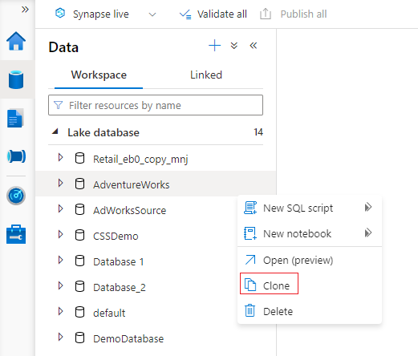
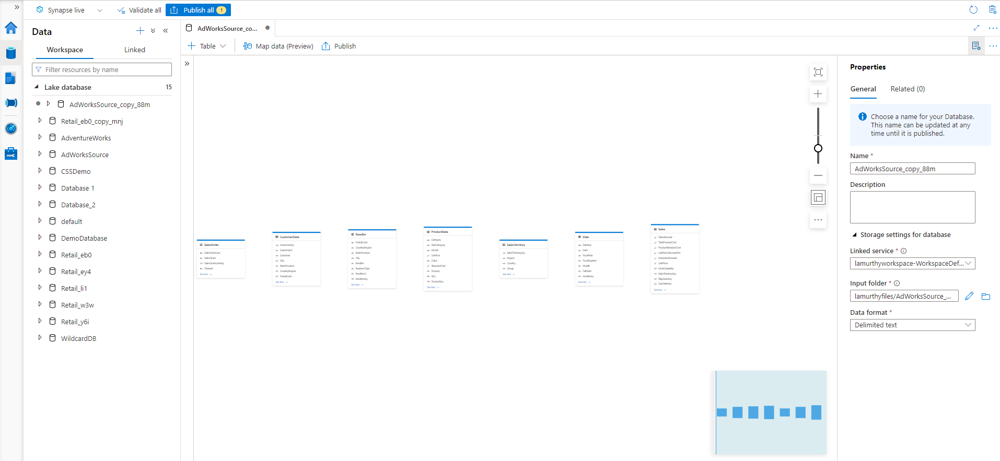
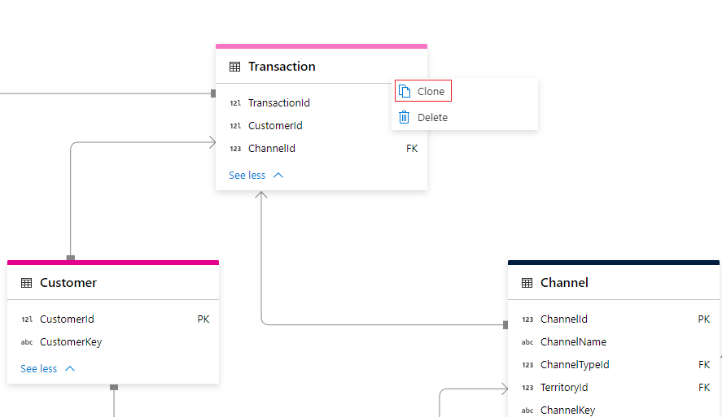
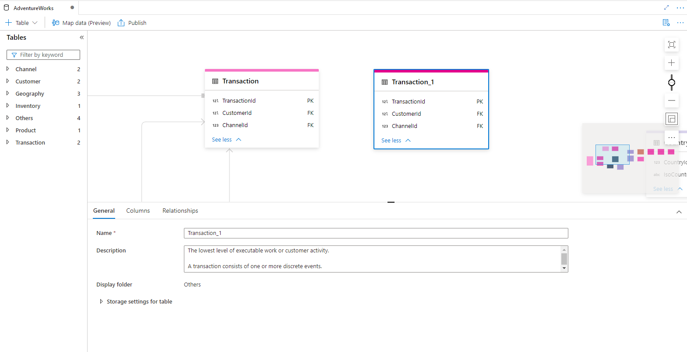

# How-to: Clone a lake database

In this article, you'll learn how to clone an existing [lake database](./concepts-lake-database.md) in Azure Synapse using the database designer. The database designer allows you to easily create and deploy a database without writing any code. 

## Prerequisites

- Synapse Administrator, or Synapse Contributor permissions are required on the Synapse workspace for creating a lake database.

## Clone database 
1. From your Azure Synapse Analytics workspace **Home** hub, select the **Data** tab on the left. The **Data** tab will open. You'll see the list of databases that already exist in your workspace.
2. Hover over the **Databases** section and select the ellipsis **...** next to the database you want to clone, then choose **Clone**.

    

3. The database designer tab will open with a copy of the selected database loaded on the canvas.
4. The database designer opens the **Properties** pane by default. Update the details for this cloned lake database.

    - **Name** Provide a new name for this database. Note that this name cannot be changed once the lake database is published.
    - **Description** Give your database a description (optional).
    - **Storage settings for database** provide the default storage information for tables in the database. The default settings are applied to each table in the database unless it's overridden on the table itself.
    - **Linked service** provide the default linked service used to store your data in Azure Data Lake Storage. The default linked service associated with the Synapse workspace will be shown, but you can change the **Linked Service** to any ADLS storage account you like.  
    - **Input folder** set the default container and folder path within that linked service using the file browser or manually editing the path with the pencil icon.
    - **Data format** select the data format. Lake databases in Azure Synapse support parquet and delimited text as the storage formats for data.
5. You can add additional tables to this cloned database by selecting the **+ Table** button. For more information, see [Modify lake database](./modify-lake-database.md). 
6. Once you have completed all the changes to your cloned database, it's now time to publish it. If you're using Git integration with your Synapse workspace, you must commit your changes and merge them into the collaboration branch. [Learn more about source control in Azure Synapse](././cicd/../../cicd/source-control.md). If you're using Synapse Live mode, you can select "publish".

## Clone tables within a lake database
The database designer allows you to clone any of the tables in your database.

1. Select a table within your lake database and click on the ellipsis **...** next to the table name. 
2. Click **Clone**.

   

3. The database designer will create a copy of the table and opens the **General** tab by default.

   

4. Update the **Name**, **Description** and **Storage settings for table** as needed. For more information, see [Modify lake database](./modify-lake-database.md).
5. Similarly update the **Columns** tab and **Relationships** tab as needed.
6. Once you have completed all the changes to your cloned database, it's now time to publish it. If you're using Git integration with your Synapse workspace, you must commit your changes and merge them into the collaboration branch. [Learn more about source control in Azure Synapse](././cicd/../../cicd/source-control.md). If you're using Synapse Live mode, you can select "publish".

## Next steps
Continue to explore the capabilities of the database designer using the links below. 
- [Create an empty lake database](./create-empty-lake-database.md)
- [Learn more about lake databases](./concepts-lake-database.md)
- [Create a lake database from lake database template](./create-lake-database-from-lake-database-templates.md)
