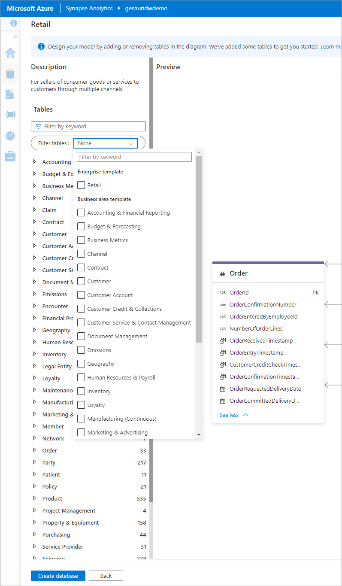

# Lake database templates

Azure Synapse Analytics provides industry specific database templates to help standardize data in the lake. These templates provide schemas for predefined business areas, enabling data to be loaded into a lake database in a structured way. Use these templates to create your lake database and use Azure Synapse analytical runtime to provide insights to business users.  

## Enterprise templates 

Enterprise database templates contain a subset of tables that are most likely to be of interest to an organization within a specific industry. It provides a high-level overview and describes the connectivity between the related business areas. These templates serve as an accelerator for many types of large projects. For example, the retail template has one enterprise template called "Retail". 

## Table

A table is an object with an independent existence that can be differentiated from other objects. For example, Customer, Store, Channel, and so on.

## Column

Each table is described by a set of columns that represent the values and data that make up the table. Each column has a name, description, data type and is associated with a table. There are around 30,000 columns in the database templates. For example, CustomerId is a column in the table Customer.

## Primary key

The primary key helps to uniquely identify the whole table. It must uniquely identify tuples in a table. For example, a key on the CustomerId column enforces uniqueness, to identify each customer in the table Customer.

## Foreign key

A foreign key is a column or a combination of columns whose values match a primary key in a different table. It helps to establish a link between two tables. For example, CustomerId in Transaction table represents a customer who has completed a transaction. A foreign key always has a relationship to a primary key, for example, to the CustomerId primary key in the Customer table.

## Composite key

A composite key is one that is composed of two or more columns that are together required to uniquely identify a record in a table. For example, in an Order table, both OrderNumber and ProductId may be required to uniquely identify a record.

## Relationships

Relationships are associations or interactions between any two tables. For example, the tables Customer and CustomerEmail are related to each other. There are two tables involved in a relationship. There's a parent table and a child table, often connected by a foreign key. You might say that the relationship is From table To table.

## Table partitions

Lake database allows for the underlying data to be partitioned for a table for better performance. You can set partition configuration in the storage settings of a table in database editor.

## Next steps

Continue to explore the capabilities of the database designer using the links below.
- [Quick start](quick-start-create-lake-database.md)
- [Lake database Concept](concepts-lake-database.md)
