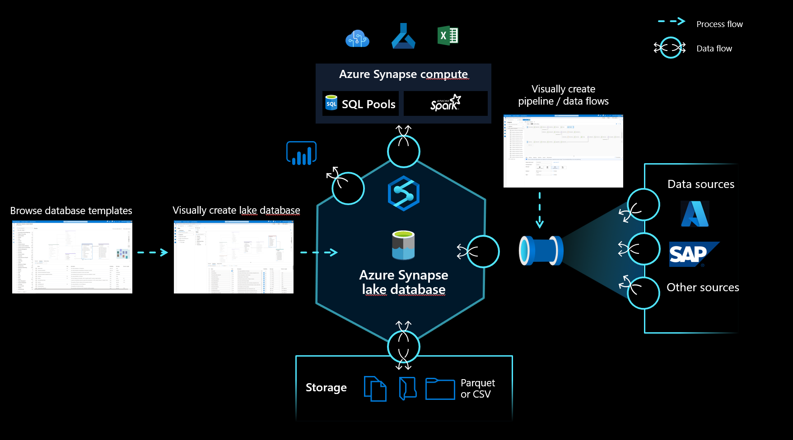

# Lake database

The lake database in Azure Synapse Analytics enables customers to bring together database design, meta information about the data that is stored and a possibility to describe how and where the data should be stored. Lake database addresses the challenge of today's data lakes where it is hard to understand how data is structured.  

## Database designer

The new database designer in Synapse Studio gives you the possibility to create a data model for your lake database and add additional information to it. Every Entity and Attribute can be described to provide more information about the model, which not only contains Entities but relationships as well. In particular, the inability to model relationships has been a challenge for the interaction on the data lake. This challenge is now addressed with an integrated designer that provides possibilities that have been available in databases but not on the lake. Also the capability to add descriptions and possible demo values to the model allows people who are interacting with it in the future to have information where they need it to get a better understanding about the data. 

## Data storage 

Lake databases use a data lake on the Azure Storage account to store the data of the database. The data can be stored in Parquet, Delta or CSV format and different settings can be used to optimize the storage. Every lake database uses a linked service to define the location of the root data folder. For every entity, separate folders are created by default within this database folder on the data lake. By default all tables within a lake database use the same format but the formats and location of the data can be changed per entity if that is requested. 

> [!NOTE] 
> Publishing a lake database does not create any of the underlying structures or schemas needed to query the data in Spark or SQL. After publishing, load data into your lake database using [pipelines](../data-integration/data-integration-data-lake.md) to begin querying it.
> 
> Currently, Delta format support for lake databases is not supported in Synapse Studio.
> 
> The synchronization of lake database objects between storage and Synapse is one-directional. Be sure to perform any creation or schema modification of lake database objects using the database designer in Synapse Studio. If you instead make such changes from Spark or directly in storage, the definitions of your lake databases will become out of sync. If this happens, you may see old lake database definitions in the database designer. You will need to replicate and publish such changes in the database designer in order to bring your lake databases back in sync.

## Database compute

The lake database is exposed in Synapse SQL serverless SQL pool and Apache Spark providing users with the capability to decouple storage from compute. The metadata that is associated with the lake database makes it easy for different compute engines to not only provide an integrated experience but also use additional information (for example, relationships) that was not originally supported on the data lake. 

## Next steps

Continue to explore the capabilities of the database designer using the links below.
- [Create lake database quick start](quick-start-create-lake-database.md)
- [Database templates Concept](concepts-database-templates.md)
