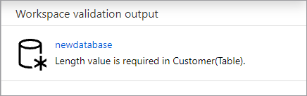

# How-to: Create a lake database from database templates

In this article, you'll learn how to use the Azure Synapse database templates to simplify the creation of a [lake database](./concepts-lake-database.md). Using database templates provides your database with rich semantic information, allowing end users of the data to more easily understand what data is available and how to use it.

## Prerequisites

- At least Synapse User role permissions are required for exploring a lake database template from Gallery.
- Synapse Administrator, or Synapse Contributor permissions are required on the Synapse workspace for creating a lake database.
- Storage Blob Data Contributor permissions are required on data lake when using the create table **From data lake** option.

## Create lake database from database template

1. From your Azure Synapse Analytics workspace **Home** hub, select **Knowledge center** and then **Browse gallery**. You'll land on the **Lake database templates** tab.
2. **Lake database templates** category lists standardized database templates available for a specific industry.
   1. You can also visit the **Lake database templates** tab from **Data** hub, **+** Add new resource, **Browse gallery** menu.
3. Select the industry you're interested in (for example, **Retail**) and select **Continue** to navigate to the exploration of the data model.
4. You'll land on the database canvas and can explore the tables available in the template. By default, the canvas will show a selection of the most used tables in that template. The canvas has various tools to help you navigate the entity-relationship diagram.
    - **Zoom to fit** to fit all tables on the canvas in the viewing area
    - **Undo last action** to undo **one** recent change
    - **Increase zoom** to zoom in to the canvas
    - **Decrease zoom** to zoom out of the canvas
    - **Zoom slider** to control the zoom level
    - **Zoom preview** to provide a preview of the canvas
    - **Expand all**/**Collapse all** to view more or less columns within a table on the canvas
    - **Clear canvas** to clear-off all the tables on the canvas

:::image type="content" source="media/create-lake-database-from-lake-database-template/canvas-overview-inline.png" alt-text="Canvas Overview." lightbox="media/create-lake-database-from-lake-database-template/canvas-overview-expanded.png" :::

5. On the left, you'll see list of folders containing the items of the template you can add to the canvas. There are several controls to help.
    - **Search box** to search for tables based on a term. The term will be searched across the template tables, columns, and descriptions.
    - **Filter tables** to select whole sections of the model to explore
      - **Enterprise templates** select tables from each **Business area** to show a "best-of".
      - **Business area templates** select tables primarily from a single **Business area** but also include related tables from other **Business areas**.
    - **Business areas** are folders containing tables related to that business construct. For example, Budget & Forecasting contains tables related to managing budgets.
    - You can expand business area folders to view the tables, and select the checkbox to add them to the canvas. 
    - Selected tables can be removed via the checkbox.
    - You can also click on the ellipses next to the business area folder and **Select All** or **UnSelect All** to add/remove all tables under that business area to the canvas.

6. You can select a table on the canvas. It opens the table properties pane with the tabs General, Columns, and Relationships.
    - The General tab has information on the table such as its name and description.
    - The Columns tab has the details about all the columns that make up the table such as column names and datatypes.
    - The Relationships tab lists the incoming and outgoing relationships of the table with other tables on the canvas.
        - Use the **Select all** toggle to view all the 'from' & 'to' relationships to that table.
        - Using the check boxes next to each relationship in the relationship tab, add the required table - relationship to the canvas. 

:::image type="content" source="media/create-lake-database-from-lake-database-template/relationship-toggle-inline.png" alt-text="Relationship toggle" lightbox="media/create-lake-database-from-lake-database-template/relationship-toggle-expanded.png":::

7. To quickly add tables that are related to the tables on canvas, select the ellipses to the right of the table name and then select **Add related tables**. All tables with existing relationships are added to the canvas. If this adds too many tables to the canvas, use the **Undo Last Action** to undo this change. 

8. Once the canvas has all the tables that meet your requirements, select **Create database** to continue with creation of lake database. The new database will show up in the database designer and you can customize it per your business needs.

9. The database designer has more **Properties** on the right that need to be configured.
    - **Name**: Give your database a name. Names cannot be edited after the database is published, so make sure the name you choose is correct.
    - **Description**: Giving your database a description is optional, but it allows users to understand the purpose of the database.
    - **Storage settings for database**: This section contains the default storage information for tables in the database. This default is applied to each table in the database unless it's overridden on the table itself.
    - **Linked service**: This is the default linked service used to store your data in Azure Data Lake Storage. The default linked service associated with the Synapse workspace will be shown, but you can change the **Linked Service** to any ADLS storage account you like. 
    - **Input folder**: This is used to set the default container and folder path within that linked service using the file browser or manually editing the path with the pencil icon.
    - **Data format**: Lake databases in Azure Synapse Analytics support Apache Parquet and delimited text as the storage formats for data.
> [!NOTE]
> You can always override the default storage settings on a table by table basis, and the default remains customizable. If you are not sure what to choose, you can revisit this later. If you are unsure of the folder hierarchy in the data lake, you can also specify wildcards to traverse the directory structure.
 
:::image type="content" source="media/create-lake-database-from-lake-database-template/designer-overview-inline.png" alt-text="Designer Overview" lightbox="media/create-lake-database-from-lake-database-template/designer-overview-expanded.png" :::

10. You can begin to customize tables, columns, and relationships inherited from the database template. You can also add custom tables, columns, relationships as needed in the database. For more information on modifying a lake database, see [Modify a lake database.](./modify-lake-database.md)

11. With the database customized, it's now time to publish it. If you're using Git integration with your Synapse workspace, you must commit your changes and merge them into the collaboration branch. [Learn more about source control in Azure Synapse](././cicd/../../cicd/source-control.md). If you're using Synapse Live mode, you can select **Publish**.
     - Your database will be validated for errors before it's published. Any errors found will be showing in the notifications tab with instructions on how to remedy the error.
      
       
     - Publishing will create your database schema in the Azure Synapse Metastore. After publishing, the database and table objects will be visible to other Azure services and allow the metadata from your database to flow into apps like Power BI or Microsoft Purview.

12.  You've now created a lake database using a lake database template in Azure Synapse. 

## Next steps

Continue to explore the capabilities of the database designer using the links below. 
- [Modify a lake database](./modify-lake-database.md)
- [Learn more about lake databases](./concepts-lake-database.md)
