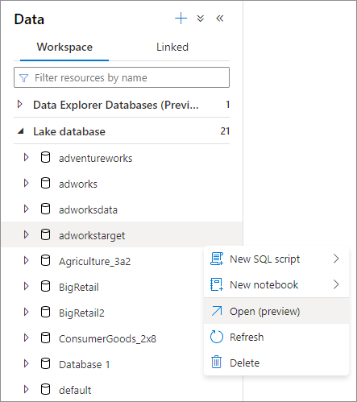
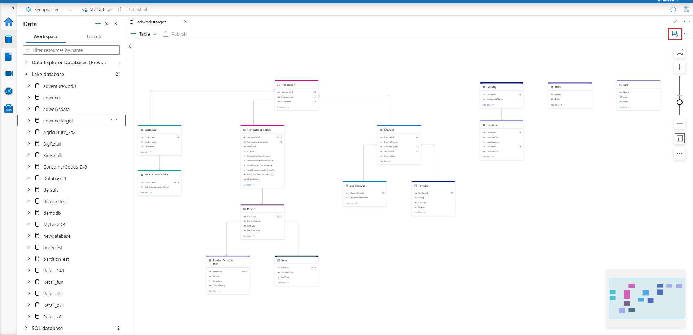
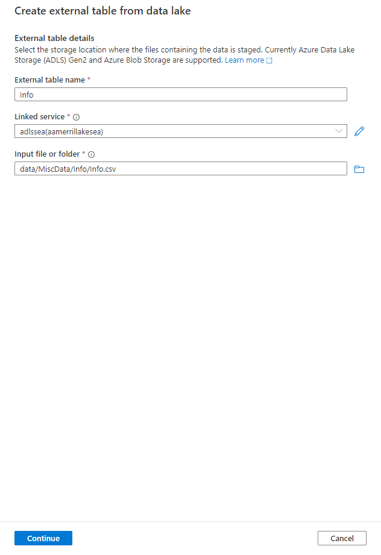
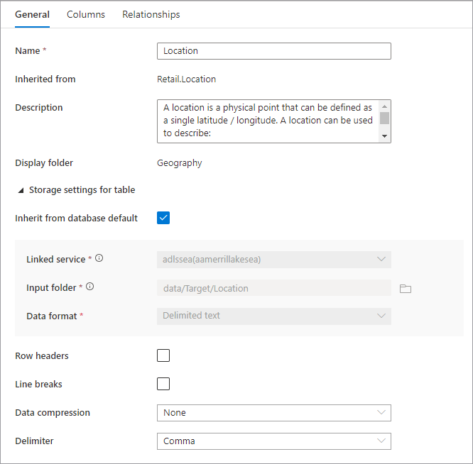
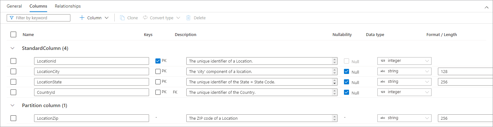
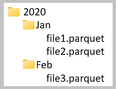
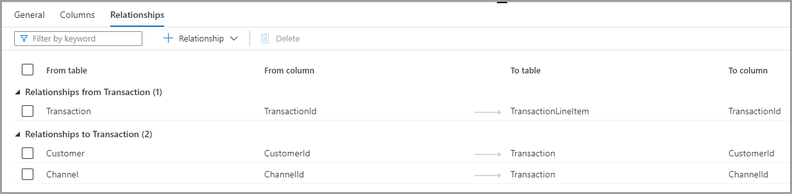

# How-to: Modify a lake database

In this article, you'll learn how to modify an existing [lake database](./concepts-lake-database.md) in Azure Synapse using the database designer. The database designer allows you to easily create and deploy a database without writing any code. 

## Prerequisites

- Synapse Administrator, or Synapse Contributor permissions are required on the Synapse workspace for creating a lake database.
- Storage Blob Data Contributor permissions are required on data lake when using the create table **From data lake** option.

## Modify database properties
1. From your Azure Synapse Analytics workspace **Home** hub, select the **Data** tab on the left. The **Data** tab will open you'll see the list of databases that already exist in your workspace.
2. Hover over the **Databases** section and select the ellipsis **...** next to the database you want to modify, then choose **Open**.

    

3. The database designer tab will open with your selected database loaded on the canvas.
4. The database designer has **Properties** pane that can be opened by selecting the **Properties** icon in the upper right of the tab.

    - **Name** Names cannot be edited after the database is published, so make sure the name you choose is correct.
    - **Description** Giving your database a description is optional, but it allows users to understand the purpose of the database.
    - **Storage settings for database** is a section containing the default storage information for tables in the database. The default settings are applied to each table in the database unless it's overridden on the table itself.
    - **Linked service** is the default linked service used to store your data in Azure Data Lake Storage. The default linked service associated with the Synapse workspace will be shown, but you can change the **Linked Service** to any ADLS storage account you like.  
    - **Input folder** used to set the default container and folder path within that linked service using the file browser or manually editing the path with the pencil icon.
    - **Data format** lake databases in Azure Synapse support parquet and delimited text as the storage formats for data.
5. To add a table to the database, select the **+ Table** button. 
    - **Custom** will add a new table to the canvas.
    - **From template** will open the gallery and let you select a database template to use when adding a new table. For more information, see [Create lake database from database template](./create-lake-database-from-lake-database-templates.md).
    - **From data lake** lets you import a table schema using data already in your lake.
6. Select **Custom**. A new table will appear on the canvas called Table_1.
7. You can then customize Table_1, including the table name, description, storage settings, columns, and relationships. See the Customize tables within a database section below.
8. Add a new table from the data lake by selecting **+ Table** and then **From data lake**.
9. The **Create external table from data lake** pane will appear. Fill out the pane with the below details and select **Continue**.
    - **External table name** the name you want to give the table you're creating.
    - **Linked service** the linked service containing the Azure Data Lake Storage location where your data file lives.
    - **Input file or folder** use the file browser to navigate to and select a file on your lake you want to create a table using.

    - On the next screen, Azure Synapse will preview the file and detect the schema.
    - You'll land on the **New external table** page where you can update any settings related to the data format, and **Preview Data** to check if Azure Synapse identified the file correctly.
    - When you're happy with the settings, select **Create**.
    - A new table with the name you selected will be added to the canvas, and the **Storage settings for table** section will show the file that you specified.
10. With the database customized, it's now time to publish it. If you're using Git integration with your Synapse workspace, you must commit your changes and merge them into the collaboration branch. [Learn more about source control in Azure Synapse](././cicd/../../cicd/source-control.md). If you're using Synapse Live mode, you can select "publish".

     - Your database will be validated for errors before it's published. Any errors found will be showing in the notifications tab with instructions on how to remedy the error.

       
     - Publishing will create your database schema in the Azure Synapse Metastore.  After publishing, the database and table objects will be visible to other Azure services and allow the metadata from your database to flow into apps like Power BI or Microsoft Purview.

## Customize tables within a database
The database designer allows you to fully customize any of the tables in your database. When you select a table there are three tabs available, each containing settings related to the table's schema or metadata.

### General
The **General** tab contains information specific to the table itself.
   - **Name** the name of the table. The table name can be customized to any unique value within the database. Multiple tables with the same name aren't allowed.
   - **Inherited from** (optional) this value will be present if the table was created from a database template. It cannot be edited and tells the user which template table it was derived from.
   - **Description** a description of the table. If the table was created from a database template, this will contain a description of the concept represented by this table. This field is editable and can be changed to match the description that matches your business requirements.
   - **Display folder** provides the name of the business area folder this table was grouped under as part of the database template. For custom tables, this value will be "Other".

     
   - In addition, there is a collapsible section called **Storage settings for table** that provides settings for the underlying storage information used by the table.
   - **Inherit from database default** a checkbox that determines whether the storage settings below are inherited from the values set in the database **Properties** tab, or are set individually. If you want to customize the storage values, uncheck this box.
      - **Linked service** is the default linked service used to store your data in Azure Data Lake Storage. Change this to pick a different ADLS account.     
      - **Input folder** the folder in ADLS where the data loaded to this table will live. You can either browse the folder location or edit it manually using the pencil icon. 
      - **Data format** the data format of the data in the **Input folder** Lake databases in Azure Synapse support parquet and delimited text as the storage formats for data. If the data format doesn't match the data in the folder, queries to the table will fail.
   - For a **Data format** of Delimited text, there are further settings:
        - **Row headers** check this box if the data has row headers.
        - **Enable multiline in data** check this box if the data has multiple lines in a string column.
        - **Quote Character** specify the custom quote character for a delimited text file.
        - **Escape Character** specify the custom escape character for a delimited text file.
        - **Data compression** the compression type used on the data.
        - **Delimiter** the field delimiter used in the data files. Supported values are: Comma (,), tab (\t), and pipe (|).
        - **Partition columns** the list of partition columns will be displayed here.
        - **Appendable** check this box if you are querying Dataverse data from SQL Serverless.
   - For Parquet data, there's the following setting:
        - **Data compression** the compression type used on the data.

### Columns
The **Columns** tab is where the columns for the table are listed and can be modified. On this tab are two lists of columns: **Standard columns** and **Partition columns**. **Standard columns** are any column that stores data, is a primary key, and otherwise isn't used for the partitioning of the data. **Partition columns** store data as well, but are used to partition the underlying data into folders based on the values contained in the column. Each column has the following properties.

   - **Name** the name of the column. Must be unique within the table.
   - **Keys** indicates whether the column is a primary key (PK) and/or foreign key (FK) for the table. Not applicable to partition columns.
   - **Description** a description of the column. If the column was created from a database template, the description of the concept represented by this column will be seen. This field is editable and can be changed to match the description that matches your business requirements.
   - **Nullability** indicates whether there can be null values in this column. Not applicable to partition columns.
   - **Data type** sets the data type for the Column based on the available list of Spark data types. 
   - **Format / Length** allows for customizing the format or maximum length of the column, depending on the data type. Date and timestamp data types have format dropdowns, and other types like string have a maximum length field. Not all data types have a value as some types are fixed length.
At the top of the **Columns** tab is a command bar that can be used to interact with the columns.
   - **Filter by keyword** filters the list of columns to items that match the keyword specified.
   - **+ Column** lets you add a new column. There are three possible options.
      - **New column** creates a new custom standard column.
      - **From template** opens the exploration pane and lets you identify columns from a database template to include on your table. If your database wasn't created using a database template, this option will not appear.
      - **Partition column** adds a new custom partition column.
   - **Clone** duplicates the selected column. Cloned columns are always of the same type as the selected column.
   - **Convert type** is used to change the selected **standard column** to a **partition column** and the other way around. This option will be grayed out if you have selected multiple columns of different types or the selected column is ineligible to be converted because of a **PK** or **Nullability** flag set on the column.
   - **Delete** deletes the selected columns from the table. This action is irreversible.

You can also re-arrange the order of the columns by drag and drop using the double vertical ellipses that show up on the left of the column name when you hover over or click on the column as shown in the image above.

#### Partition Columns

Partition columns are used to partition the physical data in your database based on values in those columns. Partition columns allow an easy way to distribute data on disk into more performant chunks. Partition columns in Azure Synapse are always at the end of the table schema. In addition, they are used from top to bottom when creating the partition folders. For example, if your partition columns were Year and Month, you would end up with a structure in ADLS like this:

Where file1 and file2 contained all the rows where the values of Year and Month were 2020 and Jan respectively. As more partition columns are added to a table, the more files are added to this hierarchy, making the overall file size of the partitions smaller.

Azure Synapse doesn't enforce or create this hierarchy by adding partition columns to a table. Data must be loaded into the table using either Synapse Pipelines or a Spark notebook in order for the partition structure to be created. 

### Relationships

The relationships tab lets you specify relationships between tables in the database. Relationships in the database designer are informational, and don't enforce any constraints on the underlying data. They're read by other Microsoft applications can be used to accelerate transformations or provide business users insight into how tables are connected. The relationships pane has the following info.

   - **Relationships from (Table)** is when one or more tables have foreign keys connected to this table. This is sometimes called a parent relationship.
   - **Relationships to (Table)** is when a table that has foreign key and is connected to other table. This is sometimes called a child relationship.
   - Both relationship types have the following properties.
      - **From table** the parent table in the relationship, or the "one" side.
      - **From column** the column in the parent table the relationship is based on.
      - **To table** the child table in the relationship, or the "many" side.
      - **To column** the column in the child table the relationship is based on.
At the top of the **Relationships** tab, is the command bar that can be used to interact with the relationships
   - **Filter by keyword** filters the list of columns to items that match the keyword specified.
   - **+ Relationship** lets you add a new relationship. There are two options.
      - **From table** creates a new relationship from the table you're working on to a different table.
      - **To table** creates a new relationship from a different table to the one you're working on.
      - **From template** opens the exploration pane and lets you pick from relationships in the database template to include in your database. If your database wasn't created using a database template, this option won't appear.

## Next steps
Continue to explore the capabilities of the database designer using the links below. 
- [Create an empty lake database](./create-empty-lake-database.md)
- [Clone a lake database](./clone-lake-database.md)
- [Create a lake database from lake database template](./create-lake-database-from-lake-database-templates.md)
