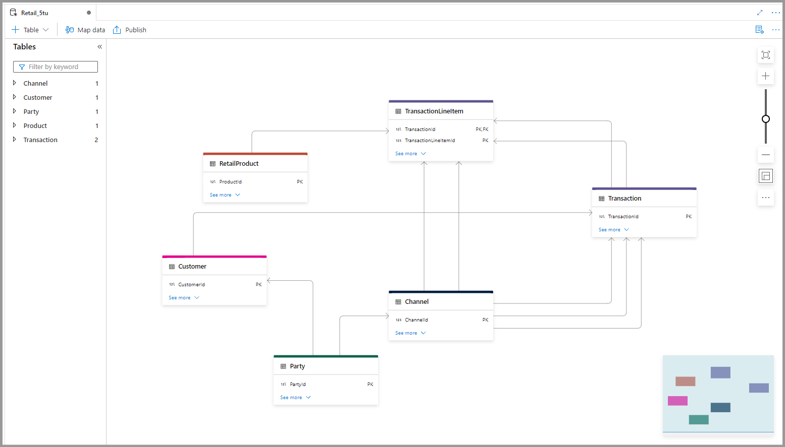
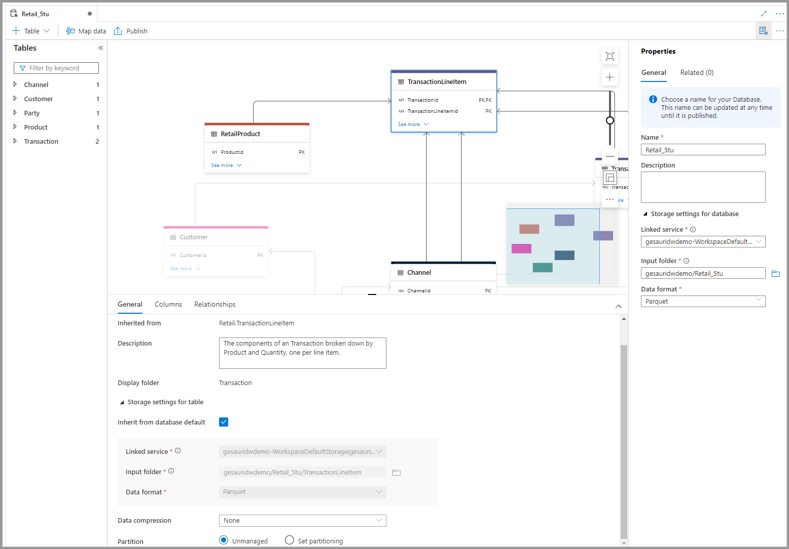

# Quick Start 

This quick start gives you a run through of an end-2-end scenario how you can leverage the database templates to create a lake database , align data to your new model and use the integrated experience to analyze the data. 

## Prerequisits

This quickstart assumes you have already created a Synapse Analytics workspace. 

## Create a lake database from database templates

Use the new database templates (preview) functionallity to create a lake database that you can use to configure your data model for the database. 

For our scenario we will use the Retail database templates and select the following entities: 
 - **RetailProduct** - A product is anything that can be offered to a market that might satisfy a want or need by potential customers. That product is the sum of all physical, psychological, symbolic, and service attributes associated with it.
 - **Transaction** - The lowest level of executable work or customer activity.
A transaction consists of one or more discrete events.
 - **TransactionLineItem** - The components of a Transaction broken down by Product and Quantity, one per line item.
 - **Party** - A party is an individual, organization, legal entity, social organization or business unit of interest to the business.
 - **Customer** - A customer is an individual or legal entity that has or has purchased a product or service.
 - **Channel** - A channel is a means by which products or services are sold and/or distributed.
The easiest way to find them is by using the search box above the different business areas that contain the tables. 
 

 
 
 ## Configure lake database
 
After you have created the database make sure the storage account & filepath is set to a location where you wish to store the data. This will default to the primary storage account within Synapse analytics but can be change to your needs. 
  
 
 
To save your layout and make it avaialble within Synapse Publish all changes. This step completes the setup of the lake database and makes it avaialble to all components within Synapse Analytics and outside. 


## Query the data

After the lake database is created there are different ways to query the data. This can be done over SQL-Ondemand within Synapse that automatically understands the newly created lake database format and exposes the data through it. 

```sql
SELECT TOP (100) [ProductId]
,[ProductName]
,[ProductDescription]
,[ProductInternalName]
,[ItemSku]
,[PrimaryBrandId]
FROM [Retail_mil].[dbo].[RetailProduct]
```
The other way to access the data within Synapse is to open a new Spark notebook and use the integrated expeirence there: 
```spark
df = spark.sql("SELECT * FROM `Retail_mil`.`RetailProduct`")
df.show(10)
```

