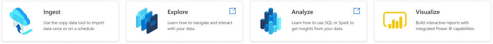
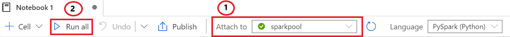

# Getting Started Tutorial with Azure Synapse Analytics
We recommend this tutorial for anyone starting with Azure Synapse Analytics. It should guide, beginners to experts, through all the necessary steps to understand basic but core principles.

## Overview
This tutorial uses a stripped down version of the New-York City cabs (Green and Yellow cabs, For Hire Vehicles) and holiday data. 

## Create and configure a workspace
The first step to use Synapse Analytics is to provision a workspace. Here is an overview of the steps to follow in the Azure portal:

1. Navigate to the Azure portal.
2. Search for **Synapse workspaces** and click on the matching entry in the results.
3. Click on **+ Add**.
4. Enter your subscription and resource group details.
5. Enter a valid workspace name and region for the workspace.
6. Select an Azure Data Lake Storage Gen2 account to be used as the workspace primary storage.
7. Select the filesystem that the workspace will use as its filesystem -- we recommend creating a container dedicated to be used as a file system for the workspace.
8. [Optional] Change the default SQL admin username and password (the password can be changed later).
9. [Optional] Change the default connections allowed settings.
10. Click on **Review + create** and then on **Create**.

The workspace provisioning process will kick off; notifications will indicate the progress and result from the Synapse workspace deployment.

### Create a Synapse workspace using other methods
Follow the steps in [Quickstart: Creating a new Synapse workspace](quickstart-create-workspace.md)

## Create analytics pools
Once the Synapse workspace is deployed, SQL pools and Apache Spark pools can be provisioned to use SQL or open-source analytics on your data. Here are the steps to provision them from the Azure portal:

### Provisioning a SQL pool
Here are the steps to provision a SQL pool using the Azure portal:

1. Navigate to the Azure portal.
2. Navigate to the workspace searching its name, or by navigating to the **Synapse workspaces** service, and selecting the workspace from the list.
3. Click on **+ New SQL pool**.
4. Enter a valid name for the SQL pool.
5. Select a performance level for the SQL pool.
6. Click on **Next: Additional settings**.
7. Select a data source to use for the SQL pool database -- none for an empty database or restore point of a backup from an existing database.
8. [Optional] Change the default collation of the database.
9. Click on **Review + create**.
10. If everything looks good, click on **Create**

Once the deployment completes successfully, the SQL pool will be available and ready to use in the workspace.

### Provisioning an Apache Spark pool
Here are the steps to provision an Apache Spark pool using the Azure portal:

1. Navigate to the Azure portal.
2. Navigate to the workspace searching its name, or by navigating to the **Synapse workspaces** service, and selecting the workspace from the list.
3. Click on **+ New Apache Spark pool**.
4. Enter a valid name for the Apache Spark pool.
5. Select a node size for the Apache Spark pool.
6. [Optional] Change the autoscale settings.
7. Set the number of nodes for the Apache Spark pool.
8. Click on **Next: Additional settings**.
9. [Optional] Change the auto-pause settings.
10. [Optional] Upload the environment config file for any libraries that will be used in the Apache Spark pool.
11. Click on **Review + create**.
12. If everything looks good, click on **Create**

Once the deployment completes successfully, the Apache Spark pool will be available and ready to use in the workspace.

### Creating SQL pools or Apache Spark pools using other methods

Follow the steps in our quickstarts:

- [Quickstart: Creating a new SQL pool](quickstart-create-sql-pool.md)
- [Quickstart: Creating a new Apache Spark pool](/quickstart-create-an-apache-spark-pool.md)

## Add users into the workspace
<!--- Optional Saveen --->

## Adding an additional storage account
In Synapse, you can connect to a workspace and analyze with SQL and Spark multiple external data stores (for example, storage accounts or databases).

Connecting to an external data store happens through linked services. Currently supported external data stores are:

| External data store | Type | Actions | Supported By | 
|---|------|-----|-----|
| ADLSg2 | Storage account | Read/Write | SQL on-demand, SQL pool, Spark |
| Blob Storage | Storage account | Read/Write | SQL on-demand, SQL pool, Spark |
| Cosmos DB | Database | Coming soon | Spark |

For the tutorial, we assume that a Data Lake Storage account, called **Contosolake**, with its container, called **datasets**, have been created. 

To add this external data store and make it visible in the **Data** section, follow the directions:
   1. Select **Data** to access the Data object explorer
   2. Select **+**
   3. Select **external data store**
   4. Select the supported storage account that you want to access. This action will create a linked service in the workspace
   5. Select **Azure Data Lake Storage Gen2** 
   6. Select **Continue**
   7. Enter the name of the linked service in the **Name** section. For the tutorial, call it ***Tutorial_Synapse***
   8. Select the account and authentication methods from the **Azure subscription**
   9. Select **Create**
   10. The external data store you connected to the workspace should be visible once you select the **refresh** icon

## Ingest data to the lake
Now we want to ingest some data into the lake. In this exercise, a stripped down version of the New York Taxi Cab will be ingested into the data lake called **Contosolake** and the path called **datasets/nyctaxismall**.

To copy data towards that storage account and container, follow the directions:
   1. Select **Orchestrate** to access the Orchestrate section
   2. Select **+**
   3. Select **Copy data**
   4. In the **Properties** section, give a name to the Task Name such as **FirstCopyActivity**. As a one-off copy activity, make sure the option **run once now** is selected. Select **Next**.
   5. In the **Source** section, select **Create new connection** to establish a connection between your workspace and the public dataset that will be ingested.
   6. Select **Azure Blob Storage** and **Continue**
   7. In this step, create a linked service:
       * Name this linked service ***Source Datasets***.
       * In the Authentication method, select SAS URl
       * In the Account selection method, select **Enter manually**
       * In the **SAS URL** section, copy the following name: ***https://sampledatasetsynapse.blob.core.windows.net/***
       * Enter the SAS token: ***""***
       * Select ***Create*** 
       * Now that the linked service has been created, select the linked service ***Source Datasets*** and select **Next**
   8. In this step, connect to the path of the linked service that you want to copy:
       * Write the following path into the section **Choose the input file or folder**: ***datasets/NYCTaxiSample/***
       * Select **Next**
       * Select ***Parquet Format*** in **File format**, leave ***snappy***
       * Select **Next**
   9. Now, define the destination of the data to be ingested:
       * Select **Tutorial_Synapse** and then **Next**
       * Write the path in the **Folder path** as ***datasets/nyctaxismall*** and then select **Next**
       * Define as the **File format**, ***Parquet format*** and make sure that ***snappy*** is selected
       * Select **Next** 
       * In the Settings section, just select **Next** 
   10. In the summary section, select **Next**
   11. Check  the process in the **Deployment** section. You can **monitor** the progress or **Edit the pipeline** from there.
   12. Once the process to copy the data is over, you should see the data under the storage account **Contosolake** and the path **datasets/nyctaxismall**.

## Discover and Explore data
After ingesting some data, it is possible to use the  **Data** pillar to discover, browse, and explore Synapse databases and external data stores, connected through linked services.

   1. Go to **Data** to access the Orchestrate section
   2. Expand the **Storage accounts** and find the account named **Tutorial_Synapse** and expand it
   3. Select the container named **datasets** and use the storage explorer view to browse within that container
   4. Select the folder called **nyctaxismall**
   5. Select a parquet file in that folder and right click on this parquet file. There are two ways to explore the file:
       * **New SQL script - Select TOP 100**: it lets you use SQL on-demand to explore the file without defining schema or table (it is in Parquet)
       * **New notebook**: it will open a notebook in PySpark to load that file into a dataframe
   6. Right click on the selected parquet file and pick ***New SQL script - Select TOP 100***:
       * Select Run as in the following picture
       
       * Because you never ran a SQL on-demand query before it might take more time than usual. Try another time to run SQL on-demand on the same or a different file. It should take a couple of seconds for the results to come.
       * The exploration of multiple files with SQL on-demand is possible by just holding the **Ctrl** key on the keyboard and doing multiple selections
   7. Now, right click on the selected parquet file and pick ***New notebook***:
       * Attach a Spark pool, created in the earlier part of the tutorial
       * Select ***Run all***
       
       * Because Spark pool is probably not running yet, it will take up to 3 minutes to get the Spark pool running and the notebook to be executed. This time to spin-up pool from a cold stage is an industry-leading benchmark in the Big Data space.

## Prep and Transform
<!--- Euan --->

## Create tables
<!--- Euan --->

## Analyze
### Analyze with a notebook
<!--- Euan --->

### Analyze with SQL script
<!--- Josh --->

### Analyze with Power BI
<!--- Josh --->

## Serve via Power BI
<!--- Josh --->

## Serve via SQL pool
<!--- Matthew --->

## Orchestrate code using pipeline
<!--- Matthew --->

## Monitor
<!--- Matthew --->
