# Getting Started with Azure Synapse Analytics
This tutorial guides leads developers through all the basic steps to needed to use Azure Synapse Analytics.

## Create a Synapse workspace
First, you need a Synapse workspace. Follow the steps in [Quickstart: Creating a new Synapse workspace](quickstart-create-workspace.md) to create a workspace.

## Launch Synapse Studio
Once your workspace is created, you can use Synapse Studio with it one of two ways:
* Open your Synapse workspace in the [Azure portal](https://portal.azure.com) and at the top of the Overview section click
* Go to https://web.azuresynapse.net and login to your workspace

## Create a SQL pool

* In Synapse Studio, on the left side click **Manage > SQL pools**
* Click **+New**
* For **SQL pool name** enter `SQLDB1`
* For **Performance level** use `DW100C`
* Click **Review+create**
* Click **Create**
* Your pool will be ready in a few minutes

## Create a Spark pool

* In Synapse Studio, on the left side click **Manage > Apache Sparke pools**
* Click **+New**
* For **Apache Spark pool name** enter `Spark1`
* For **Node size** select `Small`
* For **Number of nodes** set the minimum to 3 and the maximum to 3
* Click **Review+create**
* Click **Create**
* Your Spark pool will be ready in a few seconds

## Load the NYX Taxi Sample data into your SQL pool

* In Synapse Studio, it the topmost blue meny, click on the **?** icon.
* Select **Getting started > Getting started hub**
* In the card labelled **Query sample data** select the SQL pool `SQLDB1`
* Click **Query data**
* You will see a notification saying "Loading sample data". 
* NYXC taxi data tables are being loaded into SQLDB1 and this takes only a few minutes. Wait until it finishes.

## Exploire the NYC taxi data in the SQL Pool

* In Synapse Studio, navigate to the **Data** hub
* Navigate to **SQLDB1 > Tables > dbo.Trip**
* Right-click on the **dbo.Trip** table and select **New SQL Script > Select TOP 100 Rows**
* A new SQL script will be created and automaticall run
* Replace the text of the SQL script with this code and run it.
    ```
    SELECT PassengerCount,
          SUM(TripDistanceMiles) as SumTripDistance,
          AVG(TripDistanceMiles) as AvgTripDistance
    FROM  dbo.Trip
    WHERE TripDistanceMiles > 0 AND PassengerCount > 0
    GROUP BY PassengerCount
    ORDER BY PassengerCount
    ```
* This query shows how the total trip distances and average trip distance relate to the number of passengers
* In the SQL scripts, result window select **Chart** to see a visualization of the results as a line chart


## Orchestrate using a pipeline

After ingesting, exploring, analyzing, and serving your data, you can schedule these activities to automatically run using pipeline orchestration.

   1. Go to **Develop** and find the Spark notebook you used to analyze your data. 
   2. Open your **Spark notebook**.
   3. Click the **Add to pipeline** button at the upper right of the view.   
   4. Select **Existing pipeline**. All of your workspace's pipelines will be listed.
   5. Select the pipeline you created during the **data ingestion step**.   
   6. Click **Add** to open an authoring view of that pipeline, with the Spark notebook activity added.
   7. Click and drag the **green box** next to the **Copy activity**, and connect it to the **new Spark notebook activity**.
   8. Publish your modified pipeline by clicking **Publish all** in the upper left of the view.   
   9. To manually trigger the pipeline, click **Add trigger**, then **Trigger now**.
   
         Your pipeline is now running the data ingestion step, followed by the Spark notebook analysis step.
         
   10. Click **Add trigger**, **New/Edit**.   
   11. Click **Choose trigger...**, then **New**.
   12. For **Recurrence**, enter **Every 1 hour**. For **End on**, enter a date-time soon in the future to make sure this tutorial pipeline doesn't continue running.
   
   13. Click **OK**, then **OK** to go back to the pipeline authoring view.
   
   14. Publish your new trigger by clicking **Publish all** in the upper left of the view.
   
          Your pipeline will now run every week until your chosen end date.

## Monitor

After setting up a pipeline that lets you ingest and analyze your data automatically, you can monitor the progress and history of your pipeline runs.

   1. Click **Monitor** and open **Pipeline runs**.
   
   2. You should see your tutorial pipeline's runs listed. If you see other more recent pipeline runs instead, you can **filter** the list by pipeline name to just see runs of your pipeline.
   
   3. Open **the most recent run of your pipeline** to see the details of when each activity ran within your pipeline. The **pipeline run details view** will open.
   
       - **New SQL script - Select TOP 100**: it lets you use SQL on-demand to explore the file without defining schema or table (it is in Parquet)
       - **New notebook**: it will open a notebook in PySpark to load that file into a dataframe


## Prep and Transform

### Create tables or views

While using PySpark, Scala or C# are popular ways to interact with data in Spark, SQL is the most common language to use to manipulate data of all sorts. Its very easy to take a data frame generated by reading a file into a table or view.

1. Using either the notebook from above or a new one, run it on the Trip.parquet file from nyctaxismall

The code should look something like this

```python
%%pyspark
data_path = spark.read.load('abfss://datasets@contosolake.dfs.core.windows.net/nyctaxismall/Trip.parquet', format='parquet')
data_path.show(100)
```

2. Now you are going to turn that data frame into a view so that it can be queried from SQL, there are lots of ways to do this and different types of views as well as tables. You will use a temporary view for now, this only lasts for the session and is cleaned up automatically. Add the following code in a new cell

 ```python
 data_path.createOrReplaceTempView('trip_df')
 ```

This will create a temporary view called 'trip_df'.

3. Now you have a view we can query it using Spark SQL. Add the following code in a new cell in the notebook.

```sql
%%sql
SELECT
    *
FROM
    trip_df
```

Now you will have the same output as above except the SQL language was used.

- The %%sql tells the notebook that this cell uses sql rather than PySpark
- The table that is rendered for the results is a little nicer than the one used as the output from the ***show*** command.

## Analyze

### Analyze with a notebook

Now that you have the data in a view that can be queried with Spark SQL its possible to undertake more interesting analysis. Spark supports rich analysis in different languages. You can now extend the query you wrote above to do some more interesting operations.

```sql

%%sql
SELECT  
    PassengerCount,
    SUM(TripDistanceMiles) as SumTripDistance,
    AVG(TripDistanceMiles) as AvgTripDistance
FROM
    trip_df t
WHERE
    TripDistanceMiles > 0 AND PassengerCount > 0
GROUP BY
    PassengerCount
ORDER BY
    PassengerCount
```

This query should feel very familiar to you if you know the SQL language. You are adding a couple of simple aggregates and filtering out some outlier data. You should now see output that looks like this;


To enable a more visual/chart view select chart in the view selector that is highlighted in red to get this view.


This chart is interesting but lets say you really wanted to look at the average trip distance by passenger count, for that you need to change the field used on the y-axis and should probably change the chart type. To do this select the ***View options*** pane (small rectangle in red in the screenshot). The editor panel should then appear and changes can be made, in this case change the selected field in the ***Y axis column*** to be "AvgTripDistance", change the ***Chart type*** to bar chart and then press ***Apply***.

To get a chart like this;


If you prefer not to use SQL then the same can be achieved with the following PySpark code

```python
%%pyspark
from pyspark.sql import functions as F

prepped_df = data_path.select('TripDistanceMiles', 'PassengerCount')\
                     .filter((F.col("TripDistanceMiles") > 0) & (F.col("PassengerCount") > 0))\
                     .groupBy(data_path.PassengerCount)\
                     .agg(F.sum(F.col("TripDistanceMiles")).alias("SumTripDistance"),F.avg(F.col("TripDistanceMiles")).alias("AvgTripDistance"))\
                     .orderBy(data_path.PassengerCount)
display(prepped_df)

```

Using the display command at the end of this code renders the results in the same table/chart output control as the one used by Spark SQL. The results are the same and you need to make the same changes to the fields and chart type as above.

One of the advantages of using PySpark is many more visualization options, the following code will generate a more colorful bar chart using the Python seaborn and matplotlib libraries.

```python
%%pyspark
import matplotlib.pyplot as plt
import seaborn as sns
import pandas as pd

sns.set(style = "whitegrid")

prepped_pdf = prepped_df.toPandas()
sns.barplot(x="PassengerCount", y="AvgTripDistance", data = prepped_pdf)
plt.show()
```

This results in a chart like the following;


Finally if you want to understand more details about what happened when you were running the Spark SQL and PySpark code select the monitoring view or the Spark UI view highlighted in red.

### Analyze with SQL script
These same Parquet files can be analyzed using T-SQL with the Synapse SQL Serverless preview. Use the same SQL script that you created in the **Discover and Explore Data** section of this article. You can now extend that query to some more interesting like below.

```sql
SELECT
    DateId
    ,PickupGeographyID
    ,sum(PassengerCount) as TotalPassengerCount
    ,sum(TotalAmount) as TotalFareAmount
    ,count(*) as NumberOfTrips
FROM
    OPENROWSET(
        BULK 'https://{StorageAccount}.dfs.core.windows.net/{Container}/nyctaxismall/Trip.parquet',
        FORMAT='PARQUET'
    ) AS [t]
WHERE
    TripDistanceMiles > 0 AND PassengerCount > 0
GROUP BY
    DateId
    ,PickupGeographyID
ORDER BY
    DateId
```

If you are a user of T-SQL, this syntax will be identical to what you are used to using. This query selects three aggregations from the **Trip** Parquet file and groups them by DateId and PickupGeographyId. After running the query, you should see and output like this;
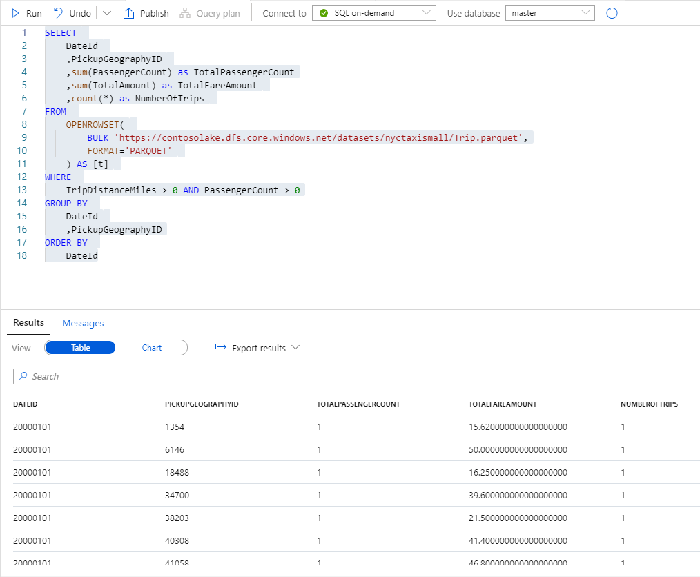

You can make the results easier to read, by replacing DateId and PickupGeographyId with the actual date and pickup city. This values can be obtained by joining to the **Date** and **Geography** files. 

```sql
SELECT
    d.[Date]
    ,g.City
    ,sum(PassengerCount) as TotalPassengerCount
    ,sum(TotalAmount) as TotalFareAmount
    ,count(*) as NumberOfTrips
FROM
    OPENROWSET(
        BULK 'https://{StorageAccount}.dfs.core.windows.net/{Container}/nyctaxismall/Trip.parquet',
        FORMAT='PARQUET'
    ) AS [t]
        JOIN OPENROWSET(
            BULK 'https://{StorageAccount}.dfs.core.windows.net/{Container}/nyctaxismall/dimDate.parquet',
            FORMAT='PARQUET'
        ) AS [d]
            ON t.DateId = d.dateId
        JOIN OPENROWSET(
            BULK 'https://{StorageAccount}.dfs.core.windows.net/{Container}/nyctaxismall/dimGeography.parquet',
            FORMAT='PARQUET'
        ) AS [g]
            ON t.PickupGeographyID = g.GeographyId
WHERE
    TripDistanceMiles > 0 AND PassengerCount > 0
GROUP BY
    d.[Date]
    ,g.City
ORDER BY
    d.[Date]
    ,g.City

```
After running this query, your output should look like this;
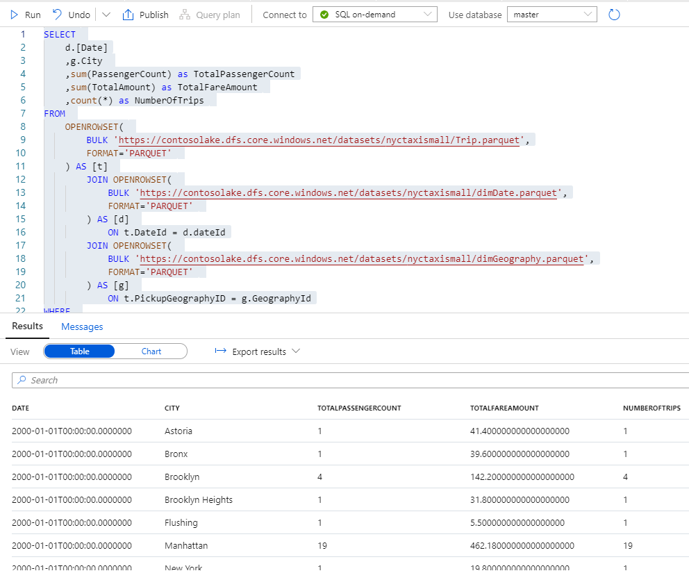

As you can see, multiple Parquet files can be joined almost as if they were actual SQL views. If you find the **OPENROWSET** syntax a little harder to user to use than regular SQL views, you can solve this by creating a SQL database that contains SQL views.
## Create a database with SQL on-demand.

On the **Develop** hub click the **+** to add a new SQL **script**.
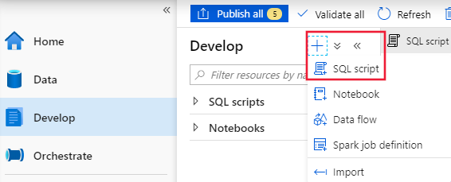

To create the database run the following script;

```sql
CREATE DATABASE NYCTaxiVirtual;
```

Now, if you flip to the data hub, you will see the newly created database.
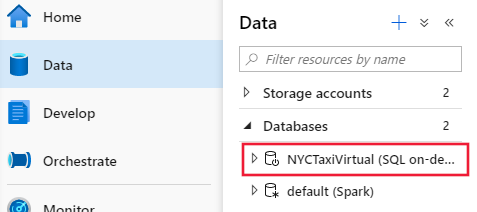

## Create SQL views

Create a new SQL script which uses the NYCTaxiVirtual database by right clicking on the database name and selecting **New SQL script**. 

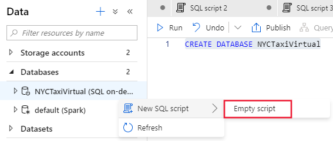

Run SQL statements like the following for each view that you wish to create.

```sql
CREATE VIEW Trips AS
SELECT
    *
FROM
    OPENROWSET(
        BULK 'https://{StorageAccount}.dfs.core.windows.net/{Container}/nyctaxismall/Trip.parquet',
        FORMAT='PARQUET'
    ) AS [r];
```

```sql
CREATE VIEW dimDate AS
SELECT
     *
FROM
    OPENROWSET(
        BULK 'https://{StorageAccount}.dfs.core.windows.net/{Container}/nyctaxismall/dimDate.parquet',
        FORMAT='PARQUET'
    ) AS [r];
```

```sql
CREATE VIEW dimGeography AS
SELECT
     *
FROM
    OPENROWSET(
        BULK 'https://{StorageAccount}.dfs.core.windows.net/{Container}/nyctaxismall/dimGeography.parquet',
        FORMAT='PARQUET'
    ) AS [r];
```

After the views are created, you can expand the NYCTaxiVirtual database in the data hub to see the views and their schema.
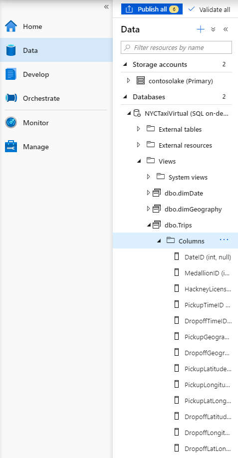

## Query the SQL views

Your original queries can now be updated to use the views instead of **OPENROWSET** to each file.

```sql
SELECT
    d.[Date]
    ,g.City
    ,sum(PassengerCount) as TotalPassengerCount
    ,sum(TotalAmount) as TotalFareAmount
    ,count(*) as NumberOfTrips
FROM
    Trips [t]
        JOIN dimDate [d]
            ON t.DateId = d.dateId
        JOIN dimGeography [g]
            ON t.PickupGeographyID = g.GeographyId
WHERE
    TripDistanceMiles > 0 AND PassengerCount > 0
GROUP BY
    d.[Date]
    ,g.City
ORDER BY
    d.[Date]
    ,g.City
```

Ensure that when you run the query, that you are running it using the NYCTaxiVirtual database.
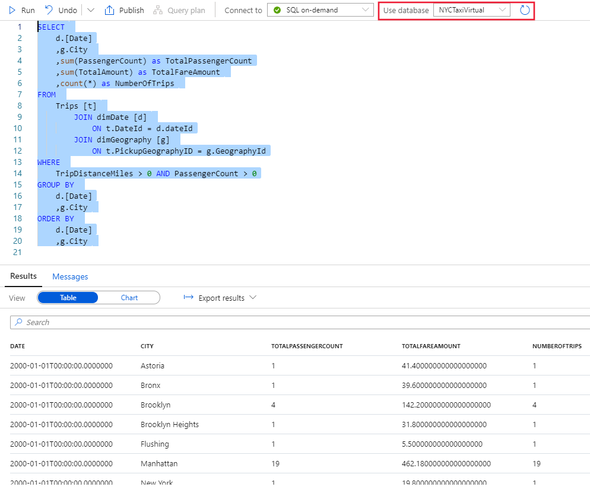

### Visualize with Power BI
 Your data can now be easily analyzed and visualized in Power BI. Synapse offers a unique integration which allows you to link a Power BI workspace to you Synapse workspace. Before going forward, follow the steps in this [quickstart](quickstart-power-bi.md) to link your Power BI workspace.
On the **Develop** hub, expand your linked workspace under **Power BI** and click on **Power BI Datasets**.

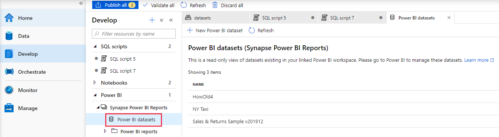

Any existing datasets from you linked Power BI workspace will be displayed here. You can create new reports in Synapse Studio using these Power BI datasets. Let’s create a new Power BI dataset for the database which we created in the last section. Click **+ New Power BI dataset**. 

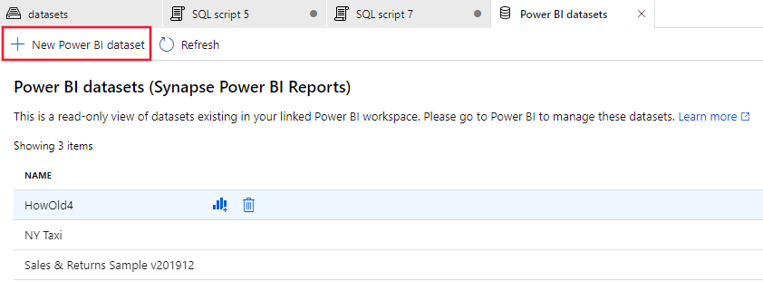

While Power BI reports can be created in Synapse Studio, Power BI datasets must be created in the Power BI Desktop. Install the Power BI Desktop if you have not already and then click **Start** once the installation is complete.

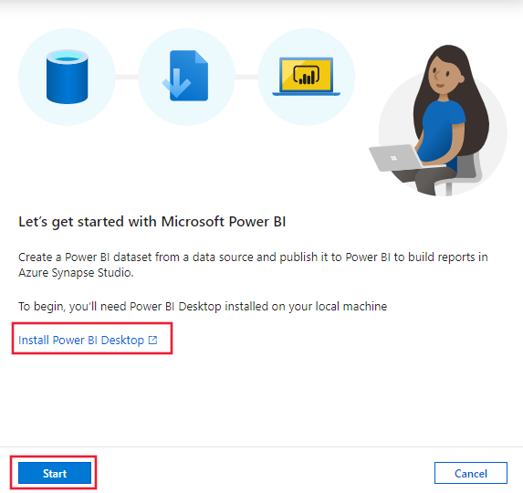

Select **NYCTaxiVirtual** and click continue.

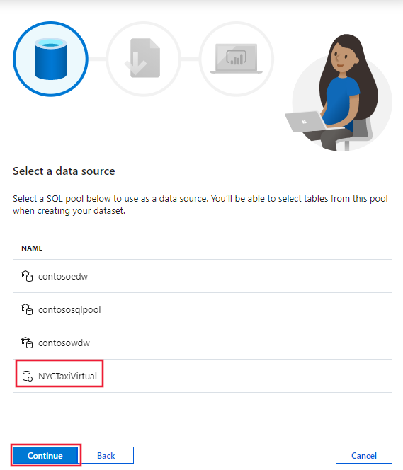

Click **Download** to download the Power BI dataset file (pbids). Open the file when the download is complete to launch the Power BI Desktop. Once the Power BI Desktop has been launched, sign into Synapse by using your Azure Active Directory user account. Then click **Connect**.

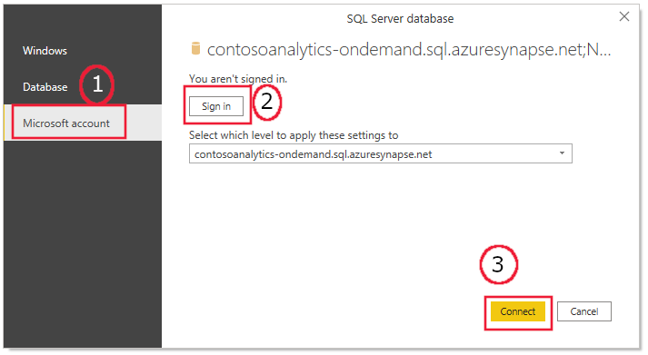

Select all the views to include in your Power BI dataset and click **Load**.

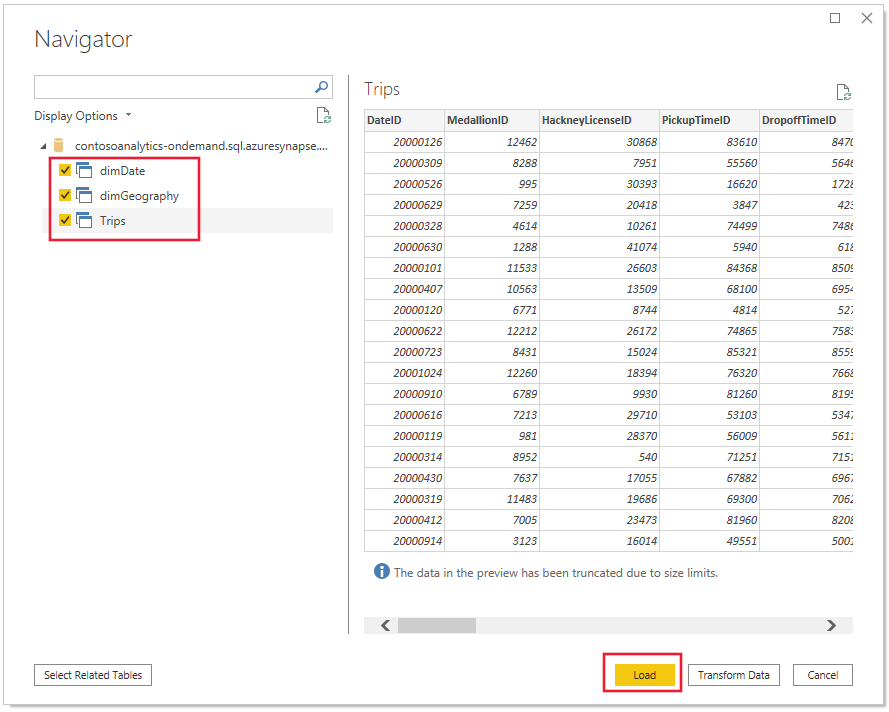

Select **DirectQuery** and click **OK**.

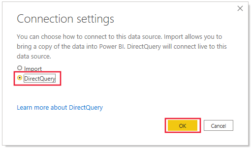

Click on the **Model** view and create relationships between the three tables by dragging **DateID** from **Trips** and dropping it on **DateID** in **dimDate**. 

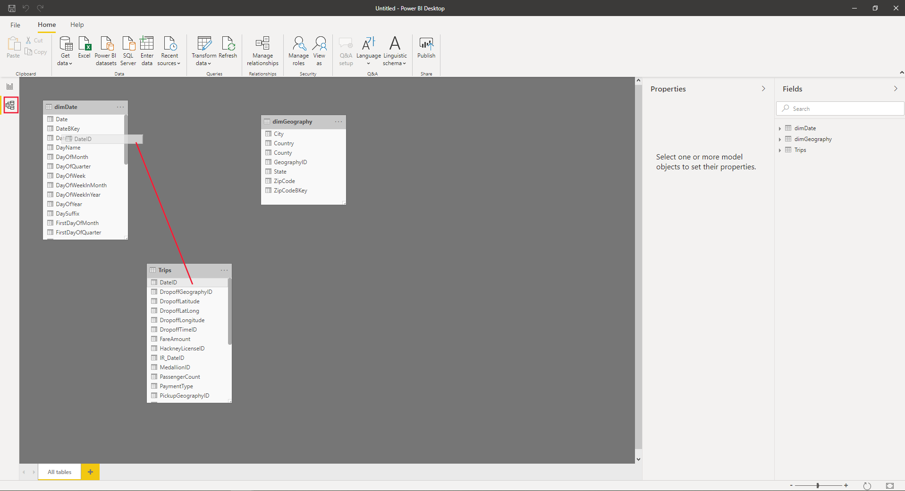

Click **Assume referential integrity** and click **OK**.

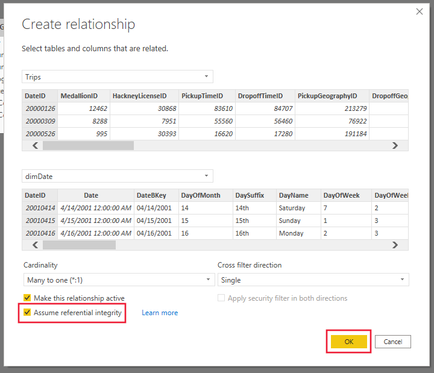

Create another relationship by dragging **PickupGepgraphyID** from **Trips** and dropping it on **GeographyID** on **dimGeography**. Select **Assume referential integrity** like in the last step. Your model diagram should now look something like below.

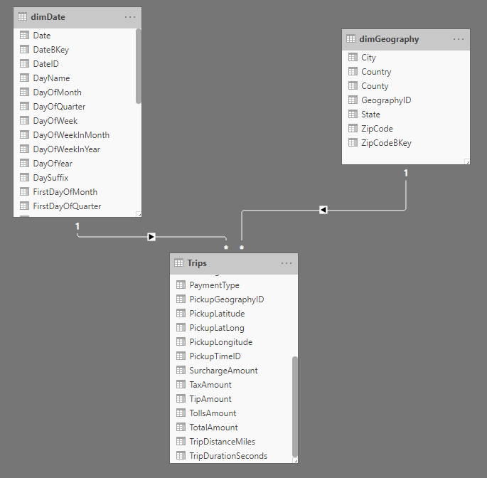

Go back to the **Report** view and right-click on the **Trips** table and click on **New Measure**.

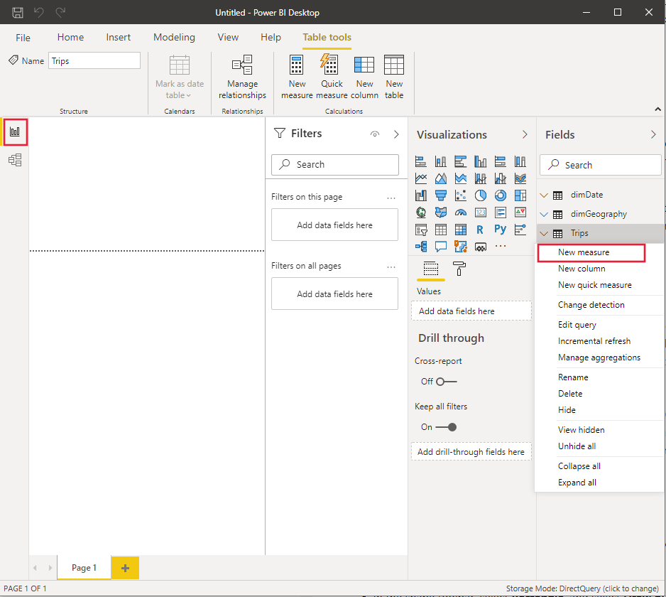

Enter the following DAX formula into the formula bar and press enter.
```dax
Average fair per trip = DIVIDE(
                                SUM(Trips[TotalAmount])
                                ,COUNTROWS(Trips)
                            )
```

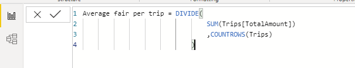

Save the Power BI File and publish it to the Power BI workspace that you linked to Synapse.

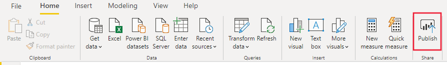

After publishing, go to the **Settings** page for your Power BI dataset inside of your Power BI workspace.

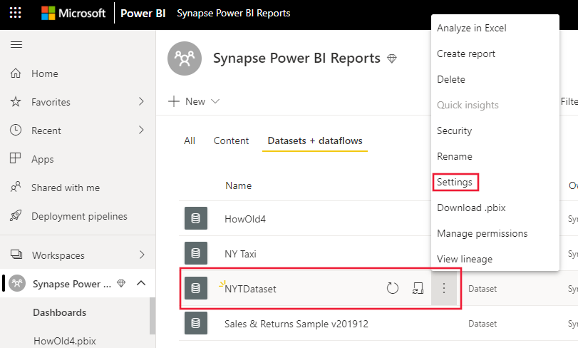

Under **Data source credentials** hit **Edit credentials**.

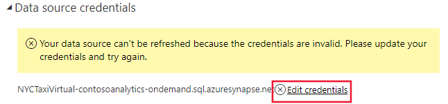

Change the **Authentication method** to **OAuth2** and click **Sign in**. Sign in with your Azure Active Directory Account.

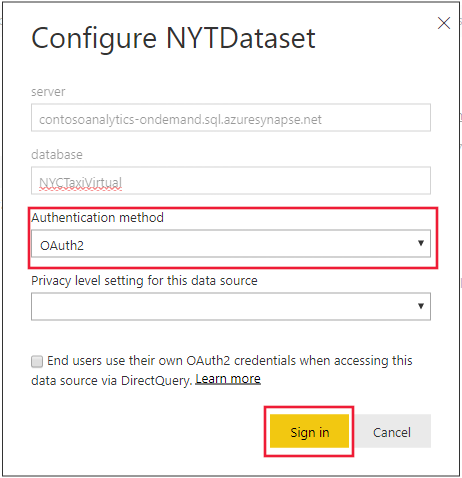

After publishing, switch back to Synapse Studio and click **Close and refresh**.

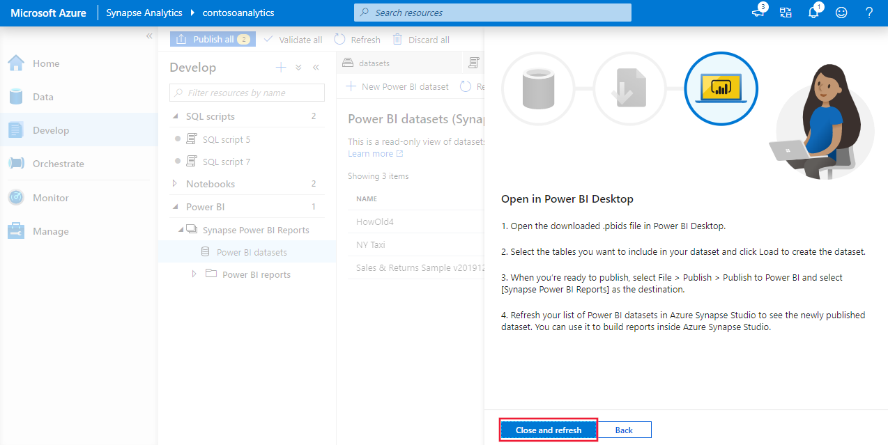

Click **New Power BI report** next to the name of the Power BI dataset that you just published. Now you can build out your Power BI report direction in Synapse Studio. Don’t forget to save the report when you are finished creating it.

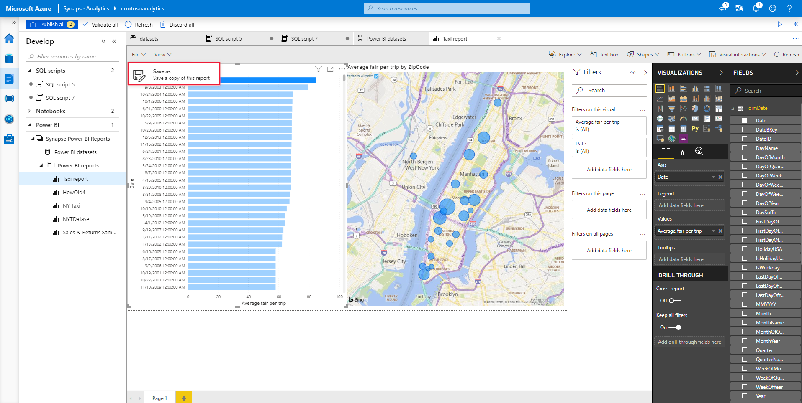


## Orchestrate using a pipeline

After ingesting, exploring, analyzing, and serving your data, you can schedule these activities to automatically run using pipeline orchestration.

   1. Go to **Develop** and find the Spark notebook you used to analyze your data.
   2. Open your **Spark notebook**.
   3. Click the **Add to pipeline** button at the upper right of the view.
   4. Select **Existing pipeline**. All of your workspace's pipelines will be listed.
   5. Select the pipeline you created during the **data ingestion step**.
   6. Click **Add** to open an authoring view of that pipeline, with the Spark notebook activity added.
   7. Click and drag the **green box** next to the **Copy activity**, and connect it to the **new Spark notebook activity**.
   8. Publish your modified pipeline by clicking **Publish all** in the upper left of the view.
   9. To manually trigger the pipeline, click **Add trigger**, then **Trigger now**.
         Your pipeline is now running the data ingestion step, followed by the Spark notebook analysis step.
   10. Click **Add trigger**, **New/Edit**.
   11. Click **Choose trigger...**, then **New**.
   12. For **Recurrence**, enter **Every 1 hour**. For **End on**, enter a date-time soon in the future to make sure this tutorial pipeline doesn't continue running.
   13. Click **OK**, then **OK** to go back to the pipeline authoring view.
   14. Publish your new trigger by clicking **Publish all** in the upper left of the view.
          Your pipeline will now run every week until your chosen end date.

## Monitor

After setting up a pipeline that lets you ingest and analyze your data automatically, you can monitor the progress and history of your pipeline runs.

   1. Click **Monitor** and open **Pipeline runs**.
   2. You should see your tutorial pipeline's runs listed. If you see other more recent pipeline runs instead, you can **filter** the list by pipeline name to just see runs of your pipeline.
   3. Open **the most recent run of your pipeline** to see the details of when each activity ran within your pipeline. The **pipeline run details view** will open.
   4. To see details about each activity run in your pipeline, examine the **activity runs**, which are listed at the bottom of the view.

