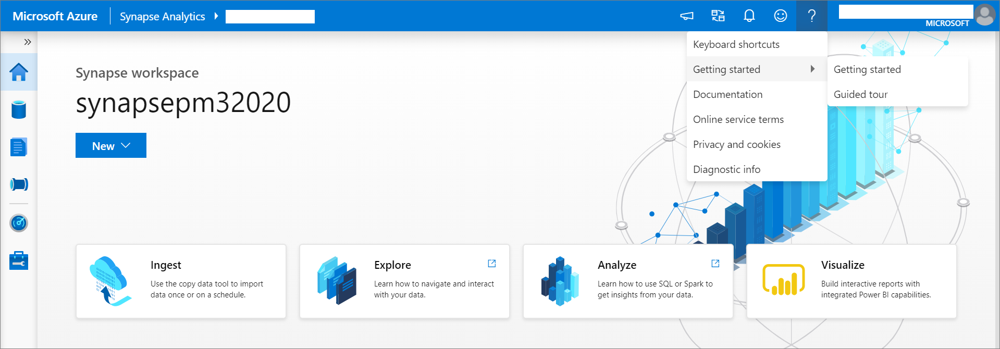
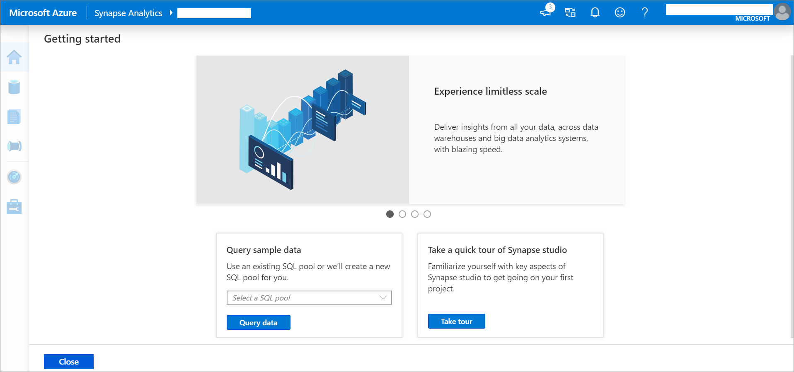
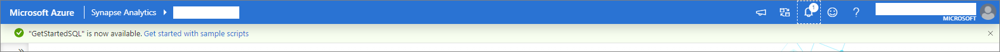
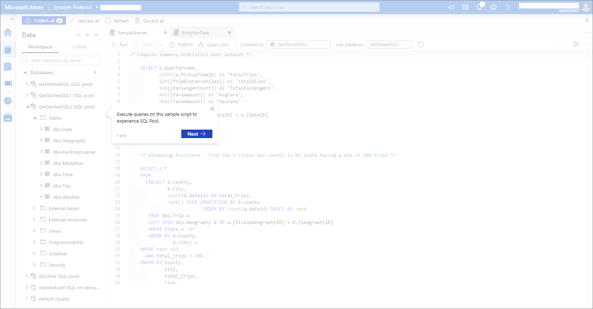
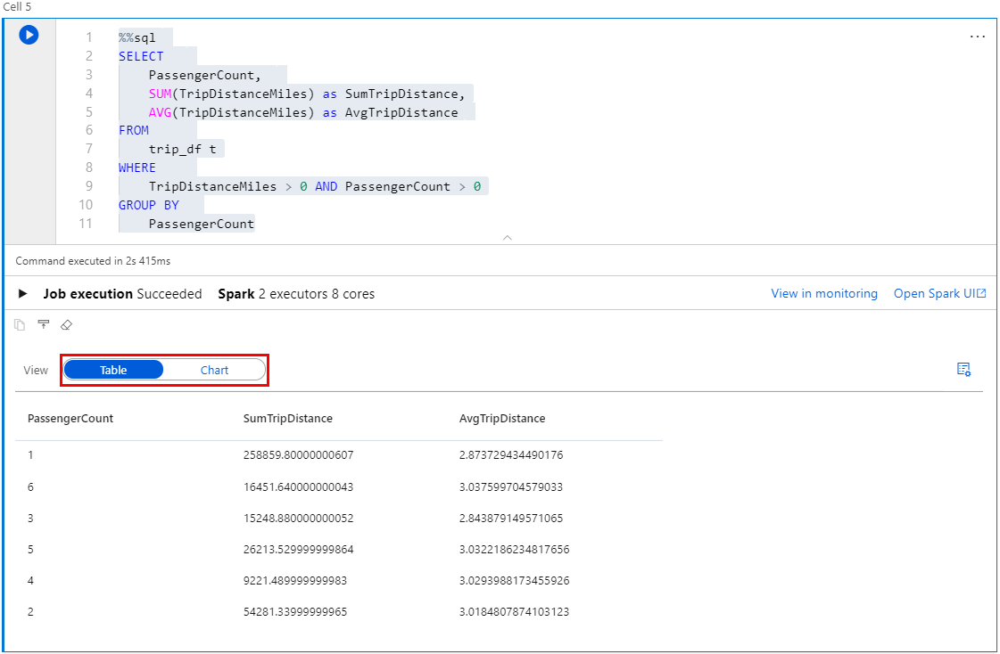
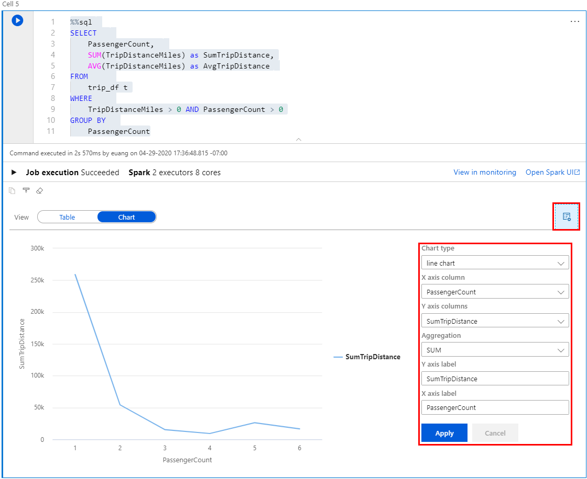
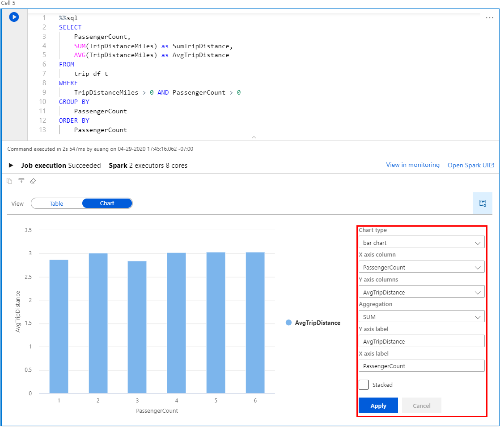
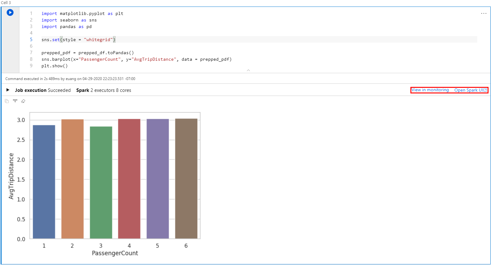

# Getting Started Tutorial with Azure Synapse Analytics

We recommend this tutorial for anyone starting with Azure Synapse Analytics. It guides, beginners to experts, through all the necessary steps to understand basic but core principles.


## Overview

This tutorial uses a stripped down version of the New-York City cabs (Green and Yellow cabs, For Hire Vehicles) and holiday data. 

## Create and configure a workspace

The first step to use Synapse Analytics is to provision a workspace. Here is an overview of the steps to follow in the Azure portal:

1. Navigate to the Azure portal.
2. Search for **Synapse workspaces** and click on the matching entry in the results.
3. Click on **+ Add**.
4. Enter your subscription and resource group details.
5. Enter a valid workspace name and region for the workspace.
6. Select an Azure Data Lake Storage Gen2 account to be used as the workspace primary storage.
7. Select the filesystem that the workspace will use as its filesystem -- we recommend creating a container dedicated to be used as a file system for the workspace.
8. [Optional] Change the default SQL admin username and password (the password can be changed later).
9. [Optional] Change the default connections allowed settings.
10. Click on **Review + create** and then on **Create**.

The workspace provisioning process will kick off; notifications will indicate the progress and result from the Synapse workspace deployment.

### Create a Synapse workspace using other methods

Follow the steps in [Quickstart: Creating a new Synapse workspace](quickstart-create-workspace.md)

## Getting started Hub

You can run some SQL Scripts using the New-York City cabs sample data loaded into a newly created SQL pool or using an existing SQL pool. Here is an overview of the Getting started Hub:
1. From the Azure home page navigate to the Getting started hub clicking on the "?"


2. Click on "Query sample data" card


3. Select from the drop-down menu "+ New" if you want to create a New SQL pool. This operation will take a few minutes. While the SQL pool is being created you can click on the "?" and can discover the "guided tour". If you previously created a SQL pool you can select it from the drop-down menu for existing SQL pools and then select "Query data". In this case, you will be adding sample data to the selected SQL pool. Make sure that you did not previously load the sample data. This activity will take a few minutes.


4. Once the SQL pool is created or the sample data is loaded to your existing SQL pool, you can click on "Get started with sample scripts"


5. Two preloaded scripts will appear. Run SampleQueries and check the results in the table and the in the chart and then run the BringYourData to create the External Table.


6. You can now pause or delete the SQL pool.

## Create analytics pools

Once the Synapse workspace is deployed, SQL pools and Apache Spark pools can be provisioned to use SQL or open-source analytics on your data. Here are the steps to provision them from the Azure portal:

### Provisioning a SQL pool

Here are the steps to provision a SQL pool using the Azure portal:

1. Navigate to the Azure portal.
2. Navigate to the workspace searching its name, or by navigating to the **Synapse workspaces** service, and selecting the workspace from the list.
3. Click on **+ New SQL pool**.
4. Enter a valid name for the SQL pool.
5. Select a performance level for the SQL pool.
6. Click on **Next: Additional settings**.
7. Select a data source to use for the SQL pool database -- none for an empty database or restore point of a backup from an existing database.
8. [Optional] Change the default collation of the database.
9. Click on **Review + create**.
10. If everything looks good, click on **Create**

Once the deployment completes successfully, the SQL pool will be available and ready to use in the workspace.

### Provisioning an Apache Spark pool

Here are the steps to provision an Apache Spark pool using the Azure portal:

1. Navigate to the Azure portal.
2. Navigate to the workspace searching its name, or by navigating to the **Synapse workspaces** service, and selecting the workspace from the list.
3. Click on **+ New Apache Spark pool**.
4. Enter a valid name for the Apache Spark pool.
5. Select a node size for the Apache Spark pool.
6. [Optional] Change the autoscale settings.
7. Set the number of nodes for the Apache Spark pool.
8. Click on **Next: Additional settings**.
9. [Optional] Change the auto-pause settings.
10. [Optional] Upload the environment config file for any libraries that will be used in the Apache Spark pool.
11. Click on **Review + create**.
12. If everything looks good, click on **Create**

Once the deployment completes successfully, the Apache Spark pool will be available and ready to use in the workspace.

### Creating SQL pools or Apache Spark pools using other methods

Follow the steps in our quickstarts:

- [Quickstart: Creating a new SQL pool](quickstart-create-sql-pool.md)
- [Quickstart: Creating a new Apache Spark pool](/quickstart-create-an-apache-spark-pool.md)

## Adding an additional storage account

In Synapse, you can connect to a workspace and analyze with SQL and Spark multiple external data stores (for example, storage accounts or databases).

Connecting to an external data store happens through linked services. Currently supported external data stores are:

| External data store | Type | Actions | Supported By |
|---|------|-----|-----|
| ADLSg2 | Storage account | Read/Write | SQL on-demand, SQL pool, Spark |
| Blob Storage | Storage account | Read/Write | SQL on-demand, SQL pool, Spark |
| Cosmos DB | Database |  | Spark |

For the tutorial, we assume that a Data Lake Storage account, called **Contosolake**, with its container, called **datasets**, have been created.

To add this external data store and make it visible in the **Data** section, follow the directions:

   1. Select **Data** to access the Data object explorer
   2. Select **+**
   3. Select **external data store**
   4. Select the supported storage account that you want to access. This action will create a linked service in the workspace
   5. Select **Azure Data Lake Storage Gen2**
   6. Select **Continue**
   7. Enter the name of the linked service in the **Name** section. For the tutorial, call it ***Tutorial_Synapse***
   8. Select the account and authentication methods from the **Azure subscription**
   9. Select **Create**
   10. The external data store you connected to the workspace should be visible once you select the **refresh** icon

## Ingest data into the lake

Now we want to ingest some data into the lake. In this exercise, a stripped down version of the New York Taxi Cab will be ingested into the data lake called **Contosolake** and the path called **datasets/nyctaxismall**.

To copy data towards that storage account and container, follow the directions:

   1. Select **Orchestrate** to access the Orchestrate section
   2. Select **+**
   3. Select **Copy data**
   4. In the **Properties** section, give a name to the Task Name such as **FirstCopyActivity**. As a one-off copy activity, make sure the option **run once now** is selected. Select **Next**.
   5. In the **Source** section, select **Create new connection** to establish a connection between your workspace and the public dataset that will be ingested.
   6. Select **Azure Blob Storage** and **Continue**
   7. In this step, create a linked service:
       - Name this linked service ***Source Datasets***.
       - In the Authentication method, select SAS URl
       - In the Account selection method, select **Enter manually**
       - In the **SAS URL** section, copy the following name: ***https://sampledatasetsynapse.blob.core.windows.net/***
       - Enter the SAS token: ***""***
       - Select ***Create***
       - Now that the linked service has been created, select the linked service ***Source Datasets*** and select **Next**
   8. In this step, connect to the path of the linked service that you want to copy:
       - Write the following path into the section **Choose the input file or folder**: ***datasets/NYCTaxiSample/***
       - Select **Next**
       - Select ***Parquet Format*** in **File format**, leave ***snappy***
       - Select **Next**
   9. Now, define the destination of the data to be ingested:
       - Select **Tutorial_Synapse** and then **Next**
       - Write the path in the **Folder path** as ***datasets/nyctaxismall*** and then select **Next**
       - Define as the **File format**, ***Parquet format*** and make sure that ***snappy*** is selected
       - Select **Next**
       - In the Settings section, just select **Next**
   10. In the summary section, select **Next**
   11. Check  the process in the **Deployment** section. You can **monitor** the progress or **Edit the pipeline** from there.
   12. Once the process to copy the data is over, you should see the data under the storage account **Contosolake** and the path **datasets/nyctaxismall**.

## Discover and Explore data

After ingesting data, it is possible to use the  **Data** pillar to discover, browse, and explore Synapse databases and external data stores, connected through linked services.

   1. Go to **Data** to access the Orchestrate section
   2. Expand the **Storage accounts** and find the account named **Tutorial_Synapse** and expand it
   3. Select the container named **datasets** and use the storage explorer view to browse within that container
   4. Select the folder called **nyctaxismall**
   5. Select a parquet file in that folder and right click on this parquet file. There are two ways to explore the file:
       * **New SQL script - Select TOP 100**: it lets you use SQL on-demand to explore the file without defining schema or table (it is in Parquet)
       * **New notebook**: it will open a notebook in PySpark to load that file into a dataframe
   6. Right click on the selected parquet file and pick ***New SQL script - Select TOP 100***:
       * Select Run as in the following picture
       
       * Because you never ran a SQL on-demand query before it might take more time than usual. Try another time to run SQL on-demand on the same or a different file. It should take a couple of seconds for the results to come.
       * The exploration of multiple files with SQL on-demand is possible by just holding the **Ctrl** key on the keyboard and doing multiple selections
   7. Now, right click on the selected parquet file and pick ***New notebook***:
       * Attach a Spark pool, created in the earlier part of the tutorial
       * Select ***Run all***
       
       * Because Spark pool is probably not running yet, it will take up to 3 minutes to get the Spark pool running and the notebook to be executed. This time to spin-up pool from a cold stage is an industry-leading benchmark in the Big Data space.

<!-- ## Prep and Transform -->
<!--- Euan --->

<!-- ## Create tables -->
<!--- Euan --->

<!-- ## Analyze -->
<!-- ### Analyze with a notebook -->
<!--- Euan --->

<!-- ### Analyze with SQL script -->
<!--- Josh --->

<!-- ### Analyze with Power BI -->
<!--- Josh --->

<!-- ## Serve via Power BI -->
<!--- Josh --->

<!-- ## Serve via SQL pool -->
<!--- Matthew --->

## Orchestrate using a pipeline

After ingesting, exploring, analyzing, and serving your data, you can schedule these activities to automatically run using pipeline orchestration.

   1. Go to **Develop** and find the Spark notebook you used to analyze your data.
   
   2. Open your **Spark notebook**.
   
   3. Click the **Add to pipeline** button at the upper right of the view.
   
   4. Select **Existing pipeline**. All of your workspace's pipelines will be listed.
   
   5. Select the pipeline you created during the **data ingestion step**.
   
   6. Click **Add** to open an authoring view of that pipeline, with the Spark notebook activity added.
   
   7. Click and drag the **green box** next to the **Copy activity**, and connect it to the **new Spark notebook activity**.
   
   8. Publish your modified pipeline by clicking **Publish all** in the upper left of the view.
   
   9. To manually trigger the pipeline, click **Add trigger**, then **Trigger now**.
   
         Your pipeline is now running the data ingestion step, followed by the Spark notebook analysis step.
         
   10. Click **Add trigger**, **New/Edit**.
   
   11. Click **Choose trigger...**, then **New**.
   
   12. For **Recurrence**, enter **Every 1 hour**. For **End on**, enter a date-time soon in the future to make sure this tutorial pipeline doesn't continue running.
   
   13. Click **OK**, then **OK** to go back to the pipeline authoring view.
   
   14. Publish your new trigger by clicking **Publish all** in the upper left of the view.
   
          Your pipeline will now run every week until your chosen end date.

## Monitor

After setting up a pipeline that lets you ingest and analyze your data automatically, you can monitor the progress and history of your pipeline runs.

   1. Click **Monitor** and open **Pipeline runs**.
   
   2. You should see your tutorial pipeline's runs listed. If you see other more recent pipeline runs instead, you can **filter** the list by pipeline name to just see runs of your pipeline.
   
   3. Open **the most recent run of your pipeline** to see the details of when each activity ran within your pipeline. The **pipeline run details view** will open.
   
       - **New SQL script - Select TOP 100**: it lets you use SQL on-demand to explore the file without defining schema or table (it is in Parquet)
       - **New notebook**: it will open a notebook in PySpark to load that file into a dataframe


## Prep and Transform

### Create tables or views

While using PySpark, Scala or C# are popular ways to interact with data in Spark, SQL is the most common language to use to manipulate data of all sorts. Its very easy to take a data frame generated by reading a file into a table or view.

1. Using either the notebook from above or a new one, run it on the Trip.parquet file from nyctaxismall

The code should look something like this

```python
%%pyspark
data_path = spark.read.load('abfss://datasets@contosolake.dfs.core.windows.net/nyctaxismall/Trip.parquet', format='parquet')
data_path.show(100)
```

2. Now you are going to turn that data frame into a view so that it can be queried from SQL, there are lots of ways to do this and different types of views as well as tables. You will use a temporary view for now, this only lasts for the session and is cleaned up automatically. Add the following code in a new cell

 ```python
 data_path.createOrReplaceTempView('trip_df')
 ```

This will create a temporary view called 'trip_df'.

3. Now you have a view we can query it using Spark SQL. Add the following code in a new cell in the notebook.

```sql
%%sql
SELECT
    *
FROM
    Trip
```

Now you will have the same output as above except the SQL language was used.

- The %%sql tells the notebook that this cell uses sql rather than PySpark
- The table that is rendered for the results is a little nicer than the one used as the output from the ***show*** command.

## Analyze

### Analyze with a notebook

Now that you have the data in a view that can be queried with Spark SQL its possible to undertake more interesting analysis. Spark supports rich analysis in different languages. You can now extend the query you wrote above to do some more interesting operations.

```sql

%%sql
SELECT  
    PassengerCount,
    SUM(TripDistanceMiles) as SumTripDistance,
    AVG(TripDistanceMiles) as AvgTripDistance
FROM
    trip_df t
WHERE
    TripDistanceMiles > 0 AND PassengerCount > 0
GROUP BY
    PassengerCount
ORDER BY
    PassengerCount
```

This query should feel very familiar to you if you know the SQL language. You are adding a couple of simple aggregates and filtering out some outlier data. You should now see output that looks like this;



To enable a more visual/chart view select chart in the view selector that is highlighted in red to get this view.



This chart is interesting but lets say you really wanted to look at the average trip distance by passenger count, for that you need to change the field used on the y-axis and should probably change the chart type. To do this select the ***View options*** pane (small rectangle in red in the screenshot). The editor panel should then appear and changes can be made, in this case change the selected field in the ***Y axis column*** to be "AvgTripDistance", change the ***Chart type*** to bar chart and then press ***Apply***.

To get a chart like this;



If you prefer not to use SQL then the same can be achieved with the following PySpark code

```python
%%PySpark
from pyspark.sql import functions as F

prepped_df = trip_df.select('TripDistanceMiles', 'PassengerCount')\
                     .filter((F.col("TripDistanceMiles") > 0) & (F.col("PassengerCount") > 0))\
                     .groupBy(trip_df.PassengerCount)\
                     .agg(F.sum(F.col("TripDistanceMiles")).alias("SumTripDistance"),F.avg(F.col("TripDistanceMiles")).alias("AvgTripDistance"))\
                     .orderBy(trip_df.PassengerCount)
display(prepped_df)

```

Using the display command at the end of this code renders the results in the same table/chart output control as the one used by Spark SQL. The results are the same and you need to make the same changes to the fields and chart type as above.

One of the advantages of using PySpark is many more visualization options, the following code will generate a more colorful bar chart using the Python seaborn and matplotlib libraries.

```python
%%pyspark
import matplotlib.pyplot as plt
import seaborn as sns
import pandas as pd

sns.set(style = "whitegrid")

prepped_pdf = prepped_df.toPandas()
sns.barplot(x="PassengerCount", y="AvgTripDistance", data = prepped_pdf)
plt.show()
```

This results in a chart like the following;


Finally if you want to understand more details about what happened when you were running the Spark SQL and PySpark code select the monitoring view or the Spark UI view highlighted in red.

### Analyze with SQL script
These same Parquet files can be analyzed using T-SQL with the Synapse SQL Serverless preview. Use the same SQL script that you created in the **Discover and Explore Data** section of this article. You can now extend that query to some more interesting like below.

```sql
SELECT
    DateId
    ,PickupGeographyID
    ,sum(PassengerCount) as TotalPassengerCount
    ,sum(TotalAmount) as TotalFareAmount
    ,count(*) as NumberOfTrips
FROM
    OPENROWSET(
        BULK 'https://{StorageAccount}.dfs.core.windows.net/{Container}/nyctaxismall/Trip.parquet',
        FORMAT='PARQUET'
    ) AS [t]
WHERE
    TripDistanceMiles > 0 AND PassengerCount > 0
GROUP BY
    DateId
    ,PickupGeographyID
ORDER BY
    DateId
```

If you are a user of T-SQL, this syntax will be identical to what you are used to using. This query selects three aggregations from the **Trip** Parquet file and groups them by DateId and PickupGeographyId. After running the query, you should see and output like this;


You can make the results easier to read, by replacing DateId and PickupGeographyId with the actual date and pickup city. This values can be obtained by joining to the **Date** and **Geography** files. 

```sql
SELECT
    d.[Date]
    ,g.City
    ,sum(PassengerCount) as TotalPassengerCount
    ,sum(TotalAmount) as TotalFareAmount
    ,count(*) as NumberOfTrips
FROM
    OPENROWSET(
        BULK 'https://{StorageAccount}.dfs.core.windows.net/{Container}/nyctaxismall/Trip.parquet',
        FORMAT='PARQUET'
    ) AS [t]
        JOIN OPENROWSET(
            BULK 'https://{StorageAccount}.dfs.core.windows.net/{Container}/nyctaxismall/dimDate.parquet',
            FORMAT='PARQUET'
        ) AS [d]
            ON t.DateId = d.dateId
        JOIN OPENROWSET(
            BULK 'https://{StorageAccount}.dfs.core.windows.net/{Container}/nyctaxismall/dimGeography.parquet',
            FORMAT='PARQUET'
        ) AS [g]
            ON t.PickupGeographyID = g.GeographyId
WHERE
    TripDistanceMiles > 0 AND PassengerCount > 0
GROUP BY
    d.[Date]
    ,g.City
ORDER BY
    d.[Date]
    ,g.City

```
After running this query, your output should look like this;


As you can see, multiple Parquet files can be joined almost as if they were actual SQL views. If you find the **OPENROWSET** syntax a little harder to user to use than regular SQL views, you can solve this by creating a virtual SQL database with SQL views.
## Create a virtual SQL database.

On the **Develop** hub click the **+** to add a new SQL **script**.


To create the database run the following script;

```sql
CREATE DATABASE NYCTaxiVirtual;
```

Now, if you flip to the data hub, you will see the newly created database.


## Create SQL views

Create a new SQL script which uses the NYCTaxiVirtual database by right clicking on the database name and selecting **New SQL script**. 


Run SQL statements like the following for each view that you wish to create.

```sql
CREATE VIEW Trips AS
SELECT
    *
FROM
    OPENROWSET(
        BULK 'https://{StorageAccount}.dfs.core.windows.net/{Container}/nyctaxismall/Trip.parquet',
        FORMAT='PARQUET'
    ) AS [r];
```

```sql
CREATE VIEW dimDate AS
SELECT
     *
FROM
    OPENROWSET(
        BULK 'https://{StorageAccount}.dfs.core.windows.net/{Container}/nyctaxismall/dimDate.parquet',
        FORMAT='PARQUET'
    ) AS [r];
```

```sql
CREATE VIEW dimGeography AS
SELECT
     *
FROM
    OPENROWSET(
        BULK 'https://{StorageAccount}.dfs.core.windows.net/{Container}/nyctaxismall/dimGeography.parquet',
        FORMAT='PARQUET'
    ) AS [r];
```

After the views are created, you can expand the NYCTaxiVirtual database in the data hub to see the views and their schema.


## Query the SQL views

Your original queries can now be updated to use the views instead of **OPENROWSET** to each file.

```sql
SELECT
    d.[Date]
    ,g.City
    ,sum(PassengerCount) as TotalPassengerCount
    ,sum(TotalAmount) as TotalFareAmount
    ,count(*) as NumberOfTrips
FROM
    Trips [t]
        JOIN dimDate [d]
            ON t.DateId = d.dateId
        JOIN dimGeography [g]
            ON t.PickupGeographyID = g.GeographyId
WHERE
    TripDistanceMiles > 0 AND PassengerCount > 0
GROUP BY
    d.[Date]
    ,g.City
ORDER BY
    d.[Date]
    ,g.City
```

Ensure that when you run the query, that you are running it using the NYCTaxiVirtual database.


### Visualize with Power BI
 Your data can now be easily analyzed and visualized in Power BI. Synapse offers a unique integration which allows you to link a Power BI workspace to you Synapse workspace. Before going forward, follow the steps in this [quickstart](quickstart-power-bi.md) to link your Power BI workspace.
On the **Develop** hub, expand your linked workspace under **Power BI** and click on **Power BI Datasets**.


Any existing datasets from you linked Power BI workspace will be displayed here. You can create new reports in Synapse Studio using these Power BI datasets. Let’s create a new Power BI dataset for the virtual database which we created in the last section. Click **+ New Power BI dataset**. 


While Power BI reports can be created in Synapse Studio, Power BI datasets must be created in the Power BI Desktop. Install the Power BI Desktop if you have not already and then click **Start** once the installation is complete.


Select **NYCTaxiVirtual** and click continue.


Click **Download** to download the Power BI dataset file (pbids). Open the file when the download is complete to launch the Power BI Desktop. Once the Power BI Desktop has been launched, sign into Synapse by using your Azure Active Directory user account. Then click **Connect**.


Select all the views to include in your Power BI dataset and click **Load**.


Select **DirectQuery** and click **OK**.


Click on the **Model** view and create relationships between the three tables by dragging **DateID** from **Trips** and dropping it on **DateID** in **dimDate**. 


Click **Assume referential integrity** and click **OK**.


Create another relationship by dragging **PickupGepgraphyID** from **Trips** and dropping it on **GeographyID** on **dimGeography**. Select **Assume referential integrity** like in the last step. Your model diagram should now look something like below.


Go back to the **Report** view and right-click on the **Trips** table and click on **New Measure**.


Enter the following DAX formula into the formula bar and press enter.
```dax
Average fair per trip = DIVIDE(
                                SUM(Trips[TotalAmount])
                                ,COUNTROWS(Trips)
                            )
```


Save the Power BI File and publish it to the Power BI workspace that you linked to Synapse.


After publishing, go to the **Settings** page for your Power BI dataset inside of your Power BI workspace.


Under **Data source credentials** hit **Edit credentials**.


Change the **Authentication method** to **OAuth2** and click **Sign in**. Sign in with your Azure Active Directory Account.


After publishing, switch back to Synapse Studio and click **Close and refresh**.


Click **New Power BI report** next to the name of the Power BI dataset that you just published. Now you can build out your Power BI report direction in Synapse Studio. Don’t forget to save the report when you are finished creating it.


<!--## Serve via SQL pool--->
<!--- Matthew
--->


## Orchestrate using a pipeline

After ingesting, exploring, analyzing, and serving your data, you can schedule these activities to automatically run using pipeline orchestration.

   1. Go to **Develop** and find the Spark notebook you used to analyze your data.
   2. Open your **Spark notebook**.
   3. Click the **Add to pipeline** button at the upper right of the view.
   4. Select **Existing pipeline**. All of your workspace's pipelines will be listed.
   5. Select the pipeline you created during the **data ingestion step**.
   6. Click **Add** to open an authoring view of that pipeline, with the Spark notebook activity added.
   7. Click and drag the **green box** next to the **Copy activity**, and connect it to the **new Spark notebook activity**.
   8. Publish your modified pipeline by clicking **Publish all** in the upper left of the view.
   9. To manually trigger the pipeline, click **Add trigger**, then **Trigger now**.
         Your pipeline is now running the data ingestion step, followed by the Spark notebook analysis step.
   10. Click **Add trigger**, **New/Edit**.
   11. Click **Choose trigger...**, then **New**.
   12. For **Recurrence**, enter **Every 1 hour**. For **End on**, enter a date-time soon in the future to make sure this tutorial pipeline doesn't continue running.
   13. Click **OK**, then **OK** to go back to the pipeline authoring view.
   14. Publish your new trigger by clicking **Publish all** in the upper left of the view.
          Your pipeline will now run every week until your chosen end date.

## Monitor

After setting up a pipeline that lets you ingest and analyze your data automatically, you can monitor the progress and history of your pipeline runs.

   1. Click **Monitor** and open **Pipeline runs**.
   2. You should see your tutorial pipeline's runs listed. If you see other more recent pipeline runs instead, you can **filter** the list by pipeline name to just see runs of your pipeline.
   3. Open **the most recent run of your pipeline** to see the details of when each activity ran within your pipeline. The **pipeline run details view** will open.
   4. To see details about each activity run in your pipeline, examine the **activity runs**, which are listed at the bottom of the view.

## Next steps

[Add users into the workspace]()
