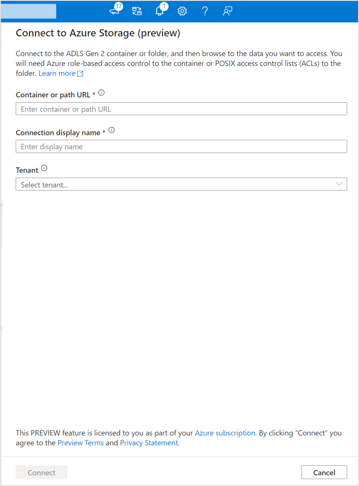

# Browse ADLS Gen2 folders (preview) in an Azure Synapse Analytics workspace
You can now browse an Azure Data Lake Storage Gen2 (ADLS Gen2) container or folder in your Azure Synapse Analytics workspace by connecting to the container or specific folder in Data Hub. If your organization does not grant users the Storage Blob Data Contributor role on the storage account, but allows creation of POSIX-like access control lists (ACLs) to the container or specific folders, then you can follow the steps listed in this article to browse files and folders in ADLS Gen2.

>[!Note]
>This preview feature enables users to browse ADLS Gen2 folders that they have ACLs to, but does not support upload, download, create, edit, delete, or rename actions on files or folders. Users with the Storage Blob Data Contributor role can perform all actions on ADLS Gen2 folders.

## Prerequisites
The following prerequisites must be met prior to connecting a container or folder in Azure Synapse:
* The Storage Blob Data Contributor (Azure RBAC) role or access control lists (ACLs) must be granted to your Microsoft Entra identity.
* A linked service to the ADLS Gen2 container must be created in the Synapse workspace.

## Connect ADLS Gen2 folder to your Azure Synapse Analytics workspace
1. Go to the **Linked** tab of Data Hub
2. Right click on **Azure Data Lake Storage Gen2** and select **Connect to Azure Storage (preview)**
    * Provide the ADLS Gen2 container or folder URL in the format `https://storageaccountname.dfs.core.windows.net/containername/foldername/`
    * Provide a unique name for the connection
    * Provide the name of the tenant that contains the ADLS Gen2 account. When left blank, the tenant associated with the Synapse workspace will be used.
    
3. Click on **Connect**. You will see the connected container or folder under **Attached Containers**.

## Next steps
Learn more about ACLs in Azure Data Lake Storage Gen2.
- [Access control lists in Azure Data Lake Storage Gen2](../storage/blobs/data-lake-storage-access-control.md)
- [Use the Azure portal to manage ACLs in Azure Data Lake Storage Gen2](../storage/blobs/data-lake-storage-acl-azure-portal.md)
