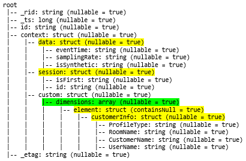
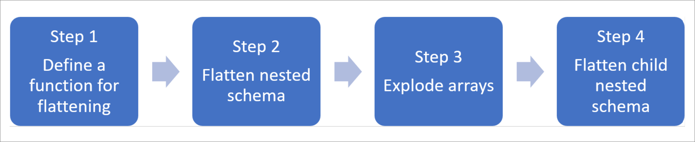
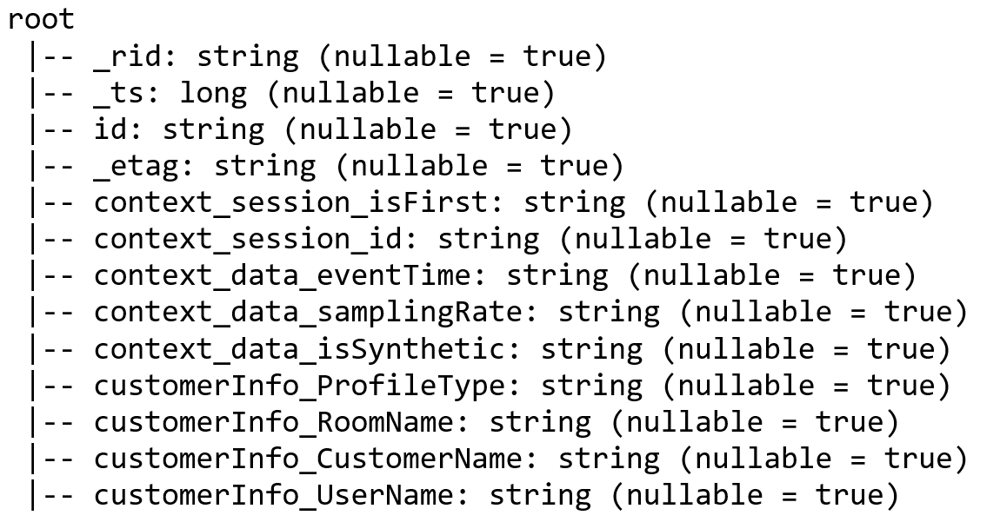

# Analyze complex data types in Azure Synapse Analytics

This article is relevant for Parquet files and containers in [Azure Synapse Link for Azure Cosmos DB](.\synapse-link\how-to-connect-synapse-link-cosmos-db.md). You can use Spark or SQL to read or transform data with complex schemas such as arrays or nested structures. The following example is completed with a single document, but it can easily scale to billions of documents with Spark or SQL. The code included in this article uses PySpark (Python).

## Use case

Complex data types are increasingly common and represent a challenge for data engineers. Analyzing nested schema and arrays can involve time-consuming and complex SQL queries. Additionally, it can be difficult to rename or cast the nested columns data type. Also, when you're working with deeply nested objects, you can encounter performance problems.

Data engineers need to understand how to efficiently process complex data types and make them easily accessible to everyone. In the following example, you use Spark in Azure Synapse Analytics to read and transform objects into a flat structure through data frames. You use the serverless model of SQL in Azure Synapse Analytics to query such objects directly, and return those results as a regular table.

## What are arrays and nested structures?

The following object comes from [Application Insights](../azure-monitor/app/app-insights-overview.md). In this object, there are nested structures and arrays that contain nested structures.

```json
{
    "id": "66532691-ab20-11ea-8b1d-936b3ec64e54",
    "context": {
        "data": {
            "eventTime": "2020-06-10T13:43:34.553Z",
            "samplingRate": "100.0",
            "isSynthetic": "false"
        },
        "session": {
            "isFirst": "false",
            "id": "38619c14-7a23-4687-8268-95862c5326b1"
        },
        "custom": {
            "dimensions": [
                {
                    "customerInfo": {
                        "ProfileType": "ExpertUser",
                        "RoomName": "",
                        "CustomerName": "diamond",
                        "UserName": "XXXX@yahoo.com"
                    }
                },
                {
                    "customerInfo": {
                        "ProfileType": "Novice",
                        "RoomName": "",
                        "CustomerName": "topaz",
                        "UserName": "XXXX@outlook.com"
                    }
                }
            ]
        }
    }
}
```

### Schema example of arrays and nested structures
When you're printing the schema of the object's data frame (called **df**) with the command `df.printschema`, you see the following representation:

* Yellow represents nested structures.
* Green represents an array with two elements.

[](./media/how-to-complex-schema/schema-origin.png#lightbox)

`_rid`, `_ts`, and `_etag` have been added to the system as the document was ingested into the Azure Cosmos DB transactional store.

The preceding data frame counts for 5 columns and 1 row only. After transformation, the curated data frame will have 13 columns and 2 rows, in a tabular format.

## Flatten nested structures and explode arrays

With Spark in Azure Synapse Analytics, it's easy to transform nested structures into columns and array elements into multiple rows. Use the following steps for implementation.

[](./media/how-to-complex-schema/spark-transform-steps.png#lightbox)

### Define a function to flatten the nested schema

You can use this function without change. Create a cell in a [PySpark notebook](quickstart-apache-spark-notebook.md) with the following function:

```python
from pyspark.sql.functions import col

def flatten_df(nested_df):
    stack = [((), nested_df)]
    columns = []

    while len(stack) > 0:
        parents, df = stack.pop()

        flat_cols = [
            col(".".join(parents + (c[0],))).alias("_".join(parents + (c[0],)))
            for c in df.dtypes
            if c[1][:6] != "struct"
        ]

        nested_cols = [
            c[0]
            for c in df.dtypes
            if c[1][:6] == "struct"
        ]

        columns.extend(flat_cols)

        for nested_col in nested_cols:
            projected_df = df.select(nested_col + ".*")
            stack.append((parents + (nested_col,), projected_df))

    return nested_df.select(columns)
```

### Use the function to flatten the nested schema

In this step, you flatten the nested schema of the data frame (**df**) into a new data frame (`df_flat`):

```python
from pyspark.sql.types import StringType, StructField, StructType
df_flat = flatten_df(df)
display(df_flat.limit(10))
```

The display function should return 10 columns and 1 row. The array and its nested elements are still there.

### Transform the array

Here, you transform the array, `context_custom_dimensions`, in the data frame `df_flat`, into a new data frame `df_flat_explode`. In the following code, you also define which column to select:

```python
from pyspark.sql.functions import explode
from pyspark.sql.functions import flatten
from pyspark.sql.functions import arrays_zip
df_flat_explode = df_flat.select("_rid","_ts","id","_etag",explode(df_flat.context_custom_dimensions),"context_session_isFirst","context_session_id","context_data_eventTime","context_data_samplingRate","context_data_isSynthetic")\
.select("_rid","_ts","id","_etag","col.*","context_session_isFirst","context_session_id","context_data_eventTime","context_data_samplingRate","context_data_isSynthetic")
display(df_flat_explode.limit(10))

```

The display function should return 10 columns and 2 rows. The next step is to flatten nested schemas with the function defined in step 1.

### Use the function to flatten the nested schema

Finally, you use the function to flatten the nested schema of the data frame `df_flat_explode`, into a new data frame, `df_flat_explode_flat`:
```python
df_flat_explode_flat = flatten_df(df_flat_explode)
display(df_flat_explode_flat.limit(10))
```

The display function should show 13 columns and 2 rows.

The function `printSchema` of the data frame `df_flat_explode_flat` returns the following result:

[](./media/how-to-complex-schema/schema-final.png#lightbox)

## Read arrays and nested structures directly

With the serverless model of SQL, you can query and create views and tables over such objects.

First, depending how the data has been stored, users should use the following taxonomy. Everything shown in uppercase is specific to your use case:

| Bulk | Format |
| ------ | ------ |
| 'https://ACCOUNTNAME.dfs.core.windows.net/FILESYSTEM/PATH/FINENAME.parquet' |'Parquet' (ADLSg2)|
| N'endpoint=https://ACCOUNTNAME.documents-staging.windows-ppe.net:443/;account=ACCOUNTNAME;database=DATABASENAME;collection=COLLECTIONNAME;region=REGIONTOQUERY', SECRET='YOURSECRET' |'CosmosDB' (Azure Synapse Link)|


Replace each field as follows:
* 'YOUR BULK ABOVE' is the connection string of the data source you connect to.
* 'YOUR TYPE ABOVE' is the format you use to connect to the source.

```sql
select *
FROM
openrowset(
    BULK 'YOUR BULK ABOVE',
    FORMAT='YOUR TYPE ABOVE'
)
with (id varchar(50),
        contextdataeventTime varchar(50) '$.context.data.eventTime',
        contextdatasamplingRate varchar(50) '$.context.data.samplingRate',
        contextdataisSynthetic varchar(50) '$.context.data.isSynthetic',
        contextsessionisFirst varchar(50) '$.context.session.isFirst',
        contextsessionid varchar(50) '$.context.session.id',
        contextcustomdimensions varchar(max) '$.context.custom.dimensions'
) as q 
cross apply openjson (contextcustomdimensions) 
with ( ProfileType varchar(50) '$.customerInfo.ProfileType',
            RoomName varchar(50) '$.customerInfo.RoomName',
            CustomerName varchar(50) '$.customerInfo.CustomerName',
            UserName varchar(50) '$.customerInfo.UserName'
    )
```

There are two different types of operations:

- The first operation type is indicated in the following line of code, which defines the column called `contextdataeventTime` that refers to the nested element, `Context.Data.eventTime`. 
  ```sql
  contextdataeventTime varchar(50) '$.context.data.eventTime'
  ```

  This line defines the column called `contextdataeventTime` that refers to the nested element, `Context>Data>eventTime`.

- The second operation type uses `cross apply` to create new rows for each element under the array. Then it defines each nested object. 
  ```sql
  cross apply openjson (contextcustomdimensions) 
  with ( ProfileType varchar(50) '$.customerInfo.ProfileType', 
  ```

  If the array had 5 elements with 4 nested structures, the serverless model of SQL returns 5 rows and 4 columns. The serverless model of SQL can query in place, map the array in 2 rows, and display all nested structures into columns.

## Next steps

* [Learn how to query Synapse Link for Azure Cosmos DB with Spark 3](./synapse-link/how-to-query-analytical-store-spark-3.md)
* [Learn how to query Synapse Link for Azure Cosmos DB with Spark 2](./synapse-link/how-to-query-analytical-store-spark.md)
* [Query Parquet nested types](./sql/query-parquet-nested-types.md)
