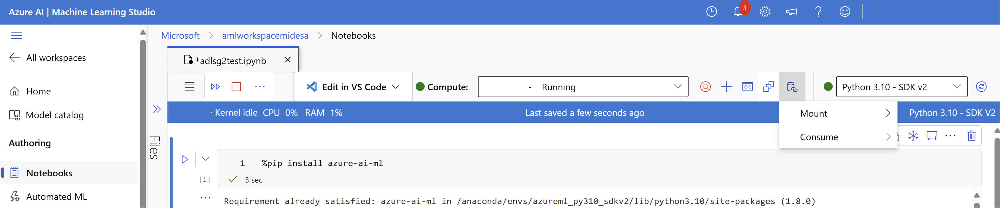

# Tutorial: Accessing Azure Synapse ADLS Gen2 Data in Azure Machine Learning

In this tutorial, we'll guide you through the process of accessing data stored in Azure Synapse Azure Data Lake Storage Gen2 (ADLS Gen2) from Azure Machine Learning (Azure Machine Learning). This capability is especially valuable when you aim to streamline your machine learning workflow by leveraging tools such as Automated ML, integrated model and experiment tracking, or specialized hardware like GPUs available in Azure Machine Learning.

To access ADLS Gen2 data in Azure Machine Learning, we will create an Azure Machine Learning Datastore that points to the Azure Synapse ADLS Gen2 storage account.

## Prerequisites
- An [Azure Synapse Analytics workspace](../get-started-create-workspace.md). Ensure that it has an Azure Data Lake Storage Gen2 storage account configured as the default storage. For the Data Lake Storage Gen2 file system that you work with, ensure that you're the *Storage Blob Data Contributor*.
- An [Azure Machine Learning workspace](../../machine-learning/quickstart-create-resources.md).

## Install libraries

First, we will install the ```azure-ai-ml``` package. 

```python
%pip install azure-ai-ml

```

## Create a Datastore

Azure Machine Learning offers a feature known as a Datastore, which acts as a reference to your existing Azure storage account. We will create a Datastore which references our Azure Synapse ADLS Gen2 storage account.

In this example, we'll create a Datastore linking to our Azure Synapse ADLS Gen2 storage. After initializing an ```MLClient``` object, you can provide connection details to your ADLS Gen2 account. Finally, you can execute the code to create or update the Datastore.

```python
from azure.ai.ml.entities import AzureDataLakeGen2Datastore
from azure.ai.ml import MLClient

ml_client = MLClient.from_config()

# Provide the connection details to your Azure Synapse ADLSg2 storage account
store = AzureDataLakeGen2Datastore(
    name="",
    description="",
    account_name="",
    filesystem=""
)

ml_client.create_or_update(store)
```

You can learn more about creating and managing Azure Machine Learning datastores using this [tutorial on Azure Machine Learning data stores](../../machine-learning/concept-data.md).

## Mount your ADLS Gen2 Storage Account

Once you have set up your data store, you can then access this data by creating a **mount** to your ADLSg2 account. In Azure Machine Learning, creating a mount to your ADLS Gen2 account entails establishing a direct link between your workspace and the storage account, enabling seamless access to the data stored within. Essentially, a mount acts as a pathway that allows Azure Machine Learning to interact with the files and folders in your ADLS Gen2 account as if they were part of the local filesystem within your workspace. 

Once the storage account is mounted, you can effortlessly read, write, and manipulate data stored in ADLS Gen2 using familiar filesystem operations directly within your Azure Machine Learning environment, simplifying data preprocessing, model training, and experimentation tasks.

To do this:

1. Start your compute engine.
2. Select **Data Actions** and then select **Mount**.

    

1. From here, you should see and select your ADLSg2 storage account name. It may take a few moments for your mount to be created.
1. Once your mount is ready, you can select **Data actions** and then **Consume**. Under **Data**, you can then select the mount that you want to consume data from.

Now, you can use your preferred libraries to directly read data from your mounted Azure Data Lake Storage account.

## Read data from your storage account

```python
import os
# List the files in the mounted path
print(os.listdir("/home/azureuser/cloudfiles/data/datastore/{name of mount}"))

# Get the path of your file and load the data using your preferred libraries
import pandas as pd
df = pd.read_csv("/home/azureuser/cloudfiles/data/datastore/{name of mount}/{file name}")
print(df.head(5))
```

## Next steps
- [Create and manage GPUs in Azure Machine Learning](../../machine-learning/how-to-train-distributed-gpu.md)
- [Create Automated ML jobs in Azure Machine Learning](../../machine-learning/concept-automated-ml.md)