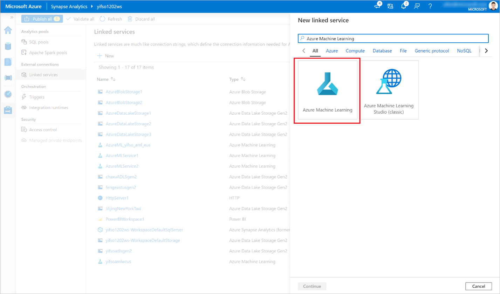
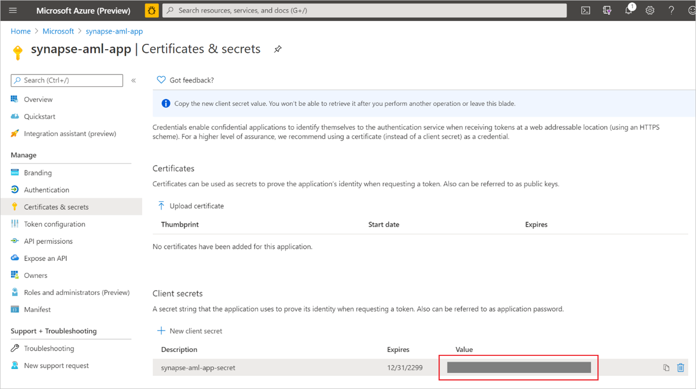
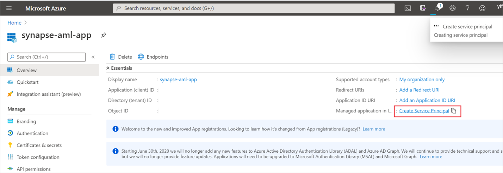
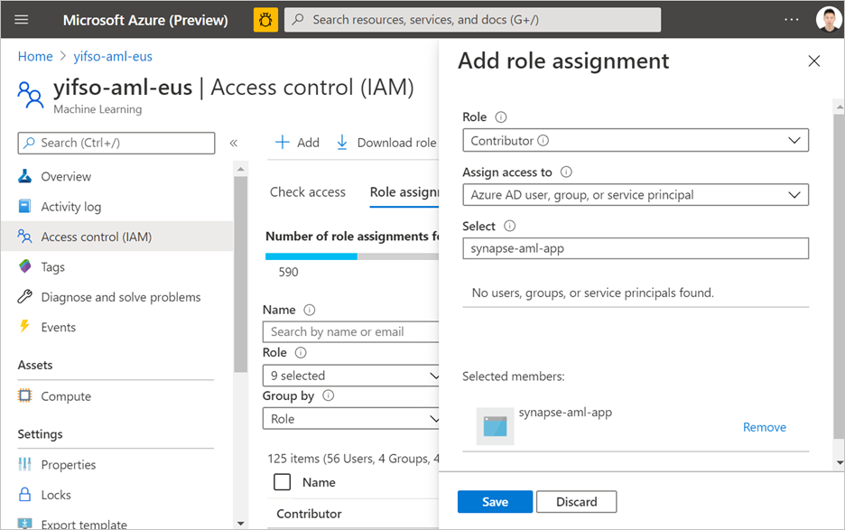

# Quickstart: Create a new Azure Machine Learning linked service in Synapse

> **IMPORTANT, PLEASE NOTE THE BELOW LIMITATIONS:**
> - **The Azure ML integration is not currently supported in Synapse Workspaces with Data Exfiltration Protection.** If you are **not** using data exfiltration protection and want to connect to Azure ML using private endpoints, you can set up a managed AzureML private endpoint in your Synapse workspace. [Read more about managed private endpoints](../security/how-to-create-managed-private-endpoints.md)
> - **AzureML linked service is not supported with self hosted integration runtimes.** This applies to Synapse workspaces with and without Data Exfiltration Protection.

In this quickstart, you'll link an Azure Synapse Analytics workspace to an Azure Machine Learning workspace. Linking these workspaces allows you to leverage Azure Machine Learning from various experiences in Synapse.

For example, this linking to an Azure Machine Learning workspace enables these experiences:

- Run your Azure Machine Learning pipelines as a step in your Synapse pipelines. To learn more, see [Execute Azure Machine Learning pipelines](../../data-factory/transform-data-machine-learning-service.md).

- Enrich your data with predictions by bringing a machine learning model from the Azure Machine Learning model registry and score the model in Synapse SQL pools. For more details, see [Tutorial: Machine learning model scoring wizard for Synapse SQL pools](tutorial-sql-pool-model-scoring-wizard.md).

## Two types of authentication

There are two types of identities you can use when creating an Azure Machine Learning linked service in Azure Synapse.

* Synapse workspace Managed Identity
* Service Principal

In the following sections, you'll find guidance on how to create an Azure Machine Learning linked service using these two different types of authentication.

## Prerequisites

- You'll need an Azure subscription. If needed, [create a free Azure account](https://azure.microsoft.com/free/).
- [Synapse Analytics workspace](../get-started-create-workspace.md) with an ADLS Gen2 storage account configured as the default storage. You need to be the **Storage Blob Data Contributor** of the ADLS Gen2 filesystem that you work with.
- [Azure Machine Learning workspace](../../machine-learning/how-to-manage-workspace.md).
- If you chose to use a Service principal, you need permissions (or request from someone who has permissions) to create a service principal and secret which you can use to create the linked service. Note that this service principal needs to be assigned the contributor role in the Azure Machine Learning workspace.
- Sign in to the [Azure portal](https://portal.azure.com/)

## Create a linked service using the Synapse workspace Managed identity

This section will guide you on how to create an Azure Machine Learning linked service in Azure Synapse, using the [Azure Synapse workspace Managed Identity](../../data-factory/data-factory-service-identity.md?context=/azure/synapse-analytics/context/context&tabs=synapse-analytics)

### Give MSI permission to the Azure ML workspace

1. Navigate to your Azure Machine Learning workspace resource in the Azure portal and select **Access Control**

1. Create a role assignment and add your Synapse workspace Managed Service identity (MSI) as a *contributor* of the Azure Machine Learning workspace. Note that this will require being an owner of the resource group that the Azure Machine Learning workspace belongs to. If you have trouble finding your Synapse workspace MSI, search for the name of the Synapse workspace.

### Create an Azure ML linked service

1. In the Synapse workspace where you want to create the new Azure Machine Learning linked service, go to **Manage** > **Linked services**, and create a new linked service with type "Azure Machine Learning".

   

1. Fill out the form:

   - Provide the details about the Azure Machine Learning workspace you want to link to. This includes details about subscription and workspace name.

   - Select Authentication Method: **Managed Identity**

1. Click **Test Connection** to verify if the configuration is correct. If the connection test passes, click **Save**.

   If the connection test fails, make sure that the Azure Synapse workspace MSI has permissions to access this Azure Machine Learning workspace, and try again.

## Create a linked service using a service principal

This section will guide you on how to create an Azure Machine Learning linked service with a service principal.

### Create a service principal

This step will create a new Service Principal. If you want to use an existing Service Principal, you can skip this step.

1. Open Azure portal. 

1. Go to **Azure Active Directory** -> **App registrations**.

1. Click **New registration**. Then, follow instructions to register a new application.

1. After the application is registered, generate a secret for the application. Go to **Your application** -> **Certificate & Secret**. Click **Add client secret** to generate a secret. Keep the secret safe and it will be used later.

   

1. Create a service principal for the application. Go to **Your application** -> **Overview** and then click **Create service principal**. In some cases, this service principal is automatically created.

   

1. Add the service principal as "contributor" of the Azure Machine Learning workspace. Note that this will require being an owner of the resource group that the Azure Machine Learning workspace belongs to.

   

### Create an Azure ML linked service

1. In the Synapse workspace where you want to create the new Azure Machine Learning linked service, go to **Manage** -> **Linked services**, create a new linked service with type "Azure Machine Learning".

   

1. Fill out the form:

   - Provide the details about the Azure Machine Learning workspace you want to link to. This includes details about subscription and workspace name.

   - Select Authentication Method: **Service Principal**

   - Service principal ID: This is the **application (client) ID** of the Application.

   > [!NOTE]
   > The ID is NOT the name of the application. You can find this ID in the overview page of the application. It should be a long string looking similar to this "81707eac-ab38-406u-8f6c-10ce76a568d5".

   - Service principal key: The secret you generated in the previous section.

1. Click **Test Connection** to verify if the configuration is correct. If the connection test passes, click **Save**.

   If the connection test fails, make sure that the service principal ID and secret are correct and try again.

## Next steps

- [Tutorial: Machine learning model scoring wizard - dedicated SQL pool](tutorial-sql-pool-model-scoring-wizard.md)
- [Machine Learning capabilities in Azure Synapse Analytics](what-is-machine-learning.md)
