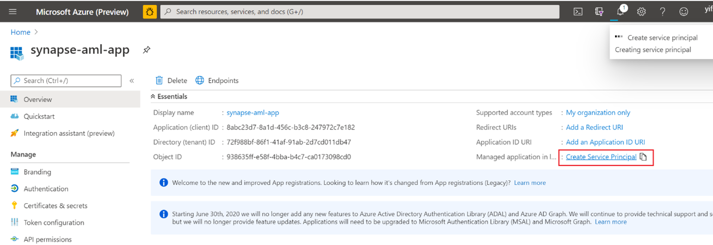
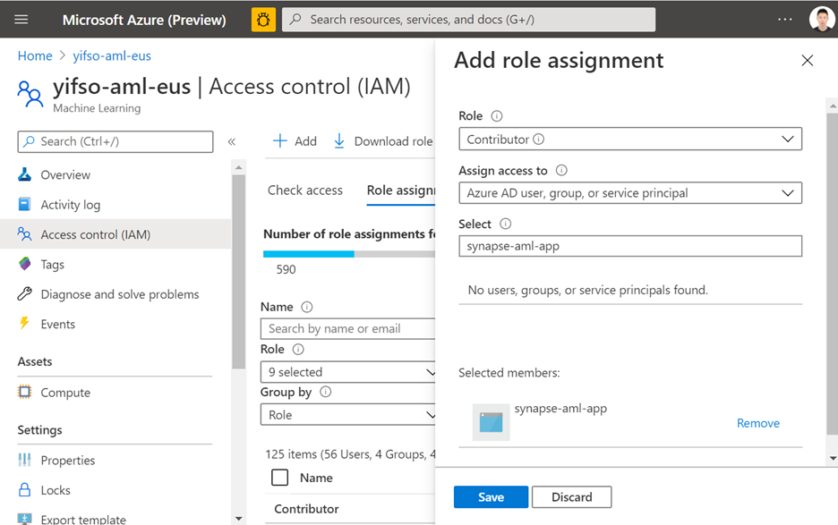
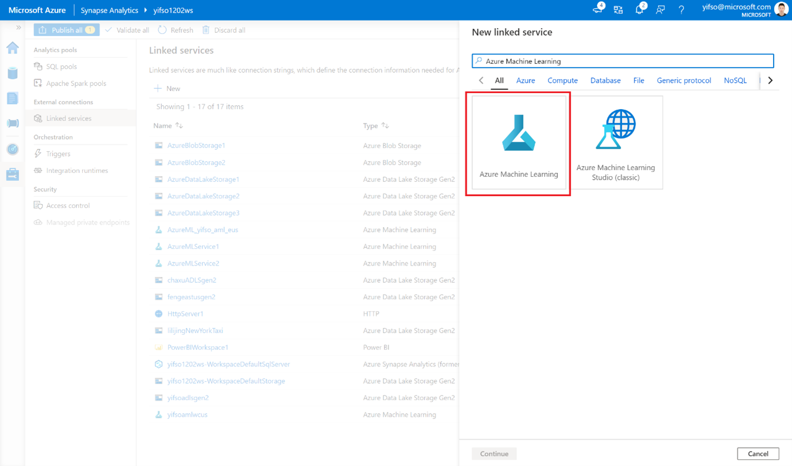

# Quickstart: Create a new Azure ML linked service in Synapse

Linking a Synapse workspace to an Azure ML workspace allows you to leverage Azure ML from various experiences in Synapse.
Examples of experiences that this linking to an Azure ML workspace enables:

* Run your Azure Machine Learning pipelines as a step in your Synapse pipelines. [Learn more about using Azure ML in pipelines](/azure/data-factory/transform-data-machine-learning-service.md)

* Enrich your data with predictions by bringing an ML model from the Azure ML model registry and score the model in Synapse SQL pools. [Learn more about the Synapse model scoring experience](TODO)

If you don't have an Azure subscription, [create a free account before you begin](https://azure.microsoft.com/free/).

## Prerequisites

- Azure subscription - [create one for free](https://azure.microsoft.com/free/)
- [Synapse Analytics workspace](quickstart-create-workspace.md) with an ADLS Gen2 storage account configured as the default storage. You need to be the **Storage Blob Data Contributor** of the ADLS Gen2 filesystem that you work with.
- [Azure Machine Learning Workspace](https://docs.microsoft.com/en-us/azure/machine-learning/how-to-manage-workspace)
- You also need permissions (or request from someone who has permissions) to create a service principal and secret which you can use to create the linked service. Note that this service principal needs to be assigned the contributor role in the Azure ML Workspace.

## Sign in to the Azure portal

Sign in to the [Azure portal](https://portal.azure.com/)

## Create a service principal

This step will create a new Service Principal. If you want to use an existing Service Principal, you can skip this step.
1. Open Azure portal. 
1. Go to "Azure Active Directory -> App registrations". 
1. Click "New registration". Then, follow instructions on the UI to register a new application.
1. After the application is registered. Generate a secret for the application. Go to "Your application -> Certificate & Secret". Click "Add client secret" to generate a secret. Keep the secret safe and it will be used later.

1. Create a service principal for the application. Go to "Your application -> Overview" and then click "Create service principal". In some cases, this service principal is automatically created.

1. Add the service principal as "contributor" of the Azure ML workspace. Note that this will require being an owner of the resource group that the Azure ML woskpace belongs to.

## Navigate to the Synapse workspace and create a linked service
1. In the Synapse workspace where you want to create the new Azure ML linked service, go to "Management -> Linked service", create a new linked service with type "Azure Machine Learning".

2. Fill out the form:
   
* Service principal ID: This is the **application (client) ID** of the Application. 
  
 *Note that this is NOT the name of the application. You can find this ID in the overview page of the application. It should be a long string looking similar to this "81707eac-ab38-406u-8f6c-10ce76a568d5"*

* Service principal key: The secret we generated in the previous section.

3. Click "Test Connection" to verify if the configuration is correct. If the connection test passes, click "Save".

If the connection test failed, make sure that the service principal ID and secret are correct and try again.

## Next steps

- See [Tutorial: Machine learning model scoring wizard - SQL pool](tutorial-sql-scoring-wizard.md).
