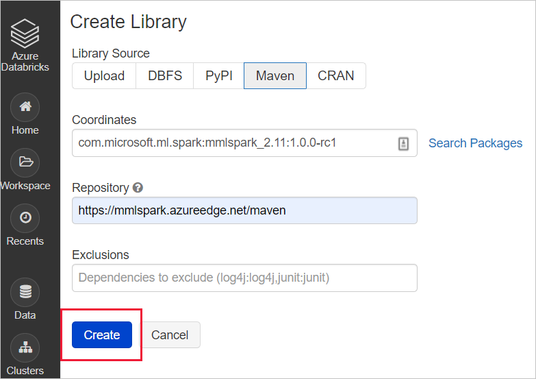
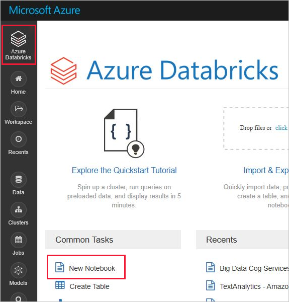

# Setup environment for Azure AI services for big data

Setting up your environment is the first step to building a pipeline for your data. After your environment is ready, running a sample is quick and easy.

In this article, you'll perform these steps to get started:

> [!div class="checklist"]
> * [Create an Azure AI services resource](#create-an-azure-ai-services-resource)
> * [Create an Apache Spark cluster](#create-an-apache-spark-cluster)
> * [Try a sample](#try-a-sample)

## Create an Azure AI services resource

To work with big data in Azure AI services, first create an Azure AI services resource for your workflow. There are two main types of Azure AI services: cloud services hosted in Azure and containerized services managed by users. We recommend starting with the simpler cloud-based Azure AI services.

### Cloud services

Cloud-based Azure AI services are intelligent algorithms hosted in Azure. These services are ready for use without training, you just need an internet connection. You can [create resources for Azure AI services in the Azure portal](../../ai-services/multi-service-resource.md?pivots=azportal) or with the [Azure CLI](../../ai-services/multi-service-resource.md?pivots=azcli).

### Containerized services (optional)

If your application or workload uses large datasets, requires private networking, or can't contact the cloud, communicating with cloud services might be impossible. In this situation, containerized Azure AI services have these benefits:

* **Low Connectivity**: You can deploy containerized Azure AI services in any computing environment, both on-cloud and off. If your application can't contact the cloud, consider deploying containerized Azure AI services on your application.

* **Low Latency**: Because containerized services don't require the round-trip communication to/from the cloud, responses are returned with much lower latencies.

* **Privacy and Data Security**: You can deploy containerized services into private networks, so that sensitive data doesn't leave the network.

* **High Scalability**: Containerized services don't have "rate limits" and run on user-managed computers. So, you can scale Azure AI services without end to handle much larger workloads.

Follow [this guide](../../ai-services/cognitive-services-container-support.md) to create a containerized Azure AI service.

## Create an Apache Spark cluster

[Apache Spark&trade;](http://spark.apache.org/) is a distributed computing framework designed for big-data data processing. Users can work with Apache Spark in Azure with services like Azure Databricks, Azure Synapse Analytics, HDInsight, and Azure Kubernetes Services. To use the big data Azure AI services, you must first create a cluster. If you already have a Spark cluster, feel free to try an example.

### Azure Databricks

Azure Databricks is an Apache Spark-based analytics platform with a one-click setup, streamlined workflows, and an interactive workspace. It's often used to collaborate between data scientists, engineers, and business analysts. To use the big data Azure AI services on Azure Databricks, follow these steps:

1. [Create an Azure Databricks workspace](/azure/databricks/scenarios/quickstart-create-databricks-workspace-portal#create-an-azure-databricks-workspace)

1. [Create a Spark cluster in Databricks](/azure/databricks/scenarios/quickstart-create-databricks-workspace-portal#create-a-spark-cluster-in-databricks)

1. Install the SynapseML open-source library (or MMLSpark library if you're supporting a legacy application):

    * Create a new library in your databricks workspace  
       

    * For SynapseML: input the following maven coordinates
      Coordinates:  `com.microsoft.azure:synapseml_2.12:0.10.0`
      Repository: default

    * For MMLSpark (legacy): input the following maven coordinates
      Coordinates:  `com.microsoft.ml.spark:mmlspark_2.11:1.0.0-rc3`
      Repository: `https://mmlspark.azureedge.net/maven`  
      

    * Install the library onto a cluster  
      

### Azure Synapse Analytics (optional)

Optionally, you can use Synapse Analytics to create a spark cluster. Azure Synapse Analytics brings together enterprise data warehousing and big data analytics. It gives you the freedom to query data on your terms, using either serverless on-demand or provisioned resources at scale. To get started using Azure Synapse Analytics, follow these steps:

1. [Create a Synapse Workspace (preview)](../quickstart-create-workspace.md).

1. [Create a new serverless Apache Spark pool (preview) using the Azure portal](../quickstart-create-apache-spark-pool-portal.md).

In Azure Synapse Analytics, big data for Azure AI services is installed by default.

### Azure Kubernetes Service

If you're using containerized Azure AI services, one popular option for deploying Spark alongside containers is the Azure Kubernetes Service.

To get started on Azure Kubernetes Service, follow these steps:

1. [Deploy an Azure Kubernetes Service (AKS) cluster using the Azure portal](../../aks/learn/quick-kubernetes-deploy-portal.md)

1. [Install the Apache Spark 2.4.0 helm chart](https://hub.helm.sh/charts/microsoft/spark)

1. [Install an Azure AI container using Helm](../../ai-services/computer-vision/deploy-computer-vision-on-premises.md)

## Try a sample

After you set up your Spark cluster and environment, you can run a short sample. This sample assumes Azure Databricks and the `mmlspark.cognitive` package. For an example using `synapseml.cognitive`, see [Add search to AI-enriched data from Apache Spark using SynapseML](../../search/search-synapseml-cognitive-services.md).

First, you can create a notebook in Azure Databricks. For other Spark cluster providers, use their notebooks or Spark Submit.

1. Create a new Databricks notebook, by choosing **New Notebook** from the **Azure Databricks** menu.

    

1. In the **Create Notebook**, enter a name, select **Python** as the language, and select the Spark cluster that you created earlier.

    

    Select **Create**.

1. Paste this code snippet into your new notebook.

    ```python
    from mmlspark.cognitive import *
    from pyspark.sql.functions import col
    
    # Add your region and subscription key from the Language service
    service_key = "ADD-SUBSCRIPTION-KEY-HERE"
    service_region = "ADD-SERVICE-REGION-HERE"
    
    df = spark.createDataFrame([
      ("I am so happy today, its sunny!", "en-US"),
      ("I am frustrated by this rush hour traffic", "en-US"),
      ("The Azure AI services on spark aint bad", "en-US"),
    ], ["text", "language"])
    
    sentiment = (TextSentiment()
        .setTextCol("text")
        .setLocation(service_region)
        .setSubscriptionKey(service_key)
        .setOutputCol("sentiment")
        .setErrorCol("error")
        .setLanguageCol("language"))
    
    results = sentiment.transform(df)
    
    # Show the results in a table
    display(results.select("text", col("sentiment")[0].getItem("score").alias("sentiment")))
    ```

1. Get your region and subscription key from the **Keys and Endpoint** menu from your Language resource in the Azure portal.

1. Replace the region and subscription key placeholders in your Databricks notebook code with values that are valid for your resource.

1. Select the play, or triangle, symbol in the upper right of your notebook cell to run the sample. Optionally, select **Run All** at the top of your notebook to run all cells. The answers will display below the cell in a table.

### Expected results

| text                                      |   sentiment |
|:------------------------------------------|------------:|
| I am so happy today, its sunny!           |   0.978959  |
| I am frustrated by this rush hour traffic |   0.0237956 |
| The Azure AI services on spark aint bad  |   0.888896  |

## Next steps

- [Azure AI services in Azure Synapse Analytics](./overview-cognitive-services.md)
- [Tutorial: Sentiment analysis with Azure AI Language](./tutorial-cognitive-services-sentiment.md)
