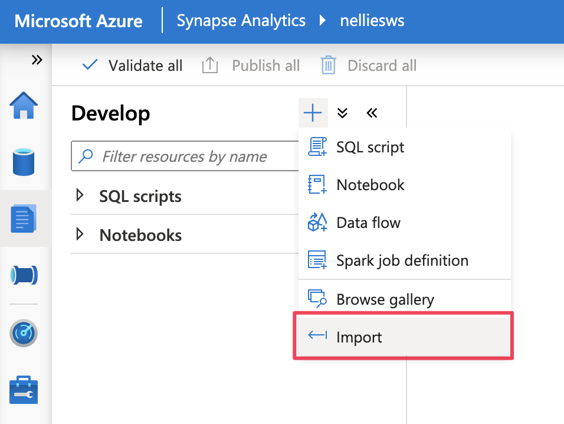
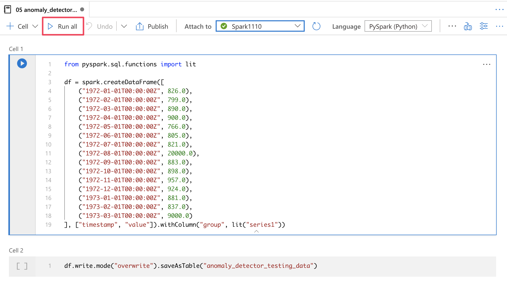
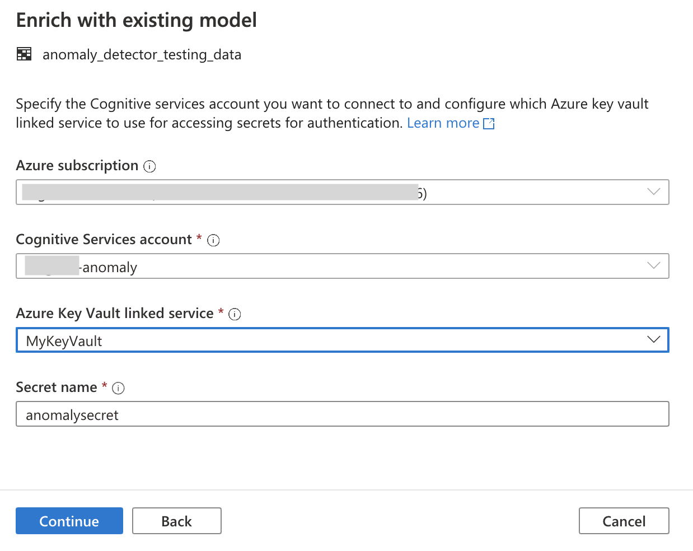
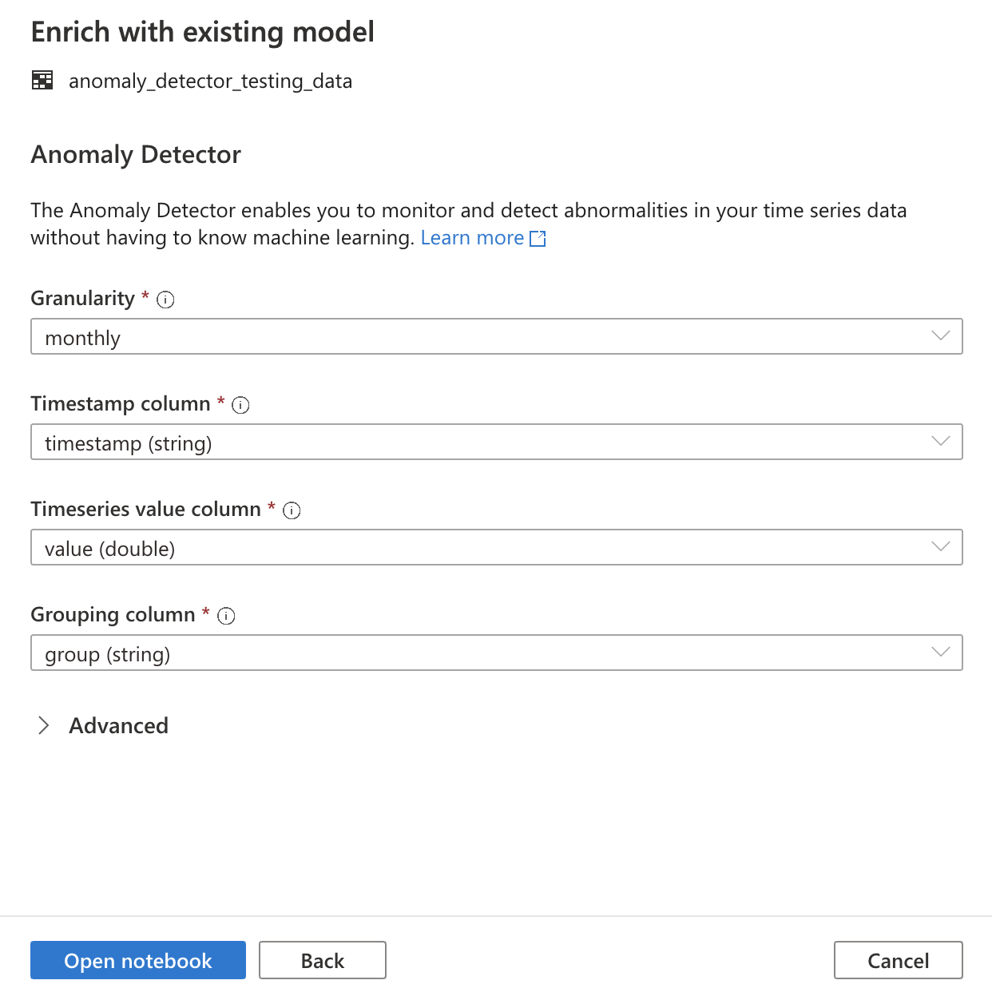
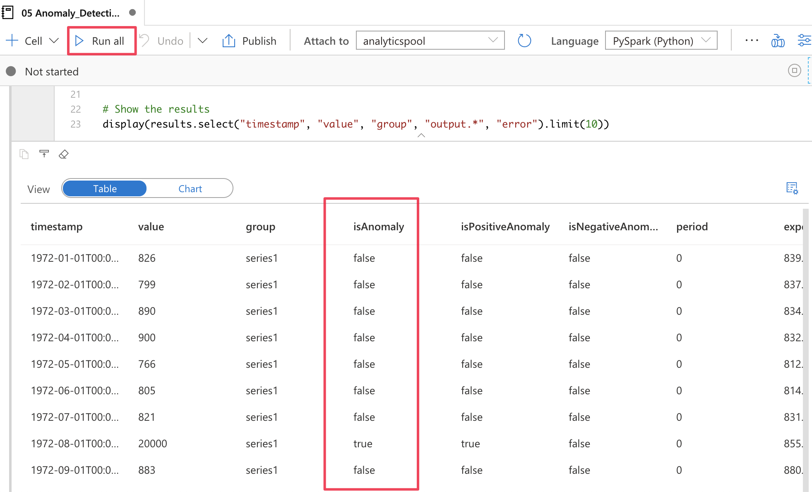

# Tutorial: Anomaly detection with Cognitive Services (preview)

In this tutorial, you'll learn how to easily enrich your data in Azure Synapse Analytics with [Azure Cognitive Services](../../cognitive-services/index.yml). You'll use [Anomaly Detector](../../cognitive-services/anomaly-detector/index.yml) to find anomalies. A user in Azure Synapse can simply select a table to enrich for detection of anomalies.

This tutorial covers:

> [!div class="checklist"]
> - Steps for getting a Spark table dataset that contains time series data.
> - Use of a wizard experience in Azure Synapse to enrich data by using Anomaly Detector in Cognitive Services.

If you don't have an Azure subscription, [create a free account before you begin](https://azure.microsoft.com/free/).

## Prerequisites

- [Azure Synapse Analytics workspace](../get-started-create-workspace.md) with an Azure Data Lake Storage Gen2 storage account configured as the default storage. You need to be the *Storage Blob Data Contributor* of the Data Lake Storage Gen2 file system that you work with.
- Spark pool in your Azure Synapse Analytics workspace. For details, see [Create a Spark pool in Azure Synapse](../quickstart-create-sql-pool-studio.md).
- Completion of the pre-configuration steps in the [Configure Cognitive Services in Azure Synapse](tutorial-configure-cognitive-services-synapse.md) tutorial.

## Sign in to the Azure portal

Sign in to the [Azure portal](https://portal.azure.com/).

## Create a Spark table

You need a Spark table for this tutorial.

1. Download the following notebook file that contains code to generate a Spark table: [prepare_anomaly_detector_data.ipynb](https://go.microsoft.com/fwlink/?linkid=2149577).

1. Upload the file to your Azure Synapse workspace.

   

1. Open the notebook file and select **Run All** to run all cells.

   

1. A Spark table named **anomaly_detector_testing_data** should now appear in the default Spark database.

## Open the Cognitive Services wizard

1. Right-click the Spark table created in the previous step. Select **Machine Learning** > **Predict with a model** to open the wizard.

   

2. A configuration panel appears, and you're asked to select a Cognitive Services model. Select **Anomaly Detector**.

   

## Provide authentication details

To authenticate to Cognitive Services, you need to reference the secret in your key vault. The following inputs depend on the [prerequisite steps](tutorial-configure-cognitive-services-synapse.md) that you should have completed before this point.

- **Azure subscription**: Select the Azure subscription that your key vault belongs to.
- **Cognitive Services account**: Enter the Text Analytics resource that you'll connect to.
- **Azure Key Vault linked service**: As part of the prerequisite steps, you created a linked service to your Text Analytics resource. Select it here.
- **Secret name**: Enter the name of the secret in your key vault that contains the key to authenticate to your Cognitive Services resource.

## Configure Anomaly Detector

Provide the following details to configure Anomaly Detector:

- **Granularity**: The rate at which your data is sampled. Choose **monthly**. 

- **Timestamp column**: The column that represents the time of the series. Choose **timestamp (string)**.

- **Timeseries value column**: The column that represents the value of the series at the time specified by the Timestamp column. Choose **value (double)**.

- **Grouping column**: The column that groups the series. That is, all rows that have the same value in this column should form one time series. Choose **group (string)**.

When you're done, select **Open notebook**. This will generate a notebook for you with PySpark code that uses Azure Cognitive Services to detect anomalies.

## Run the notebook

The notebook that you just opened uses the [mmlspark library](https://github.com/Azure/mmlspark) to connect to Cognitive Services. The Azure Key Vault details that you provided allow you to securely reference your secrets from this experience without revealing them.

You can now run all cells to perform anomaly detection. Select **Run All**. [Learn more about Anomaly Detector in Cognitive Services](../../cognitive-services/anomaly-detector/index.yml).

## Next steps

- [Tutorial: Sentiment analysis with Azure Cognitive Services](tutorial-cognitive-services-sentiment.md)
- [Tutorial: Machine learning model scoring in Azure Synapse dedicated SQL pools](tutorial-sql-pool-model-scoring-wizard.md)
- [Machine Learning capabilities in Azure Synapse Analytics](what-is-machine-learning.md)
