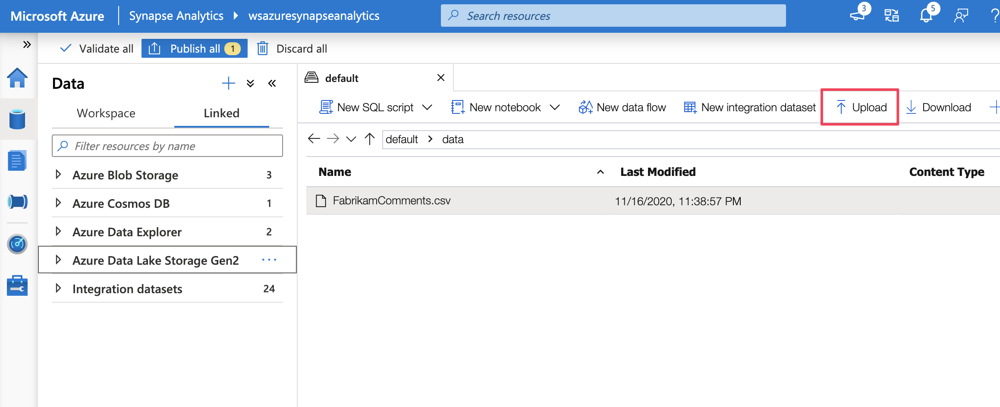
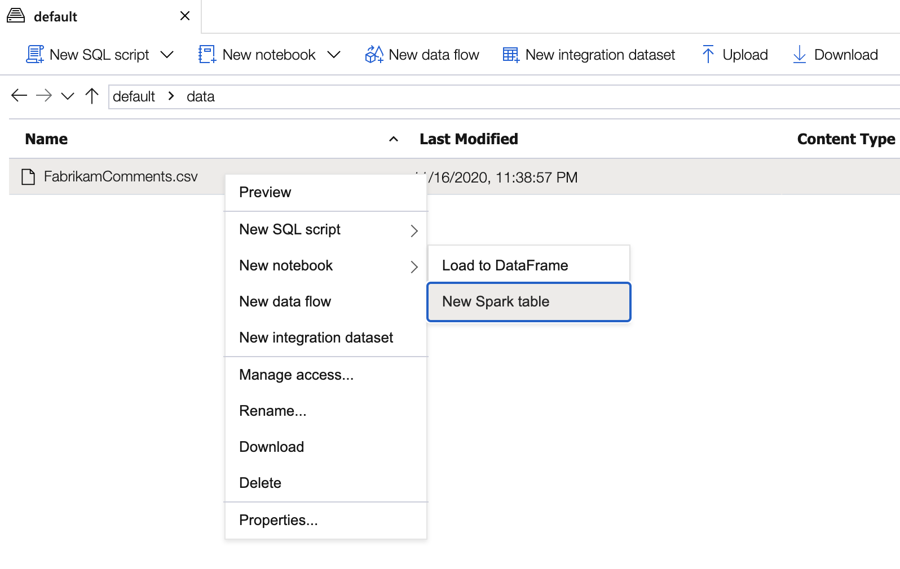
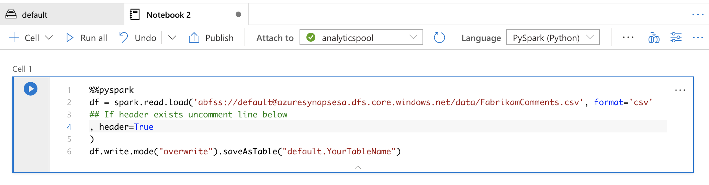
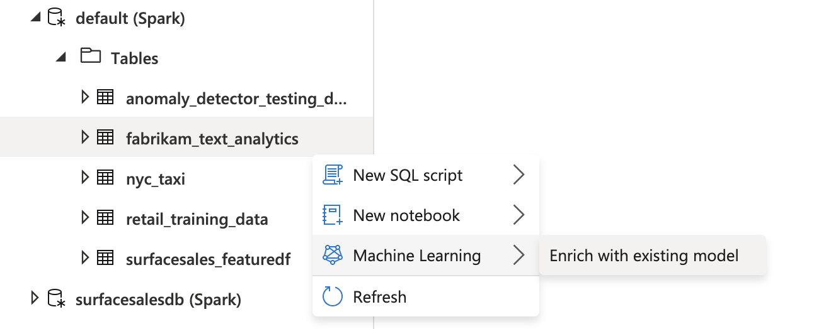
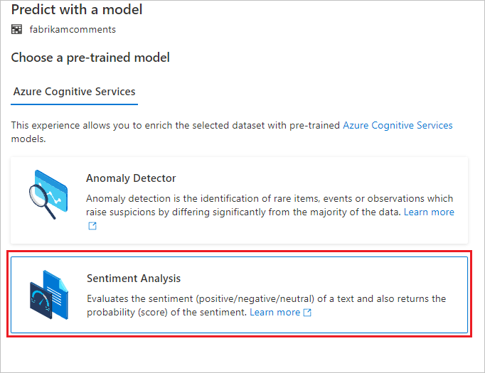
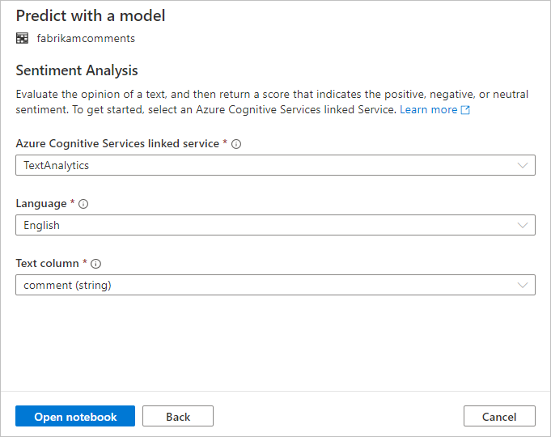
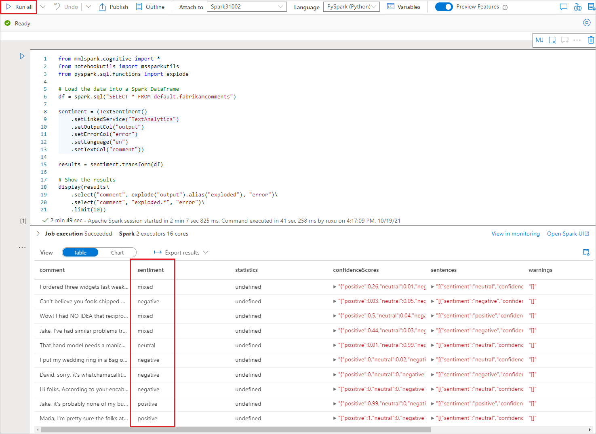

# Tutorial: Sentiment analysis with Azure AI services

In this tutorial, you'll learn how to easily enrich your data in Azure Synapse Analytics with [Azure AI services](../../ai-services/index.yml). You'll use the [Azure AI Language](../../ai-services/language-service/index.yml) text analytics capabilities to perform sentiment analysis. 

A user in Azure Synapse can simply select a table that contains a text column to enrich with sentiments. These sentiments can be positive, negative, mixed, or neutral. A probability will also be returned.

This tutorial covers:

> [!div class="checklist"]
> - Steps for getting a Spark table dataset that contains a text column for sentiment analysis.
> - Using a wizard experience in Azure Synapse to enrich data by using Text Analytics in Azure AI Language.

If you don't have an Azure subscription, [create a free account before you begin](https://azure.microsoft.com/free/).

## Prerequisites

- [Azure Synapse Analytics workspace](../get-started-create-workspace.md) with an Azure Data Lake Storage Gen2 storage account configured as the default storage. You need to be the *Storage Blob Data Contributor* of the Data Lake Storage Gen2 file system that you work with.
- Spark pool in your Azure Synapse Analytics workspace. For details, see [Create a Spark pool in Azure Synapse](../quickstart-create-sql-pool-studio.md).
- Pre-configuration steps described in the tutorial [Configure Azure AI services in Azure Synapse](tutorial-configure-cognitive-services-synapse.md).

## Sign in to the Azure portal

Sign in to the [Azure portal](https://portal.azure.com/).

## Create a Spark table

You'll need a Spark table for this tutorial.

1. Download the [FabrikamComments.csv](https://github.com/aghonaim/datasets/blob/master/FabrikamComments.csv) file, which contains a dataset for text analytics. 

1. Upload the file to your Azure Synapse storage account in Data Lake Storage Gen2.
  
   

1. Create a Spark table from the .csv file by right-clicking the file and selecting **New Notebook** > **Create Spark table**.

   

1. Name the table in the code cell and run the notebook on a Spark pool. Remember to set `header=True`.

   

   ```python
   %%pyspark
   df = spark.read.load('abfss://default@azuresynapsesa.dfs.core.windows.net/data/FabrikamComments.csv', format='csv'
   ## If a header exists, uncomment the line below
   , header=True
   )
   df.write.mode("overwrite").saveAsTable("default.YourTableName")
   ```

<a name='open-the-cognitive-services-wizard'></a>

## Open the Azure AI services wizard

1. Right-click the Spark table created in the previous procedure. Select **Machine Learning** > **Predict with a model** to open the wizard.

   

2. A configuration panel appears, and you're asked to select a pre-trained model. Select **Sentiment Analysis**.

   

## Configure sentiment analysis

Next, configure the sentiment analysis. Select the following details:
- **Azure Cognitive Services linked service**: As part of the prerequisite steps, you created a linked service to your [Azure AI service](tutorial-configure-cognitive-services-synapse.md). Select it here.
- **Language**: Select **English** as the language of the text that you want to perform sentiment analysis on.
- **Text column**: Select **comment (string)** as the text column in your dataset that you want to analyze to determine the sentiment.

When you're done, select **Open notebook**. This generates a notebook for you with PySpark code that performs the sentiment analysis with Azure AI services.



## Run the notebook

The notebook that you just opened uses the [SynapseML library](https://github.com/microsoft/SynapseML) to connect to Azure AI services. The Azure AI services linked service that you provided allow you to securely reference your Azure AI service from this experience without revealing any secrets.

 You can now run all cells to enrich your data with sentiments. Select **Run all**. 

The sentiments are returned as **positive**, **negative**, **neutral**, or **mixed**. You also get probabilities per sentiment. [Learn more about sentiment analysis in Azure AI services](../../ai-services/language-service/sentiment-opinion-mining/overview.md).



## Next steps
- [Tutorial: Anomaly detection with Azure AI services](tutorial-cognitive-services-anomaly.md)
- [Tutorial: Machine learning model scoring in Azure Synapse dedicated SQL pools](tutorial-sql-pool-model-scoring-wizard.md)
- [SynapseML text sentiment analysis](https://microsoft.github.io/SynapseML/docs/documentation/transformers/transformers_cognitive/#textsentiment)
- [Machine Learning capabilities in Azure Synapse Analytics](what-is-machine-learning.md)
