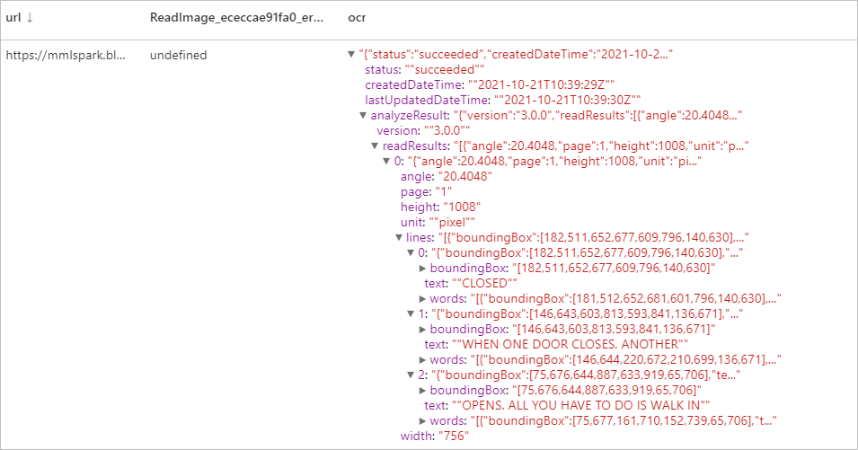
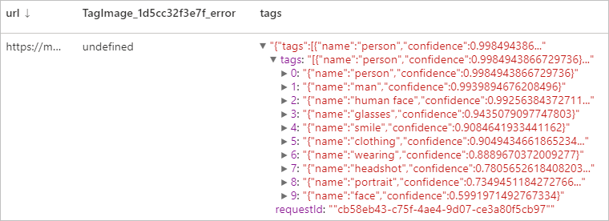
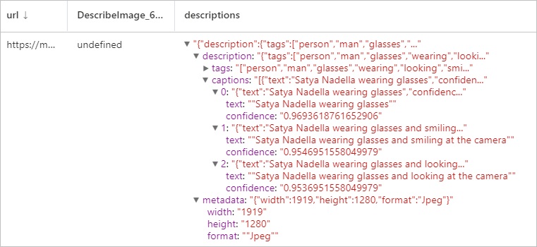
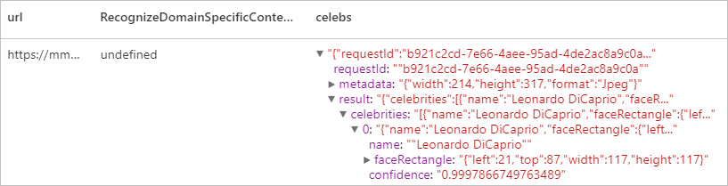

# Tutorial: Vision with Azure AI services

[Azure AI Vision](../../ai-services/computer-vision/index.yml) is an [Azure AI service](../../ai-services/index.yml) that enables you to process images and return information based on the visual features. In this tutorial, you'll learn how to use [Azure AI Vision](../../ai-services/computer-vision/index.yml) to analyze images on Azure Synapse Analytics.

This tutorial demonstrates using text analytics with [SynapseML](https://github.com/microsoft/SynapseML) to:

> [!div class="checklist"]
> - Extract visual features from the image content
> - Recognize characters from images (OCR)
> - Analyze image content and generate thumbnail
> - Detect and identify domain-specific content in an image
> - Generate tags related to an image
> - Generate a description of an entire image in human-readable language


## Analyze image
Extracts a rich set of visual features based on the image content,  such as objects, faces, adult content, and autogenerated text descriptions. 
### Example input


```python
# Create a dataframe with the image URLs
df = spark.createDataFrame([
        ("<replace with your file path>/dog.jpg", )
    ], ["image", ])

# Run the Azure AI Vision service. Analyze Image extracts infortmation from/about the images.
analysis = (AnalyzeImage()
    .setLinkedService(ai_service_name)
    .setVisualFeatures(["Categories","Color","Description","Faces","Objects","Tags"])
    .setOutputCol("analysis_results")
    .setImageUrlCol("image")
    .setErrorCol("error"))

# Show the results of what you wanted to pull out of the images.
display(analysis.transform(df).select("image", "analysis_results.description.tags"))

```
### Expected results

```json
["dog","outdoor","fence","wooden","small","brown","building","sitting","front","bench","standing","table","walking","board","beach","holding","bridge"]
```

## Optical character recognition (OCR)
Extract printed text, handwritten text, digits, and currency symbols from images, such as photos of street signs and products, as well as from documents—invoices, bills, financial reports, articles, and more. It's optimized to extract text from text-heavy images and multi-page PDF documents with mixed languages. It supports detecting both printed and handwritten text in the same image or document.

### Example input


```python
df = spark.createDataFrame([
        ("<replace with your file path>/ocr.jpg", )
    ], ["url", ])

ri = (ReadImage()
    .setLinkedService(ai_service_name)
    .setImageUrlCol("url")
    .setOutputCol("ocr"))

display(ri.transform(df))
```
### Expected results


## Generate thumbnails
Analyze the contents of an image to generate an appropriate thumbnail for that image. The Vision service first generates a high-quality thumbnail and then analyzes the objects within the image to determine the area of interest. Vision then crops the image to fit the requirements of the area of interest. The generated thumbnail can be presented using an aspect ratio that is different from the aspect ratio of the original image, depending on your needs.

### Example input


```python
df = spark.createDataFrame([
        ("<replace with your file path>/satya.jpeg", )
    ], ["url", ])

gt =  (GenerateThumbnails()
    .setLinkedService(ai_service_name)
    .setHeight(50)
    .setWidth(50)
    .setSmartCropping(True)
    .setImageUrlCol("url")
    .setOutputCol("thumbnails"))

thumbnails = gt.transform(df).select("thumbnails").toJSON().first()

import json
img = json.loads(thumbnails)["thumbnails"]

displayHTML("")

```

### Expected results


## Tag image
Generates a list of words, or tags, that are relevant to the content of the supplied image. Tags are returned based on thousands of recognizable objects, living beings, scenery, or actions found in images. Tags may contain hints to avoid ambiguity or provide context, for example the tag "ascomycete" may be accompanied by the hint "fungus".

Let continue using Satya's image as an example.

```python
df = spark.createDataFrame([
        ("<replace with your file path>/satya.jpeg", )
    ], ["url", ])

ti = (TagImage()
    .setLinkedService(ai_service_name)
    .setImageUrlCol("url")
    .setOutputCol("tags"))

display(ti.transform(df))
```

### Expected result



## Describe image
Generate a description of an entire image in human-readable language, using complete sentences. The Vision service's algorithms generate various descriptions based on the objects identified in the image. The descriptions are each evaluated and a confidence score generated. A list is then returned ordered from highest confidence score to lowest.

Let continue using Satya's image as an example.

```python
df = spark.createDataFrame([
        ("<replace with your file path>/satya.jpeg", )
    ], ["url", ])

di = (DescribeImage()
    .setLinkedService(ai_service_name)
    .setMaxCandidates(3)
    .setImageUrlCol("url")
    .setOutputCol("descriptions"))

display(di.transform(df))
```
### Expected result


## Recognize domain-specific content
Use domain models to detect and identify domain-specific content in an image, such as celebrities and landmarks. For example, if an image contains people, Vision can use a domain model for celebrities to determine if the people detected in the image are known celebrities.

Let continue using Satya's image as an example.

```python

df = spark.createDataFrame([
        ("<replace with your file path>/satya.jpeg", )
    ], ["url", ])

celeb =  (RecognizeDomainSpecificContent()
    .setLinkedService(ai_service_name)
    .setModel("celebrities")
    .setImageUrlCol("url")
    .setOutputCol("celebs"))

display(celeb.transform(df))
```

### Expected result


## Clean up resources
To ensure the Spark instance is shut down, end any connected sessions(notebooks). The pool shuts down when the **idle time** specified in the Apache Spark pool is reached. You can also select **stop session** from the status bar at the upper right of the notebook.


## Next steps

* [Check out Synapse sample notebooks](https://github.com/Azure-Samples/Synapse/tree/main/MachineLearning) 
* [SynapseML GitHub Repo](https://github.com/Azure/mmlspark)
* [SynapseML documentation](https://microsoft.github.io/SynapseML/docs/documentation/transformers/transformers_cognitive/)