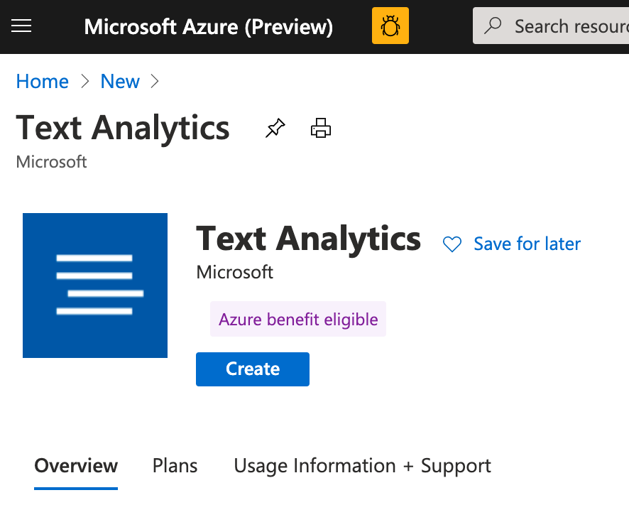
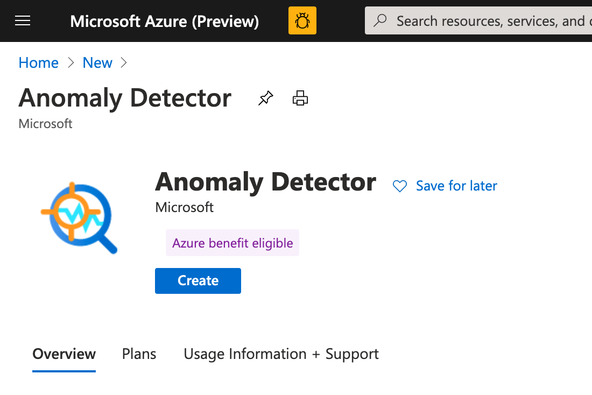
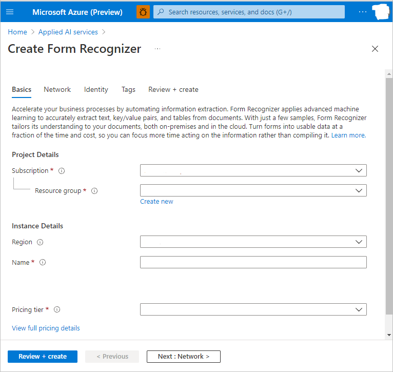
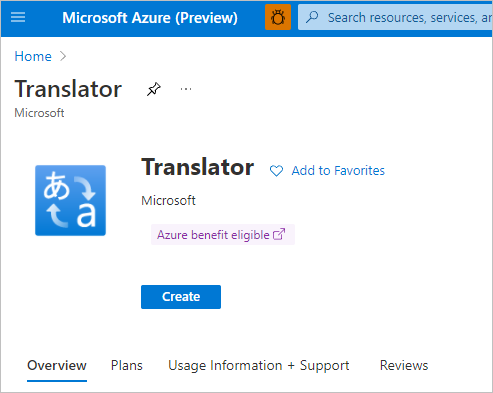
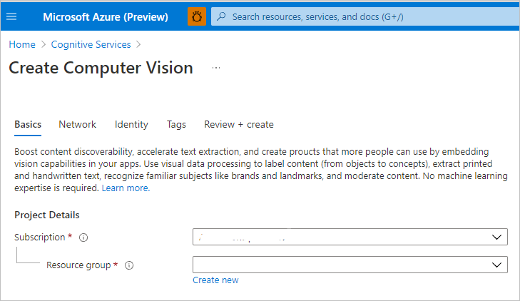
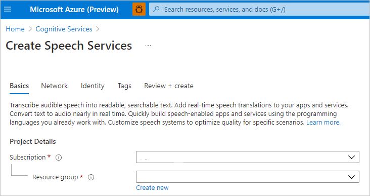
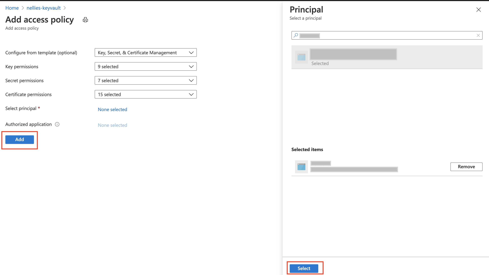
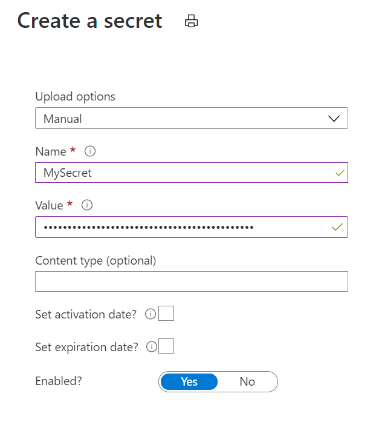
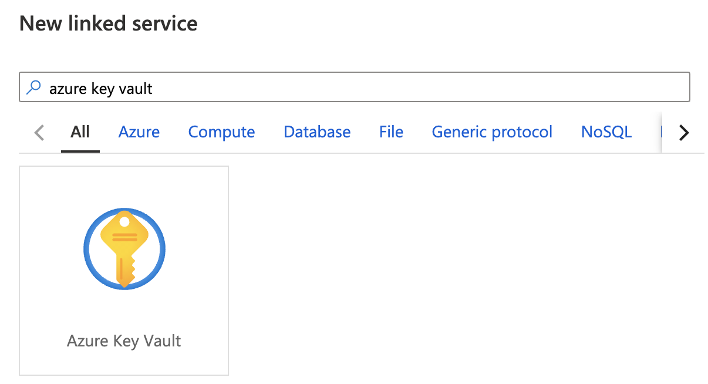
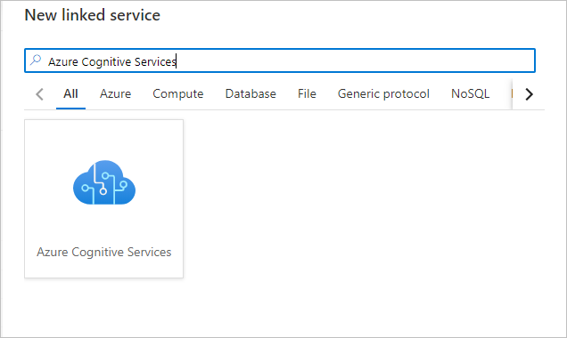

# Quickstart: Configure prerequisites for using Azure AI services in Azure Synapse Analytics

In this quickstart, you'll learn how set up the prerequisites for securely using Azure AI services in Azure Synapse Analytics. Linking these Azure AI services allows you to leverage Azure AI services from various experiences in Synapse.

This quickstart covers:
> [!div class="checklist"]
> - Create an Azure AI services resource like Text Analytics or Anomaly Detector.
> - Store an authentication key to Azure AI services resources as secrets in Azure Key Vault, and configure access for an Azure Synapse Analytics workspace.
> - Create an Azure Key Vault linked service in your Azure Synapse Analytics workspace.
> - Create an Azure AI services linked service in your Azure Synapse Analytics workspace.

If you don't have an Azure subscription, [create a free account before you begin](https://azure.microsoft.com/free/).

## Prerequisites

- [Azure Synapse Analytics workspace](../get-started-create-workspace.md) with an Azure Data Lake Storage Gen2 storage account configured as the default storage. You need to be the *Storage Blob Data Contributor* of the Azure Data Lake Storage Gen2 file system that you work with.

## Sign in to the Azure portal

Sign in to the [Azure portal](https://portal.azure.com/).

## Create an Azure AI services resource

[Azure AI services](../../ai-services/index.yml) includes many types of services. Follow services are examples used in the Azure Synapse tutorials.

You can create a [Text Analytics](https://portal.azure.com/#create/Microsoft.CognitiveServicesTextAnalytics) resource in the Azure portal:

You can create an [Anomaly Detector](https://portal.azure.com/#create/Microsoft.CognitiveServicesAnomalyDetector) resource in the Azure portal:

You can create an [Azure AI Document Intelligence](https://portal.azure.com/#create/Microsoft.CognitiveServicesFormRecognizer) resource (for Document Intelligence) in the Azure portal:

You can create a [Translator](https://portal.azure.com/#create/Microsoft.CognitiveServicesTextTranslation) resource in the Azure portal:

You can create a [Computer Vision](https://portal.azure.com/#create/Microsoft.CognitiveServicesComputerVision) resource in the Azure portal:

You can create a [Face](https://portal.azure.com/#create/Microsoft.CognitiveServicesFace) resource in the Azure portal:

You can create a [Speech](https://portal.azure.com/#create/Microsoft.CognitiveServicesSpeechServices) resource in the Azure portal:

## Create a key vault and configure secrets and access

1. Create a [key vault](https://portal.azure.com/#create/Microsoft.KeyVault) in the Azure portal.
2. Go to **Key Vault** > **Access policies**, and grant the [Azure Synapse workspace MSI](../../data-factory/data-factory-service-identity.md?context=/azure/synapse-analytics/context/context&tabs=synapse-analytics) permissions to read secrets from Azure Key Vault.

   > [!NOTE]
   > Make sure that the policy changes are saved. This step is easy to miss.

   

3. Go to your Azure AI services resource. For example, go to **Anomaly Detector** > **Keys and Endpoint**. Then copy either of the two keys to the clipboard.

4. Go to **Key Vault** > **Secret** to create a new secret. Specify the name of the secret, and then paste the key from the previous step into the **Value** field. Finally, select **Create**.

   

   > [!IMPORTANT]
   > Make sure you remember or note down this secret name. You'll use it later when you create the Azure AI services linked service.

## Create an Azure Key Vault linked service in Azure Synapse

1. Open your workspace in Synapse Studio. 
2. Go to **Manage** > **Linked Services**. Create an **Azure Key Vault** linked service by pointing to the key vault that you just created. 
3. Verify the connection by selecting the **Test connection** button. If the connection is green, select **Create** and then select **Publish all** to save your change.

## Create an Azure AI linked service in Azure Synapse

1. Open your workspace in Synapse Studio.
2. Go to **Manage** > **Linked Services**. Create an **Azure Cognitive Services** linked service by pointing to the Azure AI service that you just created. 
3. Verify the connection by selecting the **Test connection** button. If the connection is green, select **Create** and then select **Publish all** to save your change.

You're now ready to continue with one of the tutorials for using the Azure AI services experience in Synapse Studio.

## Next steps

- [Tutorial: Sentiment analysis with Azure AI services](tutorial-cognitive-services-sentiment.md)
- [Tutorial: Anomaly detection with Azure AI services](tutorial-cognitive-services-sentiment.md)
- [Tutorial: Machine learning model scoring in Azure Synapse dedicated SQL Pools](tutorial-sql-pool-model-scoring-wizard.md).
- [Machine Learning capabilities in Azure Synapse Analytics](what-is-machine-learning.md)
