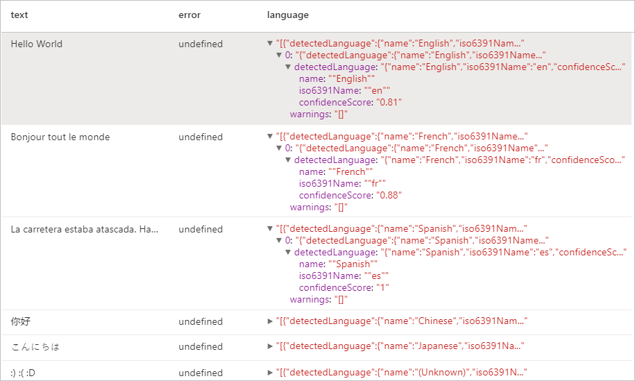
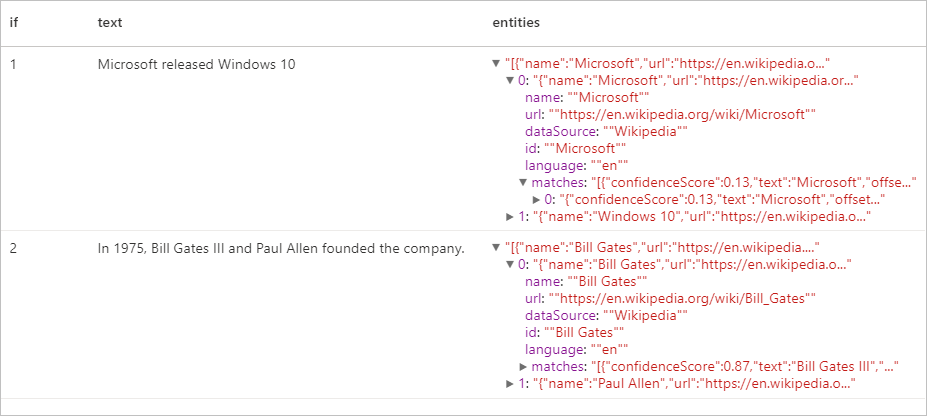
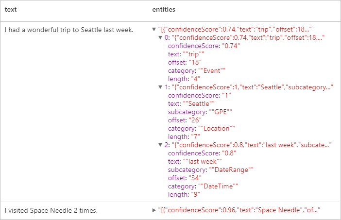
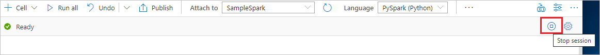

# Tutorial: Text Analytics with Azure AI services

[Text Analytics](../../ai-services/language-service/index.yml) is an [Azure AI services](../../ai-services/index.yml) that enables you to perform  text mining and text analysis with Natural Language Processing (NLP) features. In this tutorial, you'll learn how to use [Text Analytics](../../ai-services/language-service/index.yml) to analyze unstructured text on Azure Synapse Analytics.

This tutorial demonstrates using text analytics with [SynapseML](https://github.com/microsoft/SynapseML) to:

> [!div class="checklist"]
> - Detect sentiment labels at the sentence or document level
> - Identify the language for a given text input
> - Recognize entities from a text with links to a well-known knowledge base
> - Extract key phases from a text
> - Identify different entities in text and categorize them into pre-defined classes or types
> - Identify and redact sensitive entities in a given text

If you don't have an Azure subscription, [create a free account before you begin](https://azure.microsoft.com/free/).

## Prerequisites

- [Azure Synapse Analytics workspace](../get-started-create-workspace.md) with an Azure Data Lake Storage Gen2 storage account configured as the default storage. You need to be the *Storage Blob Data Contributor* of the Data Lake Storage Gen2 file system that you work with.
- Spark pool in your Azure Synapse Analytics workspace. For details, see [Create a Spark pool in Azure Synapse](../quickstart-create-sql-pool-studio.md).
- Pre-configuration steps described in the tutorial [Configure Azure AI services in Azure Synapse](tutorial-configure-cognitive-services-synapse.md).


## Get started
Open Synapse Studio and create a new notebook. To get started, import [SynapseML](https://github.com/microsoft/SynapseML). 

```python
import synapse.ml
from synapse.ml.cognitive import *
from pyspark.sql.functions import col
```

## Configure text analytics

Use the linked text analytics you configured in the [pre-configuration steps](tutorial-configure-cognitive-services-synapse.md) . 

```python
ai_service_name = "<Your linked service for text analytics>"
```

## Text Sentiment
The Text Sentiment Analysis provides a way for detecting the sentiment labels (such as "negative", "neutral" and "positive") and confidence scores at the sentence and document-level. See the [Supported languages in Text Analytics API](../../ai-services/language-service/language-detection/overview.md?tabs=sentiment-analysis) for the list of enabled languages.

```python

# Create a dataframe that's tied to it's column names
df = spark.createDataFrame([
  ("I am so happy today, its sunny!", "en-US"),
  ("I am frustrated by this rush hour traffic", "en-US"),
  ("The Azure AI services on spark aint bad", "en-US"),
], ["text", "language"])

# Run the Text Analytics service with options
sentiment = (TextSentiment()
    .setLinkedService(linked_service_name)
    .setTextCol("text")
    .setOutputCol("sentiment")
    .setErrorCol("error")
    .setLanguageCol("language"))

# Show the results of your text query in a table format
results = sentiment.transform(df)

display(results
    .withColumn("sentiment", col("sentiment").getItem("document").getItem("sentences")[0].getItem("sentiment"))
    .select("text", "sentiment"))

```
### Expected results

|text|sentiment|
|---|---|
|I am so happy today, its sunny!|positive|
|I am frustrated by this rush hour traffic|negative|
|The Azure AI services on spark aint bad|positive|

---

## Language Detector

The Language Detector evaluates text input for each document and returns language identifiers with a score that indicates the strength of the analysis. This capability is useful for content stores that collect arbitrary text, where language is unknown. See the [Supported languages in Text Analytics API](../../ai-services/language-service/language-detection/overview.md?tabs=language-detection) for the list of enabled languages.

```python
# Create a dataframe that's tied to it's column names
df = spark.createDataFrame([
  ("Hello World",),
  ("Bonjour tout le monde",),
  ("La carretera estaba atascada. Había mucho tráfico el día de ayer.",),
  ("你好",),
  ("こんにちは",),
  (":) :( :D",)
], ["text",])

# Run the Text Analytics service with options
language = (LanguageDetector()
    .setLinkedService(linked_service_name)
    .setTextCol("text")
    .setOutputCol("language")
    .setErrorCol("error"))

# Show the results of your text query in a table format
display(language.transform(df))
```
### Expected results

---

## Entity Detector
The Entity Detector returns a list of recognized entities with links to a well-known knowledge base. See the [Supported languages in Text Analytics API](../../ai-services/language-service/language-detection/overview.md?tabs=entity-linking) for the list of enabled languages.

```python
df = spark.createDataFrame([
    ("1", "Microsoft released Windows 10"),
    ("2", "In 1975, Bill Gates III and Paul Allen founded the company.")
], ["if", "text"])

entity = (EntityDetector()
    .setLinkedService(linked_service_name)
    .setLanguage("en")
    .setOutputCol("replies")
    .setErrorCol("error"))

display(entity.transform(df).select("if", "text", col("replies").getItem("document").getItem("entities").alias("entities")))
```
### Expected results


---

## Key Phrase Extractor

The Key Phrase Extraction evaluates unstructured text and returns a list of key phrases. This capability is useful if you need to quickly identify the main points in a collection of documents. See the [Supported languages in Text Analytics API](../../ai-services/language-service/language-detection/overview.md?tabs=key-phrase-extraction) for the list of enabled languages.

```python
df = spark.createDataFrame([
    ("en", "Hello world. This is some input text that I love."),
    ("fr", "Bonjour tout le monde"),
    ("es", "La carretera estaba atascada. Había mucho tráfico el día de ayer.")
], ["lang", "text"])

keyPhrase = (KeyPhraseExtractor()
    .setLinkedService(linked_service_name)
    .setLanguageCol("lang")
    .setOutputCol("replies")
    .setErrorCol("error"))

display(keyPhrase.transform(df).select("text", col("replies").getItem("document").getItem("keyPhrases").alias("keyPhrases")))
```

### Expected results

|text|keyPhrases|
|---|---|
|Hello world. This is some input text that I love.|"["Hello world","input text"]"|
|Bonjour tout le monde|"["Bonjour","monde"]"|
|La carretera estaba atascada. Había mucho tráfico el día de ayer.|"["mucho tráfico","día","carretera","ayer"]"|

---

## Named Entity Recognition (NER)

Named Entity Recognition (NER) is the ability to identify different entities in text and categorize them into pre-defined classes or types such as: person, location, event, product, and organization. See the [Supported languages in Text Analytics API](../../ai-services/language-service/language-detection/overview.md?tabs=named-entity-recognition) for the list of enabled languages.

```python
df = spark.createDataFrame([
    ("1", "en", "I had a wonderful trip to Seattle last week."),
    ("2", "en", "I visited Space Needle 2 times.")
], ["id", "language", "text"])

ner = (NER()
    .setLinkedService(linked_service_name)
    .setLanguageCol("language")
    .setOutputCol("replies")
    .setErrorCol("error"))

display(ner.transform(df).select("text", col("replies").getItem("document").getItem("entities").alias("entities")))
```
### Expected results


---

## Personally Identifiable Information (PII) V3.1
The PII feature is part of NER and it can identify and redact sensitive entities in text that are associated with an individual person such as: phone number, email address, mailing address, passport number. See the [Supported languages in Text Analytics API](../../ai-services/language-service/language-detection/overview.md?tabs=pii) for the list of enabled languages.

```python
df = spark.createDataFrame([
    ("1", "en", "My SSN is 859-98-0987"),
    ("2", "en", "Your ABA number - 111000025 - is the first 9 digits in the lower left hand corner of your personal check."),
    ("3", "en", "Is 998.214.865-68 your Brazilian CPF number?")
], ["id", "language", "text"])

pii = (PII()
    .setLinkedService(linked_service_name)
    .setLanguageCol("language")
    .setOutputCol("replies")
    .setErrorCol("error"))

display(pii.transform(df).select("text", col("replies").getItem("document").getItem("entities").alias("entities")))
```
### Expected results


---

## Clean up resources
To ensure the Spark instance is shut down, end any connected sessions(notebooks). The pool shuts down when the **idle time** specified in the Apache Spark pool is reached. You can also select **stop session** from the status bar at the upper right of the notebook.



## Next steps

* [Check out Synapse sample notebooks](https://github.com/Azure-Samples/Synapse/tree/main/MachineLearning) 
* [SynapseML GitHub Repo](https://github.com/microsoft/SynapseML)
