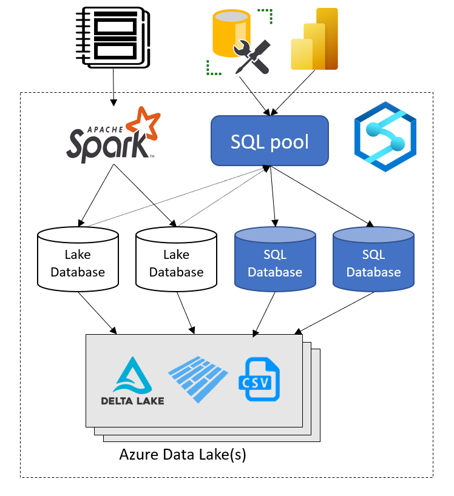

# Access lake databases using serverless SQL pool in Azure Synapse Analytics

The Azure Synapse Analytics workspace enables you to create two types of databases on top of a Spark data lake: 

- **Lake databases** where you can define tables on top of lake data using Apache Spark notebooks, database templates, or Microsoft Dataverse (previously Common Data Service). These tables will be available for querying using T-SQL (Transact-SQL) language using the serverless SQL pool. 
- **SQL databases** where you can define your own databases and tables directly using the serverless SQL pools. You can use T-SQL CREATE DATABASE, CREATE EXTERNAL TABLE to define the objects and add additional SQL views, procedures, and inline-table-value functions on top of the tables. 



This article focuses on [lake databases](../database-designer/concepts-lake-database.md) in a serverless SQL pool in Azure Synapse Analytics.

Azure Synapse Analytics allows you to create lake databases and tables using Spark or database designer, and then analyze data in the lake databases using the serverless SQL pool. The lake databases and the tables (parquet or CSV-backed) that are created on the Apache Spark pools, [database templates](../database-designer/concepts-database-templates.md), or Dataverse are automatically available for querying with the serverless SQL pool engine. The lake databases and tables that are modified will be available in serverless SQL pool after some time. There will be a delay until the changes made in Spark or Database designed appear in serverless.

## Manage lake database

To manage Spark created lake databases, you can use Apache Spark pools or [Database designer](../database-designer/create-empty-lake-database.md). For example, create or delete a lake database through a Spark pool job. You can't create a lake database or the objects in the lake databases using the serverless SQL pool.

The Spark `default` database is available in the serverless SQL pool context as a lake database called `default`.

>[!NOTE]
> You cannot create a lake and a SQL database in the serverless SQL pool with the same name. 

Tables in the lake databases cannot be modified from a serverless SQL pool. Use the [Database designer](../database-designer/modify-lake-database.md) or Apache Spark pools to modify a lake database. The serverless SQL pool enables you to make the following changes in a lake database using Transact-SQL commands:

- Adding, altering, and dropping views, procedures, inline table-value functions in a lake database.
- Adding and removing database-scoped Microsoft Entra users.
- Add or remove Microsoft Entra database users to the **db_datareader** role. Microsoft Entra database users in the **db_datareader** role have permission to read all tables in the lake database, but cannot read data from other databases.

## Security model

The lake databases and tables are secured at two levels:

- The underlying storage layer by assigning to Microsoft Entra users one of the following: 
    - Azure role-based access control (Azure RBAC) 
    - Azure attribute-based access control (Azure ABAC) role
    - ACL permissions
- The SQL layer where you can define a Microsoft Entra user and grant SQL permissions to SELECT data from tables referencing the lake data.

## Lake security model

Access to lake database files is controlled using the lake permissions on storage layer. Only Microsoft Entra users can use tables in the lake databases, and they can access the data in the lake using their own identities.

You can grant access to the underlying data used for external tables to a security principal, such as: a user, a Microsoft Entra application with [assigned service principal](../../active-directory/develop/howto-create-service-principal-portal.md), or a security group. For data access, grant both of the following permissions:

- Grant `read (R)` permission on files (such as the table's underlying data files).
- Grant `execute (X)` permission on the folder where the files are stored and on every parent folder up to the root. You can read more about these permissions on [Access control lists(ACLs)](../../storage/blobs/data-lake-storage-access-control.md) page. 

For example, in `https://<storage-name>.dfs.core.windows.net/<fs>/synapse/workspaces/<synapse_ws>/warehouse/mytestdb.db/myparquettable/`, security principals need:

- `execute (X)` permissions on all the folders starting at the `<fs>` to the `myparquettable`.
- `read (R)` permissions on `myparquettable` and files inside that folder, to be able to read a table in a database (synchronized or original one).

If a security principal requires the ability to create objects or drop objects in a database, additional `write (W)` permissions are required on the folders and files in the `warehouse` folder. Modifying objects in a database is not possible from serverless SQL pool, only from Spark pools or the [database designer](../database-designer/modify-lake-database.md).

### SQL security model

The Azure Synapse workspace provides a T-SQL endpoint that enables you to query the lake database using the serverless SQL pool. In addition to the data access, SQL interface enables you to control who can access the tables. You need to enable a user to access the shared lake databases using the serverless SQL pool. There are two types of users who can access the lake databases:

- Administrators: Assign the **Synapse SQL Administrator** workspace role or **sysadmin** server-level role inside the serverless SQL pool. This role has full control over all databases. The **Synapse Administrator** and **Synapse SQL Administrator** roles also have all permissions on all objects in a serverless SQL pool, by default. 
- Workspace readers: Grant the server-level permissions **GRANT CONNECT ANY DATABASE** and **GRANT SELECT ALL USER SECURABLES** on serverless SQL pool to a login that will enable the login to access and read any database. This might be a good choice for assigning reader/non-admin access to a user.
- Database readers: Create database users from Microsoft Entra ID in your lake database and add them to **db_datareader** role, which will enable them to read data in the lake database.

Learn more about [setting access control on shared databases here](../sql/shared-databases-access-control.md).

## Custom SQL objects in lake databases

Lake databases allow creation of custom T-SQL objects, such as schemas, procedures, views, and the inline table-value functions (iTVFs). In order to create custom SQL objects, you **MUST** create a schema where you will place the objects. Custom SQL objects cannot be placed in `dbo` schema because it is reserved for the lake tables that are defined in Spark, database designer, or Dataverse.

> [!IMPORTANT]
> You must create custom SQL schema where you will place your SQL objects. The custom SQL objects cannot be placed in the `dbo` schema. The `dbo` schema is reserved for the lake tables that are originally created in Spark or database designer.

## Examples

### Create SQL database reader in lake database

In this example, we are adding a Microsoft Entra user in the lake database who can read data via shared tables. The users are added in the lake database via the serverless SQL pool. Then, assign the user to the **db_datareader** role so they can read data.

```sql
CREATE USER [customuser@contoso.com] FROM EXTERNAL PROVIDER;
GO
ALTER ROLE db_datareader
ADD MEMBER [customuser@contoso.com];
```

### Create workspace-level data reader

A login with `GRANT CONNECT ANY DATABASE` and `GRANT SELECT ALL USER SECURABLES` permissions is able to read all tables using the serverless SQL pool, but not able to create SQL databases or modify the objects in them.

```sql
CREATE LOGIN [wsdatareader@contoso.com] FROM EXTERNAL PROVIDER
GRANT CONNECT ANY DATABASE TO [wsdatareader@contoso.com]
GRANT SELECT ALL USER SECURABLES TO [wsdatareader@contoso.com]
```

This script enables you to create users without admin privileges who can read any table in Lake databases.

### Create and connect to Spark database with serverless SQL pool

First, create a new Spark database named `mytestdb` using a Spark cluster you have already created in your workspace. You can achieve that, for example, using a Spark C# Notebook with the following .NET for Spark statement:

```csharp
spark.Sql("CREATE DATABASE mytestlakedb")
```

After a short delay, you can see the lake database from serverless SQL pool. For example, run the following statement from serverless SQL pool.

```sql
SELECT * FROM sys.databases;
```

Verify that `mytestlakedb` is included in the results.

### Create custom SQL objects in lake database

The following example shows how to create a custom view, procedure, and inline table-value function (iTVF) in the `reports` schema:

```sql
CREATE SCHEMA reports
GO

CREATE OR ALTER VIEW reports.GreenReport
AS SELECT puYear, puMonth,
            fareAmount = SUM(fareAmount),
            tipAmount = SUM(tipAmount),
            mtaTax = SUM(mtaTax)
FROM dbo.green
GROUP BY puYear, puMonth
GO

CREATE OR ALTER PROCEDURE reports.GreenReportSummary
AS BEGIN
SELECT puYear, puMonth,
            fareAmount = SUM(fareAmount),
            tipAmount = SUM(tipAmount),
            mtaTax = SUM(mtaTax)
FROM dbo.green
GROUP BY puYear, puMonth
END
GO

CREATE OR ALTER FUNCTION reports.GreenDataReportMonthly(@year int)
RETURNS TABLE
RETURN ( SELECT puYear = @year, puMonth,
                fareAmount = SUM(fareAmount),
                tipAmount = SUM(tipAmount),
                mtaTax = SUM(mtaTax)
        FROM dbo.green
        WHERE puYear = @year
        GROUP BY puMonth )
GO
```


## Next steps

- [Learn more about Azure Synapse Analytics' shared metadata](overview.md)
- [Learn more about Azure Synapse Analytics' shared metadata Tables](table.md)
- [Quickstart: Create a new lake database leveraging database templates](../database-designer/quick-start-create-lake-database.md)
- [Tutorial: Use serverless SQL pool with Power BI Desktop & create a report](../sql/tutorial-connect-power-bi-desktop.md)
- [Synchronize Apache Spark for Azure Synapse external table definitions in serverless SQL pool](../sql/develop-storage-files-spark-tables.md)
- [Tutorial: Explore and Analyze data lakes with serverless SQL pool](../sql/tutorial-data-analyst.md)
 
