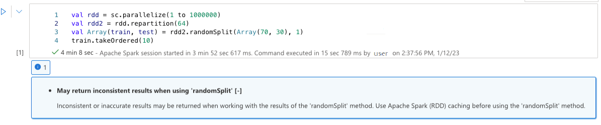
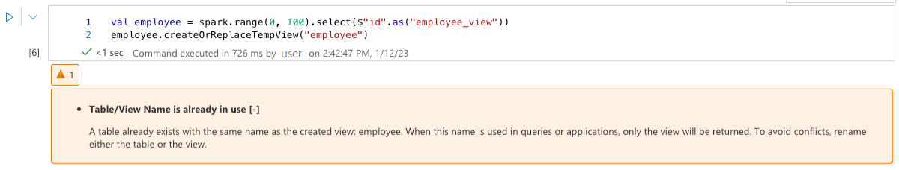
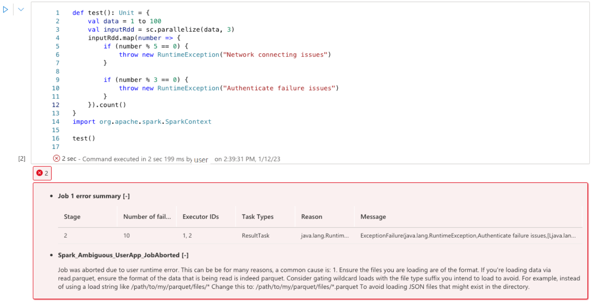

# Apache Spark Advisor in Azure Synapse Analytics (Preview)

The Apache Spark advisor analyzes commands and code run by Spark and displays real-time advice for Notebook runs. The Spark advisor has built-in patterns to help users avoid common mistakes, offer recommendations for code optimization, perform error analysis, and locate the root cause of failures.

## Built-in advice

#### May return inconsistent results when using 'randomSplit'
Inconsistent or inaccurate results may be returned when working with the results of the 'randomSplit' method. Use Apache Spark (RDD) caching before using the 'randomSplit' method.

Method randomSplit() is equivalent to performing sample() on your data frame multiple times, with each sample refetching, partitioning, and sorting your data frame within partitions. The data distribution across partitions and sorting order is important for both randomSplit() and sample(). If either changes upon data refetch, there may be duplicates, or missing values across splits and the same sample using the same seed may produce different results.

These inconsistencies may not happen on every run, but to eliminate them completely, cache your data frame, repartition on a column(s), or apply aggregate functions such as groupBy.

#### Table/view name is already in use
A view already exists with the same name as the created table, or a table already exists with the same name as the created view. 
When this name is used in queries or applications, only the view will be returned no matter which one created first. To avoid conflicts, rename either the table or the view. 

#### Unable to recognize a hint
The selected query contains a hint that isn't recognized. Verify that the hint is spelled correctly.

```scala
spark.sql("SELECT /*+ unknownHint */ * FROM t1")
```

#### Unable to find a specified relation name(s)
Unable to find the relation(s) specified in the hint. Verify that the relation(s) are spelled correctly and accessible within the scope of the hint.

```scala
spark.sql("SELECT /*+ BROADCAST(unknownTable) */ * FROM t1 INNER JOIN t2 ON t1.str = t2.str")
```

#### A hint in the query prevents another hint from being applied
The selected query contains a hint that prevents another hint from being applied.

```scala
spark.sql("SELECT /*+ BROADCAST(t1), MERGE(t1, t2) */ * FROM t1 INNER JOIN t2 ON t1.str = t2.str")
```

#### Enable 'spark.advise.divisionExprConvertRule.enable' to reduce rounding error propagation
This query contains the expression with Double type. We recommend that you enable the configuration 'spark.advise.divisionExprConvertRule.enable', which can help reduce the division expressions and to reduce the rounding error propagation.

```text
"t.a/t.b/t.c" convert into "t.a/(t.b * t.c)"
```

#### Enable 'spark.advise.nonEqJoinConvertRule.enable' to improve query performance
This query contains time consuming join due to "Or" condition within query. We recommend that you enable the configuration 'spark.advise.nonEqJoinConvertRule.enable', which can help to convert the join triggered by "Or" condition to SMJ or BHJ to accelerate this query.

#### Optimize delta table with small files compaction

This query is on a delta table with many small files. To improve the performance of queries, run the OPTIMIZE command on the delta table. More details could be found within this [article](https://aka.ms/small-file-advise-delta).  

#### Optimize Delta table with ZOrder

This query is on a Delta table and contains a highly selective filter. To improve the performance of queries, run the OPTIMIZE ZORDER BY command on the delta table. More details could be found within this [article](https://aka.ms/small-file-advise-delta). 

## User Experience

The Apache Spark advisor displays the advices, including info, warning and errors, at Notebook cell output real-time.

* Info

    

* Warning

    

* Errors
 
    

## Next steps

For more information on monitoring Apache Spark applications, see the [Monitor Apache Spark applications using Synapse Studio](apache-spark-applications.md) article.

For more information to create a notebook, see the [How to use Synapse notebooks](../spark/apache-spark-development-using-notebooks.md)
