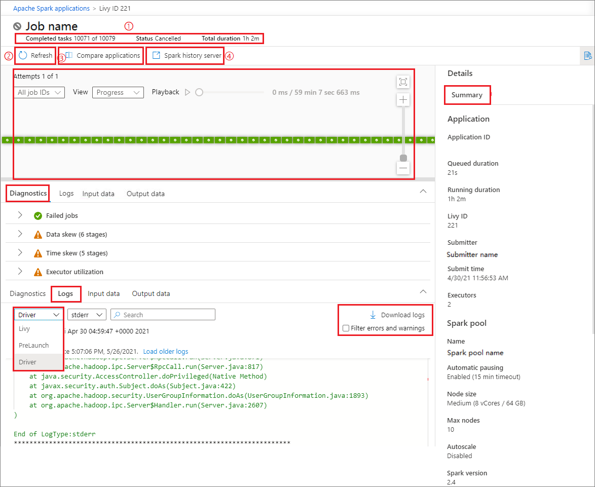

# Use Synapse Studio to monitor your Apache Spark applications

With Azure Synapse Analytics, you can use Apache Spark to run notebooks, jobs, and other kinds of applications on your Apache Spark pools in your workspace.

This article explains how to monitor your Apache Spark applications, allowing you to keep an eye on the latest status, issues, and progress.

This tutorial covers the following tasks:

* Monitor running Apache Spark Application
* View completed Apache Spark Application
* View canceled Apache Spark Application
* Debug failed Apache Spark Application

## Prerequisites

Before you start with this tutorial, make sure to meet the following requirements:

- A Synapse Studio workspace. For instructions, see [Create a Synapse Studio workspace](https://docs.microsoft.com/azure/machine-learning/how-to-manage-workspace#create-a-workspace).

- A serverless Apache Spark pool.

## Monitor running Apache Spark application

Open **Monitor**, then select **Apache Spark applications**. To view the details about the Apache Spark applications that are running, select the submitting Apache Spark application and view the details. If the Apache Spark application is still running, you can monitor the progress.

  

1. Check the **Completed tasks**, **Status**, and **Total duration**.

2. **Cancel** the Apache Spark application.

3. **Refresh** Log query.

4. Click on **Spark UI** button to go to Spark Job page.

5. View the graph. You can see an overview of your job in the generated job graph. Refer to Step 6，7，8，9，10 of [View completed Apache Spark application](#view-completed-apache-spark-application).

6. Check the **Summary** info.

7. Check the diagnostics in **Diagnostic** tab.

8. Check the **Logs** in this tab. You can select different type of logs from the drop-down list, and you can download the log info by clicking **Download logs**, and check the checkbox of **Filter errors and warnings** to filter the errors and warnings you need.

    

## View completed Apache Spark application

Open **Monitor**, then select **Apache Spark applications**. To view the details about the completed Apache Spark applications, select the Apache Spark application and view the details.

  

1. Check the **Completed tasks**, **Status**, and **Total duration**.

2. Refresh Log query.

3. Open Apache Spark history server link by clicking **Spark history server**.

4. Check the **Summary** info.

5. Check the **Logs**. You can select different type of logs from the drop-down list, and you can download the log info by clicking **Download logs**, and check the checkbox of **Filter errors and warnings** to filter the errors and warnings you need.

6. You can see an overview of your job in the generated job graph. By default, the graph shows all jobs. You can filter this view by **Job ID**.

7. By default, the **Progress** display is selected. You can check the data flow by selecting **Progress**/**Read**/**Written**/**Duration** in the **Display** dropdown list.

8. To playback the job, click on **Playback** button. You can click on **Stop** button at any time to stop.

9. Use mouse scroll or scroll bar to zoom in and zoom out the job graph, you can also select **Zoom to Fit** to make it fit the screen.

10. The job graph node displays the following information of each stage:

    * ID.

    * Name or description.

    * Total task number.

    * Data read: the sum of input size and shuffle read size.

    * Data write: the sum of output size and shuffle writes size.

    * Execution time: the time between start time of the first attempt and completion time of the last attempt.

    * Row count: the sum of input records, output records, shuffle read records and shuffle write records.

    * Progress.

     
    
11. Click on **View details** in the graph, then the details for stage will show out.

    

## View canceled Apache Spark application

Open **Monitor**, then select **Apache Spark applications**. To view the details about the canceled Apache Spark applications, select the Apache Spark application and view the details.

  

1. Check the **Completed tasks**, **Status**, and **Total duration**.

2. Refresh the Log query.

3. Open Apache history server link by clicking **Spark history server**.

4. View the graph. You can see an overview of your job in the generated job graph. Refer to Step 6，7，8，9，10 of [View completed Apache Spark application](#view-completed-apache-spark-application).

5. Check the **Summary** info.

6. Check the **Logs**. You can select different type of logs from the drop-down list, and you can download the log info by clicking **Download** logs, and check the checkbox of **Filter errors and warnings** to filter the errors and warnings you need.

7. Click on **View details** in the graph, then the details for stage will show out.

   

## Debug failed Apache Spark application

Open **Monitor**, then select **Apache Spark applications**. To view the details about the failed Apache Spark applications, select the Apache Spark application and view the details.

1. Check the **Completed tasks**, **Status**, and **Total duration**.

2. Refresh Log query.

3. Open Apache Spark history server link by clicking **Spark history server**.

4. View the graph. You can see an overview of your job in the generated job graph. Refer to Step 6，7，8，9，10 of [View completed Apache Spark application](#view-completed-apache-spark-application)

5. Check the **Summary** info.

6. Check the error info.

   

## Next steps

For more information on monitoring pipeline runs, see the [Monitor pipeline runs using Synapse Studio](how-to-monitor-pipeline-runs.md) article.  
