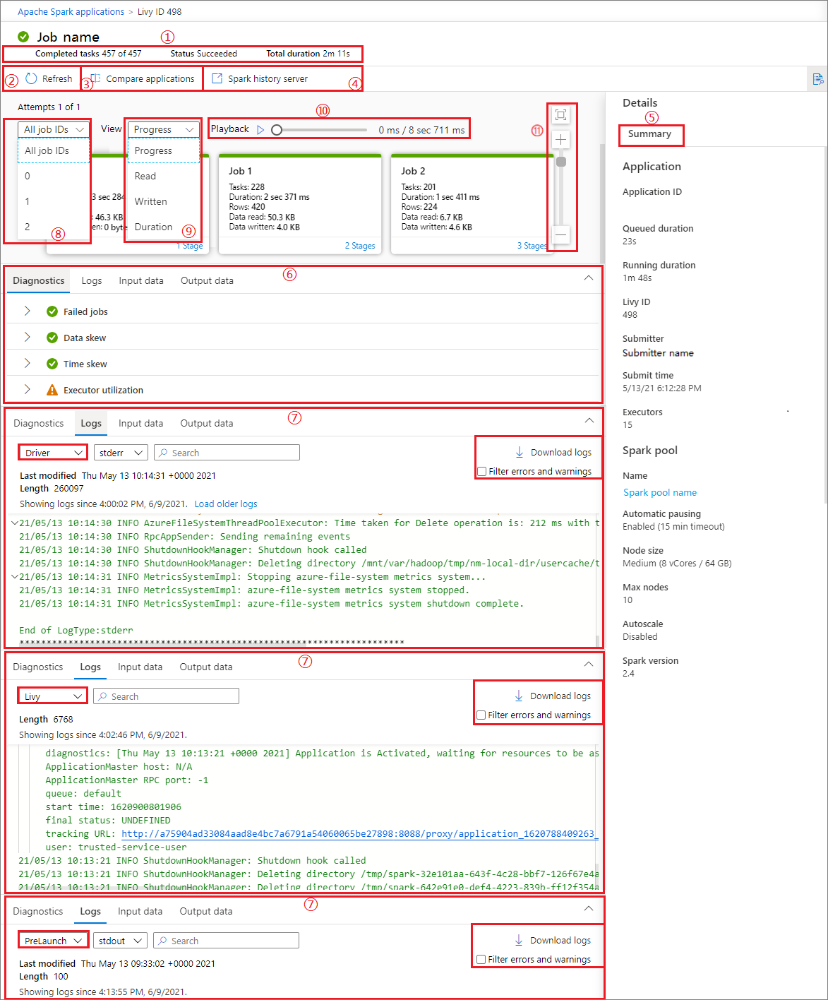
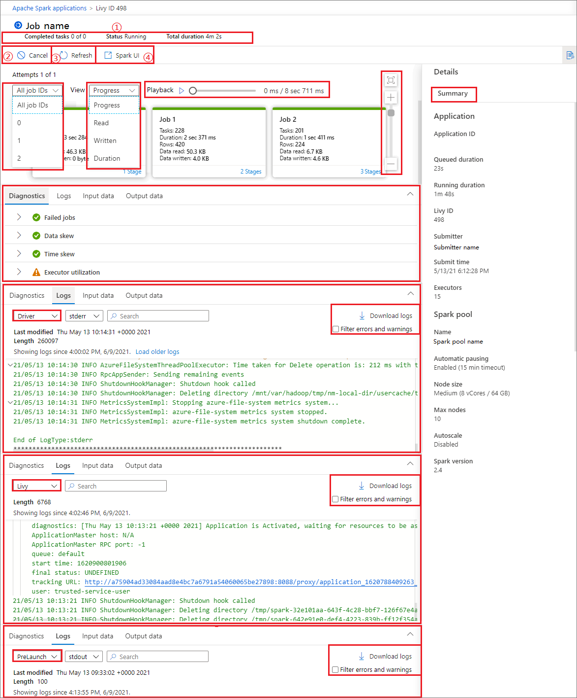

# Use Synapse Studio to monitor your Apache Spark applications

With Azure Synapse Analytics, you can use Apache Spark to run notebooks, jobs, and other kinds of applications on your Apache Spark pools in your workspace.

This article explains how to monitor your Apache Spark applications, allowing you to keep an eye on the latest status, issues, and progress.

## View Apache Spark applications 

You can view all Apache Spark applications from **Monitor** -> **Apache Spark applications**.

  

## View completed Apache Spark applications

Open **Monitor**, then select **Apache Spark applications**. To view the details about the completed Apache Spark applications, select the Apache Spark application.

  

1. Check the **Completed tasks**, **Status**, and **Total duration**.

2. **Refresh** the job.

3. Click on **Compare applications** to use the comparison feature, for more information on this feature, see the [**Compare Apache Spark applications**](#compare-apache-spark-applications).

4. Click on **Spark history server** to open the History Server page.

5. Check the **Summary** info.

6. Check the diagnostics in **Diagnostic** tab.

7. Check the **Logs**. You can view full log of **Livy**, **Prelaunch**, and **Driver** logs via selecting different options in the drop-down list. And you can directly retrieve the required log information by searching keywords. Click **Download log** to download the log information to the local, and select the **Filter errors and warnings** check box to filter the errors and warnings you need.

8. You can see an overview of your job in the generated job graph. By default, the graph shows all jobs. You can filter this view by **Job ID**.

9. By default, the **Progress** display is selected. You can check the data flow by selecting **Progress**/**Read**/**Written**/**Duration** in the **View** dropdown list.

10. To play back the job, click on **Playback** button. You can click on **Stop** button at any time to stop.

11. Use scroll bar to zoom in and zoom out the job graph, you can also select **Zoom to Fit** to make it fit the screen.

  

12. The job graph node displays the following information of each stage:

    - Job ID
    - Task number
    - Duration time
    - Row count
    - Data read: the sum of input size and shuffle read size
    - Data written: the sum of output size and shuffle writes size
    - Stage number

       

13. Hover the mouse over a job, and the job details will be displayed in the tooltip:
    
    - Icon of job status: If the job status is successful, it will be displayed as a green "√"; if the job detects a problem, it will display a yellow "!"
    - Job ID
    - General part:
      - Progress
      - Duration time
      - Total tasks number
    - Data part:
      - Total rows number
      - Read size
      - Written size
    - Skew part:
      - Data skew
      - Time skew
    - Stage number

      

14. Click **Stage number** to expand all the stages contained in the job. Click **Collapse** next to the Job ID to collapse all the stages in the job.

15. Click on **View details** in a stage graph, then the details for a stage will appear.

    
    
## Monitor Apache Spark application progress

Open **Monitor**, then select **Apache Spark applications**. To view the details about the Apache Spark applications that are running, select the submitted Apache Spark application. If the Apache Spark application is still running, you can monitor the progress.

  

1. Check the **Completed tasks**, **Status**, and **Total duration**.

2. **Cancel** the Apache Spark application.

3. **Refresh** the Job.

4. Click on **Spark UI** button to go to Spark Job page.

5. For **Job graph**, **Summary**, **Diagnostics**, **Logs**. You can see an overview of your job in the generated job graph. Refer to steps 5 - 15 of [View completed Apache Spark applications](#view-completed-apache-spark-applications). 

  

## View canceled Apache Spark applications

Open **Monitor**, then select **Apache Spark applications**. To view the details about the canceled Apache Spark applications, select the Apache Spark application.

   

1. Check the **Completed tasks**, **Status**, and **Total duration**.

2. **Refresh** the Job.

3. Click on **Compare applications** to use the comparison feature, for more information on this feature, see the [**Compare Apache Spark applications**](#compare-apache-spark-applications).

4. Open Apache history server link by clicking **Spark history server**.

5. View the graph. You can see an overview of your job in the generated job graph. Refer to steps 5 - 15 of [View completed Apache Spark applications](#view-completed-apache-spark-applications).

  

## Debug failed Apache Spark application

Open **Monitor**, then select **Apache Spark applications**. To view the details about the failed Apache Spark applications, select the Apache Spark application.

  

1. Check the **Completed tasks**, **Status**, and **Total duration**.

2. **Refresh** the Job.

3. Click on **Compare applications** to use the comparison feature, for more information on this feature, see the [**Compare Apache Spark applications**](#compare-apache-spark-applications).

4. Open Apache history server link by clicking **Spark history server**.

5. View the graph. You can see an overview of your job in the generated job graph. Refer to steps 5 - 15 of [View completed Apache Spark applications](#view-completed-apache-spark-applications).

  

## View input data/output data

Select an Apache Spark application, and click on **Input data/Output data tab** to view dates of the input and output for Apache Spark application. This function can help you debug the Spark job. And the data source supports three storage methods: gen1, gen2, and blob.
    
**Input data tab**
     
1. Click on the **Copy input** button to paste the input file to the local.

2. Click the **Export to CSV** button to export the input file in CSV format.

3. You can search files by input keywords in **Search box** (keywords include file name, read format and path).

4. You can sort the input files by clicking **Name**, **Read format**, and **path**.

5. Use the mouse to hover over an input file, the icon of the **Download/Copy path/More** button will appear.

  

6. Click on **More** button. The **Copy path/Show in explorer/Properties** will appear in the context menu.
      
    

   * Copy path: can copy **Full path** and **Relative path**.
   * Show in explorer: can jump to the linked storage account (Data->Linked).
   * Properties: show the basic properties of the file (File name/File path/Read format/Size/Modified).

     

**Output data tab**

   Displays the same features as the input tab.

   

## Compare Apache Spark Applications

There are two ways to compare applications. You can compare by choosing **Compare Application**, or click the **Compare in notebook** button to view it in the notebook.

### Compare by application

Click on **Compare applications** button and choose an application to compare performance. You can see the difference between the two applications.

1. Use the mouse to hover over an application, and then the **Compare applications** icon is displayed.

2. Click on the **Compare applications** icon, and the Compare applications page will pop up.

3. Click on **Choose application** button to open **Choose comparison application** page.

4. When choosing the comparison application, you need to either enter the application URL, or choose from the recurring list. Then, click **OK** button. 

   

5. The comparison result will be displayed on the compare applications page.

   

### Compare in notebook

Click the **Compare in Notebook** button on the **Compare applications** page to open the notebook. The default name of the *.ipynb* file is **Recurrent Application Analytics**.

In the Notebook: Recurrent Application Analytics file, you can run it directly after setting the Spark pool and Language.

## Next steps

For more information on monitoring pipeline runs, see the [Monitor pipeline runs using Synapse Studio](how-to-monitor-pipeline-runs.md) article.
