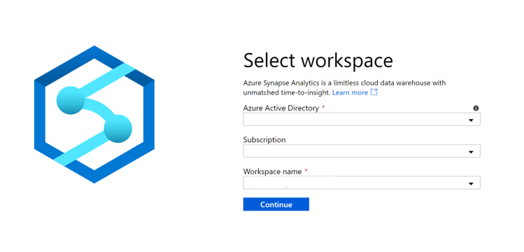
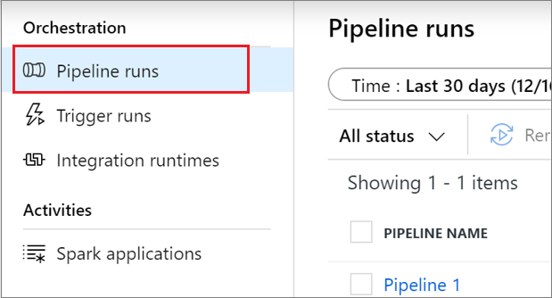
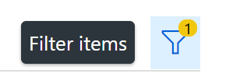
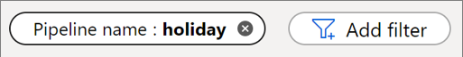

# Use Azure Synapse Studio to monitor your workspace pipeline runs

With Azure Synapse Analytics, you can create complex pipelines that can automate and orchestrate your data movement, data transformation, and compute activities within your solution. You can author and monitor these pipelines using Azure Synapse Studio (preview).

This article explains how to monitor your pipeline runs, which allows you to keep an eye on the latest status, issues, and progress of your pipelines.

## Access the list of pipeline runs

To see the list of pipeline runs in your workspace, first [open the Azure Synapse Studio](https://web.azuresynapse.net/) and select your workspace.

Once you've opened your workspace, select the **Monitor** section on the left.

Select **Pipeline runs** to view the list of pipeline runs.

## Filtering your pipeline runs

You can filter the list of pipeline runs to the ones you're interested in. The filters at the top of the screen allow you to specify a field on which you'd like to filter.

For example, you can filter the view to see only the pipeline runs for the pipeline named "holiday":

## Viewing details about a specific pipeline run

To view details about your pipeline run, select the pipeline run. Then view the activity runs associated with the pipeline run. If the pipeline is still running, you can monitor the progress. 
  
## Next steps

To learn more about monitoring applications, see the [Monitor Apache Spark applications](how-to-monitor-spark-applications.md) article. 
