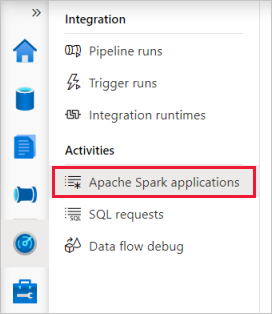
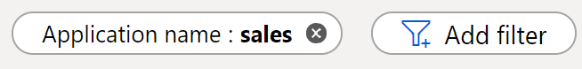

# Monitor your Apache Spark applications in Synapse Studio

With Azure Synapse Analytics, you can use Apache Spark to run notebooks, jobs, and other kinds of applications on your Apache Spark pools in your workspace.

This article explains how to monitor your Apache Spark applications, allowing you to keep an eye on the latest status, issues, and progress.

## Access Apache Spark applications list

To see the list of Apache Spark applications in your workspace, first [open the Synapse Studio](https://web.azuresynapse.net/) and select your workspace.

Once you've opened your workspace, select the **Monitor** section on the left.

Select **Apache Spark applications** to view the list of Apache Spark applications.

 

## Filter your Apache Spark applications

You can filter the list of Apache Spark applications to the ones you're interested in. The filters at the top of the screen allow you to specify a field on which you'd like to filter.

For example, you can filter the view to see only the Apache Spark applications that contain the name "sales":

## View details about a specific Apache Spark application

To view the details about one of your Apache Spark applications, select the Apache Spark application and view the details. If the Apache Spark application is still running, you can monitor the progress. [Read more](apache-spark-applications.md).

## Next steps

For more information on monitoring pipeline runs, see the [Monitor pipeline runs Synapse Studio](how-to-monitor-pipeline-runs.md) article. 

For more information on debugging Apache Spark application, see the [Monitor Apache Spark applications on Synapse Studio](apache-spark-applications.md) article.