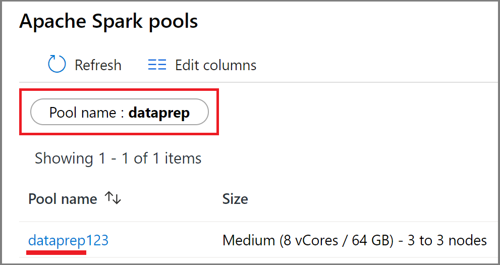
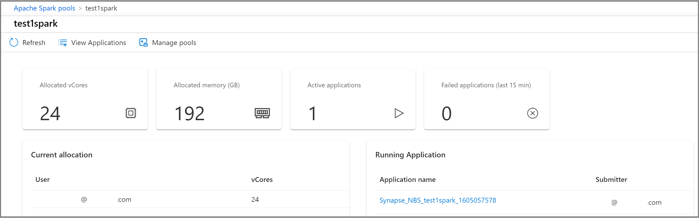

# Use Synapse Studio to monitor your Apache Spark pools

With Azure Synapse Analytics, you can use Apache Spark to run notebooks, jobs, and other kinds of applications on Apache Spark pools in your workspace.

This article explains how to monitor your Apache Spark pools, allowing you to keep an eye on the status of your pools, including how many vCores are in use by different workspace users.

## Access Apache Spark pools list

To see the list of Apache Spark pools in your workspace, first [open the Synapse Studio](https://web.azuresynapse.net/) and select your workspace.

Once you've opened your workspace, select the **Monitor** section on the left.

Select **Apache Spark pools** to view the list of Apache Spark pools.

 

## Filter your Apache Spark pools

You can filter the list of Apache Spark pools to the ones that interest you. The filters at the top of the screen allow you to specify a field on which you'd like to filter.

For example, you can filter the view to see only the Apache Spark pools containing the name "dataprep":

## View details about a specific Apache Spark pool

To view the details about one of your Apache Spark pools, select the Apache Spark pool to view the details.

## Next steps

For more information on monitoring pipeline runs, see the [Monitor pipeline runs in Synapse Studio](how-to-monitor-pipeline-runs.md) article. 

For more information on monitoring Apache Spark applications, see the [Monitor Apache Spark applications in Synapse Studio](how-to-monitor-spark-applications.md) article.
