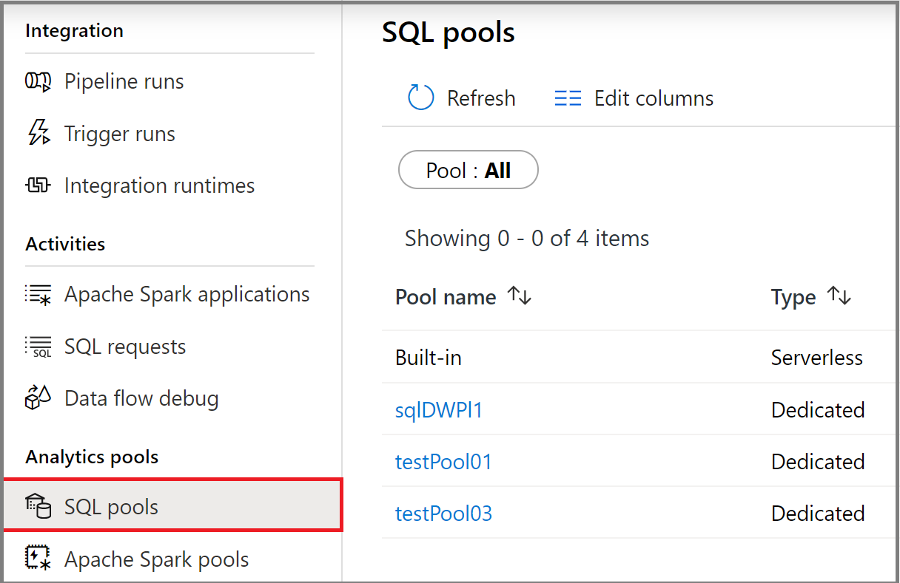
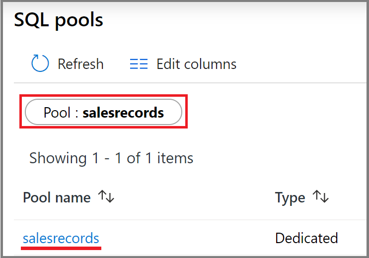
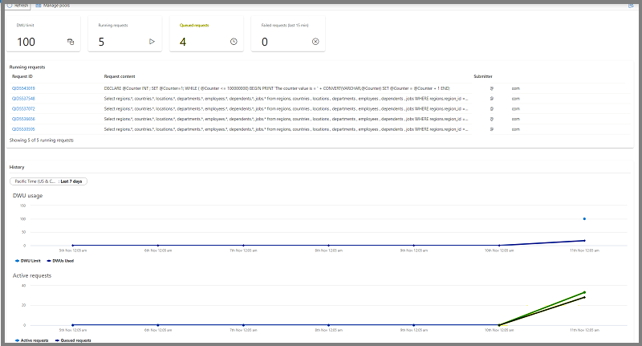

# Use Synapse Studio to monitor your SQL pools

With Synapse Studio, you can run SQL scripts on the SQL pools in your workspace.

This article explains how to monitor your SQL pools, allowing you to keep an eye on the status and activity of your pools.

## Access SQL pools list

To see the list of SQL pools in your workspace, first [open the Synapse Studio](https://web.azuresynapse.net/) and select your workspace.

Once you've opened your workspace, select the **Monitor** section on the left.

Select **SQL pools** to view the list of SQL pools.

 

## Filter your SQL pools

You can filter the list of SQL pools to the ones that interest you. The filters at the top of the screen allow you to specify a field on which you'd like to filter.

For example, you can filter the view to see only the SQL pools containing the name "salesrecords":

## View details about a specific SQL pool

To view the details about one of your SQL pools, select the SQL pool to view the details.

## Next steps

For more information on monitoring pipeline runs, see the [Monitor pipeline runs in Synapse Studio](how-to-monitor-pipeline-runs.md) article. 

For more information on monitoring SQL requests, see the [Monitor SQL requests in Synapse Studio](how-to-monitor-sql-requests.md) article.