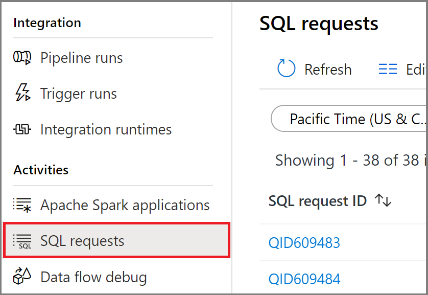

# Use Synapse Studio to monitor your SQL requests

With Synapse Studio, you can run SQL scripts on the SQL pools in your workspace.

This article explains how to monitor your SQL requests, allowing you to keep an eye on the status of running requests and discover details of historical requests.

## Access SQL requests list

To see the list of SQL requests in your workspace, first [open the Synapse Studio](https://web.azuresynapse.net/) and select your workspace.

Once you've opened your workspace, select the **Monitor** section on the left.

Select **SQL requests** to view the list of SQL requests.

 

## Select a SQL pool

By default, the SQL request history for the built-in serverless SQL pool are shown in this view. You can select one of your dedicated SQL pools to see the SQL request history of that pool.

## Filter your SQL requests

You can filter the list of SQL requests to the ones that interest you. The filters at the top of the screen allow you to specify a field on which you'd like to filter.

For example, you can filter the view to see only the SQL requests submitted by `maria@contoso.com`:

## View details about a specific SQL request

To view the details about one of your SQL requests, open the SQL request to navigate to the details view. For the complex requests running on dedicated SQL pools, you can monitor the progress.

## Next steps

For more information on monitoring pipeline runs, see the [Monitor pipeline runs in Synapse Studio](how-to-monitor-pipeline-runs.md) article. 

For more information on monitoring Apache Spark applications, see the [Monitor Apache Spark applications in Synapse Studio](how-to-monitor-spark-applications.md) article.

To analyze historical queries, see [Historical query storage and analysis in Azure Synapse Analytics](../sql/query-history-storage-analysis.md).