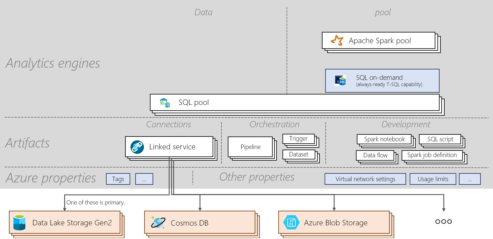

# Azure Synapse Analytics cheat sheet

Azure Synapse Analytics cheat sheet will guide you through the basic concepts of the service and important commands which will be helpful for new learners as well as for those who want to take a quick look at the important topics.

## Architecture

> [!div class="mx-imgBorder"]
>

## Concepts
| Nouns and verbs                         | What it does       |
|:---                                 |:---                 |
| **Synapse Workspace** | A securable collaboration boundary for doing cloud-based enterprise analytics in Azure. A workspace is deployed in a specific region and has an associated ADLSg2 account and file system (for storing temporary data). A workspace is under a resource group. |
| **SQL Analytics**   | Can do SQL Analytics with pools and with on-demand  |
| **SQL pool**   | 0-to-N SQL provisioned resources with their corresponding databases can be deployed in a workspace. Each SQL pool has an associated database. A SQL pool can be scaled, paused and resumed manually or automatically through Azure function. A SQL pool can scale from 100 DWU up to 30,000 DWU.       |
| **SQL on-demand**   | Distributed data processing system built for large-scale data that lets you run T-SQL queries over data in data lake. It is serverless so you don't need to manage infrastructure.       |
|**Spark** | Spark run-time used in a Spark pool. The current version supported is Spark 2.4 with Python 3.6.1, Scala 2.11.12, .NET support for Apache Spark 0.5 and Delta Lake 0.3.  | 
| **Spark pool**  | 0-to-N Spark provisioned resources with their corresponding databases can be deployed in a workspace. A Spark pool can auto-pause/resume/scale.  |
| **Spark application**  |   It consists of a driver process and a set of executor processes. A Spark application runs on a Spark pool.            |
| **Spark session**  |   Unified entry point of a spark application. It provides a way to interact with various spark’s functionality with a lesser number of constructs. To run a notebook, a session needs to be created. A session can be configured to run on a specific number of executors of a specific size. The default configuration for a notebook session is is to run on 2 executors of a medium size. |
| **SQL Request**  |   Operation such as a query run through a SQL pool or SQL On-Demand |
|**Data Integration**| Gives the capability to ingest data between various sources and orchestrate activities running within a workspace or outside a workspace| 
|**Artifacts**| Concept that encapsulates all objects necessary for a user to manage data sources, develop, orchestrate and visualize|
|**Notebook**| Interactive and reactive Data Science and Engineering interface supporting Scala, PySpark, C# and SparkSQL. |
|**Spark job definition**|Interface to submit a Spark job by with assembly jar containing the code and its dependencies|
|**Data Flow**|  Provides a fully visual experience with no coding required to do big data transformation. All optimization and execution are handled in a serverless fashion |
|**SQL script**| Set of SQL commands saved in a file. A SQL script can contain one or more SQL statements. It can be used to run SQL requests through SQL Analytics Pool or On-Demand.|
|**Pipeline**| Logical grouping of activities that together perform a task.|
|**Activity**| Defines actions to perform on data such as copying data, running a Notebook or a SQL script|
|**Trigger**| Executes a pipeline. It can be run manually or automatically (schedule, tumbling window or event-based)|
|**Linked service**| Connection strings that define the connection information needed for the workspace to connect to external resources|
|**Dataset**|  Named view of data that simply points or references the data to be used in an activity as input and output. It belongs to a Linked Service|

