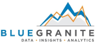

# Azure Synapse Analytics system integration partners

This article highlights Microsoft system integration partner companies building solutions with Azure Synapse.

## System Integration partners
| Partner | Description | Website/Product link |
| ------- | ----------- | -------------------- |
|  |**Accenture** Bringing together 45,000+ dedicated professionals, the Accenture Microsoft Business Group—powered by Avanade—helps enterprises to thrive in the era of digital disruption.|[Partner page](https://www.accenture.com/us-en/services/microsoft-index) |
|  |**Adatis** Adatis offers services that specialize in advanced data analytics, from data strategy and consultancy, to world class delivery and managed services. |[Partner page](https://adatis.co.uk/)  |
|  |**Blue Granite** The BlueGranite Catalyst for Analytics is an engagement approach that features their “think big, but start small” philosophy. Starting with collaborative envisioning and strategy sessions, Blue Granite work with clients to discover, create, and realize the value of new modern data and analytics solutions, using the latest technologies on the Microsoft platform.|[Partner page](https://www.blue-granite.com/) |
|  |**Capax Global** We improve your business by making better use of information you already have. Building custom solutions that align to your business goals, and setting you up for long-term success. We combine well-established patterns and practices with technology while using our team's wide range of industry and commercial software development experience. We share a passion for technology, innovation, and client satisfaction. Our pride for what we do drives the success of our projects and is fundamental to why people partner with us.|[Partner page](https://www.capaxglobal.com/) |
|  |**Coeo** Coeo’s team includes cloud consultants with deep expertise in Azure databases, and BI consultants dedicated to providing flexible and scalable analytic solutions. Coeo can help you move to a hybrid or full Azure solution.|[Partner page](https://www.coeo.com/solution/technology/microsoft-azure/) |
|  |**Cognizant** As a Microsoft strategic partner, Cognizant has the consulting skills and experience to help customers make the journey to the cloud. For each client project, Cognizant uses its strong partnership with Microsoft to maximize customer benefits from the Azure architecture.|[Partner page](https://mbg.cognizant.com/technologies-capabilities/microsoft-azure/) |
|  |**Neal Analytics** Neal Analytics helps companies navigate their digital transformation journey in converting data into valuable assets and a competitive advantage. With our machine learning and data engineering expertise, we use data to drive margin increases and profitable analytics projects. Comprised of consultants specializing in Data Science, Business Intelligence, Cognitive Services, practical AI, Data Management, and IoT, Neal Analytics is trusted to solve unique business problems and optimize operations across industries.|[Partner page](https://nealanalytics.com/) |
|  |**Pragmatic Works** Pragmatic Works can help you capitalize on the value of your data by empowering more users and applications on the same dataset. We kickstart, accelerate, and maintain your cloud environment with a range of solutions that fit your business needs.|[Partner page](https://www.pragmaticworks.com/) |

## Next Steps
To learn more about some of our other partners, see [Business intelligence partners](business-intelligence.md), [Data Integration partners](data-integration.md), [Data Management partners](data-management.md), and also [Machine Learning & AI partners](machine-learning-ai.md).

